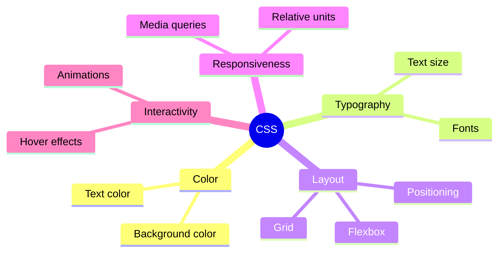
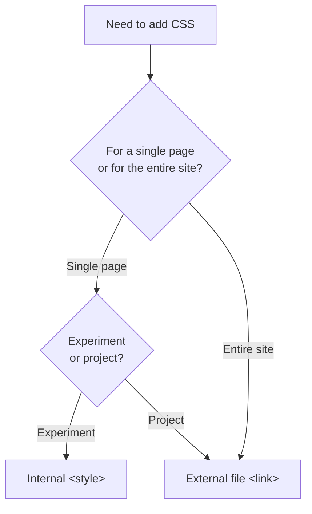

## Introduction to CSS. Syntax and Connection

> **Connection with the previous course:** in the "HTML: From A to Z" course, we built the "skeleton" of the page - the semantic structure without a single element of visual styling. Today we begin "dressing" this skeleton: CSS is responsible for how the page looks, not for what's on it.

---

## Lesson Goal

Understand what CSS is, how it relates to HTML, and master the basic syntax - so that by the end of the lesson, you can independently connect styles to any page and change its appearance.

## What You Will Learn by the End of the Lesson

- Explain why CSS is needed and how it interacts with HTML.
- Connect CSS in three ways (inline, internal, external) - and understand why an external file is preferred.
- Write a CSS rule using the syntax `selector { property: value; }`.
- Use the Elements/Styles tab in DevTools to edit styles "live."

---

## Lesson Timeline

| Block                                         | Content                                     |
| -------------------------------------------- | ---------------------------------------------- |
| 1. What CSS is and why it's needed            | Analogy with clothing, separation of HTML/CSS        |
| 2. Three ways to connect CSS               | Inline, internal, external - pros and cons   |
| 3. CSS rule syntax                     | Selector, property, value, comments      |
| 4. Mini-task                              | Write a rule independently                |
| 5. DevTools: editing styles live            | Elements → Styles, experiments without saving |
| 6. Practice: first connection and styling | Connecting external CSS to your HTML page   |
| 7. Summary and homework                  | Reinforcement                                    |

---

## Block 1. What CSS Is and Why It's Needed

**In simple terms:** recall the analogy from the HTML course - HTML is the frame of a house. To continue the metaphor, **CSS (Cascading Style Sheets) is the interior designer**: they don't change the layout of rooms (that's the job of HTML), but they paint the walls, arrange furniture, choose curtains - that is, they determine how everything looks.

Another useful analogy: **HTML is the human body, CSS is the clothing**. The same body (the same HTML structure) can be "dressed" completely differently - in a formal suit or in sportswear - while the structure itself (arms, legs, head) doesn't change.

**Key principle to always remember:** HTML and CSS solve **different tasks**, and it's important not to mix them:

- HTML answers the question "**what** is this?" (heading, paragraph, list, button).
- CSS answers the question "**what does it look like**?" (what color, what size, where it's positioned).

If in the HTML course we already said "don't use `<b>` instead of `<strong>`, because it's about appearance, not meaning" - now we finally have **the right place** where all appearance concerns can be moved: that's CSS.

### What Can CSS Do

- Text and background colors.
- Dimensions, spacing, borders (Box model - lesson 3).
- Block layout on the page (Flexbox/Grid - lessons 5-6).
- Fonts and typography (lesson 7).
- Adaptation to different screen sizes (lesson 8).
- Simple animations and interactive states (lesson 9).

We'll cover all of these in order throughout the course - and today we lay the foundation: **how to connect and write CSS at all**.



---

## Block 2. Three Ways to Connect CSS

There are three technically working ways to add CSS to an HTML page. Let's examine all three - but it's important to understand right away that they are **not equal** in quality.

### Method 1. Inline Styles (`style=""`)

The style is written directly inside the HTML tag, using the `style` attribute.

```html
<p style="color: red; font-size: 20px;">This text is red and large</p>
```

**Pros:** fast, applied instantly to a specific element.

**Cons:**

- The style is tied to one specific element - if you have 20 identical paragraphs that need to be styled the same way, you'll have to duplicate the same code 20 times.
- Mixes structure (HTML) and presentation (CSS) in one place - this is exactly the mixing of "what" and "how" that we avoided even in the HTML course when rejecting `<b>`/`<i>` in favor of semantics.
- Such styles have the **highest priority** in the cascade (more on this in lesson 2), which can unexpectedly "override" your other styles and make debugging difficult.

**Conclusion:** rarely used, usually only for quick experiments or dynamically generated styles via JavaScript.

### Method 2. Internal CSS (`<style>` tag)

Styles are written inside a `<style>` tag placed in the `<head>` of the HTML document.

```html
<head>
    <meta charset="UTF-8">
    <title>My Page</title>
    <style>
        p {
            color: red;
            font-size: 20px;
        }
    </style>
</head>
```

**Pros:** styles are applied to all matching elements on the page at once, no need to duplicate code for every tag.

**Cons:** styles work only **on this single HTML page** - if your site has 5 pages (like in the HTML course), and you need the same style on all five, you'll have to copy the same `<style>` block into the `<head>` of each page, and any changes require updating all 5 copies manually.

**Conclusion:** convenient for small experiments or unique styles specific to one page, but not suitable as the main method for a full-fledged multi-page project.

### Method 3. External CSS File (`<link>` tag)

Styles are placed in a separate `.css` file, which is connected to HTML via the `<link>` tag - we've already seen this tag in the HTML course (lesson 9), when we talked about connecting styles in advance.

**File `style.css`:**

```css
p {
    color: red;
    font-size: 20px;
}
```

**File `index.html`:**

```html
<head>
    <meta charset="UTF-8">
    <title>My Page</title>
    <link rel="stylesheet" href="css/style.css">
</head>
```

**Pros:**

- **One file - many pages.** Connect the same `style.css` to all HTML files on your site - and styles will be applied identically everywhere. Changed the file once - all pages updated at once.
- **Separation of concerns.** HTML files contain only the structure, the CSS file contains only the presentation. Each file is easier to read and maintain individually.
- **Browser caching.** The browser loads an external CSS file once and remembers it - when navigating between pages of your site, reloading styles is not required, which speeds up the site.

**Conclusion:** this is **the correct, professional method**, which we will use as the main one in this course. That's why in the HTML course roadmap we prepared the folder structure in advance with a separate `css/`.

### Comparison Table

|Method|Where it's written|Scope|Recommendation|
|---|---|---|---|
|Inline (`style=""`)|Inside the tag itself|One specific element|Avoid, except rare cases|
|Internal (`<style>`)|In `<head>` of the HTML file|Only this one page|Only for small experiments|
|External (`<link>`)|Separate `.css` file|Any number of pages|**Main method in this course**|



---

### Common Beginner Mistakes

|Error|How to Fix|
|---|---|
|Using inline styles for the entire project "because it's faster"|Switch to an external file - in the long run it saves much more time|
|Forgetting `rel="stylesheet"` on the `<link>` tag|Without this attribute, the browser won't understand that the linked file contains styles|
|Specifying the wrong path to the CSS file (e.g., forgetting the `css/` folder)|Check the path relative to the HTML file's location (as we covered in lesson 3 of the HTML course)|

---

## Block 3. CSS Rule Syntax

Now let's break down how to actually write CSS code inside a file.

### Anatomy of One Rule

```css
p {
    color: red;
    font-size: 20px;
}
```

Let's break it down:

- **`p`** - **selector**. It determines which HTML elements this rule applies to. In this case, all `<p>` tags on the page.
- **`{ }`** - curly braces, inside which the styles for the selected elements are listed.
- **`color: red;`** and **`font-size: 20px;`** - **declarations**. Each declaration consists of:
    - a **property** (`color`, `font-size`) - what exactly you're changing;
    - a **value** (`red`, `20px`) - what you're changing it to;
    - separated by a colon `:`, ending with a semicolon `;`.

**Analogy:** imagine you're giving instructions to a seamstress: "For all shirts (**selector**) - make the collar blue (**property: value**), and the sleeves 60 cm long (**property: value**)." A CSS rule works on the same principle: an address (who to apply to) + a list of specific changes.

### The Importance of the Semicolon

```css
p {
    color: red;
    font-size: 20px
}
```

Technically, the last semicolon before the closing brace `}` is not required (the browser will still understand this code) - but it is **strongly recommended** to always include it. The reason is simple: if later you add another property after the last one, forgetting to put `;` before the new line, both properties will "stick together" into one erroneous line, and the browser may interpret it incorrectly.

```css
/* Bad: forgot ; after font-size, then added a new line */
p {
    color: red;
    font-size: 20px
    font-weight: bold;  /* this line will break */
}
```

**Rule for this course:** put `;` after **every** declaration, including the last one.

### Multiple Selectors in One Rule

If several different tags need to receive the same styles - they can be listed with a comma, without duplicating the entire block:

```css
h1, h2, h3 {
    color: navy;
    font-family: Arial, sans-serif;
}
```

This is equivalent to writing three separate identical blocks for `h1`, `h2`, `h3` individually - but shorter and easier to maintain.

### Comments in CSS

```css
/* This is a comment - the browser completely ignores it */
p {
    color: red; /* a comment can also be placed at the end of a line */
}

/*
Comment can
span multiple lines
*/
```

Comments in CSS are written between `/*` and `*/` (unlike HTML, where comments are written as `<!-- -->`). Use them to leave notes for yourself (or other developers) - for example, explaining why a particular style was added, or temporarily "turning off" a piece of code during debugging without deleting it.

```css
p {
    color: red;
    /* font-size: 40px; - temporarily disabled for testing */
}
```

---

### Common Beginner Mistakes

|Error|How to Fix|
|---|---|
|Confusing the colon `:` (between property and value) with the semicolon `;` (at the end of a declaration)|Remember the order: `property: value;` - colon inside, semicolon at the end|
|Forgetting the closing curly brace `}`|Every rule must be fully closed - opening and closing braces come in a pair|
|Using HTML comments `<!-- -->` inside a CSS file|In CSS, comments are written as `/* text */`|
|Writing a value without a unit of measurement where it's required: `font-size: 20;`|Specify units where required: `font-size: 20px;` (more about units in lesson 7)|

---

## Block 4. Mini-Task

Write, without peeking, a CSS rule that makes all `<h2>` tags blue (`blue`) with a font size of `28px`.

**Solution:**

```css
h2 {
    color: blue;
    font-size: 28px;
}
```

---

## Block 5. DevTools: Editing Styles "Live"

We already used DevTools in the HTML course to view the page structure. Today we open a new feature - the **Styles tab**, which shows and allows you to **edit** CSS directly in the browser, without saving the file.

### How It Works

1. Open any website (or your project via Live Server).
2. Open DevTools (F12).
3. On the **Elements** tab (Chrome/Edge) or **Inspector** (Firefox), click on any element on the page.
4. On the right (or bottom, depending on settings), the **Styles** panel will appear - it shows all CSS rules that apply specifically to this element.

### What You Can Do

- **Change an existing value:** click directly on the property value (e.g., on `red` next to `color`) and type a new one - changes will be applied to the page instantly.
- **Add a new property:** click on an empty line inside the rule and write `property: value;`.
- **Temporarily disable a property:** uncheck the checkbox next to the property - it will be "turned off" without being deleted, which is convenient for experimenting with "how it would look without this style."

**Important to understand:** all changes via DevTools are **temporary**. They are visible only to you, only in this open browser tab, and disappear completely when the page is refreshed (F5). DevTools does not modify the real file on disk - it's a tool for **experiments and debugging**, not for saving results.

**Why this is useful in practice:** imagine you're unsure which background color looks better - dark blue or black. Instead of changing code in the file, saving, refreshing the page, changing again and saving again - you can try dozens of options right in DevTools in seconds, and only when you find the right one - transfer the final value to the real CSS file.

**Useful debugging trick:** if a style isn't being applied as expected for some reason, DevTools will show you **all** competing rules affecting the element and which one actually "won" (more on why it wins in lesson 2 about the cascade).

---

## Block 6. Practice: First Connection and Styling

Now let's apply everything in practice - connect an external CSS file to your `index.html` page from the HTML course.

**Step 1.** In your project folder (create it if it doesn't exist yet), open (or create) the file `css/style.css`.

**Step 2.** Write the first styles in it:

```css
body {
    background-color: #f4f4f4;
    font-family: Arial, sans-serif;
}

h1 {
    color: #2c3e50;
}

p {
    color: #333333;
    font-size: 16px;
}
```

**Step 3.** Make sure the `<head>` of your `index.html` contains the connection (as we prepared in lesson 9 of the HTML course):

```html
<link rel="stylesheet" href="css/style.css">
```

**Step 4.** Open the page via Live Server and make sure the background has changed and the heading and paragraph text have taken on new colors.

**Step 5.** Experiment - change the `background-color` value to any other color (you can use any of the commonly accepted English names: `lightblue`, `pink`, `beige`) and see the result after saving the file and refreshing the page in the browser.

---

## Lesson Summary

Today you learned:

- CSS is responsible for **how the page looks**, HTML - for **what** is on it - these tasks should not be mixed.
- There are three ways to connect CSS: inline (`style=""`), internal (`<style>`), external (`<link>`) - in this course the main method is **external file**.
- CSS rule syntax: `selector { property: value; }`, with a mandatory semicolon after each declaration.
- Comments in CSS are written as `/* text */`.
- DevTools allows you to experiment with styles "live" without changing the real file - an excellent tool for quick idea testing.

---

## Practice

Connect an external CSS file to your HTML page from the HTML course and style:

1. The `<body>` background color.
2. The text color for `<h1>` and all `<p>` tags.
3. The font size for `<p>` - make it slightly larger than the default value.
4. Through DevTools, try temporarily changing the background color to 2-3 different options, without saving to file - just to get a feel for the tool.

---

[Next lesson: Selectors and Cascade →](Lesson-2/en/Selectors%20and%20Cascade.md)
