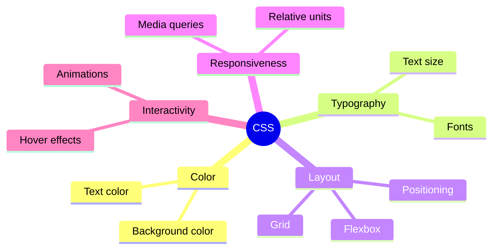
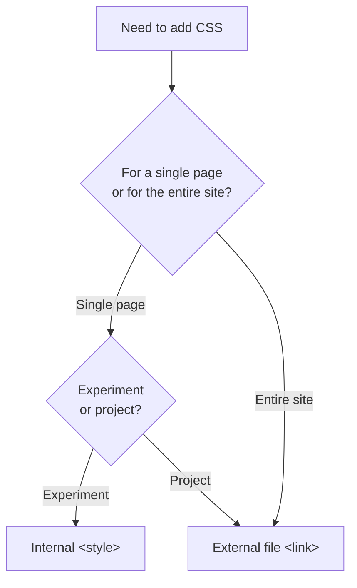

## Введение в CSS. Синтаксис и подключение

> **Связь с предыдущим курсом:** в курсе «HTML: от А до Я» мы построили «скелет» страниц - семантическую структуру без единого элемента визуального оформления. Сегодня начинаем «одевать» этот скелет: CSS отвечает за то, как страница выглядит, а не за то, что на ней есть.

---

## Цель урока

Понять, что такое CSS, как он связан с HTML, и освоить базовый синтаксис - чтобы в конце занятия вы могли самостоятельно подключить стили к любой странице и изменить её внешний вид.

## Чему вы научитесь к концу урока

- Объяснять, зачем нужен CSS и как он взаимодействует с HTML.
- Подключать CSS тремя способами (инлайн, внутренний, внешний) - и понимать, почему внешний файл предпочтителен.
- Писать CSS-правило по синтаксису `селектор { свойство: значение; }`.
- Пользоваться вкладкой Elements/Styles в DevTools для правки стилей «вживую».

---

## Хронометраж урока

| Блок                                         | Содержание                                     |
| -------------------------------------------- | ---------------------------------------------- |
| 1. Что такое CSS и зачем он нужен            | Аналогия с одеждой, разделение HTML/CSS        |
| 2. Три способа подключения CSS               | Инлайн, внутренний, внешний - плюсы и минусы   |
| 3. Синтаксис CSS-правила                     | Селектор, свойство, значение, комментарии      |
| 4. Мини-задание                              | Написать правило самостоятельно                |
| 5. DevTools: правка стилей вживую            | Elements → Styles, эксперименты без сохранения |
| 6. Практика: первое подключение и стилизация | Подключаем внешний CSS к своей HTML-странице   |
| 7. Итоги и домашнее задание                  | Закрепление                                    |

---

## Блок 1. Что такое CSS и зачем он нужен

**Простыми словами:** вспомните аналогию из курса HTML - HTML это каркас дома. Если продолжить метафору, то **CSS (Cascading Style Sheets, «каскадные таблицы стилей») - это дизайнер интерьера**: он не меняет расположение комнат (это работа HTML), но красит стены, расставляет мебель, подбирает шторы - то есть определяет, как всё это выглядит.

Другая полезная аналогия: **HTML - это тело человека, CSS - это одежда**. Одно и то же тело (одна и та же HTML-структура) можно "одеть" совершенно по-разному - в строгий костюм или в спортивный костюм - при этом сама структура (руки, ноги, голова) не меняется.

**Ключевой принцип, о котором важно помнить всегда:** HTML и CSS решают **разные задачи**, и важно их не смешивать:

- HTML отвечает на вопрос «**что** это?» (заголовок, абзац, список, кнопка).
- CSS отвечает на вопрос «**как это выглядит**?» (какого цвета, какого размера, где расположено).

Если в HTML-курсе мы уже говорили «не используйте `<b>` вместо `<strong>`, потому что это про внешний вид, а не про смысл» - то теперь мы наконец получаем **правильное место**, куда можно перенести все заботы о внешнем виде: это CSS.

### Что вообще умеет CSS

- Цвет текста и фона.
- Размеры, отступы, рамки (Box model - урок 3).
- Расположение блоков на странице (Flexbox/Grid - уроки 5-6).
- Шрифты и типографику (урок 7).
- Адаптацию под разные размеры экрана (урок 8).
- Простую анимацию и интерактивные состояния (урок 9).

Всё это мы пройдём по порядку в течение курса - а сегодня закладываем фундамент: **как вообще подключить и написать CSS**.



---

## Блок 2. Три способа подключения CSS

Есть три технически рабочих способа добавить CSS к HTML-странице. Разберём все три - но важно сразу понимать, что они **не равноценны** по качеству.

### Способ 1. Инлайн-стили (`style=""`)

Стиль пишется прямо внутри HTML-тега, через атрибут `style`.

```html
<p style="color: red; font-size: 20px;">Этот текст красный и крупный</p>
```

**Плюсы:** быстро, применяется мгновенно к конкретному элементу.

**Минусы:**

- Стиль привязан к одному конкретному элементу - если у вас 20 одинаковых абзацев, нужных стилизовать одинаково, придётся дублировать один и тот же код 20 раз.
- Смешивает структуру (HTML) и оформление (CSS) в одном месте - это как раз то смешивание "что" и "как", которого мы избегали ещё с курса HTML, когда отказывались от `<b>`/`<i>` в пользу семантики.
- Такие стили имеют **самый высокий приоритет** в каскаде (подробнее об этом - в уроке 2), что может неожиданно "перебивать" другие ваши стили и затруднять отладку.

**Вывод:** используется редко, обычно только для быстрых экспериментов или динамически генерируемых стилей через JavaScript.

### Способ 2. Внутренний CSS (тег `<style>`)

Стили пишутся внутри тега `<style>`, помещённого в `<head>` HTML-документа.

```html
<head>
    <meta charset="UTF-8">
    <title>Моя страница</title>
    <style>
        p {
            color: red;
            font-size: 20px;
        }
    </style>
</head>
```

**Плюсы:** стили применяются ко всем подходящим элементам страницы разом, не нужно дублировать код на каждый тег.

**Минусы:** стили работают только **на этой одной HTML-странице** - если у вас сайт из 5 страниц (как в курсе HTML), и вам нужен одинаковый стиль на всех пяти, придётся копировать один и тот же блок `<style>` в `<head>` каждой страницы, и при любом изменении - обновлять все 5 копий вручную.

**Вывод:** удобно для небольших экспериментов или уникальных стилей, специфичных именно для одной страницы, но не подходит как основной способ для полноценного многостраничного проекта.

### Способ 3. Внешний файл CSS (тег `<link>`)

Стили выносятся в отдельный `.css`-файл, который подключается к HTML через тег `<link>` - мы уже видели этот тег в курсе HTML (урок 9), когда говорили про подключение стилей заранее.

**Файл `style.css`:**

```css
p {
    color: red;
    font-size: 20px;
}
```

**Файл `index.html`:**

```html
<head>
    <meta charset="UTF-8">
    <title>Моя страница</title>
    <link rel="stylesheet" href="css/style.css">
</head>
```

**Плюсы:**

- **Один файл - множество страниц.** Подключите один и тот же `style.css` ко всем HTML-файлам сайта - и стили применятся везде одинаково. Изменили файл один раз - обновились все страницы разом.
- **Разделение ответственности.** HTML-файлы содержат только структуру, CSS-файл - только оформление. Каждый файл легче читать и поддерживать по отдельности.
- **Кеширование браузером.** Внешний CSS-файл браузер загружает один раз и запоминает - при переходе между страницами вашего сайта повторная загрузка стилей не требуется, что ускоряет работу сайта.

**Вывод:** это **правильный, профессиональный способ**, который мы будем использовать в этом курсе как основной. Именно поэтому в дорожной карте курса HTML мы заранее готовили структуру папок с отдельной `css/`.

### Сравнительная таблица

|Способ|Где пишется|Область действия|Рекомендация|
|---|---|---|---|
|Инлайн (`style=""`)|Внутри самого тега|Один конкретный элемент|Избегать, кроме редких случаев|
|Внутренний (`<style>`)|В `<head>` HTML-файла|Только эта одна страница|Только для мелких экспериментов|
|Внешний (`<link>`)|Отдельный `.css`-файл|Любое количество страниц|**Основной способ в этом курсе**|



---

### Частые ошибки новичков

|Ошибка|Как исправить|
|---|---|
|Используют инлайн-стили для всего проекта "потому что быстрее"|Переходите на внешний файл - в долгосрочной перспективе он экономит гораздо больше времени|
|Забывают `rel="stylesheet"` у тега `<link>`|Без этого атрибута браузер не поймёт, что подключаемый файл - это стили|
|Указывают неверный путь к CSS-файлу (например, забывают папку `css/`)|Проверяйте путь относительно расположения самого HTML-файла (как мы разбирали в уроке 3 курса HTML)|

---

## Блок 3. Синтаксис CSS-правила

Теперь разберём, как именно писать сам CSS-код внутри файла.

### Анатомия одного правила

```css
p {
    color: red;
    font-size: 20px;
}
```

Разберём по частям:

- **`p`** - **селектор**. Он определяет, к каким HTML-элементам применится это правило. В данном случае - ко всем тегам `<p>` на странице.
- **`{ }`** - фигурные скобки, внутри которых перечисляются стили для выбранных элементов.
- **`color: red;`** и **`font-size: 20px;`** - **объявления** (declarations). Каждое объявление состоит из:
    - **свойства** (`color`, `font-size`) - что именно вы меняете;
    - **значения** (`red`, `20px`) - на что вы это меняете;
    - разделены двоеточием `:`, заканчиваются точкой с запятой `;`.

**Аналогия:** представьте, что вы даёте инструкцию швее: «Всем рубашкам (**селектор**) - сделай воротник синим (**свойство: значение**), а рукава - длиной 60 см (**свойство: значение**)». CSS-правило работает по такому же принципу: адрес (кому применить) + список конкретных изменений.

### Обязательность точки с запятой

```css
p {
    color: red;
    font-size: 20px
}
```

Технически последняя точка с запятой перед закрывающей скобкой `}` необязательна (браузер всё равно поймёт этот код) - но **настоятельно рекомендуется** всегда её ставить. Причина простая: если позже вы добавите ещё одно свойство после последнего, забыв поставить `;` перед новой строкой, оба свойства "слипнутся" в одну ошибочную строку, и браузер может неправильно её интерпретировать.

```css
/* Плохо: забыли ; после font-size, а потом дописали новую строку */
p {
    color: red;
    font-size: 20px
    font-weight: bold;  /* эта строка сломается */
}
```

**Правило этого курса:** ставьте `;` после **каждого** объявления, включая последнее.

### Несколько селекторов в одном правиле

Если несколько разных тегов должны получить одинаковые стили - их можно перечислить через запятую, не дублируя весь блок:

```css
h1, h2, h3 {
    color: navy;
    font-family: Arial, sans-serif;
}
```

Это эквивалентно написанию трёх отдельных одинаковых блоков для `h1`, `h2`, `h3` по отдельности - но короче и легче поддерживать.

### Комментарии в CSS

```css
/* Это комментарий - браузер его полностью игнорирует */
p {
    color: red; /* комментарий можно поставить и в конце строки */
}

/*
Комментарий может
занимать несколько строк
*/
```

Комментарии в CSS пишутся между `/*` и `*/` (в отличие от HTML, где комментарии оформляются как `<!-- -->`). Используйте их, чтобы оставлять себе (или другим разработчикам) пояснения - например, зачем добавлен именно такой стиль, или временно "выключить" часть кода при отладке, не удаляя его.

```css
p {
    color: red;
    /* font-size: 40px; - временно отключено для теста */
}
```

---

### Частые ошибки новичков

|Ошибка|Как исправить|
|---|---|
|Путают двоеточие `:` (между свойством и значением) и точку с запятой `;` (в конце объявления)|Запомните порядок: `свойство: значение;` - двоеточие внутри, точка с запятой в конце|
|Забывают закрывающую фигурную скобку `}`|Каждое правило должно быть полностью закрыто - открывающая и закрывающая скобка в паре|
|Используют HTML-комментарии `<!-- -->` внутри CSS-файла|В CSS комментарии оформляются как `/* текст */`|
|Пишут значение без единицы измерения там, где она обязательна: `font-size: 20;`|Указывайте единицы измерения, где это требуется: `font-size: 20px;` (подробнее про единицы - в уроке 7)|

---

## Блок 4. Мини-задание

Напишите самостоятельно, без подглядывания, CSS-правило, которое делает все теги `<h2>` синего цвета (`blue`) с размером шрифта `28px`.

**Решение:**

```css
h2 {
    color: blue;
    font-size: 28px;
}
```

---

## Блок 5. DevTools: правка стилей «вживую»

Мы уже пользовались DevTools в курсе HTML для просмотра структуры страницы. Сегодня открываем новую возможность - **вкладку Styles**, которая показывает и позволяет **редактировать** CSS прямо в браузере, без сохранения файла.

### Как это работает

1. Откройте любой сайт (или свой проект через Live Server).
2. Откройте DevTools (F12).
3. На вкладке **Elements** (Chrome/Edge) или **Инспектор** (Firefox) кликните на любой элемент страницы.
4. Справа (или снизу, в зависимости от настроек) появится панель **Styles** - там показаны все CSS-правила, которые применяются именно к этому элементу.

### Что можно делать

- **Изменить существующее значение:** кликните прямо на значение свойства (например, на `red` рядом с `color`) и впишите новое - изменения применятся к странице мгновенно.
- **Добавить новое свойство:** кликните на пустую строку внутри правила и допишите `свойство: значение;`.
- **Временно отключить свойство:** снимите галочку рядом со свойством - оно "выключится", не удаляясь, что удобно для эксперимента "как будет выглядеть без этого стиля".

**Важно понимать:** все изменения через DevTools - **временные**. Они видны только вам, только в этой открытой вкладке браузера, и полностью исчезают при обновлении страницы (F5). DevTools не изменяет реальный файл на диске - это инструмент для **экспериментов и отладки**, а не для сохранения результата.

**Зачем это нужно на практике:** представьте, что вы сомневаетесь, какой цвет фона будет смотреться лучше - тёмно-синий или чёрный. Вместо того чтобы менять код в файле, сохранять, обновлять страницу, снова менять и снова сохранять - вы можете за секунды перепробовать десятки вариантов прямо в DevTools, и только когда найдёте подходящий - перенести финальное значение в реальный CSS-файл.

**Полезный приём для отладки:** если стиль почему-то не применяется так, как вы ожидали, DevTools покажет вам **все** конкурирующие правила, влияющие на элемент, и какое из них реально "победило" (подробнее про то, почему именно оно побеждает - в уроке 2 про каскад).

---

## Блок 6. Практика: первое подключение и стилизация

Теперь применим всё на практике - подключим внешний CSS-файл к вашей странице `index.html` из курса HTML.

**Шаг 1.** В папке проекта (если ещё не создана - создайте) откройте (или создайте) файл `css/style.css`.

**Шаг 2.** Впишите в него первые стили:

```css
body {
    background-color: #f4f4f4;
    font-family: Arial, sans-serif;
}

h1 {
    color: #2c3e50;
}

p {
    color: #333333;
    font-size: 16px;
}
```

**Шаг 3.** Убедитесь, что в `<head>` вашего `index.html` есть подключение (как мы уже готовили в уроке 9 курса HTML):

```html
<link rel="stylesheet" href="css/style.css">
```

**Шаг 4.** Откройте страницу через Live Server и убедитесь, что фон изменился, а текст заголовка и абзацев принял новые цвета.

**Шаг 5.** Поэкспериментируйте - измените значение `background-color` на любой другой цвет (можно взять любое из общепринятых английских названий: `lightblue`, `pink`, `beige`) и посмотрите на результат после сохранения файла и обновления страницы в браузере.

---

## Итоги урока

Сегодня вы узнали:

- CSS отвечает за то, **как выглядит** страница, HTML - за то, **что** на ней есть - эти задачи не стоит смешивать.
- Есть три способа подключения CSS: инлайн (`style=""`), внутренний (`<style>`), внешний (`<link>`) - в этом курсе основной способ **внешний файл**.
- Синтаксис CSS-правила: `селектор { свойство: значение; }`, с обязательной точкой с запятой после каждого объявления.
- Комментарии в CSS пишутся как `/* текст */`.
- DevTools позволяет экспериментировать со стилями "вживую" без изменения реального файла - отличный инструмент для быстрой проверки идей.

---

## Практика

Подключите внешний CSS-файл к вашей HTML-странице из курса HTML и стилизуйте:

1. Цвет фона `<body>`.
2. Цвет текста для `<h1>` и всех `<p>`.
3. Размер шрифта для `<p>` - сделайте его чуть крупнее значения по умолчанию.
4. Через DevTools попробуйте временно поменять цвет фона на 2-3 разных варианта, не сохраняя в файл - просто чтобы прочувствовать инструмент.

---

[Следующий урок: Селекторы и каскад →](../2/ru/Селекторы%20и%20каскад.md)
