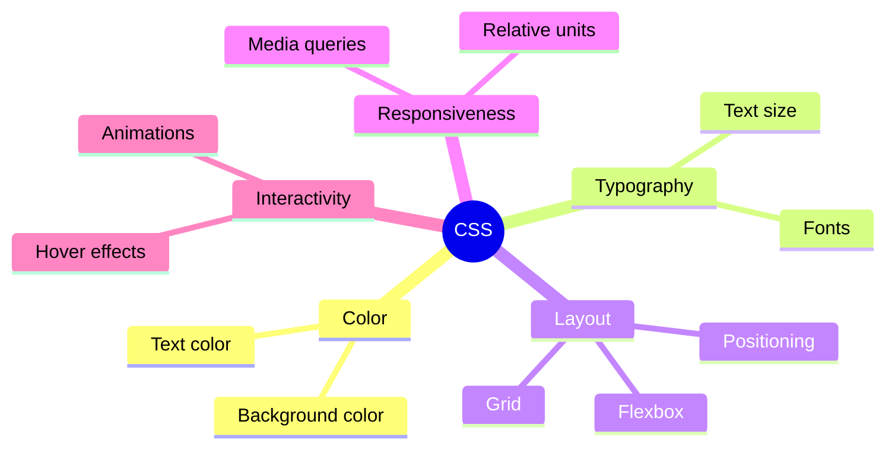
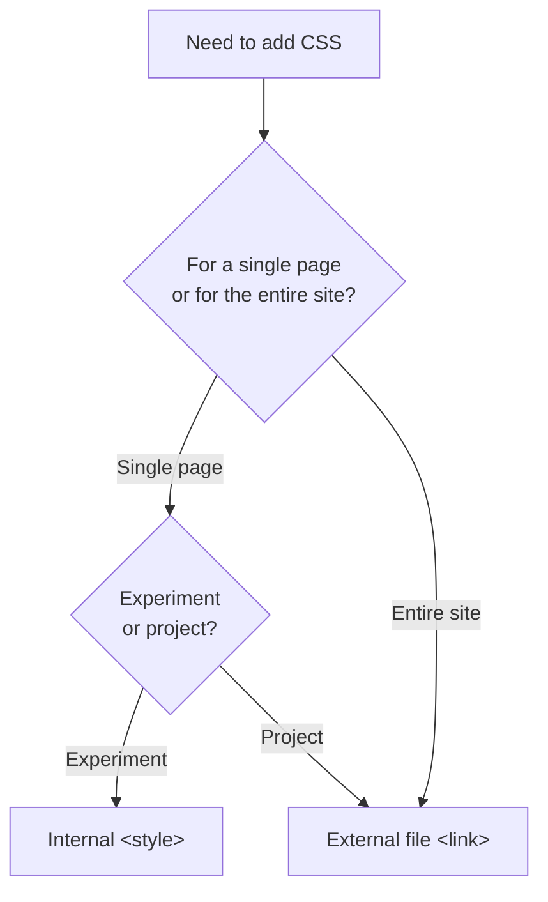

## CSS ga kirish. Sintaksis va ulash

> **Oldingi kurs bilan bog'liqlik:** "HTML: A dan Z gacha" kursida biz sahifaning "skeletini" qurdik - vizual bezatish elementlarsiz semantic tuzilma. Bugun bu skeletni "kiyintirishni" boshlaymiz: CSS sahifaning qanday ko'rinishini, unda nima borligini emas, belgilaydi.

---

## Darsning maqsadi

CSS nima ekanligini, HTML bilan qanday bog'liqligini tushunish va asosiy sintaksisni o'rganish - dars oxiriga qadar har qanday sahifaga mustaqil ravishda uslublarni ulash va uning tashqi ko'rinishini o'zgartira olishingiz kerak.

## Dars oxiriga qadar nimalarni o'rganasiz

- CSS nima uchun kerak va HTML bilan qanday o'zaro ta'sir qilishini tushuntirish.
- CSSni uchta usulda ulash (inline, ichki, tashqi) - va tashqi fayl nima uchun afzal ekanligini tushunish.
- CSS qoidasini `selektor { xususiyat: qiymat; }` sintaksisida yozish.
- DevTools'dagi Elements/Styles tabidan foydalanib, uslublarni "jonli" tahrirlash.

---

## Darsning vaqt jadvali

| Blok                                         | Mazmun                                     |
| -------------------------------------------- | ---------------------------------------------- |
| 1. CSS nima va nima uchun kerak            | Kiyim bilan taqqoslash, HTML/CSS ajratish        |
| 2. CSSni ulashning uchta usuli               | Inline, ichki, tashqi - afzallik va kamchiliklari   |
| 3. CSS qoidasining sintaksisi                     | Selektor, xususiyat, qiymat, izohlar      |
| 4. Mini-vazifa                              | Qoidani mustaqil yozish                |
| 5. DevTools: uslublarni jonli tahrirlash            | Elements → Styles, saqlamasdan tajriba |
| 6. Amaliyot: birinchi ulash va uslublash | Tashqi CSSni o'zingizning HTML sahifangizga ulash   |
| 7. Xulosalar va uy vazifasi                  | Mustahkamlash                                    |

---

## Blok 1. CSS nima va nima uchun kerak

**Oddiy so'z bilan:** HTML kursidagi analogiyani eslang - HTML bu uyning karkasi. Agar metaforani davom ettirsak, **CSS (Cascading Style Sheets, "kaskadli uslublar jadvali") bu interyer dizayneri**: u xonalarning joylashuvini o'zgartirmaydi (bu HTMLning ishi), lekin devorlarni bo'yaydi, mebelni joylashtiradi, parda tanlaydi - ya'ni hamma narsa qanday ko'rinishini belgilaydi.

Boshqa foydali analogiya: **HTML bu inson tanasi, CSS bu kiyim**. Bitta tana (bitta HTML tuzilmasi) butunlay boshqacha "kiyinishi" mumkin - rasmiy kostyum yoki sport kiyimi - shu bilan birga tuzilma (qo'llar, oyoqlar, bosh) o'zgarmaydi.

**Har doim eslab qolish kerak bo'lgan asosiy printsip:** HTML va CSS **turli vazifalarni** hal qiladi va ularni aralashtirish muhim:

- HTML "**nima** bu?" degan savolga javob beradi (sarlavha, paragraf, ro'yxat, tugma).
- CSS "**qanday ko'rinadi**?" degan savolga javob beradi (qanday rangda, qanday o'lchamda, qayerda joylashgan).

Agar HTML kursida biz allaqachon "`<b>` o'rniga `<strong>` ishlatmang, chunki bu tashqi ko'rinish haqida, mazmuni emas" degan bo'lsak - endi biz nihoyat barcha tashqi ko'rinish haqidagi g'amxo'rliklarni ko'chirish mumkin bo'lgan **to'g'ri joy** olamiz: bu CSS.

### CSS umuman nima qila oladi

- Matn va fon rangi.
- O'lchamlar, bo'shliqlar, ramkalar (Box model - 3-dars).
- Sahifadagi bloklarning joylashuvi (Flexbox/Grid - 5-6-darslar).
- Shriftlar va tipografiya (7-dars).
- Turli ekran o'lchamlariga moslash (8-dars).
- Oddiy animatsiya va interaktiv holatlar (9-dars).

Bularning hammasini kurs davomida bosqichma-bosqich o'tamiz - bugun asos qo'yamiz: **umuman qanday ulash va CSS yozish**.



---

## Blok 2. CSSni ulashning uchta usuli

HTML sahifaga CSS qo'shishning uchta texnik jihatdan ishlaydigan usuli mavjud. Ularning hammasini ko'rib chiqamiz - lekin ularning sifat jihatidan **teng emasligini** darhol tushunish muhim.

### Usul 1. Inline uslublar (`style=""`)

Uslub to'g'ridan-to'g'ri HTML tegi ichida, `style` orqali yoziladi.

```html
<p style="color: red; font-size: 20px;">Bu matn qizil va katta</p>
```

**Afzalliklari:** tez, aniq elementga darhol qo'llaniladi.

**Kamchiliklari:**

- Uslub bitta aniq elementga bog'langan - agar sizda 20 ta bir xil paragraf bo'lsa va ularni bir xil uslublash kerak bo'lsa, bir xil kodni 20 marta takrorlashga to'g'ri keladi.
- Tuzilmani (HTML) va bezatishni (CSS) bir joyda aralashtiradi - bu aynan "nima" va "qanday" aralashtirish, biz HTML kursidanoq `<b>`/`<i>` o'rniga semantikani tanlaganimizda qochgan edik.
- Bunday uslublar kaskadida **eng yuqori ustunlikka** ega (batafsil 2-darsda), bu boshqa uslublaringizni kutilmaganda "bosib tashlashi" va tekshirishni qiyinlashtirishi mumkin.

**Xulosa:** kamdan-kam ishlatiladi, odatda faqat tez tajribalar uchun yoki JavaScript orqali dinamik generatsiya qilinadigan uslublar uchun.

### Usul 2. Ichki CSS (`<style>` tegi)

Uslublar HTML hujjatining `<head>` qismiga joylashtirilgan `<style>` tegi ichida yoziladi.

```html
<head>
    <meta charset="UTF-8">
    <title>Mening sahifam</title>
    <style>
        p {
            color: red;
            font-size: 20px;
        }
    </style>
</head>
```

**Afzalliklari:** uslublar sahifaning barcha mos elementlariga bir vaqtda qo'llaniladi, har bir teg uchun kodni takrorlash shart emas.

**Kamchiliklari:** uslublar faqat **shu bitta HTML sahifada** ishlaydi - agar sizning 5 sahifalik saytingiz bo'lsa (HTML kursidagidek) va beshalasida bir xil uslub kerak bo'lsa, har bir sahifaning `<head>`iga bir xil `<style>` blokini nusxalashga va har bir o'zgartirishda barcha 5 nusxani qo'lda yangilashga to'g'ri keladi.

**Xulosa:** kichik tajribalar yoki faqat bitta sahifaga xos noyob uslublar uchun qulay, lekin to'liq ko'p sahifali loyiha uchun asosiy usul sifatida mos emas.

### Usul 3. Tashqi CSS fayli (`<link>` tegi)

Uslublar alohida `.css` fayliga chiqariladi, u HTMLga `<link>` tegi orqali ulanadi - bu tegni HTML kursida (9-dars) ko'rgan edik, uslublarni oldindan ulash haqida gaplashganda.

**`style.css` fayli:**

```css
p {
    color: red;
    font-size: 20px;
}
```

**`index.html` fayli:**

```html
<head>
    <meta charset="UTF-8">
    <title>Mening sahifam</title>
    <link rel="stylesheet" href="css/style.css">
</head>
```

**Afzalliklari:**

- **Bitta fayl - ko'plab sahifalar.** Bitta `style.css` faylni saytning barcha HTML fayllariga ulang - uslublar hamma joyda bir xil qo'llaniladi. Faylni bir marta o'zgartirdingiz - barcha sahifalar bir vaqtda yangilandi.
- **Mas'uliyatni ajratish.** HTML fayllar faqat tuzilmani, CSS fayl faqat bezatishni o'z ichiga oladi. Har bir faylni alohida o'qish va qo'llab-quvvatlash osonroq.
- **Brauzer tomonidan keshlash.** Tashqi CSS faylni brauzer bir marta yuklab oladi va eslab qoladi - sahifalar o'rtasida o'tganingizda uslublarni qayta yuklash shart emas, bu sayt tezligini oshiradi.

**Xulosa:** bu **to'g'ri, professional usul**, biz uni ushbu kursda asosiy sifatida ishlatamiz. Aynan shuning uchun HTML kursining yo'l xaritasida biz oldindan `css/` papkasini tayyorlagan edik.

### Taqqoslash jadvali

|Usul|Qayerda yoziladi|Amal qilish sohasi|Tavsiya|
|---|---|---|---|
|Inline (`style=""`)|Tegning o'zi ichida|Bitta aniq element|Qochish, kamdan-kam hollarda|
|Ichki (`<style>`)|HTML faylining `<head>` qismida|Faqat shu bitta sahifa|Faqat kichik tajribalar uchun|
|Tashqi (`<link>`)|Alohida `.css` fayl|Istalgan miqdordagi sahifalar|**Ushbu kursdagi asosiy usul**|



---

### Yangi boshlovchilarning ko'p uchraydigan xatolari

|Xato|Qanday tuzatish|
|---|---|
|Loyihaning hammasi uchun inline uslublardan foydalanish "tezroq deb" |Tashqi faylga o'ting - uzoq muddatda ko'p vaqtni tejaydi|
|`<link>` tegida `rel="stylesheet"` ni unutish|Bu atributsiz brauzer ulanayotgan fayl uslublar ekanligini tushunmaydi|
|CSS faylga noto'g'ri yo'l ko'rsatish (masalan, `css/` papkasini unutish)|Yo'lni HTML faylining joylashuviga nisbatan tekshiring (HTML kursining 3-darsida tahlil qilgandek)|

---

## Blok 3. CSS qoidasining sintaksisi

Endi CSS kodini fayl ichida qanday yozishni tahlil qilamiz.

### Bir qoidaning anatomiyasi

```css
p {
    color: red;
    font-size: 20px;
}
```

Qismlar bo'yicha tahlil qilamiz:

- **`p`** - **selektor**. U qaysi HTML elementlariga bu qoida qo'llanilishini belgilaydi. Bu holda - sahifadagi barcha `<p>` teglariga.
- **`{ }`** - figurali qavslar, ularning ichida tanlangan elementlar uchun uslublar ro'yxatlanadi.
- **`color: red;`** va **`font-size: 20px;`** - **e'lonlar** (declarations). Har bir e'lon quyidagilardan iborat:
    - **xususiyat** (`color`, `font-size`) - siz nima o'zgartiryapsiz;
    - **qiymat** (`red`, `20px`) - uni nimaga o'zgartiryapsiz;
    - ikki nuqta `:` bilan ajratilgan, nuqtali vergul `;` bilan tugaydi.

**Analogiya:** tasavvur qiling, siz tiranchiga ko'rsatma beryapsiz: "Barcha ko'ylaklarga (**selektor**) - yelkani ko'k qil (**xususiyat: qiymat**), va yenglarni 60 sm uzunlikda (**xususiyat: qiymat**)". CSS qoidasi shu printsip bo'yicha ishlaydi: manzil (kimga qo'llash) + aniq o'zgarishlar ro'yxati.

### Nuqtali vergulning majburiyligi

```css
p {
    color: red;
    font-size: 20px
}
```

Texnik jihatdan oxirgi nuqtali vergul yopuvchi qavsdan `}` oldin ixtiyoriy (brauzer hali ham bu kodni tushunadi) - lekin **qat'iy tavsiya** etiladi har doim uni qo'yish. Sababi oddiy: agar keyinroq oxiridan yana bir xususiyat qo'shsangiz, yangi qator oldida `;` qo'ymaslikni unutsangiz, ikkala xususiyat bir xatolik qatoriga "yopishib ketadi" va brauzer uni noto'g'ri talqin qilishi mumkin.

```css
/* Yomon: font-size dan keyin ; unutildi, keyin yangi qator qo'shildi */
p {
    color: red;
    font-size: 20px
    font-weight: bold;  /* bu qator buziladi */
}
```

**Ushbu kursning qoidasi:** har bir e'lon, shu jumladan oxirgisidan keyin `;` qo'ying.

### Bitta qoidada bir nechta selektor

Agar bir nechta turli teg bir xil uslublarni olishi kerak bo'lsa - ularni vergul bilan ro'yxatlashingiz mumkin, butun blokni takrorlamasdan:

```css
h1, h2, h3 {
    color: navy;
    font-family: Arial, sans-serif;
}
```

Bu `h1`, `h2`, `h3` uchun alohida uchta bir xil blok yozishga teng - lekin qisqaroq va saqlash osonroq.

### CSSda izohlar

```css
/* Bu izoh - brauzer uni to'liq e'tiborsiz qoldiradi */
p {
    color: red; /* izoh qator oxiriga ham qo'yilishi mumkin */
}

/*
Izoh bir nechta
qatorni egallashi mumkin
*/
```

CSSdagi izohlar `/*` va `*/` orasida yoziladi (HTMLdan farqli o'laroq, u erda izohlar `<!-- -->` ko'rinishida bo'ladi). Ularni o'zingizga (yoki boshqa dasturchilarga) tushuntirishlar qoldirish uchun ishlating - masalan, nima uchun aynan shu uslub qo'shilganini, yoki tekshirish paytida kodning bir qismini vaqtincha "o'chirish" uchun uni o'chirmasdan.

```css
p {
    color: red;
    /* font-size: 40px; - sinov uchun vaqtincha o'chirildi */
}
```

---

### Yangi boshlovchilarning ko'p uchraydigan xatolari

|Xato|Qanday tuzatish|
|---|---|
|Ikki nuqta `:` (xususiyat va qiymat orasida) va nuqtali vergul `;` (e'lon oxirida) ni adashtirish|Tartibni eslab qoling: `xususiyat: qiymat;` - ikki nuqta ichida, nuqtali vergul oxirda|
|Yopuvchi figurali qavsdan `}` unutish|Har bir qoida to'liq yopilishi kerak - ochuvchi va yopuvchi qavslar juftlikda bo'lishi kerak|
|CSS faylida HTML izohlarini `<!-- -->` ishlatish|CSSda izohlar `/* matn */` ko'rinishida yoziladi|
|Majburiy o'lchov birligi kerak bo'lgan joyda qiymatni birliksiz yozish: `font-size: 20;`|Kerakli joylarda o'lchov birliklarini ko'rsating: `font-size: 20px;` (birliklar haqida batafsil 7-darsda)|

---

## Blok 4. Mini-vazifa

Ko'zgu bilmasdan, mustaqil ravishda, barcha `<h2>` teglarini ko'k rangda (`blue`) va `28px` shrift o'lchamida qiladigan CSS qoidasini yozing.

**Yechim:**

```css
h2 {
    color: blue;
    font-size: 28px;
}
```

---

## Blok 5. DevTools: uslublarni "jonli" tahrirlash

Biz allaqachon HTML kursida DevTools'dan sahifaning tuzilishini ko'rish uchun foydalanib edik. Bugun yangi imkoniyatni ochamiz - **Styles tabi**, u CSSni brauzerda to'g'ridan-to'g'ri, faylni saqlamasdan ko'rishga va **tahrirlashga** imkon beradi.

### Bu qanday ishlaydi

1. Har qanday saytni (yoki o'z loyihangizni Live Server orqali) oching.
2. DevTools'ni oching (F12).
3. **Elements** (Chrome/Edge) yoki **Inspektor** (Firefox) tabida sahifaning istalgan elementiga bosing.
4. O'ngda (yoki pastda, sozlamalarga qarab) **Styles** paneli paydo bo'ladi - u yerda shu elementga qo'llaniladigan barcha CSS qoidalari ko'rsatiladi.

### Nima qilish mumkin

- **Mavjud qiymatni o'zgartirish:** xususiyat qiymatiga to'g'ridan-to'g'ri bosing (masalan, `color` yonidagi `red` ga) va yangisini yozing - o'zgarishlar sahifaga darhol qo'llaniladi.
- **Yangi xususiyat qo'shish:** qoida ichidagi bo'sh qatorga bosing va `xususiyat: qiymat;` yozing.
- **Xususiyatni vaqtincha o'chirish:** xususiyat yonidagi belgilashni olib tashlang - u "o'chadi", o'chirilmasdan, bu "uslubsiz qanday ko'rinishini" sinab ko'rish uchun qulay.

**Muhim tushunish:** DevTools orqali barcha o'zgarishlar **vaqtincha**. Ular faqat sizga ko'rinadi, faqat shu ochilgan brauzer tabida va sahifani yangilaganda (F5) to'liq yo'qoladi. DevTools diskdagi haqiqiy faylni o'zgartirmaydi - bu **tajribalar va tekshirish** uchun vosita, natijani saqlash uchun emas.

**Amaliyotda nima uchun kerak:** tasavvur qiling, qaysi fon rangi yaxshiroq ko'rinishini shubha ostida qoldingiz - to'q ko'k yoki qora. Fayldagi kodni o'zgartirib, saqlab, sahifani yangilab, qayta o'zgartirib, qayta saqlash o'rniga - DevTools'da soniyalarda o'nlab variantlarni sinab ko'rishingiz va faqat mosini topganingizdan keyin yakuniy qiymatni haqiqiy CSS fayliga o'tkazishingiz mumkin.

**Tekshirish uchun foydali usul:** agar uslub sababsiz kutilgandek qo'llanilmasa, DevTools sizga elementga ta'sir qiladigan **barcha** raqobatlashuvchi qoidalari va qaysi biri haqiqatan "yutganini" ko'rsatadi (nima uchun aynan u yutganini batafsil 2-darsda kaskad haqida).

---

## Blok 6. Amaliyot: birinchi ulash va uslublash

Endi amaliyotda qo'llaymiz - tashqi CSS faylni HTML kursidagi `index.html` sahifangizga ulaymiz.

**1-qadam.** Loyiha papkasida (agar hali yaratilmagan bo'lsa - yarating) `css/style.css` faylini oching (yoki yarating).

**2-qadam.** Uniga birinchi uslublarni yozing:

```css
body {
    background-color: #f4f4f4;
    font-family: Arial, sans-serif;
}

h1 {
    color: #2c3e50;
}

p {
    color: #333333;
    font-size: 16px;
}
```

**3-qadam.** `index.html` faylingizning `<head>` qismida ulanish mavjudligiga ishonch hosil qiling (HTML kursining 9-darsida tayyorlagandek):

```html
<link rel="stylesheet" href="css/style.css">
```

**4-qadam.** Sahifani Live Server orqali oching va fon o'zgarganligini, sarlavha va paragraflar matni yangi ranglar qabul qilganligini tekshiring.

**5-qadam.** Tajriba qiling - `background-color` qiymatini istalgan boshqa rangga o'zgartiring (istalgan umumiy qabul qilingan inglizcha nomlardan foydalanishingiz mumkin: `lightblue`, `pink`, `beige`) va faylni saqlab, brauzerdagi sahifani yangilagandan keyin natijani ko'ring.

---

## Darsning xulosalari

Bugun siz bilib oldingiz:

- CSS sahifaning **qanday ko'rinishini** belgilaydi, HTML unda **nima** borligini - bu vazifalarni aralashtirish kerak emas.
- CSSni ulashning uchta usuli bor: inline (`style=""`), ichki (`<style>`), tashqi (`<link>`) - ushbu kursda asosiy usul **tashqi fayl**.
- CSS qoidasining sintaksisi: `selektor { xususiyat: qiymat; }`, har bir e'lon dan keyin majburiy nuqtali vergul bilan.
- CSSdagi izohlar `/* matn */` ko'rinishida yoziladi.
- DevTools uslublarni haqiqiy faylni o'zgartirmasdan "jonli" sinab ko'rishga imkon beradi - g'oyalarni tez tekshirish uchun ajoyib vosita.

---

## Amaliyot

HTML kursidagi HTML sahifangizga tashqi CSS faylni ulang va ushlang:

1. `<body>` fon rangi.
2. `<h1>` va barcha `<p>` uchun matn rangi.
3. `<p>` uchun shrift o'lchami - uni standart qiymatdan biroz kattaroq qiling.
4. DevTools orqali fon rangini 2-3 xil variantga vaqtincha o'zgartiring, faylni saqlamasdan - faqat vositani his qilish uchun.

---

[Keyingi dars: Selektorlar va kaskad →](Lesson-2/uz/Selektorlar%20va%20kaskad.md)
