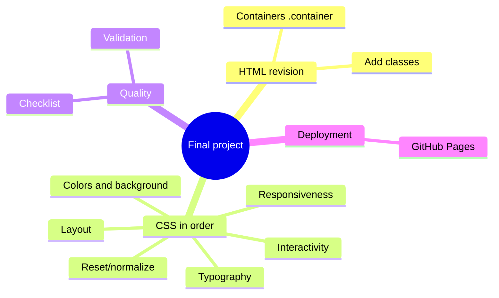
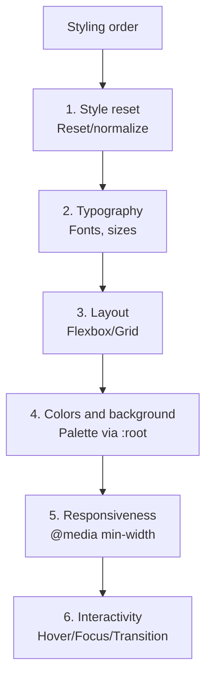

## Final Project - Complete Styling and Publishing

> **Connection to the previous lesson:** we've come the journey from `display: flex` to animations and pseudo-elements. Today is not a new topic, but **applying the entire CSS course** to an already completed HTML project from the "HTML: A to Z" course, with final publishing.

---

## Lesson Objective

Assemble all studied CSS techniques into a single polished, responsive project - take the "bare" semantic HTML site from the first course and fully style it, step by step, from a style reset to animation.

## What You Will Learn by the End of the Lesson

- How to review an existing HTML project before styling - what needs to be refined for CSS.
- How to style a project in the correct order: reset → typography → layout → colors/background → responsiveness → interactivity.
- How to go through a final CSS project quality checklist.
- How to publish the updated project on GitHub Pages.

---

## Lesson Timeline

|Block|Content|
|---|---|
|1. HTML project review|What to refine for styling: classes, wrappers|
|2. Step 1: style reset (reset/normalize)|Why it's needed, minimal version|
|3. Step 2: typography|Fonts, sizes, line-height throughout the project|
|4. Step 3: layout (Flexbox/Grid)|Page structure: header, navigation, grids|
|5. Step 4: colors and background|Color palette, consistency|
|6. Step 5: responsiveness|Media queries for all key blocks|
|7. Step 6: interactivity|Hover/focus states everywhere|
|8. Final quality checklist|Full self-check|
|9. Publishing to GitHub Pages|Updating an already published project|


---

## Block 1. HTML Project Review Before Styling

**In simple terms:** before painting the walls, it's useful to walk through the house once more and check that all doors and windows are in place and open properly. Similarly, before actively writing CSS, it's worth quickly reviewing the HTML project from the first course - not because it's "wrong" (we diligently followed the quality checklist at the end of that course), but because **styling** often requires small structural additions that weren't needed for purely semantic markup.

### What to Look for During the Review

**1. Are there enough classes for styling?**

In the HTML course we used classes rarely - mainly relying on semantic tags (`<header>`, `<nav>`, `<main>`, and so on). For CSS this is often insufficient: if there are multiple different `<section>` elements on a page, they'll all receive the same styles by default through a tag selector, but you likely need to style them differently. Go through each page and add meaningful classes where you plan to have different styling:

```html
<section class="services-section">
    ...
</section>

<section class="testimonials-section">
    ...
</section>
```

**2. Are additional wrapper containers needed?**

A common pattern that may not have existed in purely semantic HTML - a "container" with a limited max-width that centers content on wide screens:

```html
<main>
    <div class="container">
        <!-- all main content -->
    </div>
</main>
```

```css
.container {
    max-width: 1100px;
    margin: 0 auto;
    padding: 0 20px;
}
```

Without such a container, text and blocks on a very wide monitor will stretch to the full screen width, which usually looks unattractive and makes reading long lines of text difficult.

**3. Do all images have predictable sizes/proportions for future styling?**

Recall lesson 4 of the HTML course - we discussed `width`/`height` on `` for space reservation. For CSS styling, it's important that images can flexibly adapt (`width: 100%;` inside a container with limited width), so it's not a problem if specific pixel sizes in the HTML are already outdated - we'll override them in CSS.

**It's important to understand: this review is not about rewriting HTML from scratch** - it's about targeted, careful additions (classes, occasionally wrapper containers) on top of already high-quality, semantic structure. The structure itself, developed in the first course, remains unchanged.



---

## Block 2. Step 1: Style Reset (Reset/Normalize)

**In simple terms:** different browsers apply slightly different "factory" default styles to the same HTML tags (for example, different margins on lists or different font sizes on headings). **A style reset** is CSS code at the very beginning of a project that removes these differences, bringing all browsers to a single, predictable "blank slate" from which you then build your own styling from scratch.

### Minimal Reset for This Course

```css
* {
    margin: 0;
    padding: 0;
    box-sizing: border-box;
}
```

We already partially implemented this in lesson 3 (`box-sizing: border-box`) - today we add the zeroing of standard `margin`/`padding` that browsers apply by default to, for example, `<body>`, `<h1>`–`<h6>`, `<ul>`/`<ol>`, `<p>`.

### A Slightly More Complete Version (Normalization)

```css
* {
    margin: 0;
    padding: 0;
    box-sizing: border-box;
}

body {
    line-height: 1.5;
    -webkit-font-smoothing: antialiased;
}

img {
    max-width: 100%;
    display: block;
}

ul, ol {
    list-style: none;
}

a {
    text-decoration: none;
    color: inherit;
}
```

Let's briefly review the new lines:

- `body { line-height: 1.5; }` - a reasonable default base line height (recall lesson 7).
- `img { max-width: 100%; display: block; }` - images never "overflow" their container, and a small "phantom" gap at the bottom that browsers sometimes add to images as inline elements by default is removed.
- `ul, ol { list-style: none; }` - removes standard list markers/numbers (useful, for example, for navigation menus where `<ul>` is used not as a "visible list" but simply as a semantic wrapper for menu items).
- `a { text-decoration: none; color: inherit; }` - removes the standard underline and blue color of links, allowing full control of their styling through custom classes; `color: inherit;` makes the link "inherit" the text color from its parent (recall inheritance from lesson 2) instead of using the browser's default blue.

**Important accessibility note:** when removing `list-style: none;` and `text-decoration: none;`, remember that now **you yourself** are responsible for making links and interactive elements remain noticeably distinguishable from regular text - for example, through a `:hover` state (lesson 9) or through an explicit color different from surrounding text, rather than relying solely on the browser's standard underline.

**Placement in the file:** the style reset is always written at the **very beginning** of your CSS file, before all other, "substantive" rules.

---

## Block 3. Step 2: Typography Throughout the Project

Now that the reset is in place, let's set the **base** typography that will propagate through inheritance (lesson 2) to virtually the entire project.

```css
html {
    font-size: 16px;
}

body {
    font-family: "Roboto", Arial, sans-serif;
    font-size: 1rem;
    line-height: 1.6;
    color: #2c3e50;
}

h1, h2, h3 {
    font-family: "Roboto", Arial, sans-serif;
    font-weight: 700;
    line-height: 1.2;
}

h1 {
    font-size: 2.5rem;
}

h2 {
    font-size: 2rem;
}

h3 {
    font-size: 1.5rem;
}
```

Notice - we're applying several principles from lessons 1, 2, and 7 at once:

- `font-family` is set on `body` and inherited throughout the document (except headings where we explicitly override it - although in this case the value is the same, in practice these are often different fonts).
- All sizes are in `rem`, based on `html { font-size: 16px; }`, as we discussed in lesson 8 for responsiveness.
- `line-height: 1.6;` for body text (comfortable readability), but `line-height: 1.2;` for headings (headings generally look neater with tighter line spacing, especially when they span multiple lines).

If you haven't connected a Google Font yet (lesson 7) - now is the right time to do so if you want more expressive typography than the standard web-safe fonts.

---

## Block 4. Step 3: Layout (Structure with Flexbox/Grid)

Now we move to positioning the major blocks of the page - header, navigation, main content, card grids.

### Site Header and Navigation

```css
.site-header {
    display: flex;
    justify-content: space-between;
    align-items: center;
    padding: 1rem 0;
}

.main-nav {
    display: flex;
    gap: 1.5rem;
}
```

Direct application of Flexbox from lesson 5 - the logo and menu are pushed to the edges via `space-between`, and the menu items themselves are arranged in a row with even spacing via `gap`.

### General Page Structure (Example)

```css
.container {
    max-width: 1100px;
    margin: 0 auto;
    padding: 0 1.25rem;
}
```

### Card Grid (Projects, Services)

```css
.cards-grid {
    display: grid;
    grid-template-columns: repeat(auto-fit, minmax(250px, 1fr));
    gap: 1.5rem;
}
```

This uses the advanced `auto-fit`/`minmax()` technique from lesson 8 - the grid adapts to the screen width on its own, nearly without needing separate media queries for the number of columns.

**Practical advice:** go through each page of your project in order (`index.html`, `about.html`, `contact.html`, `projects.html`) and for each major visual "block" decide - is this a one-dimensional layout (Flexbox) or a full-fledged grid (Grid), based on the practical rule from lesson 6.

---

## Block 5. Step 4: Colors and Background

Put together a small, consistent color palette for the entire project - instead of making up colors "by eye" for each individual element.

```css
:root {
    --color-primary: hsl(210, 70%, 50%);
    --color-primary-dark: hsl(210, 70%, 40%);
    --color-text: #2c3e50;
    --color-background: #f9f9f9;
    --color-border: #e0e0e0;
}
```

_(This uses **CSS variables** via `:root` and `var()` - this wasn't a separate topic in the course roadmap, but it's a natural way to declare a palette once and reuse it throughout the file; you can skip this technique and simply use specific HSL/HEX values directly in each rule if that's clearer for you.)_

Application:

```css
body {
    background-color: var(--color-background);
    color: var(--color-text);
}

.button {
    background-color: var(--color-primary);
}

.button:hover {
    background-color: var(--color-primary-dark);
}
```

Recall lesson 7 - this is exactly the kind of situation (getting a darker shade of **the same** color for a hover state) for which we recommended the **HSL** format: you just need to change only the last value (lightness) without recalculating the entire color.

**Practical recommendation:** limit yourself to 3-5 main colors for the entire project (primary accent color, text color, background color, border color, possibly one additional accent color) - this is a direct requirement from the final project quality checklist ("colors and typography are consistent across the page, not haphazard").

---

## Block 6. Step 5: Responsiveness

Now that the structure and styling are ready for wide screens, go through the project in DevTools device mode (lesson 8) and add the necessary media queries.

```css
.main-nav {
    display: flex;
    flex-direction: column;
    gap: 0.75rem;
}

.site-header {
    flex-direction: column;
    align-items: flex-start;
}

@media (min-width: 768px) {
    .main-nav {
        flex-direction: row;
        gap: 1.5rem;
    }

    .site-header {
        flex-direction: row;
        align-items: center;
    }
}
```

Notice - this is the mobile-first approach from lesson 8: base rules (without a media query) are written for a narrow screen, and `@media (min-width: 768px)` "expands" the layout for wider screens.

**Go through the responsiveness checklist for each page:**

- Navigation doesn't "break" or overlap on a small screen.
- Card grids show a reasonable number of columns on different screens (or use `auto-fit`).
- Text remains readable (not too small, lines not too long on wide screens - the `.container` with `max-width` from block 4 helps with this).
- Forms (from lessons 6-7 of the HTML course) don't stretch to the full width inconveniently on desktop, and don't compress on mobile.

---

## Block 7. Step 6: Interactivity

The final touch - add hover/focus states and, optionally, a light appearance animation, using techniques from lesson 9.

```css
.button {
    background-color: var(--color-primary);
    color: white;
    padding: 0.75rem 1.5rem;
    border-radius: 6px;
    transition: background-color 0.2s, transform 0.15s;
}

.button:hover {
    background-color: var(--color-primary-dark);
    transform: translateY(-2px);
}

.button:focus {
    outline: 2px solid var(--color-primary-dark);
    outline-offset: 2px;
}

.nav-links a {
    transition: color 0.2s;
}

.nav-links a:hover {
    color: var(--color-primary);
}

input:focus,
textarea:focus {
    border-color: var(--color-primary);
    outline: none;
    box-shadow: 0 0 0 3px hsla(210, 70%, 50%, 0.25);
}
```

Notice how several course topics come together here: `transition` from lesson 9, HSL colors from lesson 7 (including `hsla()` for the semi-transparent focus shadow), and accessibility consideration (`:focus` with a noticeable but aesthetically pleasing alternative to the standard outline).

---

## Block 8. Final Quality Checklist

Go through this list - the same one announced in advance in the course roadmap - for **each** page of your project:

- [ ] CSS is connected via an external file, not inline styles
- [ ] Styling is done through classes, not ids (except in exceptional cases)
- [ ] `box-sizing: border-box` is used
- [ ] Layout is built on Flexbox/Grid, not on float/position "however it works"
- [ ] There are at least 2-3 media queries, the page is correct on mobile
- [ ] Relative units (`rem`/`em`/`%`) are used where appropriate
- [ ] Basic hover/focus states exist for interactive elements
- [ ] Colors and typography are consistent across the page (not "haphazard")

**Go through this checklist right now on one of your completed pages** - just like in the final HTML course checklist, you'll most likely find at least one item that needs refinement. Additionally, recall the quality checklist **from the HTML course** (single `h1`, `alt` on images, `label` on form fields, etc.) - styling shouldn't have accidentally disrupted any of this; for example, make sure you didn't remove `outline` from `:focus` without replacement (lesson 9), and that visible link text remains meaningful even after removing the standard underline.



---

## Block 9. Publishing the Updated Project to GitHub Pages

In the HTML course (lesson 10) we already published a project to GitHub Pages. Today is not a new "from scratch" publication but an **update** of an existing repository with new CSS files.

### If You're Working Through the GitHub Web Interface

**Step 1.** Open your existing repository on github.com.

**Step 2.** Upload the updated/new files: click "Add file" → "Upload files".

**Step 3.** Drag the `css/` folder (and any other changed files - HTML pages, if you added classes during the review in block 1) into the upload area.

**Step 4.** At the bottom, click "Commit changes".

**Step 5.** Wait 1-2 minutes - GitHub Pages will automatically rebuild and update the already published version of the site at the same link that was received in the HTML course.

### If You're Working with Git from the Terminal

```bash
git add .
git commit -m "Add complete CSS styling to the project"
git push
```

### Verifying the Result

Open your published link (`https://your-username.github.io/repository-name/`) and confirm that:

- the styles have actually been applied (if you see an unstyled page - check the path to the CSS file in `<link>`, most likely the case or folder structure on GitHub differs from local);
- the page is responsive - check on a real phone, not just in DevTools;
- all hover/focus effects work the same as locally.

---

### Common Mistakes When Updating a Publication

|Mistake|How to Fix|
|---|---|
|Forgetting to upload the entire `css/` folder, uploading only `.html` files|Make sure all changed files (including CSS) are uploaded to the repository|
|The CSS path in `<link>` uses different letter case than the actual filename on GitHub|Recall from lesson 3 of the HTML course - on GitHub Pages (Linux server) case matters in file and directory names|
|Not waiting for the rebuild, immediately checking the old cached version of the page|Wait a couple of minutes and refresh the page in the browser with a full cache clear (Ctrl+Shift+R / Cmd+Shift+R)|

---

## Course Summary

Congratulations - you've come the journey from `color: red;` in the first lesson to a fully styled, responsive, interactive, and published website! Over 10 lessons you mastered:

- CSS syntax and the correct way to connect it - external file (lesson 1).
- Precise element selection through selectors and understanding the cascade logic (lesson 2).
- Box model - the foundation on which all the rest of layout is built (lesson 3).
- Targeted positioning through `position` (lesson 4).
- Flexbox - the primary tool for one-dimensional layout (lesson 5).
- Advanced Flexbox and CSS Grid - two-dimensional grids (lesson 6).
- Typography, color, and background at a professional level (lesson 7).
- Responsive design through media queries, mobile-first (lesson 8).
- Interactivity and light animation through pseudo-classes, pseudo-elements, transition, and animation (lesson 9).
- The full cycle: from reviewing a completed HTML project to complete styling and republishing (lesson 10).

**What's next:** your site now has a solid structure (HTML) and thoughtful, responsive styling (CSS) - but is completely static: it doesn't respond to clicks dynamically, can't validate form data "on the fly," and can't load new content without a page reload. The logical continuation of the path, as announced at the very beginning - **JavaScript**, which will add true interactivity and dynamic behavior to your site, completing the HTML → CSS → JS chain.

---

## Final Practical Assignment

Style and publish your final project in full, following blocks 1-9 of this lesson:

1. Review the HTML project - add missing classes and, if needed, `.container` wrappers.
2. Style in order: reset → typography → layout → colors/background → responsiveness → interactivity.
3. Go through the final quality checklist for each page.
4. Update the publication on GitHub Pages and verify the result on a real mobile device.

---

## Homework (Post-course)

1. Ask the same friend who tested your HTML project at the end of the first course to open the site again - compare the "before" and "after" impressions of styling.
2. Run a Lighthouse check (mentioned in lesson 8 of the HTML course) on the updated site across all categories, including Performance - compare with the score you had before adding CSS.
3. Start exploring JavaScript fundamentals on your own - try, for example, the simplest script that adds a CSS class to an element on a button click (using the `transition` you already know for smoothness) - this is the first step toward connecting all three technologies together.


