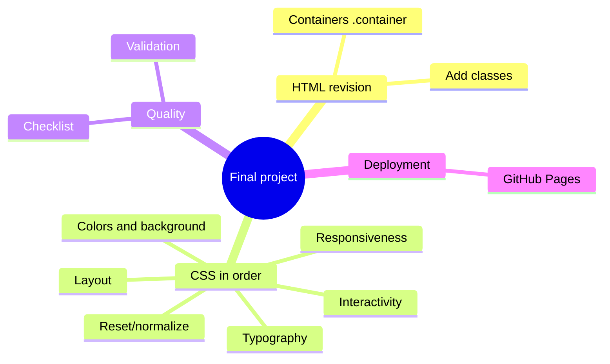
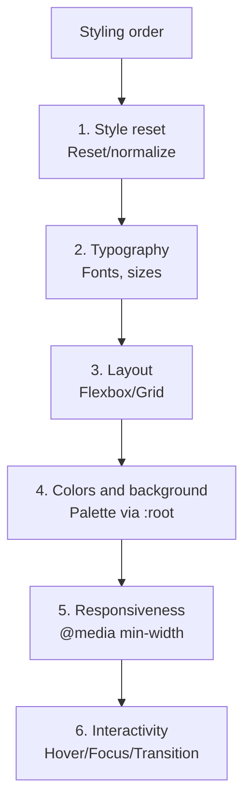

## Итоговый проект - полная стилизация и публикация

> **Связь с предыдущим уроком:** мы прошли путь от `display: flex` до анимаций и псевдоэлементов. Сегодня - не новая тема, а **применение всего курса CSS целиком** к уже готовому HTML-проекту из курса «HTML: от А до Я», с итоговой публикацией.

---

## Цель урока

Собрать все изученные приёмы CSS в единый оформленный, адаптивный проект - взять "голый" семантический HTML-сайт из первого курса и полностью его стилизовать, шаг за шагом, от сброса стилей до анимации.

## Чему вы научитесь к концу урока

- Проводить ревизию готового HTML-проекта перед стилизацией - что нужно доработать под CSS.
- Стилизовать проект в правильном порядке: сброс → типографика → layout → цвета/фон → адаптивность → интерактивность.
- Проходить по финальному чек-листу качества CSS-проекта.
- Публиковать обновлённый проект на GitHub Pages.

---

## Хронометраж урока

|Блок|Содержание|
|---|---|
|1. Ревизия HTML-проекта|Что доработать под стилизацию: классы, обёртки|
|2. Шаг 1: сброс стилей (reset/normalize)|Зачем нужен, минимальный вариант|
|3. Шаг 2: типографика|Шрифты, размеры, line-height по всему проекту|
|4. Шаг 3: layout (Flexbox/Grid)|Структура страниц: шапка, навигация, сетки|
|5. Шаг 4: цвета и фон|Цветовая палитра, согласованность|
|6. Шаг 5: адаптивность|Медиазапросы для всех ключевых блоков|
|7. Шаг 6: интерактивность|Hover/focus состояния везде|
|8. Финальный чек-лист качества|Полная самопроверка|
|9. Публикация на GitHub Pages|Обновление уже опубликованного проекта|


---

## Блок 1. Ревизия HTML-проекта перед стилизацией

**Простыми словами:** прежде чем красить стены, полезно ещё раз пройтись по дому и проверить, что все двери и окна на месте и открываются как надо. Точно так же, прежде чем активно писать CSS, стоит бегло пересмотреть HTML-проект из первого курса - не потому что он "неправильный" (мы старательно следовали чек-листу качества в конце того курса), а потому что **стилизация** часто требует небольших структурных дополнений, которые не были нужны для чисто семантической разметки.

### На что обратить внимание при ревизии

**1. Достаточно ли классов для стилизации?**

В курсе HTML мы использовали классы редко - в основном полагались на семантические теги (`<header>`, `<nav>`, `<main>` и так далее). Для CSS этого часто недостаточно: если на странице несколько разных `<section>`, всем им по умолчанию применятся одинаковые стили через селектор по тегу, а вам, скорее всего, нужно стилизовать их по-разному. Пройдитесь по каждой странице и добавьте осмысленные классы туда, где планируете разное оформление:

```html
<section class="services-section">
    ...
</section>

<section class="testimonials-section">
    ...
</section>
```

**2. Нужны ли дополнительные обёртки-контейнеры?**

Частый паттерн, которого могло не быть в чисто семантическом HTML - "контейнер" с ограниченной максимальной шириной, который центрирует содержимое на широких экранах:

```html
<main>
    <div class="container">
        <!-- весь основной контент -->
    </div>
</main>
```

```css
.container {
    max-width: 1100px;
    margin: 0 auto;
    padding: 0 20px;
}
```

Без такого контейнера текст и блоки на очень широком мониторе растянутся на всю ширину экрана, что обычно выглядит некрасиво и затрудняет чтение длинных строк текста.

**3. Все ли изображения имеют предсказуемые размеры/пропорции для будущей стилизации?**

Вспомните урок 4 курса HTML - там мы говорили про `width`/`height` у `` для резервирования места. Для CSS-стилизации важно, чтобы изображения могли гибко адаптироваться (`width: 100%;` внутри контейнера с ограниченной шириной), поэтому не страшно, если конкретные пиксельные размеры в HTML уже устарели - в CSS мы их переопределим.

**Важно понимать: эта ревизия - не про переписывание HTML заново**, а про точечные, аккуратные добавления (классы, изредка - обёртки-контейнеры) поверх уже качественной, семантической структуры. Сама структура, разработанная в первом курсе, остаётся неизменной.



---

## Блок 2. Шаг 1: сброс стилей (reset/normalize)

**Простыми словами:** разные браузеры по умолчанию применяют немного разные "заводские" стили к одним и тем же HTML-тегам (например, разные отступы у списков или разные размеры шрифта у заголовков). **Сброс стилей** - это CSS-код в самом начале проекта, который убирает эти различия, приводя все браузеры к единому, предсказуемому "чистому листу", от которого вы уже строите собственное оформление с нуля.

### Минимальный сброс для этого курса

```css
* {
    margin: 0;
    padding: 0;
    box-sizing: border-box;
}
```

Мы уже частично внедрили это в уроке 3 (`box-sizing: border-box`) - сегодня добавляем к этому обнуление стандартных `margin`/`padding`, которые браузеры по умолчанию проставляют, например, у `<body>`, `<h1>`–`<h6>`, `<ul>`/`<ol>`, `<p>`.

### Чуть более полный вариант (нормализация)

```css
* {
    margin: 0;
    padding: 0;
    box-sizing: border-box;
}

body {
    line-height: 1.5;
    -webkit-font-smoothing: antialiased;
}

img {
    max-width: 100%;
    display: block;
}

ul, ol {
    list-style: none;
}

a {
    text-decoration: none;
    color: inherit;
}
```

Разберём кратко новые строки:

- `body { line-height: 1.5; }` - разумный базовый межстрочный интервал по умолчанию (вспомните урок 7).
- `img { max-width: 100%; display: block; }` - изображения никогда не "вылезают" за пределы своего контейнера, и убирается небольшой "фантомный" отступ снизу, который браузеры иногда добавляют изображениям как строчным элементам по умолчанию.
- `ul, ol { list-style: none; }` - убирает стандартные маркеры/номера списков (полезно, например, для навигационных меню, где `<ul>` используется не как "видимый список", а просто как семантическая обёртка для пунктов меню).
- `a { text-decoration: none; color: inherit; }` - убирает стандартное подчёркивание и синий цвет ссылок, позволяя полностью управлять их оформлением через собственные классы; `color: inherit;` заставляет ссылку "наследовать" цвет текста от родителя (вспомните наследование из урока 2), а не использовать стандартный синий браузера.

**Важная оговорка про доступность:** убирая `list-style: none;` и `text-decoration: none;`, не забывайте, что теперь **вы сами** отвечаете за то, чтобы ссылки и интерактивные элементы оставались заметно отличимыми от обычного текста - например, через `:hover`-состояние (урок 9) или через явный цвет, отличный от окружающего текста, а не полагаться только на стандартное подчёркивание браузера.

**Расположение в файле:** сброс стилей всегда пишется **в самом начале** вашего CSS-файла, до всех остальных, "содержательных" правил.

---

## Блок 3. Шаг 2: типографика по всему проекту

Теперь, когда сброс готов, задаём **базовую** типографику, которая распространится через наследование (урок 2) практически на весь проект.

```css
html {
    font-size: 16px;
}

body {
    font-family: "Roboto", Arial, sans-serif;
    font-size: 1rem;
    line-height: 1.6;
    color: #2c3e50;
}

h1, h2, h3 {
    font-family: "Roboto", Arial, sans-serif;
    font-weight: 700;
    line-height: 1.2;
}

h1 {
    font-size: 2.5rem;
}

h2 {
    font-size: 2rem;
}

h3 {
    font-size: 1.5rem;
}
```

Обратите внимание - мы применяем сразу несколько принципов из уроков 1, 2 и 7:

- `font-family` задана на `body` и наследуется вниз по всему документу (кроме заголовков, где мы явно её переопределяем - хотя в данном случае значение совпадает, на практике это часто разные шрифты).
- Все размеры - в `rem`, отталкиваясь от `html { font-size: 16px; }`, как мы разбирали в уроке 8 для адаптивности.
- `line-height: 1.6;` для основного текста (комфортная читаемость), но `line-height: 1.2;` для заголовков (заголовки обычно смотрятся аккуратнее с более плотным межстрочным интервалом, особенно если состоят из нескольких строк).

Если ещё не подключили Google Font (урок 7) - сейчас подходящий момент это сделать, если хотите более выразительную типографику, чем стандартные веб-безопасные шрифты.

---

## Блок 4. Шаг 3: Layout (структура на Flexbox/Grid)

Теперь переходим к расположению крупных блоков страницы - шапки, навигации, основного контента, сеток карточек.

### Шапка сайта и навигация

```css
.site-header {
    display: flex;
    justify-content: space-between;
    align-items: center;
    padding: 1rem 0;
}

.main-nav {
    display: flex;
    gap: 1.5rem;
}
```

Прямое применение Flexbox из урока 5 - логотип и меню разнесены по краям через `space-between`, а сами пункты меню выстроены в ряд с равномерным отступом через `gap`.

### Общая структура страницы (пример)

```css
.container {
    max-width: 1100px;
    margin: 0 auto;
    padding: 0 1.25rem;
}
```

### Сетка карточек (проекты, услуги)

```css
.cards-grid {
    display: grid;
    grid-template-columns: repeat(auto-fit, minmax(250px, 1fr));
    gap: 1.5rem;
}
```

Здесь используется продвинутый приём `auto-fit`/`minmax()` из урока 8 - сетка сама адаптируется под ширину экрана почти без необходимости в отдельных медиазапросах для количества колонок.

**Практический совет:** проходите по каждой странице вашего проекта по очереди (`index.html`, `about.html`, `contact.html`, `projects.html`) и для каждого крупного визуального "блока" решайте - это одномерная раскладка (Flexbox) или полноценная сетка (Grid), опираясь на практическое правило из урока 6.

---

## Блок 5. Шаг 4: цвета и фон

Соберите небольшую, согласованную цветовую палитру для всего проекта - вместо того чтобы придумывать цвет "на глаз" для каждого отдельного элемента.

```css
:root {
    --color-primary: hsl(210, 70%, 50%);
    --color-primary-dark: hsl(210, 70%, 40%);
    --color-text: #2c3e50;
    --color-background: #f9f9f9;
    --color-border: #e0e0e0;
}
```

_(Здесь использованы **CSS-переменные** через `:root` и `var()` - это не было отдельной темой в дорожной карте курса, но является естественным способом один раз объявить палитру и переиспользовать её по всему файлу; можно опустить эту технику и просто использовать конкретные значения HSL/HEX напрямую в каждом правиле, если так понятнее.)_

Применение:

```css
body {
    background-color: var(--color-background);
    color: var(--color-text);
}

.button {
    background-color: var(--color-primary);
}

.button:hover {
    background-color: var(--color-primary-dark);
}
```

Вспомните урок 7 - именно ради таких ситуаций (получение более тёмного оттенка **того же самого** цвета для hover-состояния) мы рекомендовали формат **HSL**: достаточно изменить только последнее значение (светлоту), не пересчитывая весь цвет заново.

**Практическая рекомендация:** ограничьтесь 3-5 основными цветами на весь проект (основной акцентный цвет, цвет текста, цвет фона, цвет границ, возможно - один дополнительный акцентный цвет) - это прямое требование из чек-листа итогового проекта («цвета и типографика согласованы по всей странице, не вразнобой»).

---

## Блок 6. Шаг 5: адаптивность

Теперь, когда структура и оформление готовы на широком экране, проходим по проекту в режиме устройства DevTools (урок 8) и добавляем необходимые медиазапросы.

```css
.main-nav {
    display: flex;
    flex-direction: column;
    gap: 0.75rem;
}

.site-header {
    flex-direction: column;
    align-items: flex-start;
}

@media (min-width: 768px) {
    .main-nav {
        flex-direction: row;
        gap: 1.5rem;
    }

    .site-header {
        flex-direction: row;
        align-items: center;
    }
}
```

Обратите внимание - это mobile-first подход из урока 8: базовые правила (без медиазапроса) написаны для узкого экрана, а `@media (min-width: 768px)` "расширяет" макет для более широких экранов.

**Пройдитесь по чек-листу адаптивности для каждой страницы:**

- Навигация не "ломается" и не наезжает на маленьком экране.
- Сетки карточек показывают разумное количество колонок на разных экранах (или используют `auto-fit`).
- Текст остаётся читаемым (не слишком мелким, строки не слишком длинными на широких экранах - этому помогает `.container` с `max-width` из блока 4).
- Формы (из уроков 6-7 курса HTML) не растягиваются на всю ширину неудобным образом на десктопе, и не сжимаются на мобильном.

---

## Блок 7. Шаг 6: интерактивность

Финальный штрих - добавляем hover/focus-состояния и, при желании, лёгкую анимацию появления, используя приёмы из урока 9.

```css
.button {
    background-color: var(--color-primary);
    color: white;
    padding: 0.75rem 1.5rem;
    border-radius: 6px;
    transition: background-color 0.2s, transform 0.15s;
}

.button:hover {
    background-color: var(--color-primary-dark);
    transform: translateY(-2px);
}

.button:focus {
    outline: 2px solid var(--color-primary-dark);
    outline-offset: 2px;
}

.nav-links a {
    transition: color 0.2s;
}

.nav-links a:hover {
    color: var(--color-primary);
}

input:focus,
textarea:focus {
    border-color: var(--color-primary);
    outline: none;
    box-shadow: 0 0 0 3px hsla(210, 70%, 50%, 0.25);
}
```

Обратите внимание, как здесь сочетаются сразу несколько тем курса: `transition` из урока 9, HSL-цвета из урока 7 (в том числе `hsla()` для полупрозрачной тени фокуса), и забота о доступности (`:focus` с заметной, но эстетичной альтернативой стандартному outline).

---

## Блок 8. Финальный чек-лист качества

Пройдите по этому списку - тому самому, что был заранее объявлен в дорожной карте курса - для **каждой** страницы вашего проекта:

- [ ] CSS подключён внешним файлом, а не инлайн-стилями
- [ ] Стилизация через классы, а не через id (кроме исключительных случаев)
- [ ] Используется `box-sizing: border-box`
- [ ] Layout построен на Flexbox/Grid, а не на float/position "как попало"
- [ ] Есть хотя бы 2-3 медиазапроса, страница корректна на мобильном
- [ ] Используются относительные единицы (`rem`/`em`/`%`) там, где это уместно
- [ ] Есть базовые hover/focus-состояния у интерактивных элементов
- [ ] Цвета и типографика согласованы по всей странице (не "вразнобой")

**Пройдите этот чек-лист прямо сейчас по одной из ваших готовых страниц** - как и в итоговом чек-листе курса HTML, скорее всего, найдётся хотя бы один пункт, который стоит доработать. Дополнительно вспомните и чек-лист качества **из курса HTML** (единственный `h1`, `alt` у изображений, `label` у полей форм и так далее) - стилизация не должна была случайно нарушить ничего из этого; например, убедитесь, что вы не убрали `outline` у `:focus` без замены (урок 9), и что видимый текст ссылок остался осмысленным даже после снятия стандартного подчёркивания.



---

## Блок 9. Публикация обновлённого проекта на GitHub Pages

В курсе HTML (урок 10) мы уже публиковали проект на GitHub Pages. Сегодня - не новая публикация "с нуля", а **обновление** уже существующего репозитория новыми CSS-файлами.

### Если вы работаете через веб-интерфейс GitHub

**Шаг 1.** Откройте ваш существующий репозиторий на github.com.

**Шаг 2.** Загрузите обновлённые/новые файлы: нажмите "Add file" → "Upload files".

**Шаг 3.** Перетащите папку `css/` (и любые другие изменённые файлы - HTML-страницы, если вы добавляли классы во время ревизии в блоке 1) в область загрузки.

**Шаг 4.** Внизу нажмите "Commit changes".

**Шаг 5.** Подождите 1-2 минуты - GitHub Pages автоматически пересоберёт и обновит уже опубликованную версию сайта по той же самой ссылке, что была получена в курсе HTML.

### Если вы работаете через Git из терминала

```bash
git add .
git commit -m "Добавлена полная CSS-стилизация проекта"
git push
```

### Проверка результата

Откройте вашу опубликованную ссылку (`https://ваш-username.github.io/название-репозитория/`) и убедитесь, что:

- стили действительно применились (если видите неоформленную страницу - проверьте путь к CSS-файлу в `<link>`, скорее всего, регистр или структура папок на GitHub отличаются от локальной);
- страница адаптивна - проверьте прямо на реальном телефоне, а не только в DevTools;
- все hover/focus-эффекты работают так же, как локально.

---

### Частые ошибки при обновлении публикации

|Ошибка|Как исправить|
|---|---|
|Забывают загрузить папку `css/` целиком, загружают только `.html`-файлы|Убедитесь, что все изменённые файлы (включая CSS) загружены в репозиторий|
|Путь к CSS в `<link>` использует другой регистр букв, чем реальное имя файла на GitHub|Помните из урока 3 курса HTML - на GitHub Pages (Linux-сервер) регистр в именах файлов и путях имеет значение|
|Не дожидаются пересборки, сразу проверяют старую закешированную версию страницы|Подождите пару минут и обновите страницу в браузере с полной очисткой кеша (Ctrl+Shift+R / Cmd+Shift+R)|

---

## Итоги курса

Поздравляем - вы прошли путь от `color: red;` в первом уроке до полностью стилизованного, адаптивного, интерактивного и опубликованного сайта! За 10 уроков вы освоили:

- Синтаксис CSS и правильный способ подключения - внешний файл (урок 1).
- Точный выбор элементов через селекторы и понимание логики каскада (урок 2).
- Box model - фундамент, на котором строится вся остальная вёрстка (урок 3).
- Точечное позиционирование через `position` (урок 4).
- Flexbox - главный инструмент одномерной раскладки (урок 5).
- Продвинутый Flexbox и CSS Grid - двумерные сетки (урок 6).
- Типографику, цвет и фон на профессиональном уровне (урок 7).
- Адаптивную вёрстку через медиазапросы, mobile-first (урок 8).
- Интерактивность и лёгкую анимацию через псевдоклассы, псевдоэлементы, transition и animation (урок 9).
- Полный цикл: от ревизии готового HTML-проекта до полной стилизации и повторной публикации (урок 10).

**Что дальше:** ваш сайт теперь имеет прочную структуру (HTML) и продуманное, адаптивное оформление (CSS) - но пока полностью статичен: он не реагирует на клики динамически, не умеет проверять данные форм "на лету", не может подгружать новый контент без перезагрузки страницы. Логичное продолжение пути, как и было анонсировано в самом начале - **JavaScript**, который добавит вашему сайту настоящую интерактивность и динамическое поведение, замыкая связку HTML → CSS → JS.

---

## Финальное практическое задание

Стилизуйте и опубликуйте свой итоговый проект целиком, следуя блокам 1-9 этого урока:

1. Проведите ревизию HTML-проекта - добавьте недостающие классы и, при необходимости, `.container`-обёртки.
2. Стилизуйте по порядку: сброс → типографика → layout → цвета/фон → адаптивность → интерактивность.
3. Пройдите финальный чек-лист качества для каждой страницы.
4. Обновите публикацию на GitHub Pages и проверьте результат на реальном мобильном устройстве.

---

## Домашнее задание (пост-курс)

1. Попросите того же знакомого, что тестировал ваш HTML-проект в конце первого курса, снова открыть сайт - сравните впечатления "до" и "после" стилизации.
2. Пройдите Lighthouse-проверку (упомянутую в уроке 8 курса HTML) на обновлённом сайте по всем категориям, включая Performance - сравните с оценкой, которая была до добавления CSS.
3. Начните исследовать основы JavaScript самостоятельно - попробуйте, например, простейший скрипт, который по клику на кнопку добавляет CSS-класс элементу (используя уже знакомый вам `transition` для плавности) - это первый шаг к соединению всех трёх технологий вместе.

