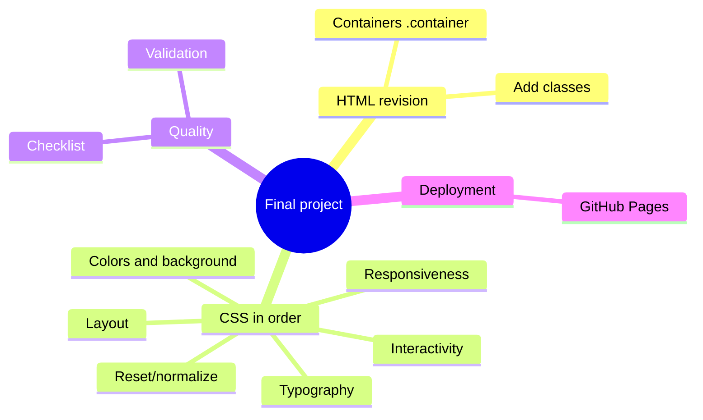
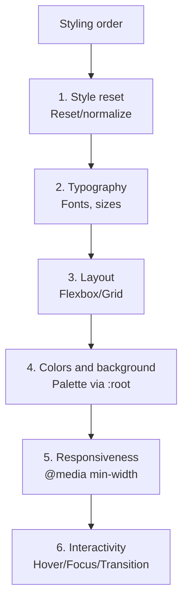

## Yakuniy loyiha - to'liq stilizatsiya va nashr etish

> **Oldingi dars bilan bog'liqlik:** biz `display: flex` dan animatsiyalar va soxta-elementlargacha yo'lni bosib o'tdik. Bugun - yangi mavzu emas, balki allaqachon tayyor HTML loyihaga **butun CSS kursining qo'llanilishi** - yakuniy nashr bilan.

---

## Darsning maqsadi

Barcha o'rganilgan CSS usullarini bitta bezatilgan, moslashuvchan loyihaga jamlash - birinchi kursdan "yupqa" semantik HTML saytni olish va uni to'liq stilizatsiya qilish, bosqichma-bosqich, uslublarni qayta o'rnatishdan animatsiyagacha.

## Dars oxiriga qadar nimalarni o'rganasiz

- Stilizatsiyadan oldin tayyor HTML loyihasini tekshirish - CSS uchun nima qo'shimcha qilish kerak.
- To'g'ri tartibda loyihani stilizatsiya qilish: qayta o'rnatish → tipografiya → layout → ranglar/fon → moslashuvchanlik → interaktivlik.
- CSS loyihasi sifatining yakuniy tekshirish ro'yxatidan o'tish.
- Yangilangan loyihani GitHub Pages da nashr etish.

---

## Darsning vaqt jadvali

|Blok|Mazmun|
|---|---|
|1. HTML loyihasini tekshirish|Stilizatsiya uchun nima qo'shimcha qilish: klasslar, o'rovchilar|
|2. 1-qadam: uslublarni qayta o'rnatish (reset/normalize)|Nega kerak, minimal variant|
|3. 2-qadam: tipografiya|Shriftlar, o'lchamlar, line-height butun loyiha bo'ylab|
|4. 3-qadam: layout (Flexbox/Grid)|Sahifalar tuzilmasi: sariq, navigatsiya, tarmoqlar|
|5. 4-qadam: ranglar va fon|Rang palitrasi, muvofiqlashtirish|
|6. 5-qadam: moslashuvchanlik|Barcha asosiy bloklar uchun media-so'rovlari|
|7. 6-qadam: interaktivlik|Hover/focus holatlari hamma joyda|
|8. Yakuniy sifat tekshirish ro'yxati|To'liq o'zini tekshirish|
|9. GitHub Pages da nashr etish|Allaqachon nashr etilgan loyihani yangilash|


---

## 1-blok. Stilizatsiyadan oldin HTML loyihasini tekshirish

**Oddiy qilib aytganda:** devorlarni bo'yashdan oldin, uyda yana bir marta yurib, barcha eshik va derazalarning o'z joyida va to'g'ri ochilishini tekshirish foydali. Xuddi shunday, CSS ni faol yozishdan oldin, birinchi kursdagi HTML loyihasini tezlik bilan ko'rib chiqish lozim - u "noto'g'ri" deb emas (biz o'sha kurs oxiridagi sifat tekshirish ro'yxatiga rioya qilgan edik), balki **stilizatsiya** ko'pincha toza semantik belgilash uchun zarur bo'lmagan kichik tuzilmaviy qo'shimchalarni talab qiladi.

### Tekshirishda e'tibor berish kerak narsalar

**1. Stilizatsiya uchun klasslar yetarlimi?**

HTML kursida biz klasslarni kam ishlatdik - asosan semantik teglarga (`<header>`, `<nav>`, `<main>` va h.k.) tayanib. CSS uchun bu ko'pincha yetarli emas: sahifada bir nechta turli `<section>` bo'lsa, ularning barchasiga teg bo'yicha tanlov orqali bir xil uslublar qo'llaniladi, sizga esa ularni turlicha stilizatsiya qilish kerak bo'lishi mumkin. Har bir sahifani ko'rib chiqing va turli bezatish rejalashtirilgan joylarga ma'noli klasslar qo'shing:

```html
<section class="services-section">
    ...
</section>

<section class="testimonials-section">
    ...
</section>
```

**2. Qo'shimcha o'rovchi-konteynerlar kerakmi?**

Toza semantik HTML da bo'lmagan bo'lishi mumkin bo'lgan keng tarqalgan naqsh - keng ekranlarda kontentni markazlashtiruvchi cheklangan maksimal kenglikdagi "konteyner":

```html
<main>
    <div class="container">
        <!-- barcha asosiy kontent -->
    </div>
</main>
```

```css
.container {
    max-width: 1100px;
    margin: 0 auto;
    padding: 0 20px;
}
```

Bunday konteynersiz matn va bloklar juda katta ekranlarda butun ekran kengligiga cho'ziladi, bu odatda yoqimsiz ko'rinadi va uzoq matn satrlarini o'qishni qiyinlashtiradi.

**3. Barcha rasmlar kelajakdagi stilizatsiya uchun bashorat qilinadigan o'lchamlarga/proporsiyalarga egami?**

HTML kursining 4-darsini eslang - biz `` da joy ajratish uchun `width`/`height` haqida gaplashgan edik. CSS stilizatsiyasi uchun rasmlarning moslashuvchan bo'lishi muhim (`width: 100%;` cheklangan kenglikdagi konteyner ichida), shuning uchun HTML dagi aniq piksel o'lchamlari eskirgan bo'lsa, xavf yo'q - CSS da ularni qayta belgilaymiz.

**Muhim tushunish: bu tekshirish HTML ni qayta yozish haqida emas**, allaqachon sifatli, semantik tuzilma ustiga aniq, ehtiyotkor qo'shimchalar (klasslar, kamdan-kam - o'rovchilar-konteynerlar) haqida. Birinchi kursda ishlab chiqilgan tuzilma o'zgarmaydi.



---

## 2-blok. 1-qadam: uslublarni qayta o'rnatish (reset/normalize)

**Oddiy qilib aytganda:** turli brauzerlar standart holatda bir xil HTML teglariga biroz turli "zavod" uslublarini qo'llaydi (masalan, ro'yxatlarning turli oraliqlari yoki sarlavhalarning turli shrift o'lchamlari). **Uslublarni qayta o'rnatish** - loyiha boshidagi CSS kodi, bu farqlarni yo'qotib, barcha brauzerlarni bitta, bashorat qilinadigan "toza varaq"ga keltiradi, undan keyin o'z bezatishingizni noldan qurasiz.

### Ushbu kurs uchun minimal qayta o'rnatish

```css
* {
    margin: 0;
    padding: 0;
    box-sizing: border-box;
}
```

Biz buni 3-darsda qisman joriy qilgan edik (`box-sizing: border-box`) - bugun bunga `<body>`, `<h1>`–`<h6>`, `<ul>`/`<ol>`, `<p>` da brauzerlar standart holatda belgilagan standart `margin`/`padding` ni nolga tushirishni qo'shamiz.

### Biroz to'liqroq variant (normallashtirish)

```css
* {
    margin: 0;
    padding: 0;
    box-sizing: border-box;
}

body {
    line-height: 1.5;
    -webkit-font-smoothing: antialiased;
}

img {
    max-width: 100%;
    display: block;
}

ul, ol {
    list-style: none;
}

a {
    text-decoration: none;
    color: inherit;
}
```

Yangi satrlarni qisqacha tahlil qilamiz:

- `body { line-height: 1.5; }` - standart holatdagi maqul satrlararo masofa (7-darsni eslang).
- `img { max-width: 100%; display: block; }` - rasmlar hech qachon o'z konteyneridan "chiqmaydi", va brauzerlar ba'zan rasmlarni standart holatda qator elementlari sifatida qo'shadigan kichik "fantom" pastki oraliq olib tashlanadi.
- `ul, ol { list-style: none; }` - ro'yxatlarning standart belgilarini/raqamlarini olib tashlaydi (masalan, navigatsiya menyulari uchun foydali, bu erda `<ul>` "ko'rinadigan ro'yxat" sifatida emas, balki menyu nuqtalari uchun semantik o'rovchi sifatida ishlatiladi).
- `a { text-decoration: none; color: inherit; }` - havolalarning standart tag chizig'i va ko'k rangini olib tashlaydi, ularning bezatishini o'z klasslari orqali to'liq boshqarishga imkon beradi; `color: inherit;` havolaga ota-elementdan matn rangini "meros qilib olish" imkonini beradi (2-darsdan meros olishni eslang), brauzerning standart ko'k rangi o'rniga.

**Moslilik haqida muhim eslatma:** `list-style: none;` va `text-decoration: none;` olib tashlab, endi havolalar va interaktiv elementlarning oddiy matndan sezilarli farqlanishini ta'minlash **o'zingiz** mas'ul ekanligini unutmang - masalan, `:hover` holati (9-dars) yoki atrofdagi matndan farqli aniq rang orqali, faqat brauzerning standart tag chizig'iga tayanmasdan.

**Faylda joylashuv:** uslublarni qayta o'rnatish har doim CSS faylingizning **eng boshida**, barcha boshqa, "mazmunli" qoidalardan oldin yoziladi.

---

## 3-blok. 2-qadam: butun loyihadagi tipografiya

Endi qayta o'rnatish tayyor bo'lganda, butun loyiha bo'ylab meros orqali (2-dars) qo'llaniladigan **asosiy** tipografiyani belgilaymiz.

```css
html {
    font-size: 16px;
}

body {
    font-family: "Roboto", Arial, sans-serif;
    font-size: 1rem;
    line-height: 1.6;
    color: #2c3e50;
}

h1, h2, h3 {
    font-family: "Roboto", Arial, sans-serif;
    font-weight: 700;
    line-height: 1.2;
}

h1 {
    font-size: 2.5rem;
}

h2 {
    font-size: 2rem;
}

h3 {
    font-size: 1.5rem;
}
```

E'tibor bering - biz 1, 2 va 7-darslardan bir necha tamoyilni qo'llayapmiz:

- `font-family` `body` da belgilangan va butun hujjat bo'ylab pastga meros qilinadi (sarlavhalarda biz uni aniq qayta belgilaganda bundan mustasno - bu holatda qiymat mos keladi, amaliyotda bu ko'pincha turli shriftlar).
- Barcha o'lchamlar `rem` da, `html { font-size: 16px; }` dan kelib chiqib, 8-darsda moslashuvchanlik uchun tushuntirilgandek.
- Asosiy matn uchun `line-height: 1.6;` (qulay o'qiladiganlik), lekin sarlavhalar uchun `line-height: 1.2;` (sarlavhalar odatda zichroq satrlararo masofa bilan yanada tartibli ko'rinadi, ayniqsa bir necha satrdan iborat bo'lsa).

Agar hali Google Font ulamagan bo'lsangiz (7-dars) - endi buni qilish uchun mos vaqt, agar standart veb-xavfsiz shriftlardan ko'ra ifodaliroq tipografiya xohlasangiz.

---

## 4-blok. 3-qadam: Layout (Flexbox/Grid bo'yicha tuzilma)

Endi sahifaning katta bloklarining joylashuviga o'tamiz - sariq, navigatsiya, asosiy kontent, kartochkalar tarmog'i.

### Sayt sarlig'i va navigatsiya

```css
.site-header {
    display: flex;
    justify-content: space-between;
    align-items: center;
    padding: 1rem 0;
}

.main-nav {
    display: flex;
    gap: 1.5rem;
}
```

5-darsdan to'g'ridan-to'g'ri Flexbox qo'llanilishi - logo va menyu `space-between` orqali chekkalarga ajratilgan, menyu nuqtalari esa `gap` orqali teng oraliq bilan qatorga joylashtirilgan.

### Sahifaning umumiy tuzilmasi (misol)

```css
.container {
    max-width: 1100px;
    margin: 0 auto;
    padding: 0 1.25rem;
}
```

### Kartochkalar tarmog'i (loyihalar, xizmatlar)

```css
.cards-grid {
    display: grid;
    grid-template-columns: repeat(auto-fit, minmax(250px, 1fr));
    gap: 1.5rem;
}
```

Bu erda 8-darsdan ilg'or `auto-fit`/`minmax()` usuli ishlatiladi - tarmoq o'zi ekran kengligiga moslashadi, ustunlar soni uchun alohida media-so'rovlarga ehtiyoj deyarli yo'q.

**Amaliy maslahat:** loyihangizning har bir sahifasini (`index.html`, `about.html`, `contact.html`, `projects.html`) navbat bilan ko'rib chiqing va har katta vizual "blok" uchun hal qiling - bu bir o'lchamli tartib (Flexbox) yoki to'liq tarmoq (Grid), 6-darsdan amaliy qoidaga asoslanib.

---

## 5-blok. 4-qadam: ranglar va fon

Butun loyiha uchun kichik, muvofiqlashtirilgan rang palitrasi yig'ing - har bir alohida element uchun "ko'z bilan" rang o'ylab topish o'rniga.

```css
:root {
    --color-primary: hsl(210, 70%, 50%);
    --color-primary-dark: hsl(210, 70%, 40%);
    --color-text: #2c3e50;
    --color-background: #f9f9f9;
    --color-border: #e0e0e0;
}
```

_(Bu erda `:root` va `var()` orqali **CSS o'zgaruvchilari** ishlatilgan - bu kurs yo'l xaritasida alohida mavzu bo'lmagan, lekin palitrani bir marta e'lon qilish va butun faylda qayta ishlatishning tabiiy usuli; bu usulni tashlab, har bir qoidada to'g'ridan-to'g'ri HSL/HEX qiymatlarini ishlatishingiz mumkin, agar tushunarliroq bo'lsa.)_

Qo'llanilishi:

```css
body {
    background-color: var(--color-background);
    color: var(--color-text);
}

.button {
    background-color: var(--color-primary);
}

.button:hover {
    background-color: var(--color-primary-dark);
}
```

7-darsni eslang - aynan shunday holatlar uchun (hover holati uchun **o'zining** rangining qorong'roq tonini olish) biz **HSL** formatini tavsiya qilgan edik: oxirgi qiymatni (yorug'likni) o'zgartirish yetarli, barcha rangni qayta hisoblamasdan.

**Amaliy tavsiya:** butun loyiha uchun 3-5 ta asosiy rang bilan cheklangan bo'ling (asosiy aktsent rang, matn rangi, fon rangi, chegaralar rangi, ehtimol - bitta qo'shimcha aktsent rang) - bu yakuniy loyiha sifat tekshirish ro'yxatidagi to'g'ridan-to'g'ri talab ("ranglar va tipografiya butun sahifada muvofiqlashtirilgan, tartibsiz emas").

---

## 6-blok. 5-qadam: moslashuvchanlik

Endi tuzilma va bezatish keng ekranda tayyor bo'lganda, loyihani DevTools qurilma rejimida (8-dars) ko'rib chiqamiz va zaruriy media-so'rovlarni qo'shamiz.

```css
.main-nav {
    display: flex;
    flex-direction: column;
    gap: 0.75rem;
}

.site-header {
    flex-direction: column;
    align-items: flex-start;
}

@media (min-width: 768px) {
    .main-nav {
        flex-direction: row;
        gap: 1.5rem;
    }

    .site-header {
        flex-direction: row;
        align-items: center;
    }
}
```

E'tibor bering - bu 8-darsdan mobile-first yondashuvi: asosiy qoidalar (media-so'rovsiz) tor ekran uchun yozilgan, `@media (min-width: 768px)` esa keng ekranlar uchun maketni "kengaytiradi".

**Har bir sahifa uchun moslashuvchanlik tekshirish ro'yxatidan o'ting:**

- Navigatsiya kichik ekranda "buzilmaydi" va yopishmaydi.
- Kartochkalar tarmog'i turli ekranlarda maqul ustunlar sonini ko'rsatadi (yoki `auto-fit` ishlatadi).
- Matn o'qiladigan qoladi (juda kichik emas, keng ekranlarda satrlar juda uzun emas - bunga 4-blokdagi `max-width` bilan `.container` yordam beradi).
- Shakllar (HTML kursining 6-7-darslaridan) desktop da hamma kenglikka qulaysiz cho'zilmaydi va mobil da siqilmaydi.

---

## 7-blok. 6-qadam: interaktivlik

So'nggi tafsilot - hover/focus holatlarini va, xohish bo'lsa, yengil paydo bo'lish animatsiyasini qo'shamiz, 9-darsdan usullarni ishlatib.

```css
.button {
    background-color: var(--color-primary);
    color: white;
    padding: 0.75rem 1.5rem;
    border-radius: 6px;
    transition: background-color 0.2s, transform 0.15s;
}

.button:hover {
    background-color: var(--color-primary-dark);
    transform: translateY(-2px);
}

.button:focus {
    outline: 2px solid var(--color-primary-dark);
    outline-offset: 2px;
}

.nav-links a {
    transition: color 0.2s;
}

.nav-links a:hover {
    color: var(--color-primary);
}

input:focus,
textarea:focus {
    border-color: var(--color-primary);
    outline: none;
    box-shadow: 0 0 0 3px hsla(210, 70%, 50%, 0.25);
}
```

E'tibor bering, bu erda kursning bir necha mavzusi qanday birlashgan: 9-darsdan `transition`, 7-darsdan HSL ranglari (shu jumladan fokus soyasining yarim shaffof uchun `hsla()`) va moslik haqida g'amxo'rlik (standart outline ga nisbatan sezilarli, lekin estetik muqobil bilan `:focus`).

---

## 8-blok. Yakuniy sifat tekshirish ro'yxati

Shu ro'yxatdan o'ting - kurs yo'l xaritasida oldindan e'lon qilingan ro'yxatdan - loyihangizning **har bir** sahifasi uchun:

- [ ] CSS tashqi fayl orqali ulangan, inline uslublar emas
- [ ] Stilizatsiya klasslar orqali, id orqali emas (istisno holatlaridan tashqari)
- [ ] `box-sizing: border-box` ishlatilgan
- [ ] Layout Flexbox/Grid qurilgan, float/position "qanday bo'lsa" emas
- [ ] Kamida 2-3 ta media-so'rov bor, sahifada mobil to'g'ri ko'rinadi
- [ ] Mos joylarda nisbiy o'lchov birliklari (`rem`/`em`/`%`) ishlatilgan
- [ ] Interaktiv elementlarda asosiy hover/focus holatlari bor
- [ ] Ranglar va tipografiya butun sahifada muvofiqlashtirilgan ("tartibsiz" emas)

**Hozir tayyor sahifalaringizdan biri bo'yicha shu ro'yxatdan o'ting** - HTML kursining yakuniy tekshirish ro'yxatida bo'lgani kabi, ehtimol, tayyorlash kerak bo'lgan kamida bitta band topiladi. Qo'shimcha HTML kursidagi sifat tekshirish ro'yxatini (yagona `h1`, rasmlarda `alt`, shakl maydonlarida `label` va h.k.) eslang - stilizatsiya tasodifan bunday hech narsani buzmasligi kerak; masalan, `:focus` dan `outline` ni almashtirmasdan o'chirmaganingizga ishonch hosil qiling (9-dars), va havolalarning ko'rinadigan matni standart tag chiziq olib tashlangandan keyin ham ma'noli qolganiga.



---

## 9-blok. Yangilangan loyihani GitHub Pages da nashr etish

HTML kursida (10-dars) biz allaqachon loyihani GitHub Pages da nashr qilgan edik. Bugun - "noldan" yangi nashr emas, balki allaqachon mavjud repositoriyani yangi CSS fayllari bilan **yangilash**.

### Agar GitHub veb-interfeysi orqali ishlasangiz

**1-qadam.** github.com da mavjud repositoriyangizni oching.

**2-qadam.** Yangilangan/yangi fayllarni yuklang: "Add file" → "Upload files" tugmasini bosing.

**3-qadam.** `css/` papkasini (va boshqa o'zgartirilgan fayllarni - HTML sahifalar, agar 1-blokda tekshirish paytida klasslar qo'shgan bo'lsangiz) yuklash maydoniga torting.

**4-qadam.** Pastda "Commit changes" tugmasini bosing.

**5-qadam.** 1-2 daqiqa kuting - GitHub Pages avtomatik ravishda saytning allaqachon nashr etilgan versiyasini qayta yig'adi va yangilaydi, HTML kursida olingan xuddi shu havola bo'yicha.

### Agar terminaldan Git orqali ishlasangiz

```bash
git add .
git commit -m "To'liq CSS stilizatsiya qo'shildi"
git push
```

### Natijani tekshirish

Nashr etilgan havolangizni (`https://sizning-username.github.io/repo-nomi/`) oching va ishonch hosil qiling:

- uslublar haqiqatan qo'llanilgan (agar bezatilmagan sahifani ko'rsangiz - `<link>` dagi CSS faylga yo'lni tekshiring, ehtimol GitHub da katta-kichik harflar yoki papka tuzilmasi mahalliydan farq qiladi);
- sahifasi moslashuvchan - haqiqiy telefonda tekshiring, faqat DevTools da emas;
- barcha hover/focus effektlari mahallidagidek ishlaydi.

---

### �️ Nashrni yangilashda ko'p uchraydigan xatolari

|Xato|Qanday tuzatish|
|---|---|
|`css/` papkasini butunlay yuklashni unutishlar, faqat `.html` fayllarini yuklashlar|Barcha o'zgartirilgan fayllar (CSS bilan) repositoriyaga yuklanganiga ishonch hosil qiling|
|`<link>` dagi CSS yo'li GitHub dagi haqiqiy fayl nomidan boshqa katta-kichik harflardan foydalanadi|HTML kursining 3-darsidan eslang - GitHub Pages (Linux server) da fayllar nomlari va yo'llarida katta-kichik harflar muhim|
|Qayta yig'ishni kutmay, darhol eski keshlangan sahifani tekshirishlar|Bir necha daqiqa kuting va brauzerda sahifani to'liq keshni tozalab yangilang (Ctrl+Shift+R / Cmd+Shift+R)|

---

## Kurs xulosalari

Tabriklaymiz - siz birinchi darsdagi `color: red;` dan to'liq stilizatsiyalangan, moslashuvchan, interaktiv va nashr etilgan saytgacha yo'lni bosib o'tdingiz! 10 dars davomida siz egalladingiz:

- CSS sintaksisi va to'g'ri ulash usuli - tashqi fayl (1-dars).
- Selektorlar orqali elementlarning aniq tanlovi va kaskad mantiqini tushunish (2-dars).
- Box model - butun qolgi tiklashning asosi (3-dars).
- `position` orqali aniq joylashtirish (4-dars).
- Flexbox - bir o'lchamli tartibning asosiy vositasi (5-dars).
- Ilg'or Flexbox va CSS Grid - ikki o'lchamli tarmoqlar (6-dars).
- Tipografiya, rang va fonni professional darajada (7-dars).
- Media-so'rovlari, mobile-first orqali moslashuvchan tiklash (8-dars).
- Soxta-sinflar, soxta-elementlar, transition va animation orqali interaktivlik va yengil animatsiya (9-dars).
- To'liq sikl: tayyor HTML loyihasini tekshirishdan to'liq stilizatsiya va qayta nashrgacha (10-dars).

**Keyingisi nima:** saytingiz endi mustahkam tuzilma (HTML) va puxta o'ylangan, moslashuvchan bezatishga (CSS) ega - lekin hali butunlay statik: bosishlarga dinamik reaktsiya bermaydi, shakllar ma'lumotlarini "uchishda" tekshirmaydi, sahifani qayta yuklamasdan yangi kontent yuklab olmaydi. Mantiqiy davom, boshida e'lon qilingandek - **JavaScript**, u saytingizga haqiqiy interaktivlik va dinamik xulq qo'shadi, HTML → CSS → JS bog'lamasini yopadi.

---

## Yakuniy amaliy topshiriq

Yakuniy loyihangizni butunlay stilizatsiya qiling va nashr eting, ushbu darsning 1-9 bloklariga rioya qiling:

1. HTML loyihasini tekshiring - yetishmayotgan klasslar qo'shing va zarurat bo'lsa `.container` o'rovchilarini.
2. Tartibda stilizatsiya qiling: qayta o'rnatish → tipografiya → layout → ranglar/fon → moslashuvchanlik → interaktivlik.
3. Har bir sahifa uchun yakuniy sifat tekshirish ro'yxatidan o'ting.
4. GitHub Pages da nashrni yangilang va natijani haqiqiy mobil qurilmada tekshiring.

---

## Uy vazifasi (kursdan keyin)

1. Birinchi kurs oxirida HTML loyihasini sinovdan o'tkazgan tanishingizdan yana saytni ochishni so'rang - stilizatsiyadan "oldin" va "keyin" taassurotlarini solishtiring.
2. HTML kursining 8-darsida eslatilgan Lighthouse tekshiruvini yangilangan saytda barcha toifalarda, shu jumladan Performance da o'tkazing - CSS qo'shishdan oldingi baho bilan solishtiring.
3. JavaScript asoslarini mustaqil o'rganishni boshlang - masalan, tugmaga bosganda elementga CSS klassi qo'shishga harakat qiling (allaqachon tanish `transition` silliqlik uchun ishlatib) - bu uchta texnologiyani birgalikda bog'lashning birinchi qadami.


