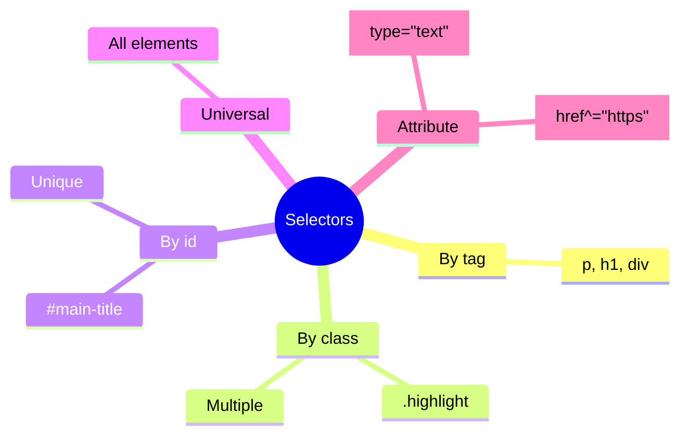
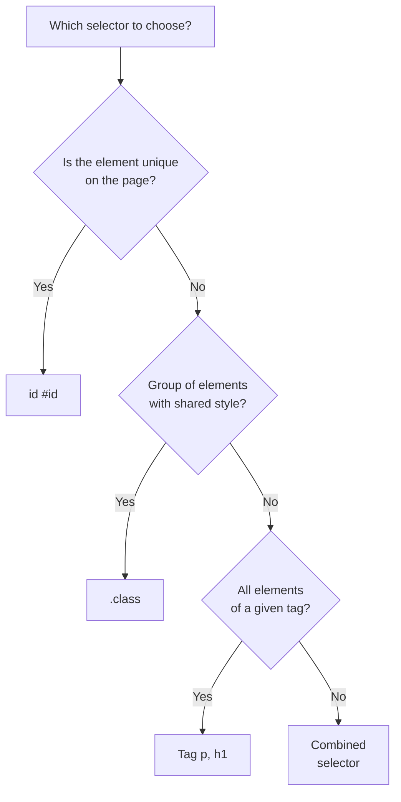

## Selectors and Cascade

> **Connection with the previous lesson:** in the last lesson, we connected CSS and wrote the first rules with a simple tag selector (`p`, `h1`). Today we learn to select elements much more precisely - and figure out what happens when several rules "compete" for the same element.

---

## Lesson Goal

Learn to accurately select the needed page elements using different types of selectors and understand the cascade logic - why a particular style is applied rather than another.

## What You Will Learn by the End of the Lesson

- Select elements by tag, class, id, and universal selector.
- Combine selectors: grouping, descendant, child element, adjacent siblings.
- Use attribute selectors.
- Understand cascade order and specificity - why a particular rule wins in a conflict.
- Understand property inheritance.

---

## Lesson Timeline

|Block|Content|
|---|---|
|1. Tag, class, id, universal selectors|Basic types, difference between class and id|
|2. Grouping and combining selectors|Descendant, child >, adjacent +, general ~|
|3. Attribute selectors|[type="text"] and similar|
|4. Mini-task|Write a selector independently|
|5. Cascade and specificity|Order in code, selector weight, !important|
|6. Inheritance|Which properties inherit, which don't|
|7. Summary and practice|Reinforcement on a real page|


---

## Block 1. Tag, Class, ID, Universal Selectors

### Tag Selector

We already used it in the last lesson - selects **all** elements of the specified tag on the page.

```css
p {
    color: #333;
}
```

Will be applied to all `<p>` without exception.

### Class Selector (`.class`)

**In simple terms:** a class is a "label" that you attach to any elements that should look the same - regardless of their tag.

First, add a `class` attribute in HTML (we've already seen it in the HTML course but didn't use it for styling):

```html
<p class="highlight">This paragraph is special</p>
<span class="highlight">And this text too</span>
```

Then in CSS, the selector for a class is written with a dot before the name:

```css
.highlight {
    background-color: yellow;
    font-weight: bold;
}
```

The style will be applied to **both** elements - to `<p>` and to `<span>` - because both have the class `highlight`, regardless of the fact that they are different tags.

**One element can have multiple classes** - separated by a space:

```html
<p class="highlight large-text">Special and large text</p>
```

```css
.highlight {
    background-color: yellow;
}

.large-text {
    font-size: 24px;
}
```

Both classes will be applied to this paragraph simultaneously.

### ID Selector (`#id`)

We already covered `id` in the HTML course - as a unique identifier for a specific element (for anchor links). The same `id` can also be used for styling:

```html
<h1 id="main-title">Main site heading</h1>
```

```css
#main-title {
    color: darkred;
    text-transform: uppercase;
}
```

**Key difference between class and id:**

|Class (`.class`)|id (`#id`)|
|---|---|
|How many elements can it be applied to|Any number|Only one (id is unique on the page)|
|Can multiple be used on one element|Yes, separated by a space|No, only one id per element|
|Priority in the cascade|Lower|Higher (more in block 5)|
|Typical use|Styling repeated blocks (cards, buttons)|Unique elements (e.g., a specific site header)|



**Practical recommendation for this course (already reflected in the final project checklist):** for styling, **use primarily classes**, not id. The reason is that classes are more flexible: the same class can be placed on as many elements as you like, while when building with id, you'll quickly hit the "only one element" limitation, even if you later need a second identical block.

### Universal Selector (`*`)

```css
* {
    margin: 0;
    padding: 0;
}
```

Selects **absolutely all** elements on the page. Often used at the beginning of a CSS file to "reset" the browser's default spacing (more on this in lesson 3, Box model, and in lesson 10 when discussing reset/normalize).

---

### Common Beginner Mistakes

|Error|How to Fix|
|---|---|
|Forgetting the dot before the class: `highlight { }` instead of `.highlight { }`|In CSS, a class always starts with a dot: `.highlight`|
|Forgetting the hash before id: `main-title { }` instead of `#main-title { }`|In CSS, an id always starts with a hash: `#main-title`|
|Using id for styling repeated elements|Remember: id is unique - use a class if there's more than one element that needs to be styled the same way|
|Confusing the `class="highlight"` attribute in HTML (without a dot) with the `.highlight` selector in CSS (with a dot)|In HTML we write the class name without a dot, in CSS - always with a dot|

---

## Block 2. Grouping and Combining Selectors

### Grouping (comma)

We already saw this in the last lesson:

```css
h1, h2, h3 {
    font-family: Georgia, serif;
}
```

Applies the same set of styles to multiple different selectors at once.

### Descendant Selector (space)

Selects an element that is **inside** another element, at any nesting level (not necessarily directly inside - it could be "several levels deep").

```html
<nav>
    <ul>
        <li><a href="#">Home</a></li>
    </ul>
</nav>

<footer>
    <a href="#">Contacts</a>
</footer>
```

```css
nav a {
    color: white;
}
```

This rule will be applied **only** to `<a>` inside `<nav>` - that is, to the "Home" link, but **not** to the "Contacts" link in the footer, because it's not inside `<nav>`.

**Analogy:** "everyone who lives in house No. 5" - doesn't matter which floor or which apartment, the main thing is that they are somewhere inside that house.

### Child Selector (`>`)

A stricter version of the descendant - selects an element that is **directly** inside the parent, one nesting level deep, not "somewhere deeper."

```html
<nav>
    <ul>
        <li><a href="#">Home</a></li>
    </ul>
</nav>
```

```css
nav > ul {
    list-style: none;
}
```

This will work because `<ul>` is a direct (immediate) child of `<nav>`. But:

```css
nav > a {
    color: white;
}
```

This will **not** work for the "Home" link in the example above, because `<a>` is not directly inside `<nav>`, but inside `<li>`, which is inside `<ul>`, which is inside `<nav>` - two levels deeper than a "direct child."

**Analogy:** "direct children" - not grandchildren or more distant descendants, but the very next generation.

### Adjacent Sibling Selector (`+`)

Selects an element that is **immediately after** another element, at the same nesting level (literal "neighbors").

```html
<h2>Section heading</h2>
<p>This paragraph is right after the heading</p>
<p>And this paragraph is second</p>
```

```css
h2 + p {
    font-weight: bold;
}
```

The style will be applied **only** to the first `<p>` (the one directly after `<h2>`), but not to the second.

### General Sibling Selector (`~`)

Selects **all** elements of the specified type that come after the first element at the same level (not necessarily the very next one, but all subsequent ones).

```css
h2 ~ p {
    color: gray;
}
```

This will apply to **both** paragraphs from the example above - to the first and the second, because both come after `<h2>` at the same level.

### Combinator Comparison Table

|Symbol|Name|What it selects|
|---|---|---|
|(space)|Descendant|Any nesting level inside|
|`>`|Child|Only the immediate, closest level|
|`+`|Adjacent Sibling|Only the very next element after|
|`~`|General Sibling|All subsequent elements at the same level|

---

### Common Beginner Mistakes

|Error|How to Fix|
|---|---|
|Confusing descendant (space, any level) with child (`>`, only the closest)|If you need a direct child - use `>`, if any nesting level is fine - just use a space|
|Forgetting spaces around `>`, `+`, `~`|Although it sometimes works without spaces technically, for readability always write `nav > ul`, not `nav>ul`|
|Using overly long, deeply nested selectors: `body div section div ul li a`|The shorter and clearer the selector, the easier it is to read and maintain - aim for simplicity, often it helps to just add a class to the needed element|

---

## Block 3. Attribute Selectors

Allow selecting elements by the value of their HTML attributes - especially useful for forms, where we already saw different `input` types in the HTML course.

```css
input[type="text"] {
    border: 1px solid gray;
}

input[type="email"] {
    border: 1px solid blue;
}
```

This will select only `<input>` with a specific `type` attribute value - meaning text fields and email fields will look different, even though both are created with the same `<input>` tag.

There are also more flexible options:

```css
/* Attribute is simply present, regardless of value */
input[required] {
    border-color: red;
}

/* Attribute value starts with the specified string */
a[href^="https"] {
    color: green;
}

/* Attribute value ends with the specified string */
img[src$=".png"] {
    border: 1px solid black;
}
```

**This is an overview topic** - you just need to know the general principle and basic syntax `[attribute="value"]`; the less common options (`^=`, `$=`) can always be looked up in the documentation when actually needed.

---

## Block 4. Mini-Task

Write a selector that selects only `<a>` elements that are directly inside `<footer>` (direct children, not deeper).

**Solution:**

```css
footer > a {
    color: lightgray;
}
```

---

## Block 5. Cascade and Specificity

The name "Cascading" in CSS itself is no accident. This is a key principle: when **multiple rules** claim the same element, the browser must decide which one to apply. This process is called the **cascade**, and it works by clear, predictable rules.

### Rule 1. Order in Code

If two rules have **the same specificity** (more on that shortly), the one written **later** in the file wins.

```css
p {
    color: red;
}

p {
    color: blue;
}
```

The text will be **blue** - the second rule "overrides" the first.

### Rule 2. Specificity (Selector Weight)

If rules have **different specificity**, the more specific one wins - regardless of order in the code.



**Simplified specificity scale (from weak to strong):**

1. Tag selector (`p`, `div`) - weight 1.
2. Class selector (`.highlight`), attribute selector (`[type="text"]`) - weight 10.
3. ID selector (`#main-title`) - weight 100.
4. Inline style (`style=""` directly in HTML) - weight 1000.

```css
p {
    color: red;
}

.highlight {
    color: blue;
}
```

```html
<p class="highlight">What color will this text be?</p>
```

The text will be **blue** - because the class selector (`10`) is more specific than the tag selector (`1`), even if the `p { color: red; }` rule were written lower in the file.

**When combining selectors, their weights add up:**

```css
nav ul li a {
    color: white;
}
```

Here are 4 tag selectors in a row: `nav` (1) + `ul` (1) + `li` (1) + `a` (1) = weight **4**. This is still **less** than a single class (weight 10):

```css
.nav-link {
    color: black;
}
```

If both rules apply to the same element, `.nav-link` (weight 10) will win, despite the fact that the first selector looks longer and more "impressive."

### `!important` - A Last Resort

```css
p {
    color: red !important;
}
```

`!important` forcibly makes a rule the "winner" in almost any situation, regardless of specificity and order (except when conflicting with another `!important`, where normal specificity rules apply again).

**Why `!important` is not recommended for overuse:** it's like a nuclear button in an argument - it "solves" a specific problem right now, but:

- it breaks the predictable logic of the cascade - now it's unclear why this particular style won, unless you specifically look at the code;
- if later you need to **override** this rule too - the only way is again `!important`, and then `!important` with higher specificity, and the code quickly turns into unmanageable chaos.

**Practical rule for this course:** use `!important` only in extreme cases (e.g., temporarily for debugging) - in 95% of situations, the correct solution to a cascade conflict is to understand the specificity and fix the selector itself, rather than "driving a nail with a sledgehammer."

---

### Common Beginner Mistakes

|Error|How to Fix|
|---|---|
|Not understanding why a written style "doesn't apply" - it actually does, but is overridden by a more specific rule|Open DevTools → Styles tab - there you can see all competing rules and the crossed-out "losers"|
|Overusing `!important` at the first confusing situation|First investigate the specificity through DevTools, `!important` - only as a last resort|
|Thinking that order in code matters more than specificity|Actually it's the opposite: specificity matters more than order, order only matters when specificity is **equal**|

---

## Block 6. Inheritance

Some CSS properties are automatically "passed on" from a parent element to child elements - without explicitly specifying a style for each of them.

```html
<body>
    <p>This text will inherit the color from body</p>
</body>
```

```css
body {
    color: darkslategray;
}
```

Although we didn't write a single rule for `<p>` directly, the text inside it will still become `darkslategray` - because the `color` property **is inherited**.

### Which Properties Inherit and Which Don't

**Usually inherited** (mainly related to text):

- `color`
- `font-family`, `font-size`, `font-weight`
- `line-height`
- `text-align`

**Usually NOT inherited** (mainly related to dimensions and block layout):

- `border`
- `margin`, `padding`
- `width`, `height`
- `background-color` (background has its own logic - more on this not now, but when we cover styling in lesson 7)

**The logic of this division is intuitive:** if a parent has a `border` of 2px, it would be strange if every nested paragraph automatically got its own border - this would lead to visual chaos of nested borders. But text color or font quite logically "passes on by inheritance" - otherwise you'd have to specify `font-family` for every individual tag on the page.

### Forced Inheritance

If absolutely necessary, any property (even normally non-inherited ones) can be forced to inherit using the explicit keyword `inherit`:

```css
.child {
    border: inherit;
}
```

**This is a rare, special case** - you just need to know that this option exists, without diving deep into it now.

---

### Common Beginner Mistakes

|Error|How to Fix|
|---|---|
|Expecting `margin`/`padding` set on the parent to be "passed on" to child elements|These properties don't inherit - set them explicitly for each needed element|
|Not understanding where an element's text color came from when nothing was explicitly set for it|Check parent elements - most likely, `color` is inherited from somewhere higher in the tree|

---

## Lesson Summary

Today you learned:

- Four basic selector types: by tag, by class (`.class`), by id (`#id`), universal (`*`) - in real projects, **classes are preferred over id** for styling.
- Combinators: descendant (space, any level), child (`>`, only the closest), adjacent sibling (`+`, only the next one), general sibling (`~`, all subsequent ones).
- Attribute selectors `[attribute="value"]` are useful, for example, for different `input` types.
- The cascade resolves rule conflicts through order in code (when specificity is equal) and specificity (tag < class/attribute < id < inline) - `!important` should only be used in extreme cases.
- Some properties inherit from parent to children (mainly text-related - `color`, `font-family`), others don't (mainly about dimensions and layout - `margin`, `border`, `width`).

---

## Practice (in class)

Take your `about.html` HTML page from the HTML course and style its parts using classes:

1. Add the class `.site-header` to `<header>` and style it with a separate background.
2. Add the class `.main-nav` to `<nav>` and style the links inside it using a descendant selector (`.main-nav a`).
3. For `<article>` inside `<main>`, assign the class `.content-block` with padding.
4. Check via DevTools that all rules are applied exactly as you expected - and that none are overridden by a more specific competitor.

---

## Homework

1. Rework the CSS for your entire HTML project so that all styles are applied via **classes**, not `id` (if you used `id` for styling in the last lesson - replace them with classes).
2. Use at least one descendant selector (space) and one child selector (`>`) in your project - for example, for styling links inside navigation.
3. Add at least one attribute selector - for example, style `input[type="email"` separately from `input[type="text"]`.
4. **Research task:** open DevTools on your favorite website, click on any link in the menu and find on the Styles tab what type of selector styles it - by class, by tag, or some other way? Pay attention to how many rules compete for this element.

---

[Next lesson: Box Model →](../3/en/Box%20Model.md)
