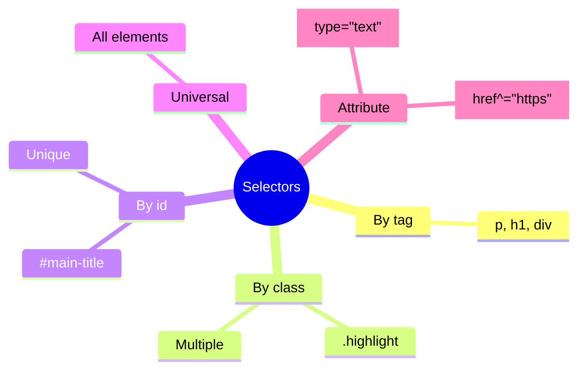
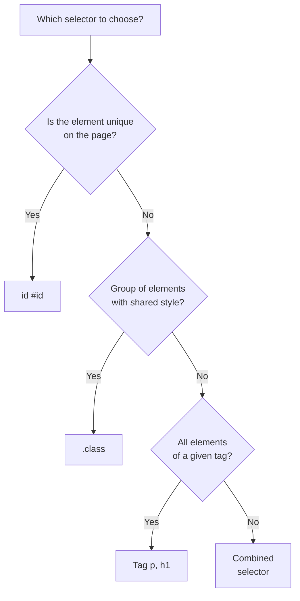

## Селекторы и каскад

> **Связь с предыдущим уроком:** на прошлом уроке мы подключили CSS и написали первые правила с простым селектором по тегу (`p`, `h1`). Сегодня учимся выбирать элементы гораздо точнее - и разбираемся, что происходит, когда несколько правил "спорят" за один и тот же элемент.

---

## Цель урока

Научиться точно выбирать нужные элементы страницы разными типами селекторов и понимать логику каскада - почему в итоге применяется именно тот стиль, а не другой.

## Чему вы научитесь к концу урока

- Выбирать элементы по тегу, классу, id и универсальным селектором.
- Комбинировать селекторы: группировка, потомок, дочерний элемент, соседние элементы.
- Использовать атрибутные селекторы.
- Понимать порядок каскада и специфичность - почему при конфликте побеждает конкретное правило.
- Понимать наследование свойств.

---

## Хронометраж урока

|Блок|Содержание|
|---|---|
|1. Селекторы по тегу, классу, id, универсальный|Базовые типы, отличие класса от id|
|2. Группировка и комбинирование селекторов|Потомок, дочерний >, соседний +, общий ~|
|3. Атрибутные селекторы|[type="text"] и похожие|
|4. Мини-задание|Написать селектор самостоятельно|
|5. Каскад и специфичность|Порядок в коде, вес селекторов, !important|
|6. Наследование|Какие свойства наследуются, какие нет|
|7. Итоги и практика|Закрепление на реальной странице|


---

## Блок 1. Селекторы по тегу, классу, id, универсальный

### Селектор по тегу

Мы уже использовали его на прошлом уроке - выбирает **все** элементы указанного тега на странице.

```css
p {
    color: #333;
}
```

Применится ко всем `<p>` без исключения.

### Селектор по классу (`.class`)

**Простыми словами:** класс - это "ярлык", который вы сами навешиваете на любые элементы, которые должны выглядеть одинаково - независимо от того, какой у них тег.

Сначала в HTML добавляется атрибут `class` (мы уже видели его в курсе HTML, но не применяли для стилизации):

```html
<p class="highlight">Этот абзац особенный</p>
<span class="highlight">И этот текст тоже</span>
```

Затем в CSS селектор для класса пишется с точкой перед именем:

```css
.highlight {
    background-color: yellow;
    font-weight: bold;
}
```

Стиль применится к **обоим** элементам - и к `<p>`, и к `<span>` - потому что у обоих есть класс `highlight`, независимо от того, что это разные теги.

**Один элемент может иметь несколько классов** - через пробел:

```html
<p class="highlight large-text">Особенный и крупный текст</p>
```

```css
.highlight {
    background-color: yellow;
}

.large-text {
    font-size: 24px;
}
```

Оба класса применятся к этому абзацу одновременно.

### Селектор по id (`#id`)

Мы уже разбирали `id` в курсе HTML - как уникальный идентификатор одного конкретного элемента (для якорных ссылок). Тот же `id` можно использовать и для стилизации:

```html
<h1 id="main-title">Главный заголовок сайта</h1>
```

```css
#main-title {
    color: darkred;
    text-transform: uppercase;
}
```

**Ключевое отличие класса от id:**

|Класс (`.class`)|id (`#id`)|
|---|---|
|Можно применить к скольким элементам|К любому количеству|Только к одному (id уникален на странице)|
|Можно ли использовать несколько на одном элементе|Да, через пробел|Нет, только один id на элемент|
|Приоритет в каскаде|Ниже|Выше (подробнее в блоке 5)|
|Типичное применение|Стилизация повторяющихся блоков (карточки, кнопки)|Уникальные элементы (например, конкретная шапка сайта)|



**Практическая рекомендация этого курса (уже отражена в чек-листе итогового проекта):** для стилизации **используйте в основном классы**, а не id. Причина - классы гибче: один и тот же класс можно навесить на сколько угодно элементов, а верстая через id, вы быстро упрётесь в ограничение "только один элемент", даже если позже понадобится второй такой же блок.

### Универсальный селектор (`*`)

```css
* {
    margin: 0;
    padding: 0;
}
```

Выбирает **абсолютно все** элементы на странице. Часто используется в начале CSS-файла для «обнуления» стандартных отступов браузера (об этом подробнее - в уроке 3, Box model, и в уроке 10 при разговоре про reset/normalize).

---

### Частые ошибки новичков

|Ошибка|Как исправить|
|---|---|
|Забывают точку перед классом: `highlight { }` вместо `.highlight { }`|Класс в CSS всегда начинается с точки: `.highlight`|
|Забывают решётку перед id: `main-title { }` вместо `#main-title { }`|Id в CSS всегда начинается с решёткой: `#main-title`|
|Используют id для стилизации повторяющихся элементов|Помните: id уникален - используйте класс, если элементов, которые нужно стилизовать одинаково, больше одного|
|Путают атрибут `class="highlight"` в HTML (без точки) и селектор `.highlight` в CSS (с точкой)|В HTML пишем имя класса без точки, в CSS - обязательно с точкой|

---

## Блок 2. Группировка и комбинирование селекторов

### Группировка (запятая)

Мы уже видели это на прошлом уроке:

```css
h1, h2, h3 {
    font-family: Georgia, serif;
}
```

Применяет один и тот же набор стилей сразу к нескольким разным селекторам.

### Селектор потомка (пробел)

Выбирает элемент, который находится **внутри** другого элемента, на любом уровне вложенности (не обязательно прямо внутри, может быть и "через несколько уровней").

```html
<nav>
    <ul>
        <li><a href="#">Главная</a></li>
    </ul>
</nav>

<footer>
    <a href="#">Контакты</a>
</footer>
```

```css
nav a {
    color: white;
}
```

Это правило применится **только** к `<a>` внутри `<nav>` - то есть к ссылке "Главная", но **не** к ссылке "Контакты" в подвале, потому что она находится не внутри `<nav>`.

**Аналогия:** «все, кто живёт в доме №5» - не важно, на каком этаже и в какой квартире, главное - что они находятся где-то внутри этого дома.

### Дочерний селектор (`>`)

Более строгий вариант потомка - выбирает элемент, который находится **непосредственно** внутри родителя, на один уровень вложенности, а не «где-то глубже».

```html
<nav>
    <ul>
        <li><a href="#">Главная</a></li>
    </ul>
</nav>
```

```css
nav > ul {
    list-style: none;
}
```

Это сработает, потому что `<ul>` - прямой (непосредственный) потомок `<nav>`. Но:

```css
nav > a {
    color: white;
}
```

Это **не сработает** для ссылки "Главная" в примере выше, потому что `<a>` находится не прямо внутри `<nav>`, а внутри `<li>`, которое внутри `<ul>`, которое внутри `<nav>` - то есть на два уровня глубже, чем «непосредственный потомок».

**Аналогия:** «прямые дети» - не внуки и не более далёкие потомки, а именно ближайшее следующее поколение.

### Соседний селектор (`+`)

Выбирает элемент, который находится **сразу после** другого элемента, на том же уровне вложенности (родные "соседи").

```html
<h2>Заголовок раздела</h2>
<p>Этот абзац сразу после заголовка</p>
<p>А этот абзац уже второй по счёту</p>
```

```css
h2 + p {
    font-weight: bold;
}
```

Стиль применится **только** к первому `<p>` (тому, что расположен сразу после `<h2>`), но не ко второму.

### Общий селектор соседей (`~`)

Выбирает **все** элементы указанного типа, которые идут после первого элемента на том же уровне (не обязательно сразу следующий, но все последующие).

```css
h2 ~ p {
    color: gray;
}
```

Это применится к **обоим** абзацам из примера выше - и к первому, и ко второму, потому что оба идут после `<h2>` на одном уровне.

### Сравнительная таблица комбинаторов

|Символ|Название|Что выбирает|
|---|---|---|
|(пробел)|Потомок|Любой уровень вложенности внутри|
|`>`|Дочерний|Только непосредственный, ближайший уровень|
|`+`|Соседний|Только следующий сразу после элемент|
|`~`|Общий соседний|Все последующие элементы на том же уровне|

---

### Частые ошибки новичков

|Ошибка|Как исправить|
|---|---|
|Путают потомка (пробел, любой уровень) и дочерний (`>`, только ближайший)|Если нужен именно прямой потомок - используйте `>`, если подойдёт любой уровень вложенности - оставляйте просто пробел|
|Забывают пробелы вокруг `>`, `+`, `~`|Хотя технически иногда работает и без пробелов, для читаемости всегда пишите `nav > ul`, а не `nav>ul`|
|Используют слишком длинные, глубоко вложенные селекторы: `body div section div ul li a`|Чем короче и понятнее селектор, тем легче его читать и поддерживать - стремитесь к простоте, часто помогает просто добавить класс к нужному элементу|

---

## Блок 3. Атрибутные селекторы

Позволяют выбирать элементы по значению их HTML-атрибутов - особенно полезно для форм, где мы уже видели разные типы `input` в курсе HTML.

```css
input[type="text"] {
    border: 1px solid gray;
}

input[type="email"] {
    border: 1px solid blue;
}
```

Это выберет только `<input>` с конкретным значением атрибута `type` - то есть текстовые поля и email-поля будут выглядеть по-разному, хотя оба созданы одним и тем же тегом `<input>`.

Есть и более гибкие варианты:

```css
/* Атрибут просто присутствует, независимо от значения */
input[required] {
    border-color: red;
}

/* Значение атрибута начинается с указанной строки */
a[href^="https"] {
    color: green;
}

/* Значение атрибута заканчивается указанной строкой */
img[src$=".png"] {
    border: 1px solid black;
}
```

**Это обзорная тема** - вам достаточно знать сам принцип и базовый синтаксис `[атрибут="значение"]`; более редкие варианты (`^=`, `$=`) можно всегда посмотреть в документации при реальной необходимости.

---

## Блок 4. Мини-задание

Напишите селектор, который выбирает только `<a>`, находящиеся непосредственно внутри `<footer>` (прямые потомки, не глубже).

**Решение:**

```css
footer > a {
    color: lightgray;
}
```

---

## Блок 5. Каскад и специфичность

Название "Cascading" (каскадные) в самом имени CSS - не случайность. Это ключевой принцип: когда **несколько правил** претендуют на один и тот же элемент, браузер должен решить, какое из них применить. Этот процесс называется **каскадом**, и он работает по чётким, предсказуемым правилам.

### Правило 1. Порядок в коде

Если два правила имеют **одинаковую специфичность** (о ней - чуть ниже), побеждает то, что написано **позже** в файле.

```css
p {
    color: red;
}

p {
    color: blue;
}
```

Текст будет **синим** - правило, идущее вторым, "перебивает" первое.

### Правило 2. Специфичность (вес селектора)

Если правила имеют **разную специфичность**, побеждает более специфичное - независимо от порядка в коде.



**Упрощённая шкала специфичности (от слабого к сильному):**

1. Селектор по тегу (`p`, `div`) - вес 1.
2. Селектор по классу (`.highlight`), атрибутный (`[type="text"]`) - вес 10.
3. Селектор по id (`#main-title`) - вес 100.
4. Инлайн-стиль (`style=""` прямо в HTML) - вес 1000.

```css
p {
    color: red;
}

.highlight {
    color: blue;
}
```

```html
<p class="highlight">Какого цвета будет этот текст?</p>
```

Текст будет **синим** - потому что селектор по классу (`10`) специфичнее селектора по тегу (`1`), даже если бы правило `p { color: red; }` было написано ниже в файле.

**При комбинировании селекторов их вес складывается:**

```css
nav ul li a {
    color: white;
}
```

Здесь 4 селектора по тегу подряд: `nav` (1) + `ul` (1) + `li` (1) + `a` (1) = вес **4**. Это всё ещё **меньше**, чем один-единственный класс (вес 10):

```css
.nav-link {
    color: black;
}
```

Если оба правила применяются к одному элементу, победит `.nav-link` (вес 10), несмотря на то, что первый селектор выглядит длиннее и "внушительнее".

### `!important` - крайняя мера

```css
p {
    color: red !important;
}
```

`!important` принудительно делает правило "победителем" почти в любой ситуации, независимо от специфичности и порядка (кроме конфликта с другим `!important`, где снова работают обычные правила специфичности).

**Почему не рекомендуется злоупотреблять `!important`:** это как ядерная кнопка в споре - она "решает" конкретную проблему прямо сейчас, но:

- ломает предсказуемую логику каскада - теперь непонятно, почему именно этот стиль победил, не заглянув специально в код;
- если позже понадобится **перебить** и это правило - единственный способ снова `!important`, а дальше `!important` с более высокой специфичностью, и код быстро превращается в трудноуправляемый хаос.

**Практическое правило этого курса:** пользуйтесь `!important` только в крайних случаях (например, временно для отладки) - в 95% ситуаций правильное решение конфликта каскада - это разобраться в специфичности и поправить сам селектор, а не "забивать гвоздь кувалдой".

---

### Частые ошибки новичков

|Ошибка|Как исправить|
|---|---|
|Не понимают, почему написанный стиль "не применяется" - на самом деле применяется, но перебит более специфичным правилом|Откройте DevTools → вкладка Styles - там видно все конкурирующие правила и зачёркнутые "проигравшие"|
|Злоупотребляют `!important` при первой же непонятной ситуации|Сначала разберитесь в специфичности через DevTools, `!important` - только последний вариант|
|Думают, что порядок в коде важнее специфичности|На самом деле наоборот: специфичность важнее порядка, порядок решает только при **равной** специфичности|

---

## Блок 6. Наследование

Некоторые CSS-свойства автоматически «передаются» от родительского элемента к дочерним - без явного указания стиля для каждого из них.

```html
<body>
    <p>Этот текст унаследует цвет от body</p>
</body>
```

```css
body {
    color: darkslategray;
}
```

Хотя мы не написали ни одного правила для `<p>` напрямую, текст внутри него всё равно станет `darkslategray` - потому что свойство `color` **наследуется**.

### Какие свойства наследуются, а какие нет

**Обычно наследуются** (в основном связаны с текстом):

- `color`
- `font-family`, `font-size`, `font-weight`
- `line-height`
- `text-align`

**Обычно НЕ наследуются** (в основном связаны с размерами и расположением блока):

- `border`
- `margin`, `padding`
- `width`, `height`
- `background-color` (у фона своя логика - подробнее не сейчас, а когда будем разбирать оформление в уроке 7)

**Логика такого разделения интуитивна:** если у родителя стоит рамка (`border`) в 2px, странно было бы, если бы у каждого вложенного абзаца автоматически появлялась своя рамка - это привело бы к визуальному хаосу из вложенных рамок. А вот цвет текста или шрифт вполне логично "передавать по наследству" - иначе пришлось бы прописывать `font-family` для каждого отдельного тега на странице.

### Принудительное наследование

Если очень нужно, любое свойство (даже обычно не наследуемое) можно заставить наследоваться явным ключевым словом `inherit`:

```css
.child {
    border: inherit;
}
```

**Это редкий, специальный случай** - вам достаточно знать, что такая возможность существует, не углубляясь в неё сейчас.

---

### Частые ошибки новичков

|Ошибка|Как исправить|
|---|---|
|Ожидают, что `margin`/`padding`, заданные у родителя, "передадутся" вложенным элементам|Эти свойства не наследуются - задавайте их явно для каждого нужного элемента|
|Не понимают, откуда взялся цвет текста у элемента, для которого явно ничего не писали|Проверьте родительские элементы - скорее всего, `color` наследуется откуда-то выше по дереву|

---

## Итоги урока

Сегодня вы узнали:

- Четыре базовых типа селекторов: по тегу, по классу (`.class`), по id (`#id`), универсальный (`*`) - в реальных проектах **классы предпочтительнее id** для стилизации.
- Комбинаторы: потомок (пробел, любой уровень), дочерний (`>`, только ближайший), соседний (`+`, только следующий), общий соседний (`~`, все последующие).
- Атрибутные селекторы `[атрибут="значение"]` полезны, например, для разных типов `input`.
- Каскад решает конфликты правил через порядок в коде (при равной специфичности) и специфичность (тег < класс/атрибут < id < инлайн) - `!important` стоит использовать только в крайних случаях.
- Некоторые свойства наследуются от родителя к потомкам (в основном текстовые - `color`, `font-family`), другие - нет (в основном про размеры и расположение - `margin`, `border`, `width`).

---

## Практика (на занятии)

Возьмите свою HTML-страницу `about.html` из курса HTML и стилизуйте её части через классы:

1. Добавьте класс `.site-header` к `<header>` и стилизуйте его отдельным фоном.
2. Добавьте класс `.main-nav` к `<nav>` и стилизуйте ссылки внутри него через селектор потомка (`.main-nav a`).
3. Для `<article>` внутри `<main>` задайте класс `.content-block` с отступами.
4. Проверьте через DevTools, что все правила применяются именно так, как вы ожидали - и что ни одно не перебито более специфичным конкурентом.

---

## Домашнее задание

1. Переработайте CSS всего вашего HTML-проекта так, чтобы все стили применялись через **классы**, а не через `id` (если вы использовали `id` для стилизации на прошлом уроке - замените на классы).
2. Используйте хотя бы один селектор потомка (пробел) и один дочерний селектор (`>`) в своём проекте - например, для стилизации ссылок внутри навигации.
3. Добавьте хотя бы один атрибутный селектор - например, стилизуйте `input[type="email"]` отдельно от `input[type="text"]`.
4. **Исследовательское задание:** откройте DevTools на любимом сайте, кликните на любую ссылку в меню и найдите на вкладке Styles, через какой тип селектора она стилизована - по классу, по тегу или как-то ещё? Обратите внимание, сколько правил конкурируют за этот элемент.

---

[Следующий урок: Box model (модель блока) →](Lesson-3/ru/Box%20model%20(модель%20блока).md)
