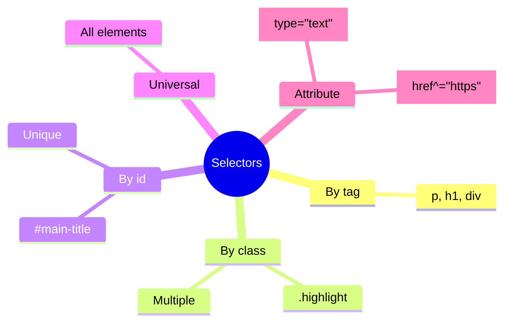
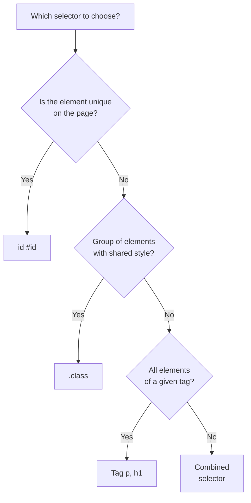

## Selektorlar va kaskad

> **Oldingi dars bilan bog'liqlik:** o'tgan darsda biz CSSni ulab, oddiy teg selektori (`p`, `h1`) bilan birinchi qoidalarni yozdik. Bugun elementlarni ancha aniqroq tanlashni o'rganamiz - va bir nechta qoida bitta element uchun "munozara" qilganda nima sodir bo'lishini tahlil qilamiz.

---

## Darsning maqsadi

Sahifaning kerakli elementlarini turli selektor turlari bilan aniq tanlashni va kaskad mantiqini tushunishni o'rganish - yakunda nima uchun aynan shu uslub qo'llaniladi, boshqasi emas.

## Dars oxiriga qadar nimalarni o'rganasiz

- Elementlarni teg, klass, id va universal selektor bilan tanlash.
- Selektorlarni birlashtirish: guruhlash, voris, farzand, qo'shni elementlar.
- Attribute selektorlaridan foydalanish.
- Kaskad tartibi va spetsifiklikni tushunish - nizoda qaysi qoida g'alaba qozonishini.
- Xususiyatlar meros olishini tushunish.

---

## Darsning vaqt jadvali

|Blok|Mazmun|
|---|---|
|1. Teg, klass, id bo'yicha selektorlar, universal|Asosiy turlar, klass va id orasidagi farq|
|2. Selektorlarni guruhlash va birlashtirish|Voris, farzand >, qo'shni +, umumiy ~|
|3. Attribute selektorlari|[type="text"] va o'xshashlari|
|4. Mini-vazifa|Selektorni mustaqil yozish|
|5. Kaskad va spetsifiklik|Kod tartibi, selektor og'irligi, !important|
|6. Meros olish|Qaysi xususiyatlar meros olinadi, qaysilari yo'q|
|7. Xulosalar va amaliyot|Haqiqiy sahifada mustahkamlash|


---

## Blok 1. Teg, klass, id bo'yicha selektorlar, universal

### Teg bo'yicha selektor

Biz uni o'tgan darsda allaqachon ishlatgan edik - sahifadagi barcha ko'rsatilgan teg elementlarini tanlaydi.

```css
p {
    color: #333;
}
```

Barcha `<p>` larga bundan mustasno qo'llaniladi.

### Klass bo'yicha selektor (`.class`)

**Oddiy so'z bilan:** klass bu "yorliq", uni o'zingiz bir xil ko'rinishi kerak bo'lgan istalgan elementlarga ilashtirasiz - ularning tegi qanday bo'lishidan qat'i nazar.

Avval HTMLga `class` atributi qo'shiladi (biz uni allaqachon HTML kursida ko'rgan edik, lekin uslublash uchun ishlatmagan edik):

```html
<p class="highlight">Bu paragraf maxsus</p>
<span class="highlight">Bu matn ham shunday</span>
```

Keyin CSSda klass uchun selektor oldiga nuqta bilan yoziladi:

```css
.highlight {
    background-color: yellow;
    font-weight: bold;
}
```

Uslub **ikkala** elementga qo'llaniladi - `<p>` ga ham, `<span>` ga ham - chunki ikkalasida ham `highlight` klassi mavjud, ularning turli teglar ekanligidan qat'i nazar.

**Bitta element bir nechta klassga ega bo'lishi mumkin** - bo'sh joy bilan:

```html
<p class="highlight large-text">Maxsus va katta matn</p>
```

```css
.highlight {
    background-color: yellow;
}

.large-text {
    font-size: 24px;
}
```

Ikkala klass shu paragrafga bir vaqtda qo'llaniladi.

### Id bo'yicha selektor (`#id`)

Biz HTML kursida `id` ni allaqachon tahlil qilgan edik - bu bitta aniq elementning noyob identifikatori (ANCHOR havolalari uchun). Shu `id` uslublash uchun ham ishlatish mumkin:

```html
<h1 id="main-title">Saytning asosiy sarlavhasi</h1>
```

```css
#main-title {
    color: darkred;
    text-transform: uppercase;
}
```

**Klass va id orasidagi asosiy farq:**

|Klass (`.class`)|id (`#id`)|
|---|---|
|Nechta elementga qo'llash mumkin|Istalgan miqdorga|Faqat bittaga (id sahifada noyob)|
|Bitta elementda bir nechta ishlatish mumkinmi|Ha, bo'sh joy bilan|Yo'q, elementda faqat bitta id|
|Kaskad ustunligi|Pastroq|Yuqoriroq (batafsil 5-blokda)|
|Odatiy ishlatilishi|Takroriy bloklarni uslublash (karta, tugmalar)|Noyob elementlar (masalan, aniq sayt tepasi)|



**Ushbu kursning amaliyot tavsiyasi (yakuniy loyiha ro'yxatida allaqachon aks etgan):** uslublash uchun **asosan klasslardan foydalaning**, id emas. Sababi - klasslar moslashuvchanroq: bir xil klassni istalgan miqdordagi elementlarga ilash mumkin, id orqali qilinsa, tezda "faqat bitta element" chegarasiga to'g'ri keladi, hatto keyinchalik ikkinchi bir xil blok kerak bo'lsa ham.

### Universal selektor (`*`)

```css
* {
    margin: 0;
    padding: 0;
}
```

Sahifadagi **absolyut barcha** elementlarni tanlaydi. Ko'pincha CSS faylining boshida brauzerning standart bo'shliqlarini "nollash" uchun ishlatiladi (batafsil 3-darsda, Box model va 10-darsda reset/normalize haqida gaplashganda).

---

### Yangi boshlovchilarning ko'p uchraydigan xatolari

|Xato|Qanday tuzatish|
|---|---|
|Klass oldida nuqtani unutish: `highlight { }` o'rniga `.highlight { }` |CSSda klass har doim nuqta bilan boshlanadi: `.highlight`|
|Id oldida # ni unutish: `main-title { }` o'rniga `#main-title { }` |CSSda id har doim # bilan boshlanadi: `#main-title`|
|Takroriy elementlarni uslublash uchun id ishlatish|Eslab qoling: id noyob - bir xil uslublash kerak bo'lgan elementlardan bir nechta bo'lsa, klass ishlating|
|HTMLdagi `class="highlight"` atributisiz (nuqtasiz) va CSSdagi `.highlight` selektorisiz (nuqta bilan) ni adashtirish|HTMLda klass nomini nuqtasiz yozamiz, CSSda esa albatta nuqta bilan|

---

## Blok 2. Selektorlarni guruhlash va birlashtirish

### Guruhlash (vergul)

Biz uni o'tgan darsda allaqachon ko'rgan edik:

```css
h1, h2, h3 {
    font-family: Georgia, serif;
}
```

Bir xil uslublar to'plamini bir nechta turli selektorga bir vaqtda qo'llaydi.

### Voris selektori (bo'sh joy)

Boshqa element **ichida** joylashgan, istalgan darajadagi ichki tuzilmada (avvalgidan avval to'g'ridan-to'g'ri ichida bo'lishi shart emas, "bir necha daraja orqali" ham bo'lishi mumkin) elementni tanlaydi.

```html
<nav>
    <ul>
        <li><a href="#">Bosh sahifa</a></li>
    </ul>
</nav>

<footer>
    <a href="#">Kontaktlar</a>
</footer>
```

```css
nav a {
    color: white;
}
```

Bu qoida faqat `<nav>` ichidagi `<a>` ga qo'llaniladi - ya'ni "Bosh sahifa" havolasiga, lekin pastki qismdagi "Kontaktlar" havolasiga **emas**, chunki u `<nav>` ichida emas.

**Analogiya:** "5-uyda yashovchilar" - qaysi qavatda va qaysi xonada bo'lishidan qat'i nazar, muhim narsa - ular shu uyning ichida joylashgan.

### Farzand selektori (`>`)

Vorisning qattiqroq varianti - **to'g'ridan-to'g'ri** ota-ona ichida, bitta daraja ichki tuzilmada, "biri qayerdada chuqurroq" emas, elementni tanlaydi.

```html
<nav>
    <ul>
        <li><a href="#">Bosh sahifa</a></li>
    </ul>
</nav>
```

```css
nav > ul {
    list-style: none;
}
```

Bu ishlaydi, chunki `<ul>` - `<nav>` ning to'g'ridan-to'g'ri (bevosita) vorisi. Lekin:

```css
nav > a {
    color: white;
}
```

Bu yuqoridagi misolda "Bosh sahifa" havolasi uchun **ishlamaydi**, chunki `<a>` `<nav>` ning to'g'ridan-to'g'ri ichida emas, `<li>` ichida, u `<ul>` ichida, u `<ul>` `<nav>` ichida - ya'ni "bevosita voris" dan ikki daraja chuqurroq.

**Analogiya:** "to'g'ridan-to'g'ri bolalar" - nevaralar emas va yanada uzoqroq avlod emas, yaqin navbatdagi avlod.

### Qo'shni selektor (`+`)

Boshqa element **darhol orqasida** joylashgan, bitta ichki tuzilma darajasida ( "qo'shnilar") elementni tanlaydi.

```html
<h2>Bo'lim sarlavhasi</h2>
<p>Bu paragraf sarlavhadan darhol keyin</p>
<p>Bu paragraf esa ikkinchi</p>
```

```css
h2 + p {
    font-weight: bold;
}
```

Uslub faqat birinchi `<p>` ga qo'llaniladi (`<h2>` dan darhol keyin joylashgani), lekin ikkinchisiga emas.

### Umumiy qo'shni selektori (`~`)

Birinchi elementdan keyin bir xil darajada kelgan (darhol navbatdagi bo'lishi shart emas, lekin barcha keyingilar) barcha ko'rsatilgan turdagi elementlarni tanlaydi.

```css
h2 ~ p {
    color: gray;
}
```

Bu yuqoridagi misoldan **ikkala** paragrafga qo'llaniladi - birinchisiga ham, ikkinchisiga ham, chunki ikkalasi ham `<h2>` dan keyin bir xil darajada keladi.

### Birlashtiruvchilarning taqqoslash jadvali

|Belgi|Nomi|Nima tanlaydi|
|---|---|---|
|(bo'sh joy)|Voris|Istalgan darajadagi ichki tuzilma|
|`>`|Farzand|Faqat bevosita, yaqin daraja|
|`+`|Qo'shni|Faqat elementdan darhol keyingisi|
|`~`|Umumiy qo'shni|Bir xil darajadagi barcha keyingi elementlar|

---

### Yangi boshlovchilarning ko'p uchraydigan xatolari

|Xato|Qanday tuzatish|
|---|---|
|Vorisni (bo'sh joy, istalgan daraja) va farzandni (`>`, faqat yaqin) adashtirish|Agar to'g'ridan-to'g'ri voris kerak bo'lsa - `>`, istalgan daraja mos bo'lsa - shunchaki bo'sh joy qoldiring|
|`>`, `+`, `~` atrofida bo'sh joylarni unutish|Garchi texnik jihatdan ba'zan bo'sh joysiz ham ishlaydi, o'qilishi uchun har doim `nav > ul` yozing, `nav>ul` emas|
|Juda uzun, chuqur ichki tuzilmali selektorlar ishlatish: `body div section div ul li a`|Selektor qancha qisqa va tushunarli bo'lsa, o'qish va saqlash shuncha oson - soddalikka intiling, ko'pincha kerakli elementga klass qo'shish yetarli|

---

## Blok 3. Attribute selektorlari

Elementlarni ularning HTML atributlari qiymati bo'yicha tanlashga imkon beradi - ayniqsa formatlar uchun foydali, biz HTML kursida allaqachon turli `input` turlarini ko'rgan edik.

```css
input[type="text"] {
    border: 1px solid gray;
}

input[type="email"] {
    border: 1px solid blue;
}
```

Bu faqat `type` atributining aniq qiymatiga ega `<input>` larni tanlaydi - ya'ni matn maydonlari va email maydonlari turlicha ko'rinadi, garchi ikkalasi ham bir xil `<input>` tegi bilan yaratilgan.

Yanacha moslashuvchan variantlar ham bor:

```css
/* Atribut shunchaki mavjud, qiymatdan qat'i nazar */
input[required] {
    border-color: red;
}

/* Atribut qiymati ko'rsatilgan satrdan boshlanadi */
a[href^="https"] {
    color: green;
}

/* Atribut qiymati ko'rsatilgan satr bilan tugaydi */
img[src$=".png"] {
    border: 1px solid black;
}
```

**Bu umumiy ko'rinish mavzusi** - sizga asosiy printsip va asosiy sintaksis `[atribut="qiymat"]` ni bilish yetarli; kamdan-kam uchraydigan variantlar (`^=`, `$=`) haqiqatda kerak bo'lganda hujjatdan ko'rish mumkin.

---

## Blok 4. Mini-vazifa

Faqat `<footer>` ichida to'g'ridan-to'g'ri joylashgan `<a>` larni tanlaydigan selektorni yozing (to'g'ridan-to'g'ri vorislar, chuqurroq emas).

**Yechim:**

```css
footer > a {
    color: lightgray;
}
```

---

## Blok 5. Kaskad va spetsifiklik

CSSning nomidagi "Cascading" (kaskadli) so'zi tasodifiy emas. Bu asosiy printsip: **bir nechta qoida** bitta elementga da'vogarlik qilganda, brauzer qaysi birini qo'llashni hal qilishi kerak. Bu jarayon **kaskad** deb ataladi va u aniq, bashorat qilinadigan qoidalar bo'yicha ishlaydi.

### Qoida 1. Kod tartibi

Agar ikki qoidaning **bir xil spetsifikligi** bo'lsa (bu haqida biroz pastda), faylda **keyinroq** yozilgan g'alaba qozonadi.

```css
p {
    color: red;
}

p {
    color: blue;
}
```

Matn **ko'k** bo'ladi - ikkinchi qoida birinchini "bosib tashlaydi".

### Qoida 2. Spetsifiklik (selektor og'irligi)

Agar qoidalarning **turli spetsifikligi** bo'lsa, spetsifikroq g'alaba qozonadi - kod tartibidan qat'i nazar.



**Soddalashtirilgan spetsifiklik shkalasi (kuchsizdan kuchliliga):**

1. Teg bo'yicha selektor (`p`, `div`) - og'irlik 1.
2. Klass bo'yicha selektor (`.highlight`), attribute (`[type="text"]`) - og'irlik 10.
3. Id bo'yicha selektor (`#main-title`) - og'irlik 100.
4. Inline uslub (`style=""` to'g'ridan-to'g'ri HTMLda) - og'irlik 1000.

```css
p {
    color: red;
}

.highlight {
    color: blue;
}
```

```html
<p class="highlight">Bu matn qanday rangda bo'ladi?</p>
```

Matn **ko'k** bo'ladi - chunki klass bo'yicha selektor (`10`) teg bo'yicha selektord (`1`) spetsifikroq, hatto `p { color: red; }` qoidasi faylda pastroq bo'lganda ham.

**Selektorlarni birlashtirishda ularning og'irligi qo'shiladi:**

```css
nav ul li a {
    color: white;
}
```

Bu yerda ketma-ket 4 ta teg bo'yicha selektor: `nav` (1) + `ul` (1) + `li` (1) + `a` (1) = og'irlik **4**. Bu hali ham bitta klassdan (og'irlik 10) **kamroq**:

```css
.nav-link {
    color: black;
}
```

Agar ikkala qoida bitta elementga qo'llanilsa, `.nav-link` (og'irlik 10) g'alaba qozonadi, birinchi selektor ko'proq va "jo'shqinroq" ko'rinishiga qaramay.

### `!important` - o'ta chora

```css
p {
    color: red !important;
}
```

`!important` qoidani deyarli har qanday vaziyatda "g'olib" qiladi, spetsifiklik va tartibdan qat'i nazar (boshqa `!important` bilan nizoda, u yerda yana oddiy spetsifiklik qoidalari ishlaydi).

**Nima uchun `!important` dan ortiqcha foydalanish tavsiya etilmaydi:** bu bahsda atom tugmasi kabi - u muammoni hozir hal qiladi, lekin:

- kaskadning bashorat qilinadigan mantiqini buzadi - endi nima uchun aynan shu uslub yutganini, koddan maxsus qaramasdan tushunish qiyin;
- keyinroq bu qoidani ham **bosib tashlash** kerak bo'lsa - yagona yo'l yana `!important`, keyin yuqoriroq spetsifiklik bilan `!important`, va kod tezda boshqarib bo'lmaydigan xaosga aylanadi.

**Ushbu kursning amaliyot qoidasi:** `!important` dan faqat o'ta holatlarda foydalaning (masalan, vaqtincha tekshirish uchun) - 95% vaziyatlarda kaskad nizosining to'g'ri yechimi spetsifiklikni tushunish va selektorni o'zgartirish, "mixni bolg'a bilan qoqish" emas.

---

### Yangi boshlovchilarning ko'p uchraydigan xatolari

|Xato|Qanday tuzatish|
|---|---|
|Yozilgan uslub "qo'llanilmaydi" nima uchun tushunishmaydi - aslida qo'llaniladi, lekin spetsifikroq qoida bilan bosiladi|DevTools oching → Styles tabi - barcha raqobatlashuvchi qoidalar va "yutqazgan" chizilganlarni ko'rish mumkin|
|Birinchi tushunarsiz vaziyatda `!important` dan ortiqcha foydalanish|Avval DevTools orqali spetsifiklikni tushuning, `!important` faqat oxirgi variant|
|Kod tartibi spetsifiklikdan muhimroq deb o'ylash|Aslida teskari: spetsifiklik tartibdan muhimroq, tartib faqat **teng** spetsifiklikda hal qiladi|

---

## Blok 6. Meros olish

Ba'zi CSS xususiyatlari avtomatik ravishda ota-ona elementdan farzandlarga "o'tadi" - har biriga alohida uslub ko'rsatmasdan.

```html
<body>
    <p>Bu matn rangini body dan meros oladi</p>
</body>
```

```css
body {
    color: darkslategray;
}
```

Garchi biz `<p>` uchun hech qanday qoida yozmagan bo'lsak ham, uning ichidagi matn baribir `darkslategray` bo'ladi - chunki `color` xususiyati **meros olinadi**.

### Qaysi xususiyatlar meros olinadi, qaysilari yo'q

**Odatda meros olinadi** (asosan matn bilan bog'liq):

- `color`
- `font-family`, `font-size`, `font-weight`
- `line-height`
- `text-align`

**Odatda meros OLINMAYDI** (asosan blok o'lchamlari va joylashuvi bilan bog'liq):

- `border`
- `margin`, `padding`
- `width`, `height`
- `background-color` (fonning o'z mantiqi bor - batafsil hozir emas, 7-darsda bezatishni tahlil qilganda)

**Bunday ajratish mantiqi intuitiv:** agar ota-ona 2px `border` qo'ygan bo'lsa, har bir ichki paragrafda avtomatik ravishda o'z ramkasi paydo bo'lsa g'alati bo'ladi - bu ichki ramkalar vizual xaosga olib kelardi. Lekin matn rangi yoki shriftni "meros qoldirish" juda mantiqiy - aks holda har bir teg uchun sahifada `font-family` yozishga to'g'ri kelardi.

### Majburiy meros olish

Agar juda kerak bo'lsa, istalgan xususiyatni (hatto odatda meros olinmaydiganini) `inherit` kalit so'zi bilan meros olishga majbur qilish mumkin:

```css
.child {
    border: inherit;
}
```

**Bu kamdan-kam, maxsus holat** - sizga bunday imkoniyat mavjudligini bilish yetarli, hozir chuqurlashmasdan.

---

### Yangi boshlovchilarning ko'p uchraydigan xatolari

|Xato|Qanday tuzatish|
|---|---|
|Ota-onada belgilangan `margin`/`padding` ichki elementlarga "o'tadi" deb kutish|Bu xususiyatlar meros olinmaydi - ularni kerakli har bir element uchun aniq belgilang|
|Hech narsa yozilmagan elementning matn rangi qayerdan kelganini tushunmaslik|Ota-ona elementlarni tekshiring - ehtimol `color` yuqoriroq daraxtdan meros olingan|

---

## Darsning xulosalari

Bugun siz bilib oldingiz:

- To'rtta asosiy selektor turi: teg bo'yicha, klass bo'yicha (`.class`), id bo'yicha (`#id`), universal (`*`) - haqiqiy loyihalarda uslublash uchun **klasslar id dan afzal**.
- Birlashtiruvchilar: voris (bo'sh joy, istalgan daraja), farzand (`>`, faqat yaqin), qo'shni (`+`, faqat navbatdagi), umumiy qo'shni (`~`, barcha keyingilar).
- Attribute selektorlari `[atribut="qiymat"]` turli `input` turlari uchun foydali.
- Kaskad qoida nizolarini kod tartibi (teng spetsifiklikda) va spetsifiklik (teg < klass/attribute < id < inline) orqali hal qiladi - `!important` faqat o'ta holatlarda ishlatilishi kerak.
- Ba'zi xususiyatlar ota-onadan vorislarga meros olinadi (asosan matn - `color`, `font-family`), boshqalari yo'q (asosan o'lchamlar va joylashuv - `margin`, `border`, `width`).

---

## Amaliyot (dars paytida)

HTML kursidagi `about.html` sahifangizni oling va uni klasslar orqali ushlang:

1. `<header>` ga `.site-header` klassini qo'shing va uni alohida fon bilan uslublang.
2. `<nav>` ga `.main-nav` klassini qo'shing va uning ichidagi havolalarni voris selektori (`.main-nav a`) orqali uslublang.
3. `<main>` ichidagi `<article>` uchun `padding` bilan `.content-block` klassini belgilang.
4. DevTools orqami barcha qoidalar kutilgandek qo'llanilayotganligini va hech biri spetsifikroq raqobatchi bilan bosilmaganligini tekshiring.

---

## Uy vazifasi

1. Barcha HTML loyihangizning CSSni qayta ishlang, barcha uslublar `id` orqali emas, **klasslar** orqali qo'llanilishi uchun (agar o'tgan darsda uslublash uchun `id` ishlatgan bo'lsangiz - klasslarga almashtiring).
2. Loyihangizda kamida bitta voris selektori (bo'sh joy) va bitta farzand selektori (`>`) ishlating - masalan, navigatsiya ichidagi havolalarni uslublash uchun.
3. Kamida bitta attribute selektori qo'shing - masalan, `input[type="email"]` ni `input[type="text"]` dan alohida uslublang.
4. **Tadqiqot vazifasi:** sevimli saytingizda DevTools'ni oching, menyudagi istalgan havolaga bosing va Styles tabida u qanday selektor turi bilan uslublanganini toping - klass bo'yicha, teg bo'yicha yoki boshqacha? Ushbu element uchun nechta qoida raqobatlashayotganiga e'tibor bering.

---

[Keyingi dars: Box model (blok modeli) →](Lesson-3/uz/Box%20model%20(blok%20modeli).md)
