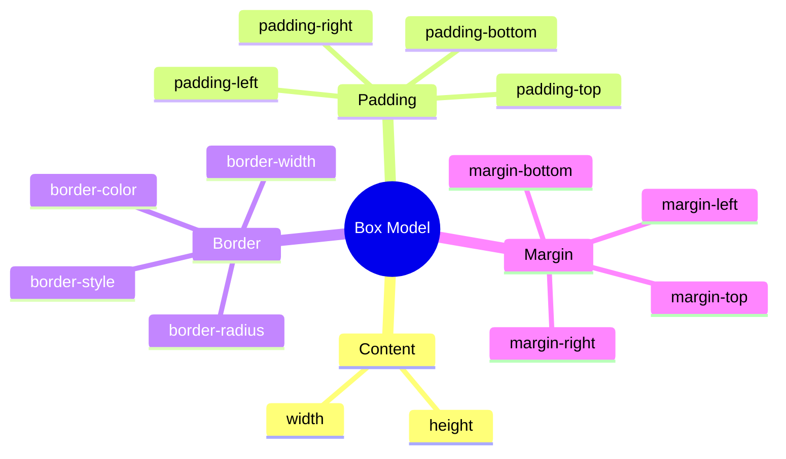
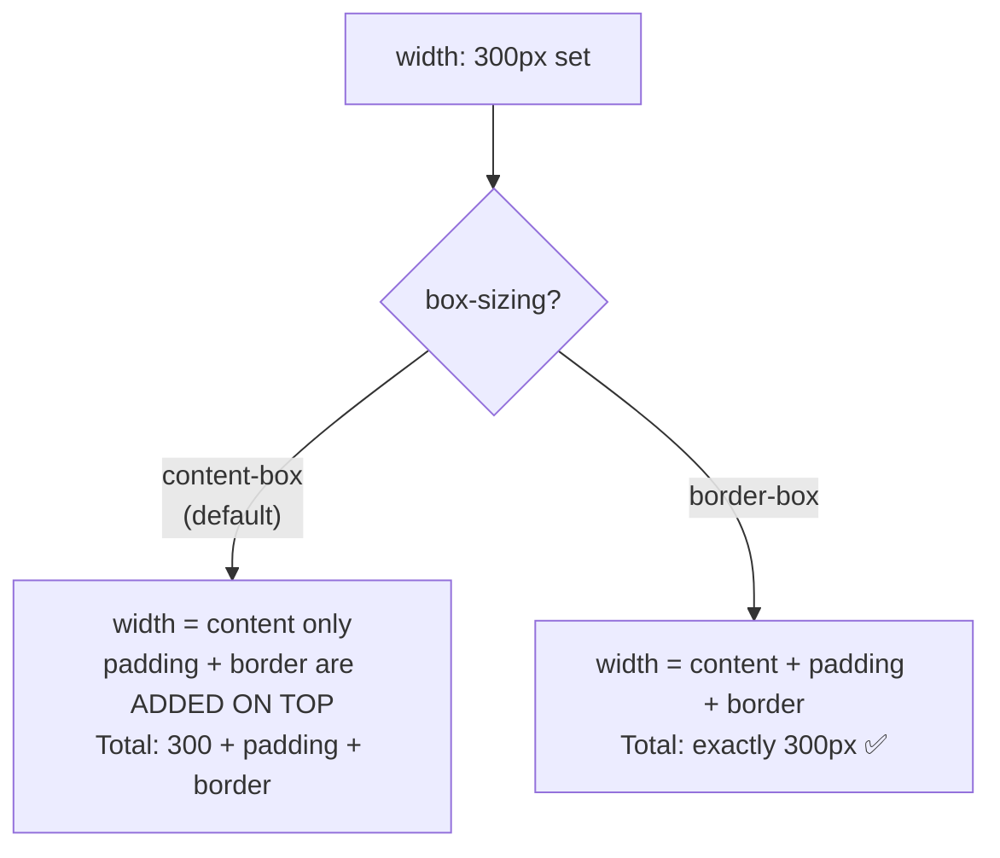

## Box Model

> **Connection with the previous lesson:** in the last lesson, we learned to precisely select elements through selectors and understood how the cascade resolves style conflicts. Today we figure out what each element on the page is physically made of - this principle is the foundation of everything we'll be doing further in the course.

---

## Lesson Goal

Understand the box model - how any HTML element is structured from the inside in terms of CSS, and learn to control its dimensions, spacing, and borders.

## What You Will Learn by the End of the Lesson

- Explain the box model: content → padding → border → margin.
- Control dimensions through `width`/`height`, `padding`, `margin`, `border`.
- Understand the difference between `box-sizing: content-box` and `border-box`.
- Recognize and explain margin collapse (collapsing of outer margins).
- Distinguish between `display: block`, `inline`, `inline-block`.

---

## Lesson Timeline

|Block|Content|
|---|---|
|1. Box model: what an element is made of|Content, padding, border, margin - visual diagram|
|2. width/height, padding, margin, border in practice|Syntax of each property|
|3. box-sizing: content-box vs border-box|Why border-box is more convenient|
|4. Mini-task|Calculate the final size of a block|
|5. Margin collapse|The mystery of collapsing margins|
|6. display: block/inline/inline-block|Difference in behavior|
|7. Summary and practice|Build a card|


---

## Block 1. Box Model: What an Element Is Made Of

**In simple terms:** imagine a painting in a frame hanging on a wall. The painting has:

- the painting itself (the image) - this is the **content**;
- the space between the painting and the frame (usually a white mat) - this is the **inner spacing (padding)**;
- the frame itself - this is the **border**;
- the distance between the frame and nearby objects on the wall (so that paintings don't touch each other) - this is the **outer spacing (margin)**.

Every HTML element in CSS is structured exactly the same - following the **box model** principle, consisting of four layers going from the center outward:

```
┌─────────────────────────────────────┐
│              margin                  │  ← outer spacing (from other elements)
│   ┌───────────────────────────────┐  │
│   │            border             │  │  ← border/frame
│   │   ┌───────────────────────┐   │  │
│   │   │        padding        │   │  │  ← inner spacing (from border to content)
│   │   │   ┌───────────────┐   │   │  │
│   │   │   │    content    │   │   │  │  ← the content itself (text, image)
│   │   │   └───────────────┘   │   │  │
│   │   └───────────────────────┘   │  │
│   └───────────────────────────────┘  │
└─────────────────────────────────────┘
```

Let's break down each layer in order, from the center to the edge:

1. **Content** - the text, image, or other content of the element. Its size is set via `width` and `height`.
2. **Padding (inner spacing)** - the space **inside** the element, between the content and the border. Increases the "breathing room" inside the block without pushing it away from neighboring elements.
3. **Border** - the visible (or invisible) frame around the padding and content.
4. **Margin (outer spacing)** - the space **outside** the element, between its border and neighboring elements. Pushes the element away from other blocks.



**The key difference between `padding` and `margin` that beginners often confuse:** padding is the spacing **inside** the block itself (as if you're adding a "cushion" inside the picture's frame), while margin is the spacing **outside** the block (the distance to nearby objects on the wall). If you set a background on an element (`background-color`), it will cover the content area **and** padding, but will never cover the margin - because margin is no longer part of the element itself, it's just the "personal space" around it.

---

## Block 2. `width`/`height`, `padding`, `margin`, `border` in Practice

### `width` and `height`

```css
.box {
    width: 300px;
    height: 150px;
}
```

Set the size of the element's **content** - an important detail we'll return to in block 3 about `box-sizing`.

### `padding`

```css
.box {
    padding: 20px;
}
```

This is shorthand that sets the same spacing on all four sides at once. You can also set them individually:

```css
.box {
    padding-top: 10px;
    padding-right: 20px;
    padding-bottom: 10px;
    padding-left: 20px;
}
```

Or use a convenient shorthand for all sides **clockwise, starting from the top** (easy to remember: "top, right, bottom, left" - like a clock hand):

```css
.box {
    padding: 10px 20px 10px 20px;  /* top right bottom left */
}
```

There are also intermediate shorthands:

```css
padding: 10px 20px;       /* top/bottom: 10px, right/left: 20px */
padding: 10px 20px 15px;  /* top: 10px, right/left: 20px, bottom: 15px */
```

### `margin`

Works by the exact same syntax rules as `padding` - just for outer spacing:

```css
.box {
    margin: 20px;                  /* all sides */
    margin: 10px 20px;             /* top/bottom, right/left */
    margin: 10px 20px 15px 5px;    /* top, right, bottom, left */
}
```

**Special technique:** `margin: 0 auto;` - a classic way to horizontally center a block with a set width inside its parent:

```css
.container {
    width: 800px;
    margin: 0 auto;
}
```

Here `0` is no spacing top/bottom, and `auto` means the browser calculates equal spacing on the left and right, so the block ends up exactly centered in the available space.

### `border`

```css
.box {
    border: 2px solid black;
}
```

A shorthand of three parts: **thickness**, **line style**, **color**. Main line styles:

```css
border: 2px solid black;    /* solid line */
border: 2px dashed gray;    /* dashed line */
border: 2px dotted red;     /* dotted line */
```

As with `padding`/`margin`, you can set borders on individual sides:

```css
.box {
    border-bottom: 1px solid #ccc;  /* bottom border only - common technique for dividers */
}
```

### `border-radius` - Rounded Corners

Although this is not technically part of the "classic" box model, it's an extremely commonly used property that logically connects with `border`:

```css
.box {
    border: 2px solid black;
    border-radius: 10px;
}
```

The larger the value, the more rounded the corners. A value of `border-radius: 50%;` on a square element turns it into a perfect circle - a common technique for round avatars.

---

### Common Beginner Mistakes

|Error|How to Fix|
|---|---|
|Confusing the order in the shorthand `padding`/`margin` (not clockwise)|Remember: top → right → bottom → left, like a clock hand moving from 12|
|Confusing `padding` (inner spacing, "inflates" the block) and `margin` (outer spacing, pushes away from neighbors)|Set a background on the block (`background-color`) - the area covered by the background is content + padding, not margin - this visually shows the difference|
|Forgetting that `border` requires all three parts (thickness, style, color) for correct rendering|Specify `border: 2px solid black;` as a whole - if you forget, for example, the style (`solid`), the border may not display at all|

---

## Block 3. `box-sizing`: `content-box` vs `border-box`

This is one of the most important practical points of the lesson - something that will genuinely affect how you calculate element dimensions for the rest of your web development career.

### Default Value: `content-box`

By default, CSS uses the `content-box` model - this means that `width`/`height` set the size of **only the content**, and `padding` and `border` are **added on top**, increasing the final visible size of the block.

```css
.box {
    width: 300px;
    padding: 20px;
    border: 5px solid black;
}
```

With `content-box` (the default), the **actual final width** of this block on screen will be:

```
300px (content) + 20px + 20px (padding left and right) + 5px + 5px (border left and right) = 350px
```

That is, the declared `width: 300px` is **not** what you'll actually see on screen if the element has padding and border. This is a historically common source of confusion and errors for beginners - you set `width: 300px`, but the block on screen turns out noticeably wider.

### Solution: `box-sizing: border-box`

```css
.box {
    box-sizing: border-box;
    width: 300px;
    padding: 20px;
    border: 5px solid black;
}
```

With `border-box`, the set `width: 300px` is already the **final width**, including padding and border. The browser itself "shrinks" the content area so that the final width stays exactly 300px, regardless of how much padding and border you add.

**Analogy:** imagine you're packing a gift into a box of a given size (e.g., 30×30 cm - that's the "final width"). With `content-box`, you first place the gift of the needed size, and then **add** wrapping paper and ribbon on top - and the box becomes larger than the originally set size. With `border-box`, you know right away: "the entire box, including wrapping and ribbon, will be exactly 30×30 cm" - and you adjust the size of the gift inside to fit that constraint.

### Practical Recommendation: Apply `border-box` Globally

The vast majority of modern CSS projects apply `border-box` **to all elements at once** at the very beginning of the stylesheet, using the universal selector from lesson 2:

```css
* {
    box-sizing: border-box;
}
```



**This is already reflected in the final project checklist** ("`box-sizing: border-box` is used") - it is strongly recommended to add this line to the very beginning of your CSS file today and keep it there for the rest of the course. This will save you from constantly recalculating "how much space will this block actually take up with padding and border."

---

### Common Beginner Mistakes

|Error|How to Fix|
|---|---|
|Not understanding why a block with `width: 300px` turns out wider than 300px on screen|Check whether `padding`/`border` is added - with the default `content-box`, they are added on top of the set width|
|Forgetting to add `box-sizing: border-box` at the beginning of the project|Add `* { box-sizing: border-box; }` as one of the first lines in your CSS file - this is a reasonable default standard for the entire course|
|Thinking that `box-sizing` is something exotic and rarely used|In practice, this is one of the first rules written in any modern CSS project|

---

## Block 4. Mini-Task

Without `box-sizing: border-box`, calculate on your own what the final width of the block on screen will be if:

```css
.box {
    width: 200px;
    padding: 15px;
    border: 3px solid black;
}
```

**Solution:**

```
200px (content) + 15px + 15px (padding left/right) + 3px + 3px (border left/right) = 236px
```

---

## Block 5. Margin Collapse (Collapsing of Outer Margins)

This is one of the most well-known CSS "mysteries" for beginners - behavior that looks like a bug but is actually a documented rule.

### The Phenomenon Explained

When two block elements are positioned **one below the other** (not side by side horizontally, but vertically), and the bottom element has `margin-top` while the top one has `margin-bottom`, these two margins **do not add up** as you might expect, but **collapse** - the resulting spacing between them equals the **larger** of the two values, not their sum.

```html
<div class="block-one">First block</div>
<div class="block-two">Second block</div>
```

```css
.block-one {
    margin-bottom: 30px;
}

.block-two {
    margin-top: 20px;
}
```

**You might intuitively expect** the distance between the blocks to be `30px + 20px = 50px`. **In reality** the distance will be only **30px** - equal to the larger of the two values; the smaller one (20px) is simply "absorbed" by the larger.

**Analogy:** imagine two people, each wanting to maintain personal distance from the other - one wants at least 30 cm, the other wants at least 20 cm. The resulting distance between them will be **30 cm** - their requirements don't add up; the more "demanding" one wins (the larger margin), because once the larger distance is maintained, the smaller one is automatically maintained too.

### Important Conditions for When Collapse Occurs

- Collapse happens **only for vertical** margins (`margin-top`/`margin-bottom`), but **not for horizontal** ones (`margin-left`/`margin-right`) - horizontal margins always add up normally.
- Collapse only occurs between **adjacent** block elements in the normal document flow - it **does not apply** if elements use Flexbox or Grid (topics of lessons 5-6) - different, more predictable rules for calculating spacing apply there.

**Practical takeaway for this course:** don't be alarmed if the distance between blocks turned out smaller than you "summed up in your head" - this is not a browser error, but the documented behavior of margin collapse. That's why many CSS developers prefer to set spacing **only on one side** of each block (e.g., always only `margin-bottom`, never adding `margin-top` for the same type of blocks) - this makes the final distance more predictable and eliminates the need to keep the subtleties of collapsing in mind.

---

### Common Beginner Mistakes

|Error|How to Fix|
|---|---|
|Not understanding why the distance between blocks is less than the sum of the set margins|Remember margin collapse - vertical margins collapse, the larger one wins|
|Trying to "fix" it by increasing both margins - but the distance still doesn't grow proportionally|Set spacing on only one side (e.g., only `margin-bottom`) for a more predictable result|
|Confusing margin collapse with Flexbox/Grid behavior|Remember: collapsing only works in the normal document flow; inside Flexbox/Grid it does not apply|

---

## Block 6. `display: block`, `inline`, `inline-block`

The last important detail of this lesson - how an element behaves in the page flow: does it take up an entire line or does it flow inline with text.

### `display: block`

The element takes up **the full available width** of its parent (by default) and **always starts on a new line** - the next element after it automatically moves to the next line, even if there was plenty of space.

By **default**, block elements include, for example, `<div>`, `<p>`, `<h1>`–`<h6>`, `<ul>`, `<li>`, `<section>`, `<header>`, `<footer>` - most of the "major" semantic tags from the HTML course.

For block elements, `width`, `height`, `margin`, `padding` on all sides **work** exactly as we covered above.

### `display: inline`

The element **does not start on a new line** - it flows directly into the text stream, taking up exactly as much space as its content needs, and the remaining text continues right after it on the same line.

By **default**, inline elements include, for example, `<span>`, `<a>`, `<strong>`, `<em>` - tags we used inside text in the HTML course.

**Important limitation:** for `inline` elements, `width` and `height` **do not work** (the browser simply ignores them) - the size of an inline element is entirely determined by its content. Vertical `margin-top`/`margin-bottom` also have no effect, but horizontal `margin-left`/`margin-right` and all `padding` do work, although padding on top/bottom may visually "overlap" neighboring text lines without shifting the actual text flow.

### `display: inline-block`

A hybrid option - "the best of both worlds":

- like `inline`, the element **does not start on a new line** - you can place several such elements side by side horizontally;
- but at the same time, like `block`, `width`, `height`, and all sides of `margin`/`padding` **fully work**.

```css
.button {
    display: inline-block;
    width: 150px;
    height: 40px;
    padding: 10px;
    margin: 5px;
}
```

This is a classic technique for, for example, a row of buttons or cards that should be positioned next to each other while having **precisely defined** dimensions.

### Comparison Table

|`block`|`inline`|`inline-block`|
|---|---|---|---|
|Starts on a new line|Yes|No|No|
|`width`/`height` work|Yes|No|Yes|
|Vertical `margin` works|Yes|No|Yes|
|Default tags|`div`, `p`, `h1`|`span`, `a`, `strong`|usually set manually|

**Looking ahead:** in lessons 5-6 we'll study Flexbox and Grid - modern, much more flexible tools for positioning multiple blocks next to each other. `inline-block` is a kind of "historical" method that's still useful to understand, but in practice in modern projects, rows of cards or buttons are more often built using Flexbox.

---

### Common Beginner Mistakes

|Error|How to Fix|
|---|---|
|Trying to set `width`/`height` on an `inline` element and not understanding why it doesn't work|Use `display: inline-block` or `display: block` if you need precise dimensions|
|Expecting several `block` elements to arrange side by side horizontally "on their own"|By default, `block` elements always wrap to a new line - for horizontal layout you need `inline-block`, Flexbox, or Grid|
|Not explicitly setting `display: inline-block`, expecting this behavior from a plain `<div>`|By default, `<div>` is `block`; if you need different behavior, specify `display` explicitly|

---

## Lesson Summary

Today you learned:

- Box model - any element consists of four layers: content → padding → border → margin, from the center to the edge.
- `width`/`height` set the content size, `padding` is inner spacing, `margin` is outer spacing, `border` is the visible boundary between them.
- By default (`content-box`) padding and border are **added** to the set width; `box-sizing: border-box` makes the set width the final one, which is much more convenient - it's recommended to apply it globally via `* { box-sizing: border-box; }`.
- Margin collapse - vertical margins of adjacent blocks don't add up, but collapse to the larger value.
- `display: block` - new line, all dimensions work; `inline` - in text flow, dimensions don't work; `inline-block` - combines both behaviors.

---

## Practice (in class)

Build a card (image + text + spacing + border) based on your HTML page from the HTML course:

```html
<div class="card">
    
    <h3>Card heading</h3>
    <p>Brief description of the card content.</p>
</div>
```

1. Set a fixed `width` for `.card`, inner `padding`, and a `border` with `border-radius`.
2. Add `* { box-sizing: border-box; }` to the beginning of your CSS file.
3. Set the image inside the card to `width: 100%;` so it fits exactly within the card's width.
4. Check via DevTools the "Computed" tab (it shows the exact final dimensions of the block including all padding/border) - does the final size match your expectations?

---

## Homework

1. Style the navigation (`<nav>`) and footer (`<footer>`) blocks of your HTML project - add neat padding and at least one decorative border (e.g., `border-top` for the footer).
2. Apply `box-sizing: border-box` globally to the entire project if you haven't already.
3. Create a row of 3 cards (similar to the practice card) with `display: inline-block` and make sure they are positioned side by side horizontally rather than wrapping to a new line.
4. **Research task:** open DevTools on any website, click on any block and find the "Computed" tab (or expand the "Box Model" tab if your browser shows it visually) - look at the actual margin/border/padding/content values of this element in practice.

---

[Next lesson: Element Positioning →](Lesson-4/en/Element%20Positioning.md)
