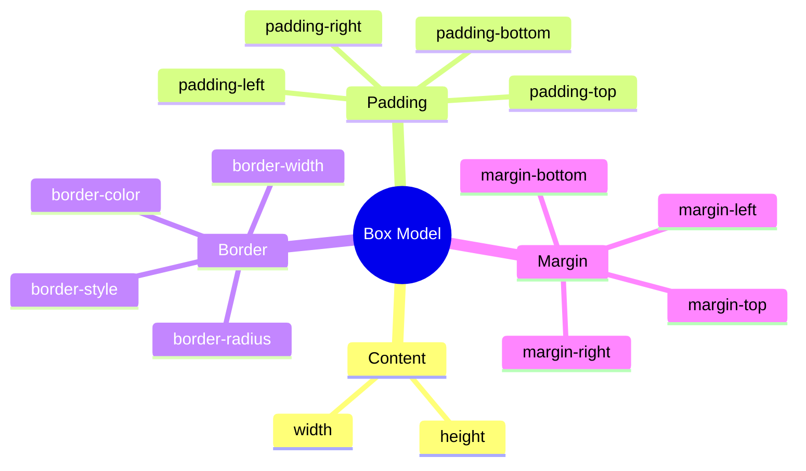
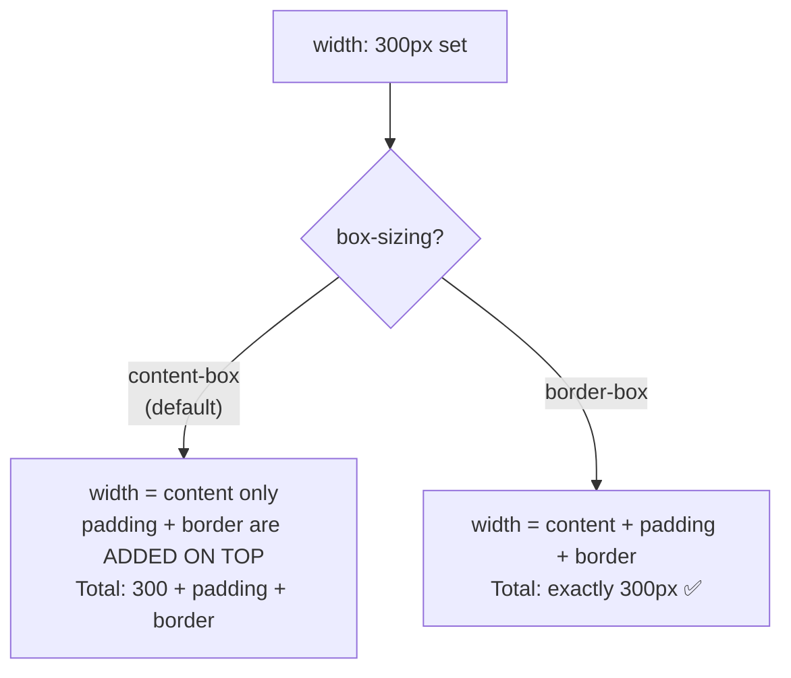

## Box model (модель блока)

> **Связь с предыдущим уроком:** на прошлом уроке мы научились точно выбирать элементы через селекторы и поняли, как каскад решает конфликты стилей. Сегодня разбираемся, из чего физически состоит каждый элемент на странице - этот принцип лежит в основе буквально всего, что мы будем делать дальше в курсе.

---

## Цель урока

Понять модель блока (box model) - как устроен любой HTML-элемент изнутри с точки зрения CSS, и научиться управлять его размерами, отступами и границами.

## Чему вы научитесь к концу урока

- Объяснять модель блока: content → padding → border → margin.
- Управлять размерами через `width`/`height`, `padding`, `margin`, `border`.
- Понимать разницу между `box-sizing: content-box` и `border-box`.
- Распознавать и объяснять схлопывание внешних отступов (margin collapse).
- Различать `display: block`, `inline`, `inline-block`.

---

## Хронометраж урока

|Блок|Содержание|
|---|---|
|1. Box model: из чего состоит элемент|Content, padding, border, margin - наглядная схема|
|2. width/height, padding, margin, border на практике|Синтаксис каждого свойства|
|3. box-sizing: content-box vs border-box|Почему border-box удобнее|
|4. Мини-задание|Посчитать итоговый размер блока|
|5. Margin collapse|Загадка схлопывания отступов|
|6. display: block/inline/inline-block|Разница в поведении|
|7. Итоги и практика|Сверстать карточку|


---

## Блок 1. Box model: из чего состоит элемент

**Простыми словами:** представьте картину в раме, которая висит на стене. У картины есть:

- сама картина (изображение) - это **содержимое**;
- пространство между картиной и рамой (обычно белый паспарту) - это **внутренний отступ**;
- сама рама - это **граница**;
- расстояние между рамой и соседними предметами на стене (чтобы картины не соприкасались друг с другом) - это **внешний отступ**.

Каждый HTML-элемент в CSS устроен точно так же - по принципу **box model** (модель блока), состоящей из четырёх слоёв, идущих от центра наружу:

```
┌─────────────────────────────────────┐
│              margin                  │  ← внешний отступ (от других элементов)
│   ┌───────────────────────────────┐  │
│   │            border             │  │  ← граница/рамка
│   │   ┌───────────────────────┐   │  │
│   │   │        padding        │   │  │  ← внутренний отступ (от границы до содержимого)
│   │   │   ┌───────────────┐   │   │  │
│   │   │   │    content    │   │   │  │  ← само содержимое (текст, картинка)
│   │   │   └───────────────┘   │   │  │
│   │   └───────────────────────┘   │  │
│   └───────────────────────────────┘  │
└─────────────────────────────────────┘
```

Разберём каждый слой по порядку, от центра к краю:

1. **Content (содержимое)** - сам текст, изображение или другое содержимое элемента. Его размер задаётся через `width` и `height`.
2. **Padding (внутренний отступ)** - пространство **внутри** элемента, между содержимым и границей. Увеличивает "воздух" внутри блока, не отодвигая его от соседних элементов.
3. **Border (граница)** - видимая (или невидимая) рамка вокруг padding и content.
4. **Margin (внешний отступ)** - пространство **снаружи** элемента, между его границей и соседними элементами. Отталкивает элемент от других блоков.



**Ключевое различие между `padding` и `margin`, которое часто путают новички:** padding - это отступ **внутри** самого блока (как будто вы добавляете "подушку" изнутри рамки картины), а margin - это отступ **снаружи** блока (расстояние до соседних предметов на стене). Если вы зададите фон элементу (`background-color`), он закрасит область content **и** padding, но никогда не закрасит margin - потому что margin уже не часть самого элемента, это просто "личное пространство" вокруг него.

---

## Блок 2. `width`/`height`, `padding`, `margin`, `border` на практике

### `width` и `height`

```css
.box {
    width: 300px;
    height: 150px;
}
```

Задают размер **содержимого** (content) элемента - важная деталь, к которой мы вернёмся в блоке 3 про `box-sizing`.

### `padding`

```css
.box {
    padding: 20px;
}
```

Это сокращённая запись, которая задаёт одинаковый отступ со всех четырёх сторон сразу. Можно задавать и по отдельности:

```css
.box {
    padding-top: 10px;
    padding-right: 20px;
    padding-bottom: 10px;
    padding-left: 20px;
}
```

Или через удобную сокращённую запись сразу для всех сторон **по часовой стрелке, начиная сверху** (запомнить порядок легко: «сверху, справа, снизу, слева» - как стрелка часов):

```css
.box {
    padding: 10px 20px 10px 20px;  /* верх право низ лево */
}
```

Есть и промежуточные сокращения:

```css
padding: 10px 20px;       /* верх/низ: 10px, право/лево: 20px */
padding: 10px 20px 15px;  /* верх: 10px, право/лево: 20px, низ: 15px */
```

### `margin`

Работает по абсолютно тем же правилам синтаксиса, что и `padding` - только для внешнего отступа:

```css
.box {
    margin: 20px;                  /* со всех сторон */
    margin: 10px 20px;             /* верх/низ, право/лево */
    margin: 10px 20px 15px 5px;    /* верх, право, низ, лево */
}
```

**Особый приём:** `margin: 0 auto;` - классический способ горизонтально отцентрировать блок с заданной шириной внутри его родителя:

```css
.container {
    width: 800px;
    margin: 0 auto;
}
```

Здесь `0` - отсутствие отступа сверху/снизу, а `auto` - браузер сам вычисляет одинаковые отступы слева и справа, чтобы блок оказался ровно по центру доступного пространства.

### `border`

```css
.box {
    border: 2px solid black;
}
```

Сокращённая запись из трёх частей: **толщина**, **стиль линии**, **цвет**. Основные стили линии:

```css
border: 2px solid black;    /* сплошная линия */
border: 2px dashed gray;    /* пунктирная линия */
border: 2px dotted red;     /* точечная линия */
```

Как и с `padding`/`margin`, можно задавать границу по отдельным сторонам:

```css
.box {
    border-bottom: 1px solid #ccc;  /* только нижняя граница - частый приём для разделителей */
}
```

### `border-radius` - скруглённые углы

Хотя формально это не часть "классической" box model, это крайне часто используемое свойство, логично связанное с `border`:

```css
.box {
    border: 2px solid black;
    border-radius: 10px;
}
```

Чем больше значение - тем сильнее скруглены углы. Значение `border-radius: 50%;` на квадратном элементе превращает его в идеальный круг - частый приём для круглых аватарок.

---

### Частые ошибки новичков

|Ошибка|Как исправить|
|---|---|
|Путают порядок в сокращённой записи `padding`/`margin` (не по часовой стрелке)|Запомните: верх → право → низ → лево, как движение стрелки часов, начиная с 12|
|Путают `padding` (отступ внутри, "надувает" блок) и `margin` (отступ снаружи, отталкивает от соседей)|Задайте фон блоку (`background-color`) - область, закрашенная фоном, это content + padding, а не margin - так наглядно видна разница|
|Забывают, что у `border` обязательны все три части (толщина, стиль, цвет) для корректного отображения|Указывайте `border: 2px solid black;` целиком - если забыть, например, стиль (`solid`), граница может не отобразиться вовсе|

---

## Блок 3. `box-sizing`: `content-box` vs `border-box`

Это один из самых важных практических моментов урока - то, что реально влияет на то, как вы будете считать размеры элементов всю оставшуюся карьеру верстальщика.

### Значение по умолчанию: `content-box`

По умолчанию в CSS используется модель `content-box` - это означает, что `width`/`height` задают размер **только content**, а `padding` и `border` **добавляются сверху**, увеличивая итоговый видимый размер блока.

```css
.box {
    width: 300px;
    padding: 20px;
    border: 5px solid black;
}
```

При `content-box` (по умолчанию) **реальная итоговая ширина** этого блока на экране будет:

```
300px (content) + 20px + 20px (padding слева и справа) + 5px + 5px (border слева и справа) = 350px
```

То есть заявленные `width: 300px` - это **не то**, что вы реально увидите на экране, если у элемента есть padding и border. Это исторически частый источник путаницы и ошибок у новичков - вы задаёте `width: 300px`, а блок на экране оказывается заметно шире.

### Решение: `box-sizing: border-box`

```css
.box {
    box-sizing: border-box;
    width: 300px;
    padding: 20px;
    border: 5px solid black;
}
```

При `border-box` заданная `width: 300px` - это уже **итоговая, финальная ширина**, включающая в себя padding и border. Браузер сам "сжимает" область content, чтобы итоговая ширина точно осталась равной 300px, независимо от того, сколько padding и border вы добавите.

**Аналогия:** представьте, что вы упаковываете подарок в коробку заданного размера (например, 30×30 см - это как раз "итоговая ширина"). При `content-box` вы сначала кладёте подарок нужного размера, а потом **добавляете** обёрточную бумагу и ленту поверх - и коробка становится больше исходно заданного размера. При `border-box` вы сразу знаете: «вся коробка целиком, включая обёртку и ленту, будет ровно 30×30 см» - и подстраиваете размер самого подарка внутри под это ограничение.

### Практическая рекомендация: применяйте `border-box` глобально

Подавляющее большинство современных CSS-проектов в самом начале файла стилей применяют `border-box` **ко всем элементам сразу**, используя универсальный селектор из урока 2:

```css
* {
    box-sizing: border-box;
}
```



**Это уже отражено в чек-листе итогового проекта курса** («Используется `box-sizing: border-box`») - настоятельно рекомендуется добавить эту строку в самое начало вашего CSS-файла прямо сегодня и оставить её там на весь оставшийся курс. Это избавит вас от постоянных пересчётов "сколько же реально займёт места этот блок с учётом padding и border".

---

### Частые ошибки новичков

|Ошибка|Как исправить|
|---|---|
|Не понимают, почему блок с `width: 300px` на экране оказывается шире 300px|Проверьте, добавлен ли `padding`/`border` - при стандартном `content-box` они добавляются сверх заданной ширины|
|Забывают добавить `box-sizing: border-box` в начало проекта|Добавьте `* { box-sizing: border-box; }` одной из первых строк в CSS-файле - это разумный стандарт по умолчанию для всего курса|
|Думают, что `box-sizing` - это что-то экзотическое и редко используемое|На практике это одно из первых правил, которое пишут в любом современном CSS-проекте|

---

## Блок 4. Мини-задание

Без `box-sizing: border-box`, посчитайте самостоятельно, какой будет итоговая ширина блока на экране, если:

```css
.box {
    width: 200px;
    padding: 15px;
    border: 3px solid black;
}
```

**Решение:**

```
200px (content) + 15px + 15px (padding слева/справа) + 3px + 3px (border слева/справа) = 236px
```

---

## Блок 5. Margin collapse (схлопывание внешних отступов)

Это одна из самых известных "загадок" CSS для новичков - поведение, которое выглядит как баг, но на самом деле является задокументированным правилом.

### Суть явления

Когда два блочных элемента расположены **друг под другом** (не рядом по горизонтали, а именно вертикально), и у нижнего элемента есть `margin-top`, а у верхнего - `margin-bottom`, эти два отступа **не складываются**, как можно было бы ожидать, а **схлопываются** - итоговый отступ между ними равен **большему** из двух значений, а не их сумме.

```html
<div class="block-one">Первый блок</div>
<div class="block-two">Второй блок</div>
```

```css
.block-one {
    margin-bottom: 30px;
}

.block-two {
    margin-top: 20px;
}
```

**Интуитивно можно ожидать**, что расстояние между блоками будет `30px + 20px = 50px`. **На самом деле** расстояние будет всего **30px** - то есть равно большему из двух значений, меньшее (20px) просто "поглощается" большим.

**Аналогия:** представьте двух людей, каждый из которых хочет держать личную дистанцию от другого - один хочет минимум 30 см, другой хочет минимум 20 см. Итоговая дистанция между ними будет **30 см** - их требования не складываются, побеждает более "требовательный" (больший отступ), потому что как только соблюдена бо́льшая дистанция, автоматически соблюдена и меньшая.

### Важные условия, при которых происходит схлопывание

- Схлопывание происходит **только для вертикальных** margin (`margin-top`/`margin-bottom`), но **не для горизонтальных** (`margin-left`/`margin-right`) - горизонтальные margin всегда складываются как обычно.
- Схлопывание происходит только между **соседними** блочными элементами в обычном потоке документа - оно **не работает**, если элементы используют Flexbox или Grid (темы уроков 5-6) - там действуют уже другие, более предсказуемые правила расчёта отступов.

**Практический вывод для этого курса:** не пугайтесь, если расстояние между блоками оказалось меньше, чем вы "суммировали в уме" - это не ошибка браузера, а задокументированное поведение margin collapse. Именно поэтому многие CSS-разработчики предпочитают задавать отступ **только с одной стороны** каждого блока (например, всегда только `margin-bottom`, никогда не добавляя `margin-top` для того же типа блоков) - это делает итоговое расстояние более предсказуемым и избавляет от необходимости держать в голове тонкости схлопывания.

---

### Частые ошибки новичков

|Ошибка|Как исправить|
|---|---|
|Не понимают, почему отступ между блоками меньше, чем сумма заданных margin|Вспомните про margin collapse - вертикальные отступы схлопываются, побеждает больший|
|Пытаются "исправить" это, увеличивая оба margin - а расстояние всё равно не растёт пропорционально|Задавайте отступ только с одной стороны (например, только `margin-bottom`) для более предсказуемого результата|
|Путают margin collapse с поведением Flexbox/Grid|Помните: схлопывание работает только в обычном потоке документа, внутри Flexbox/Grid оно не применяется|

---

## Блок 6. `display: block`, `inline`, `inline-block`

Последняя важная деталь этого урока - как элемент вообще ведёт себя в потоке страницы: занимает ли всю строку целиком или встраивается в текст.

### `display: block`

Элемент занимает **всю доступную ширину** родителя (по умолчанию) и **всегда начинается с новой строки** - следующий элемент после него автоматически переносится на новую строку, даже если места было предостаточно.

К блочным элементам **по умолчанию** относятся, например, `<div>`, `<p>`, `<h1>`–`<h6>`, `<ul>`, `<li>`, `<section>`, `<header>`, `<footer>` - большинство "крупных" семантических тегов из курса HTML.

У блочных элементов **работают** `width`, `height`, `margin`, `padding` по всем сторонам полностью так, как мы разбирали выше.

### `display: inline`

Элемент **не начинается с новой строки** - он встраивается прямо в поток текста, занимая ровно столько места, сколько нужно для его содержимого, и остальной текст продолжается сразу после него на той же строке.

К строчным элементам **по умолчанию** относятся, например, `<span>`, `<a>`, `<strong>`, `<em>` - теги, которые мы использовали внутри текста в курсе HTML.

**Важное ограничение:** у `inline`-элементов **не работают** `width` и `height` (браузер их просто проигнорирует) - размер строчного элемента полностью определяется его содержимым. Вертикальные `margin-top`/`margin-bottom` тоже не оказывают эффекта, а вот горизонтальные `margin-left`/`margin-right` и весь `padding` - работают, хотя padding сверху/снизу визуально может "наезжать" на соседние строки текста, не сдвигая сам поток текста.

### `display: inline-block`

Гибридный вариант - «лучшее из обоих миров»:

- как и `inline`, элемент **не начинается с новой строки** - можно расположить несколько таких элементов рядом по горизонтали;
- но при этом, как и у `block`, у него **полностью работают** `width`, `height` и все стороны `margin`/`padding`.

```css
.button {
    display: inline-block;
    width: 150px;
    height: 40px;
    padding: 10px;
    margin: 5px;
}
```

Это классический приём для, например, ряда кнопок или карточек, которые должны располагаться друг рядом с другом, но при этом иметь **точно заданные** размеры.

### Сравнительная таблица

|`block`|`inline`|`inline-block`|
|---|---|---|---|
|Начинается с новой строки|Да|Нет|Нет|
|Работают `width`/`height`|Да|Нет|Да|
|Работает вертикальный `margin`|Да|Нет|Да|
|Примеры тегов по умолчанию|`div`, `p`, `h1`|`span`, `a`, `strong`|обычно задаётся вручную|

**Забегая вперёд:** в уроках 5-6 мы изучим Flexbox и Grid - современные, гораздо более гибкие инструменты для расположения нескольких блоков рядом друг с другом. `inline-block` - это своего рода "исторический" способ, который всё ещё полезно понимать, но на практике в современных проектах ряды карточек или кнопок чаще делают именно через Flexbox.

---

### Частые ошибки новичков

|Ошибка|Как исправить|
|---|---|
|Пытаются задать `width`/`height` строчному (`inline`) элементу и не понимают, почему это не работает|Используйте `display: inline-block` или `display: block`, если нужны точные размеры|
|Ожидают, что несколько `block`-элементов расположатся рядом по горизонтали "сами по себе"|По умолчанию `block`-элементы всегда переносятся на новую строку - для горизонтального расположения нужен `inline-block`, Flexbox или Grid|
|Не устанавливают `display: inline-block` явно, ожидая этого поведения от обычного `<div>`|По умолчанию `<div>` - это `block`; если нужно другое поведение, укажите `display` явно|

---

## Итоги урока

Сегодня вы узнали:

- Box model - любой элемент состоит из четырёх слоёв: content → padding → border → margin, от центра к краю.
- `width`/`height` задают размер content, `padding` - отступ внутри блока, `margin` - отступ снаружи, `border` - видимая граница между ними.
- По умолчанию (`content-box`) padding и border **добавляются** к заданной ширине; `box-sizing: border-box` делает заданную ширину итоговой, что гораздо удобнее - рекомендуется применять глобально через `* { box-sizing: border-box; }`.
- Margin collapse - вертикальные отступы соседних блоков не складываются, а схлопываются до большего значения.
- `display: block` - с новой строки, работают все размеры; `inline` - в потоке текста, размеры не работают; `inline-block` - совмещает оба поведения.

---

## Практика (на занятии)

Сверстайте карточку (изображение + текст + отступы + рамка) на основе своей HTML-страницы из курса HTML:

```html
<div class="card">
    
    <h3>Заголовок карточки</h3>
    <p>Краткое описание содержимого карточки.</p>
</div>
```

1. Задайте `.card` фиксированную ширину, `padding` изнутри и `border` с `border-radius`.
2. Добавьте `* { box-sizing: border-box; }` в начало вашего CSS-файла.
3. Задайте изображению внутри карточки `width: 100%;`, чтобы оно точно вписывалось в ширину карточки.
4. Проверьте через DevTools вкладку "Computed" (там показываются точные итоговые размеры блока с учётом всех padding/border) - совпадает ли итоговый размер с вашими ожиданиями.

---

## Домашнее задание

1. Оформите блоки навигации (`<nav>`) и подвала (`<footer>`) своего HTML-проекта - добавьте аккуратные отступы (`padding`) и хотя бы одну декоративную границу (`border`, например, `border-top` у подвала).
2. Примените `box-sizing: border-box` глобально ко всему проекту, если ещё не сделали.
3. Создайте ряд из 3 карточек (аналогичных карточке из практики) с `display: inline-block` и убедитесь, что они располагаются рядом по горизонтали, а не переносятся на новую строку.
4. **Исследовательское задание:** откройте DevTools на любом сайте, кликните на любой блок и найдите вкладку "Computed" (или разверните вкладку "Box Model", если браузер показывает её визуально) - посмотрите на реальные значения margin/border/padding/content этого элемента на практике.

---

[Следующий урок: Позиционирование элементов →](../4/ru/Позиционирование%20элементов.md)
