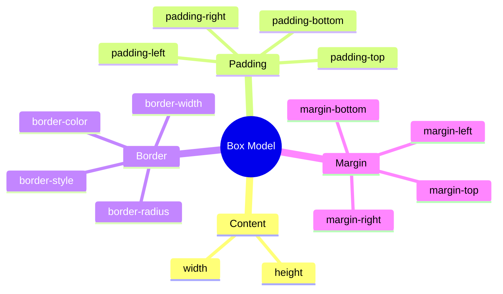
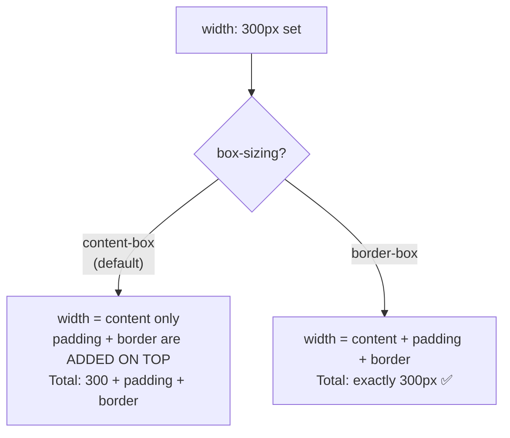

## Box model (blok modeli)

> **Oldingi dars bilan bog'liqlik:** o'tgan darsda biz selektorlar orqali elementlarni aniq tanlashni va kaskad qanday uslublar nizolarini hal qilishini o'rgandik. Bugun sahifadagi har bir element fizik jihatdan nimalardan tashkil topganini tahlil qilamiz - bu printsip kursda keyinchalik qiladigan barcha ishlarning asosida yotadi.

---

## Darsning maqsadi

Blok modelini (box model) tushunish - HTML elementining ichki tuzilmasi CSS nuqtai nazaridan qanday tashkil topganini va uning o'lchamlari, bo'shliqlari va chegaralarini boshqarishni o'rganish.

## Dars oxiriga qadar nimalarni o'rganasiz

- Blok modelini tushuntirish: content → padding → border → margin.
- `width`/`height`, `padding`, `margin`, `border` orqali o'lchamlarni boshqarish.
- `box-sizing: content-box` va `border-box` orasidagi farqni tushunish.
- Tashqi bo'shliqlarning qisqarishini (margin collapse) aniqlash va tushuntirish.
- `display: block`, `inline`, `inline-block` farqlarini ajratish.

---

## Darsning vaqt jadvali

|Blok|Mazmun|
|---|---|
|1. Box model: element nimalardan tashkil topgan|Content, padding, border, margin - tushunarli sxema|
|2. width/height, padding, margin, border amaliyotda|Har bir xususiyatning sintaksisi|
|3. box-sizing: content-box vs border-box|Nima uchun border-box qulayroq|
|4. Mini-vazifa|Blokning yakuniy o'lchamini hisoblash|
|5. Margin collapse|Bo'shliqlarning qisqarishining sirri|
|6. display: block/inline/inline-block|Xulq farqi|
|7. Xulosalar va amaliyot|Karta yasash|


---

## Blok 1. Box model: element nimalardan tashkil topgan

**Oddiy so'z bilan:** devorda osilgan ramkadagi rasmni tasavvur qiling. Rasmda bor:

- o'z rasm (tasvir) - bu **tarkibiy qism**;
- rasm va ramka orasidagi bo'shliq (odatda oq paspartu) - bu **ichki bo'shliq**;
- ramkaning o'zi - bu **chegara**;
- ramka va devordagi qo'shni predmetlar orasidagi masofa (rasmlar bir-biriga tegmasligi uchun) - bu **tashqi bo'shliq**.

Har bir HTML elementi CSSda aynan shunday tashkil topgan - **box model** (blok modeli) printsipiga asosan, markazdan tashqariga qarab to'rt qatlamdan iborat:

```
┌─────────────────────────────────────┐
│              margin                  │  ← tashqi bo'shliq (boshqa elementlardan)
│   ┌───────────────────────────────┐  │
│   │            border             │  │  ← chegara/ramka
│   │   ┌───────────────────────┐   │  │
│   │   │        padding        │   │  │  ← ichki bo'shliq (chegaradan tarkibiy qismgacha)
│   │   │   ┌───────────────┐   │   │  │
│   │   │   │    content    │   │   │  │  ← o'z tarkibiy qismi (matn, rasm)
│   │   │   └───────────────┘   │   │  │
│   │   └───────────────────────┘   │  │
│   └───────────────────────────────┘  │
└─────────────────────────────────────┘
```

Har bir qatlamni markazdan chegaraga qarab tahlil qilamiz:

1. **Content (tarkibiy qism)** - o'z matn, rasm yoki boshqa element tarkibi. O'lchami `width` va `height` orqali belgilanadi.
2. **Padding (ichki bo'shliq)** - element **ichidagi** bo'shliq, tarkibiy qism va chegara orasida. Blok ichidagi "havo" ni oshiradi, qo'shni elementlardan uzoqlashtirmasdan.
3. **Border (chegara)** - padding va content atrofida ko'rinadigan (yoki ko'rinmas) ramka.
4. **Margin (tashqi bo'shliq)** - element **tashqarisidagi** bo'shliq, uning chegarasi va qo'shni elementlar orasida. Elementni boshqa bloklardan itaradi.



**`padding` va `margin` orasidagi asosiy farq, yangi boshlovchilar ko'pincha adashadi:** padding bu blokning **ichidagi** bo'shliq (ramkadagi rasmdan ichkariga "yostiq" qo'shgan kabi), margin bu blokning **tashqarisidagi** bo'shliq (devordagi qo'shni predmetlargacha bo'lgan masofa). Agar elementga fon (`background-color`) belgilasangiz, u content **va** padding sohasini bo'yaydi, lekin hech qachon margin ni bo'ymaydi - chunki margin allaqachon elementning o'zi qismi emas, bu shunchaki atrofidagi "shaxsiy makon".

---

## Blok 2. `width`/`height`, `padding`, `margin`, `border` amaliyotda

### `width` va `height`

```css
.box {
    width: 300px;
    height: 150px;
}
```

Elementning **tarkibiy qismining** (content) o'lchamini belgilaydi - bu muhim tafsilot, unga 3-blokda `box-sizing` haqida qaytamiz.

### `padding`

```css
.box {
    padding: 20px;
}
```

Bu qisqartirilgan yozuv, to'rt tomondan bir xil bo'shliqni bir vaqtda belgilaydi. Alohida ham belgilash mumkin:

```css
.box {
    padding-top: 10px;
    padding-right: 20px;
    padding-bottom: 10px;
    padding-left: 20px;
}
```

Yoki barcha tomonlar uchun **soat yo'nalishi bo'yicha, yuqoridan boshlab** qulay qisqartirilgan yozuv bilan (tartibni eslab qolish oson: "yuqori, o'ng, past, chap" - soat koshi yo'nalishidek):

```css
.box {
    padding: 10px 20px 10px 20px;  /* yuqori o'ng past chap */
}
```

Oraliq qisqartirishlar ham bor:

```css
padding: 10px 20px;       /* yuqori/past: 10px, o'ng/chap: 20px */
padding: 10px 20px 15px;  /* yuqori: 10px, o'ng/chap: 20px, past: 15px */
```

### `margin`

`padding` bilan to'liq bir xil sintaksis qoidalari bo'yicha ishlaydi - faqat tashqi bo'shliq uchun:

```css
.box {
    margin: 20px;                  /* barcha tomonlardan */
    margin: 10px 20px;             /* yuqori/past, o'ng/chap */
    margin: 10px 20px 15px 5px;    /* yuqori, o'ng, past, chap */
}
```

**Maxsus usul:** `margin: 0 auto;` - belgilangan kenglikdagi blokni ota-onasining ichida gorizontal markazga joylashtirishning klassik usuli:

```css
.container {
    width: 800px;
    margin: 0 auto;
}
```

Bu yerda `0` - yuqori/pastda bo'shliq yo'qligi, `auto` - brauzer chap va o'ngda teng bo'shliqlarni o'zi hisoblaydi, shunda blok mavjud bo'shliqning aniq markazida joylashadi.

### `border`

```css
.box {
    border: 2px solid black;
}
```

Uch qismdan iborat qisqartirilgan yozuv: **qalinlik**, **chiziq uslubi**, **rang**. Asosiy chiziq uslublari:

```css
border: 2px solid black;    /* uzluksiz chiziq */
border: 2px dashed gray;    /* nuqtali chiziq */
border: 2px dotted red;     /* doira shaklidagi nuqtali chiziq */
```

`padding`/`margin` dagidek, chegarani alohida tomonlar bo'yicha belgilash mumkin:

```css
.box {
    border-bottom: 1px solid #ccc;  /* faqat pastki chegara - ajratuvchilar uchun ko'p ishlatiladigan usul */
}
```

### `border-radius` - yumaloqlangan burchaklar

Garchi rasman bu "klassik" box modelning qismi bo'lmasa ham, bu `border` bilan mantiqiy bog'liq va juda ko'p ishlatiladigan xususiyat:

```css
.box {
    border: 2px solid black;
    border-radius: 10px;
}
```

Qiymat qancha katta bo'lsa - burchaklar shuncha yumaloq. Kvadrat elementda `border-radius: 50%;` qiymati uni mukammal doiraga aylantiradi - dumaloq avatarlar uchun ko'p ishlatiladigan usul.

---

### Yangi boshlovchilarning ko'p uchraydigan xatolari

|Xato|Qanday tuzatish|
|---|---|
|Qisqartirilgan `padding`/`margin` yozuvidagi tartibni adashtirish (soat yo'nalishi bo'yicha emas)|Eslab qoling: yuqori → o'ng → past → chap, soat koshi 12 dan boshlab harakati kabi|
|`padding` (ichdagi bo'shliq, blokni "shishiradi") va `margin` (tashqi bo'shliq, qo'shnilaridan itaradi) ni adashtirish|Blokka fon belgilang (`background-color`) - fon bilan bo'yalgan soha content + padding, margin emas - farq shu tarzda ko'rinadi|
|`border` uchun uchta qism (qalinlik, uslub, rang) majburiyligini unutish|`border: 2px solid black;` ni to'liq yozing - masalan, uslubni (`solid`) unutsangiz, chegara umuman ko'rsatmasligi mumkin|

---

## Blok 3. `box-sizing`: `content-box` vs `border-box`

Bu darsning eng muhim amaliy qismi - haqiqatda sizning butun kelajakda element o'lchamlarini qanday hisoblashga ta'sir qiladigan narsa.

### Standart qiymat: `content-box`

CSSda standart ravishda `content-box` modeli ishlatiladi - bu `width`/`height` faqat **content** o'lchamini belgilaydi, `padding` va `border` esa **ustiga qo'shiladi**, yakuniy ko'rinadigan blok o'lchamini oshiradi.

```css
.box {
    width: 300px;
    padding: 20px;
    border: 5px solid black;
}
```

`content-box` (standart) da bu blokning ekrandagi **haqiqiy yakuniy kengligi** bo'ladi:

```
300px (content) + 20px + 20px (padding chap va o'ng) + 5px + 5px (border chap va o'ng) = 350px
```

Ya'ni ko'rsatilgan `width: 300px` bu elementda padding va border bo'lsa, ekranda **ko'rinadigan narsa emas**. Bu yangi boshlovchilar uchun tarixan ko'p uchraydigan adashish va xato manbayi - siz `width: 300px` belgilaysiz, lekin blok ekranda sezilarli darajada kengroq bo'ladi.

### Yechim: `box-sizing: border-box`

```css
.box {
    box-sizing: border-box;
    width: 300px;
    padding: 20px;
    border: 5px solid black;
}
```

`border-box` da belgilangan `width: 300px` allaqachon **yakuniy, tayyor kenglik**, padding va border ni o'z ichiga oladi. Brauzer content sohasini o'zi "siqib", yakuniy kenglik aynan 300px bo'lib qolishini ta'minlaydi, qancha padding va border qo'shmasangiz ham.

**Analogiya:** tasavvur qiling, siz belgilangan o'lchamdagi qutiga sovg'a joylashtiryapsiz (masalan, 30×30 sm - bu aynan "yakuniy kenglik"). `content-box` da avval kerakli o'lchamdagi sovg'a qo'yasiz, keyin o'ralash qog'ozi va lentani **ustiga qo'shasiz** - va quti dastlabki belgilangan o'lchamdan kattaroq bo'ladi. `border-box` da darhol bilasiz: "butun quti, o'ralash va lenta bilan birga, aynan 30×30 sm bo'ladi" - va sovg'a o'lchamini shu chegaraga moslab belgilaysiz.

### Amaliyot tavsiyasi: `border-box` ni global qo'llang

Zamonaviy CSS loyihalarining aksariyati faylning boshida `border-box` ni **barcha elementlarga bir vaqtda** qo'llaydi, 2-darsdagi universal selektordan foydalanib:

```css
* {
    box-sizing: border-box;
}
```



**Bu allaqachon kursning yakuniy loyiha ro'yxatida aks etgan** ("`box-sizing: border-box` ishlatiladi") - bu qatorni bugunoq CSS faylingizning eng boshiga qo'shishni va butun kurs davomida qoldirishni qat'iy tavsiya qilamiz. Bu sizni padding va border bilan "bu blok haqiqatda qancha joy egallaydi" doimiy qayta hisoblashdan xalos qiladi.

---

### Yangi boshlovchilarning ko'p uchraydigan xatolari

|Xato|Qanday tuzatish|
|---|---|
|`width: 300px` bo'lgan blok ekranda 300px dan kengroq chiqishini tushunmaslik|`padding`/`border` qo'shilganligini tekshiring - standart `content-box` da ular belgilangan kenglikka ustiga qo'shiladi|
|Loyiha boshiga `box-sizing: border-box` qo'shishni unutish|`* { box-sizing: border-box; }` ni CSS faylining birinchi qatorlaridan biriga qo'shing - bu butun kurs uchun asosiy standart|
|`box-sizing` nimadir ekzotik va kam ishlatiladigan narsa deb o'ylash|Amaliyotda bu har qanday zamonaviy CSS loyihada yoziladigan birinchi qoidalardan biri|

---

## Blok 4. Mini-vazifa

`box-sizing: border-box` sizmasdan, blokning ekrandagi yakuniy kengligi qancha bo'lishini mustaqil hisoblang:

```css
.box {
    width: 200px;
    padding: 15px;
    border: 3px solid black;
}
```

**Yechim:**

```
200px (content) + 15px + 15px (padding chap/o'ng) + 3px + 3px (border chap/o'ng) = 236px
```

---

## Blok 5. Margin collapse (tashqi bo'shliqlarning qisqarishi)

Bu yangi boshlovchilar uchun CSSning eng mashhur "sirlaridan" biri - xato kabi ko'rinadigan, lekin aslida hujjatlashtirilgan qoida.

### Hodisaning mohiyati

Ikki blok elementi **bir-birining ostida** joylashganda (gorizontal emas, vertikal ravishda), pastki elementda `margin-top` va yuqorida `margin-bottom` bo'lsa, bu ikkala bo'shliq **qo'shilmaydi**, kutgandek, balki **qisqiladi** - ular orasidagi yakuniy bo'shliq ikkita qiymatdan **kattaroq** ga teng, ularning yig'indisiga emas.

```html
<div class="block-one">Birinchi blok</div>
<div class="block-two">Ikkinchi blok</div>
```

```css
.block-one {
    margin-bottom: 30px;
}

.block-two {
    margin-top: 20px;
}
```

**Intuitiv kutish** bo'yicha bloklar orasidagi masofa `30px + 20px = 50px` bo'lishi kerak. **Aslida** masofa atigi **30px** bo'ladi - ya'ni ikkita qiymatdan kattaroga teng, kichigi (20px) shunchaki kattasi tomonidan "yutib yuboriladi".

**Analogiya:** ikki kishini tasavvur qiling, har biri boshqadan shaxsiy masofa saqlashni xohlaydi - bittasi kamida 30 sm, ikkinchisi kamida 20 sm. Ular orasidagi yakuniy masofa **30 sm** bo'ladi - ularning talablari qo'shilmaydi, ko'proq "talabchan" (kattaroq bo'shliq) g'alaba qozonadi, chunki kattaroq masofa saqlangandan keyin kichikroq ham avtomatik saqlanadi.

### Qisqarish sodir bo'lganda muhim shartlar

- Qisqarish **faqat vertikal** margin (`margin-top`/`margin-bottom`) uchun sodir bo'ladi, lekin **gorizontal** (`margin-left`/`margin-right`) uchun emas - gorizontal margin doimo odatdagidek qo'shiladi.
- Qisqarish faqat oddiy hujjat oqimidagi **qo'shni** blok elementlari orasida sodir bo'ladi - agar elementlar Flexbox yoki Grid ishlatsa (5-6-darslar mavzusi) **ishlamaydi** - u yerda allaqachon boshqa, bashorat qilinadigan bo'shliq hisoblash qoidalari amal qiladi.

**Ushbu kurs uchun amaliy xulosa:** bloklar orasidagi masofa "miqdorida qo'shganingizdan" kichikroq chiqsa qo'rqmang - bu brauzer xatosi emas, margin collapsening hujjatlashtirilgan xulqi. Aynan shuning uchun ko'plab CSS dasturchilari har bir blokning bo'shliqni **faqat bir tomondan** belgilashni afzal ko'radi (masalan, doimo faqat `margin-bottom`, hech qachon bir xil turdagi bloklar uchun `margin-top` qo'shmasdan) - bu yakuniy masofani bashorat qilinadigan qiladi va qisqarishning nozik tomonlarini eslab turish zaruratini yo'q qiladi.

---

### Yangi boshlovchilarning ko'p uchraydigan xatolari

|Xato|Qanday tuzatish|
|---|---|
|Blok orasidagi bo'shliq belgilangan margin yig'indisidan kichikroq bo'lishini tushunmaslik|Margin collapseni eslang - vertikal bo'shliqlar qisqiladi, kattaroq g'alaba qozonadi|
|Har ikki marginni oshirib "tuzatishga" harakat qilish - masofa baribir proporsional o'smasligini ko'rish|Bo'shliqni faqat bir tomondan belgilang (masalan, faqat `margin-bottom`) bashorat qilinadigan natija uchun|
|Margin collapse ni Flexbox/Grid xulqi bilan adashtirish|Eslab qoling: qisqarish faqat oddiy hujjat oqimida ishlaydi, Flexbox/Grid ichida qo'llanilmaydi|

---

## Blok 6. `display: block`, `inline`, `inline-block`

Ushbu darsning oxirgi muhim tafsiloti - element umuman sahifaning oqimida qanday xulq ko'rsatadi: butun qatorni egallaydi yoki matnga singib ketadi.

### `display: block`

Element **butun mavjud kenglikni** (standart ravishda) egallaydi va **doimo yangi qatordan boshlanadi** - uning keyingisi avtomatik ravishda yangi qatorga o'tadi, joy yetarli bo'lsa ham.

Blok elementlariga **standart ravishda** misol: `<div>`, `<p>`, `<h1>`–`<h6>`, `<ul>`, `<li>`, `<section>`, `<header>`, `<footer>` - HTML kursidagi ko'pchilik "katta" semantic teglari.

Blok elementlarda `width`, `height`, `margin`, `padding** barcha tomonlar bo'yicha yuqoridagidek **to'liq ishlaydi**.

### `display: inline`

Element **yangi qatordan boshlanmaydi** - u matn oqimiga singib ketadi, tarkibiy qismi uchun kerakli joy egallaydi va qolgan matn uning huddi ostida shu qatorda davom etadi.

Inline elementlarga **standart ravishda** misol: `<span>`, `<a>`, `<strong>`, `<em>` - HTML kursida matn ichida ishlatgan teglar.

**Muhim cheklovi:** inline elementlarda `width` va `height` **ishlamaydi** (brauzer ularni e'tiborsiz qoldiradi) - inline elementning o'lchami to'liq uning tarkibiy qismi bilan belgilanadi. Vertikal `margin-top`/`margin-bottom` ham ta'sir ko'rsatmaydi, lekin gorizontal `margin-left`/`padding` ishlaydi, garchi yuqori/past `padding` vizual jihatdan qo'shni matn qatorlariga "tirnash" mumkin, matn oqimining o'zini siljitmasdan.

### `display: inline-block`

Gibrid variant - "ikkala dunyoning yaxshisi":

- `inline` kabi, element **yangi qatordan boshlanmaydi** - bir nechta bunday elementni gorizontal qatorga joylashtirish mumkin;
- lekin `block` kabi, uning `width`, `height` va barcha tomonlardagi `margin`/`padding` **to'liq ishlaydi**.

```css
.button {
    display: inline-block;
    width: 150px;
    height: 40px;
    padding: 10px;
    margin: 5px;
}
```

Bu masalan, bir-birining yonida joylashishi kerak bo'lgan, lekin bir vaqtda **aniq belgilangan** o'lchamlarga ega bo'lgan tugmalar yoki kartalar qatori uchun klassik usul.

### Taqqoslash jadvali

|`block`|`inline`|`inline-block`|
|---|---|---|---|
|Yangi qatordan boshlanadi|Ha|Yo'q|Yo'q|
|`width`/`height` ishlaydi|Ha|Yo'q|Ha|
|Vertikal `margin` ishlaydi|Ha|Yo'q|Ha|
|Standart teg misollari|`div`, `p`, `h1`|`span`, `a`, `strong`|odatda qo'lda belgilanadi|

**Oldindan aytib qo'yamiz:** 5-6-darslarda biz Flexbox va Grid ni o'rganamiz - bir-birining yonida joylashgan bir nechta blok uchun zamonaviy, ancha moslashuvchan vositalar. `inline-block` bu qandaydir "tarixiy" usul, hali ham tushunish foydali, lekin amaliyotda zamonaviy loyihalarda kartalar yoki tugmalar qatorlari ko'pincha aynan Flexbox orqali qilinadi.

---

### Yangi boshlovchilarning ko'p uchraydigan xatolari

|Xato|Qanday tuzatish|
|---|---|
|Inline elementga `width`/`height` belgilashga harakat qilish va nima uchun ishlamasligini tushunmaslik|Aniq o'lchamlar kerak bo'lsa, `display: inline-block` yoki `display: block` ishlating|
|Bir nechta block elementning o'zidan gorizontal "yoningga joylashishini" kutish|Standart ravishda block elementlar doimo yangi qatorga o'tadi - gorizontal joylashuv uchun `inline-block`, Flexbox yoki Grid kerak|
|Oddiy `<div>` dan shu xulqni kutib, `display: inline-block` ni aniq belgilamaslik|Standart `<div>` - bu `block`; boshqa xulq kerak bo'lsa, `display` ni aniq belgilang|

---

## Darsning xulosalari

Bugun siz bilib oldingiz:

- Box model - har bir element to'rt qatlamdan tashkil topgan: content → padding → border → margin, markazdan chegaraga.
- `width`/`height` content o'lchamini belgilaydi, `padding` - blok ichidagi bo'shliq, `margin` - tashqi bo'shliq, `border` - ular orasidagi ko'rinadigan chegara.
- Standart (`content-box`) da padding va border belgilangan kenglikka **qo'shiladi**; `box-sizing: border-box` belgilangan kenglikni yakuniy qiladi, bu ancha qulayroq - `* { box-sizing: border-box; }` orqali global qo'llashni tavsiya etamiz.
- Margin collapse - qo'shni bloklarning vertikal bo'shliqlari qo'shilmaydi, kattaroq qiymatga qisqiladi.
- `display: block` - yangi qatordan, barcha o'lchamlar ishlaydi; `inline` - matn oqimida, o'lchamlar ishlamaydi; `inline-block` - ikkala xulqni birlashtiradi.

---

## Amaliyot (dars paytida)

HTML kursidagi sahifangiz asosida karta (rasim + matn + bo'shliqlar + ramka) yasang:

```html
<div class="card">
    
    <h3>Karta sarlavhasi</h3>
    <p>Kartaning tarkibiy qismi haqida qisqacha ma'lumot.</p>
</div>
```

1. `.card` ga belgilangan kenglik, ichki `padding` va `border-radius` bilan `border` belgilang.
2. CSS faylingizning boshiga `* { box-sizing: border-box; }` qo'shing.
3. Kartadagi rasmga `width: 100%;` belgilang, u aniq kenglikka mos kelishi uchun.
4. DevTools'da "Computed" tabi orqami (u yerda barcha padding/border bilan blokning aniq yakuniy o'lchamlari ko'rsatiladi) tekshiring - yakuniy o'lcham kutganingizga mos keladimi?

---

## Uy vazifasi

1. HTML loyihangizning navigatsiya (`<nav>`) va pastki qism (`<footer>`) bloklarini chiroyli qiling - ozgorishli bo'shliqlar (`padding`) va kamida bitta bezakli chegara (`border`, masalan, pastki qismda `border-top`) qo'shing.
2. Agar hali qilmagan bo'lsangiz, butun loyiha uchun `box-sizing: border-box` ni global qo'llang.
3. 3 ta kartadan iborat qator yarating (amaliyotdagi kartaga o'xshash) `display: inline-block` bilan va ularning gorizontal qatorda joylashganligini, yangi qatorga o'tmasligini tekshiring.
4. **Tadqiqot vazifasi:** istalgan saytda DevTools'ni oching, istalgan blokga bosing va "Computed" tabini toping (yoki brauzer vizual ko'rsatsa, "Box Model" tabini kengaytiring) - ushbu elementning haqiqiy margin/border/padding/content qiymatlarini amaliyotda ko'ring.

---

[Keyingi dars: Elementlarni joylashtirish →](../4/uz/Elementlarni%20joylashtirish.md)
