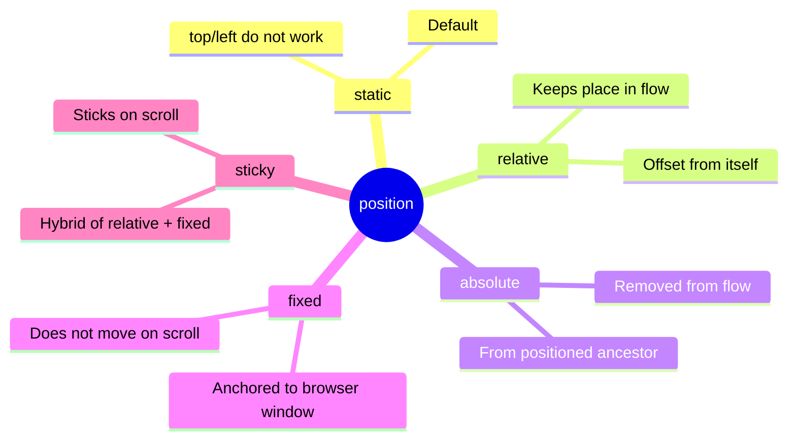
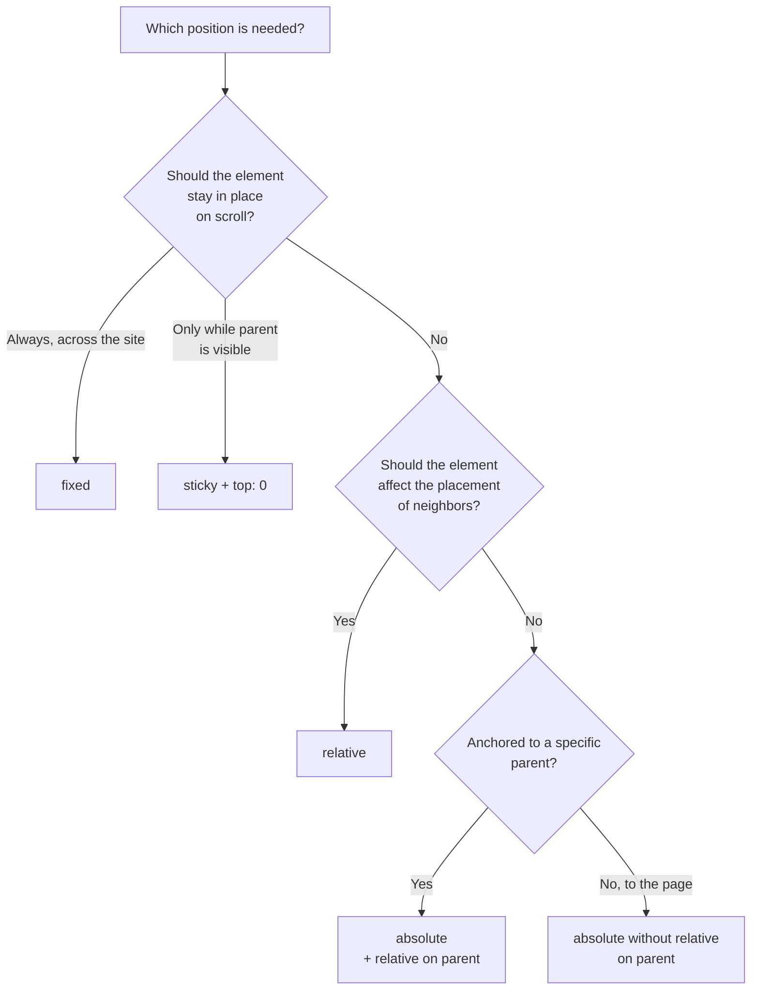

## Element Positioning

> **Connection with the previous lesson:** in the last lesson we covered what every element is made of (box model) and how elements behave in the normal document flow (`block`/`inline`/`inline-block`). Today we learn to **extract** elements from this normal flow and place them exactly where we need them.

---

## Lesson Goal

Learn to control element placement on the page using the `position` property - including "sticky" headers and elements fixed on top of other content.

## What You Will Learn by the End of the Lesson

- Distinguish between five `position` values: `static`, `relative`, `absolute`, `fixed`, `sticky`.
- Control position using `top`/`right`/`bottom`/`left`.
- Understand what the position of an `absolute` element is calculated relative to.
- Use `z-index` to control layer stacking order.
- Build practical patterns: sticky header, fixed button.

---

## Lesson Timeline

|Block|Content|
|---|---|
|1. position: static - the starting point|Default behavior|
|2. position: relative|Shifting "from itself"|
|3. position: absolute|Positioning context - the most important part of the lesson|
|4. Mini-task|Position an element independently|
|5. position: fixed and sticky|Anchoring to the screen and "sticking" on scroll|
|6. z-index|Layer stacking order|
|7. Summary and practice|Sticky header + "back to top" button|


---

## Block 1. `position: static` - the starting point

**In simple terms:** before learning to "extract" elements from their normal positioning, it's important to understand that this normal positioning is the default value of `position` - it's called `static`.

```css
.box {
    position: static;
}
```

`static` is the behavior we observed throughout the last lesson: elements are placed one after another in the normal document order - block elements from top to bottom, inline elements in the text flow. **For `static` elements, the `top`/`right`/`bottom`/`left` properties do not work** - they are completely ignored by the browser.

**All other four `position` values** (`relative`, `absolute`, `fixed`, `sticky`), which we will cover today, to varying degrees **remove the element from the normal flow** or allow shifting it away from its original position - and that is exactly why `top`/`right`/`bottom`/`left` start working for them.



---

## Block 2. `position: relative`

**In simple terms:** `relative` is the "gentlest" type of positioning. The element **stays in its usual place** in the document flow (just like with `static`), but you can **visually shift it** from its original position without affecting the layout of neighboring elements.

```html
<div class="box-one">First block</div>
<div class="box-two">Second block (shifted)</div>
<div class="box-three">Third block</div>
```

```css
.box-two {
    position: relative;
    top: 20px;
    left: 30px;
}
```

Here `.box-two` will visually shift **20px down** and **30px right** from its original position. But the important detail is: **`.box-three` won't "know" about this shift** - it will stay where it would have been if `.box-two` hadn't been moved at all. That means in the space where `.box-two` used to be, there will now be empty space (because the element still **logically** occupies its original place in the flow - it's just visually "drawn" in a different location).

**Analogy:** imagine a student sitting at their desk in a classroom (this is their place "in the flow"), but temporarily leaning to the side to grab something from a neighbor. The desk spot still belongs to them - no one else will sit there - but visually the student is not quite above their own chair right now.

### Direction of the shift: an important detail

- `top: 20px;` shifts the element **down** by 20px (20px away from the top edge).
- `left: 30px;` shifts the element **right** by 30px (30px away from the left edge).

This may seem counterintuitive at first glance ("top - but it shifts down?"), but the logic is actually simple: the value shows **how far** the element's edge has moved **away from the side** specified in the property. `top: 20px` means "move 20px away from the top edge" - and since we're moving away from the top downward, the element visually moves down.

---

### Common Beginner Mistakes

|Mistake|How to Fix|
|---|---|
|Expecting `position: relative` to remove the element from the flow, like `absolute`|`relative` **preserves** the element's place in the flow - only the visual rendering is shifted|
|Confusing the direction of the shift (`top: 20px` is down, not up)|Remember: the value is the offset **from the specified side**, not the direction of movement toward it|
|Using `position: relative` without an actual need for shifting|Remember: `relative` is also often applied not to shift the element itself, but to create a context for `absolute` descendants - we'll cover this in the next block|

---

## Block 3. `position: absolute` - the most important part of the lesson

This is arguably the most important and most confusing topic for beginners in positioning - so we'll cover it in great detail.

**In simple terms:** `absolute` **completely removes** the element from the normal document flow - it stops taking up space among other elements (as if it was never there), and other elements "don't notice" it, closing up as if the absolute element doesn't exist at all. The element itself is then positioned via `top`/`right`/`bottom`/`left` - but not "from itself" as with `relative`, but **relative to the nearest positioned ancestor**.

### Key question: what is `absolute` calculated relative to?

This is the most important (and often most confusing for beginners) part of the topic. The rule is:

**An `absolute` element is positioned relative to the nearest parent whose `position` is **different from `static`** (i.e., `relative`, `absolute`, `fixed`, or `sticky`). If no such parent exists at all, the element is positioned relative to the entire page (`<html>`).**

Let's break this down with a concrete example:

```html
<div class="card">
    <span class="badge">New</span>
    
    <p>Product description</p>
</div>
```

```css
.card {
    position: relative;  /* creates a "context" for the child absolute element */
    width: 300px;
    padding: 20px;
}

.badge {
    position: absolute;
    top: 10px;
    right: 10px;
}
```

Here `.badge` (for example, the "New" label in the corner of a product card) is positioned **relative to `.card`** - because `.card` has `position: relative` and is the nearest ancestor of `.badge` with a position other than `static`. As a result, the label will end up exactly in the top-right corner of the card, with a 10px offset from the top and 10px from the right edge **of that card specifically**, not the entire page.

### What happens if you remove `position: relative` from the parent

```css
.card {
    /* position: relative; - removed */
    width: 300px;
    padding: 20px;
}

.badge {
    position: absolute;
    top: 10px;
    right: 10px;
}
```

Now `.card` has `position: static` again (the default), which means it **doesn't qualify** as a "starting point." The browser will continue traversing up the ancestor tree looking for anyone with a position set - and if no such ancestor is found anywhere above, `.badge` will eventually "stick" to the top-right corner of **the entire page**, not the card - which is almost certainly not what you wanted.

**This is exactly why there is a classic technique** that you will definitely encounter in real projects: `position: relative;` is often added to a parent **with no intention of moving it** (not using `top`/`left` on the parent at all) - the sole purpose of this `relative` is to "create a starting point" for positioning child `absolute` elements.

**Analogy:** imagine you're sticking a sticky note to a specific page of a notebook, not just "somewhere on the desk." If the notebook (parent) is lying on the desk and you say "stick the note in the top-right corner" - by default it's unclear: the corner of what - the page or the entire desk? By setting `position: relative` on the notebook, you explicitly say: "count the corners from this notebook" - then the note will definitely end up in the corner of the right page, not somewhere on the desk.

### Practical examples of using `absolute`

**Label/badge on top of an image:**

```html
<div class="product">
    
    <span class="sale-badge">-20%</span>
</div>
```

```css
.product {
    position: relative;
}

.sale-badge {
    position: absolute;
    top: 10px;
    left: 10px;
    background-color: red;
    color: white;
    padding: 5px 10px;
}
```

**Icon inside a search field:**

```html
<div class="search-wrapper">
    <input type="text" placeholder="Search...">
    <span class="search-icon">🔍</span>
</div>
```

```css
search-wrapper {
    position: relative;
}

.search-icon {
    position: absolute;
    top: 50%;
    right: 10px;
    transform: translateY(-50%);
}
```

_(We don't cover the `transform` property in detail in this lesson - it's used here only for precise vertical centering of the icon; the general syntax can be easily looked up as needed, and we can return to it in more detail in future lessons if necessary.)_



---

### Common Beginner Mistakes

|Mistake|How to Fix|
|---|---|
|Setting `absolute` on a child element without adding `relative` to the parent|Always add `position: relative;` to the appropriate parent - otherwise positioning will be relative to the entire page|
|Not understanding why the element "disappeared" from the normal flow after `absolute`|This is expected behavior - `absolute` completely removes the element from the flow; neighboring elements close up as if it wasn't there|
|Confusing `absolute` with `fixed` (next block)|`absolute` is anchored to a positioned parent and moves with the page on scroll; `fixed` is anchored to the browser window - we'll cover this next|

---

## Block 4. Mini-Task

On your own, without looking at references, place a small close button (`<button class="close">×</button>`) in the top-right corner of a `<div class="modal">` card using the `relative`/`absolute` combination.

**Solution:**

```css
.modal {
    position: relative;
    padding: 20px;
}

.close {
    position: absolute;
    top: 10px;
    right: 10px;
}
```

---

## Block 5. `position: fixed` and `position: sticky`

### `position: fixed` - anchored to the browser window

**In simple terms:** `fixed` works similarly to `absolute` (it also completely removes the element from the document flow), but its starting point is not the nearest positioned parent, but **the entire browser window**. This means that an element with `fixed` **stays in the same spot on the screen even when the page is scrolled** - as if it's glued directly to the monitor's glass rather than to the page itself.

```css
.back-to-top {
    position: fixed;
    bottom: 20px;
    right: 20px;
}
```

A classic example is the "back to top" button in the bottom-right corner of the screen that stays visible no matter how far you scroll down a long page. Modal windows (popup dialogs that overlay all other content) also typically use `fixed`.

**Analogy:** `absolute` is a sticky note attached to a specific page of a notebook (flip the notebook - the note "travels" with the page). `fixed` is a sticky note glued directly to the computer monitor on which you're reading that notebook electronically - no matter how much you scroll the text, the note stays in the same spot on the screen.

### `position: sticky` - a hybrid of `relative` and `fixed`

**In simple terms:** `sticky` behaves like `relative` **up to a certain point**, and then, once a given scroll threshold is reached, it "sticks" and behaves like `fixed` - but only within its parent container.

```css
.site-header {
    position: sticky;
    top: 0;
}
```

Here `top: 0;` sets the condition: "as long as the page hasn't scrolled enough for the top edge of the header to reach the top of the screen - behave normally (like `relative`/`static`). As soon as the top edge of the header reaches the top of the screen - fix yourself there (like `fixed`) and remain visible on further scrolling."

**Practical example: a "sticky" website header** - during normal scrolling, the header first scrolls with the page as usual, but once it reaches the top of the screen, it "sticks" there and remains visible on top of the rest of the content as the page continues to scroll.

**An important limitation of `sticky` that beginners often stumble on:** the element will only "stick" within its **parent container** - as soon as the parent itself scrolls out of view (its bottom edge reaches the top of the screen), the `sticky` element will "unstick" and move off-screen along with the parent, rather than staying on screen forever (this is the key difference from `fixed`, which stays forever, until the end of the page). Also, `sticky` won't work if the parent element has `overflow: hidden` or similar properties that constrain the scrollable area - this is a subtlety worth being aware of in case "sticking" suddenly doesn't work in practice.

### Comparative table of all five `position` values

|Value|Stays in flow?|Starting point for top/left|Behavior on scroll|
|---|---|---|---|
|`static`|Yes|Not applicable (`top`/`left` don't work)|Moves with the page as usual|
|`relative`|Yes (place is preserved)|From its own original position|Moves with the page|
|`absolute`|No|Nearest positioned ancestor (or `<html>`)|Moves with the page (unless ancestor is fixed)|
|`fixed`|No|Browser window|Stays in the same screen position always|
|`sticky`|Yes, until it "sticks"|Parent container + condition (`top`/`bottom`)|Behaves like relative, then like fixed, within the parent|

---

### Common Beginner Mistakes

|Mistake|How to Fix|
|---|---|
|Using `fixed` when they actually want `sticky` behavior (e.g., a header that should stick only within a certain section, not forever across the site)|Check whether the element should stay visible for **the entire rest of the page** (`fixed`) or only while its parent section is visible (`sticky`)|
|Forgetting that `sticky` requires an explicit `top`/`bottom` (e.g., `top: 0;`) - without it the property simply won't work|Always specify `top`, `bottom`, or a similar value along with `position: sticky;`|
|Not checking whether `overflow: hidden` on a parent is preventing `sticky` from working|If `sticky` "doesn't stick," check the parent containers' CSS for `overflow` properties|

---

## Block 6. `z-index` - layer stacking order

When several positioned elements (with `position` other than `static`) visually **overlap** each other, the question arises: which one will end up "on top" and which one "underneath"? This is exactly what the `z-index` property solves.

**In simple terms:** imagine a stack of transparent sheets of paper lying on top of each other. `z-index` is the number that determines the order of this stack: a sheet with a higher number lies **above** (visually overlaps) a sheet with a lower number.

```html
<div class="layer-one">Layer 1</div>
<div class="layer-two">Layer 2</div>
```

```css
.layer-one {
    position: absolute;
    top: 0;
    left: 0;
    z-index: 1;
}

.layer-two {
    position: absolute;
    top: 20px;
    left: 20px;
    z-index: 2;
}
```

Here `.layer-two` will appear **visually on top of** `.layer-one` because its `z-index` (2) is greater than that of `.layer-one` (1) - regardless of which one comes first or later in the HTML code.

**Important limitation:** `z-index` works **only on positioned elements** - that is, elements whose `position` is set to `relative`, `absolute`, `fixed`, or `sticky`. For elements with `position: static` (the default), `z-index` **has no effect**, even if you specify it.

### Practical example: a modal window on top of other content

```css
.modal-overlay {
    position: fixed;
    top: 0;
    left: 0;
    width: 100%;
    height: 100%;
    background-color: rgba(0, 0, 0, 0.5);
    z-index: 100;
}

.site-header {
    position: sticky;
    top: 0;
    z-index: 10;
}
```

Here `.modal-overlay` (the darkened background of the modal window) with `z-index: 100` will be **above** `.site-header` with `z-index: 10` - meaning even the "sticky" site header will be hidden under the overlay when the modal window is open, which is typically the expected behavior.

**Practical recommendation:** in real projects, it's common to use z-index not chaotically (1, 2, 3...) but with a large "margin" between semantic levels (for example, regular content - no z-index at all, header - `z-index: 10`, dropdown menus - `z-index: 50`, modal windows - `z-index: 100`, pop-up notifications - `z-index: 1000`) - this leaves room for adding new intermediate layers in the future without rewriting existing values.

---

### Common Beginner Mistakes

|Mistake|How to Fix|
|---|---|
|Setting `z-index` on an element with `position: static` and not understanding why it doesn't work|`z-index` only affects positioned elements - first set `position: relative` (or something other than static)|
|Using chaotic close z-index values (1, 2, 3, 4...) throughout the project|Use values with a "margin" (10, 50, 100, 1000) for different semantic levels - it's easier to add new layers between them later|
|Not understanding why an element with a higher `z-index` still ended up "under" another|Check: the elements might be in different "stacking contexts" - this is a more advanced topic, but for most cases in this course, understanding the basic rule "higher z-index = higher in the stack" will be sufficient|

---

## Lesson Summary

Today you learned:

- `position: static` - default behavior, `top`/`left` don't work.
- `position: relative` - the element stays in the flow, you can visually shift it "from itself"; often used to create a starting point for child `absolute` elements.
- `position: absolute` - the element is completely removed from the flow, positioned relative to the nearest positioned ancestor (or the entire page if no such ancestor exists).
- `position: fixed` - the element is anchored to the browser window, stays in place regardless of scrolling.
- `position: sticky` - a hybrid: behaves normally until it "hits" a given scroll threshold, then "sticks" within its parent.
- `z-index` determines the layer stacking order, but only works on elements with a position other than `static`.

---

## Practice (in class)

Build two classic patterns based on your own HTML project:

1. **Sticky site header:**

```css
.site-header {
    position: sticky;
    top: 0;
    background-color: white;
    z-index: 10;
}
```

Check that when scrolling a long page, the header "sticks" to the top and remains visible.

2. **Label/badge on top of an image** (for example, "New" on a project card from your portfolio) - using the combination of `relative` (parent) + `absolute` (child element).

---

## Homework

1. Add a "back to top" button with `position: fixed` to your site, placed in the bottom-right corner of the screen, visible when scrolling a long page (you can make it an anchor link to `#top`, recalling lesson 3 of the HTML course).
2. Find a card on your projects page (`projects.html`) and add a "Featured" label or similar to one of them using `position: absolute` relative to the card with `position: relative`.
3. Apply `position: sticky` to your header and verify that it "sticks" when scrolling.
4. **Research task:** open DevTools on any major website with a "sticky" header (for example, a news site or marketplace) and find in the header's CSS styles what `position` value is used - `sticky` or `fixed`? Check whether the header unsticks when scrolling to the end of the page (this will tell you which value was used).

---

[Next lesson: Flexbox Basics →](Lesson-5/en/Flexbox%20Basics.md)
