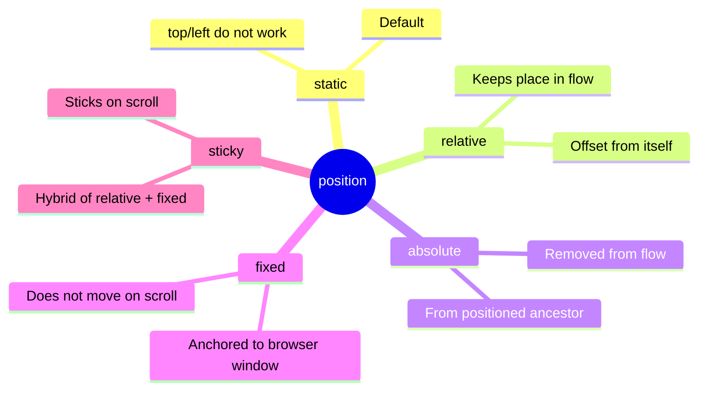
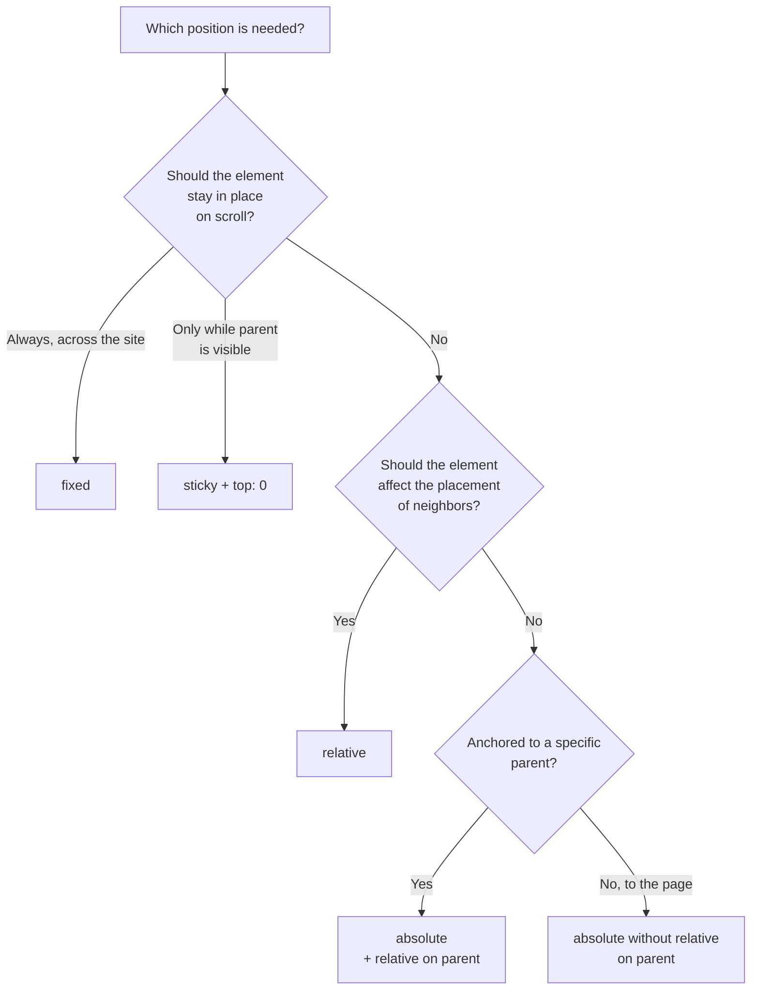

## Позиционирование элементов

> **Связь с предыдущим уроком:** на прошлом уроке мы разобрали, из чего состоит каждый элемент (box model) и как элементы ведут себя в обычном потоке страницы (`block`/`inline`/`inline-block`). Сегодня учимся **вынимать** элементы из этого обычного потока и располагать их именно там, где нужно нам.

---

## Цель урока

Научиться управлять расположением элементов на странице через свойство `position` - включая "прилипающие" шапки и элементы, зафиксированные поверх остального контента.

## Чему вы научитесь к концу урока

- Различать пять значений `position`: `static`, `relative`, `absolute`, `fixed`, `sticky`.
- Управлять положением через `top`/`right`/`bottom`/`left`.
- Понимать, относительно чего вычисляется положение `absolute`-элемента.
- Использовать `z-index` для управления порядком наложения слоёв.
- Собирать практические паттерны: прилипающая шапка, зафиксированная кнопка.

---

## Хронометраж урока

|Блок|Содержание|
|---|---|
|1. position: static - точка отсчёта|Поведение по умолчанию|
|2. position: relative|Сдвиг "от себя самого"|
|3. position: absolute|Контекст позиционирования - самая важная часть урока|
|4. Мини-задание|Позиционировать элемент самостоятельно|
|5. position: fixed и sticky|Фиксация на экране и "прилипание" при прокрутке|
|6. z-index|Порядок наложения слоёв|
|7. Итоги и практика|Прилипающая шапка + кнопка "наверх"|


---

## Блок 1. `position: static` - точка отсчёта

**Простыми словами:** прежде чем учиться "вынимать" элементы из обычного расположения, важно понять, что это расположение и есть значение `position` по умолчанию - оно называется `static`.

```css
.box {
    position: static;
}
```

`static` - это то поведение, которое мы уже наблюдали весь прошлый урок: элементы располагаются друг за другом в обычном порядке документа, блочные - сверху вниз, строчные - в потоке текста. **У `static`-элементов не работают** свойства `top`/`right`/`bottom`/`left` - они полностью игнорируются браузером.

**Все остальные четыре значения `position`** (`relative`, `absolute`, `fixed`, `sticky`), которые мы разберём сегодня, в той или иной степени **выводят элемент из обычного потока** или позволяют сдвинуть его в сторону от изначального места - и именно поэтому у них уже начинают работать `top`/`right`/`bottom`/`left`.



---

## Блок 2. `position: relative`

**Простыми словами:** `relative` - самый "мягкий" вид позиционирования. Элемент **остаётся на своём обычном месте** в потоке документа (как при `static`), но вы можете **визуально сдвинуть его** относительно этого исходного места, не влияя на расположение соседних элементов.

```html
<div class="box-one">Первый блок</div>
<div class="box-two">Второй блок (сдвинутый)</div>
<div class="box-three">Третий блок</div>
```

```css
.box-two {
    position: relative;
    top: 20px;
    left: 30px;
}
```

Здесь `.box-two` визуально сдвинется на **20px вниз** и **30px вправо** от своего исходного места. Но важная деталь: **`.box-three` не "узнает" об этом сдвиге** - он останется там, где был бы, если бы `.box-two` вообще не двигали. То есть на месте, где раньше было `.box-two`, теперь просто останется пустое пространство (потому что элемент по-прежнему **логически** занимает своё исходное место в потоке - просто визуально "нарисован" в другом месте).

**Аналогия:** представьте студента, который сидит за своей партой в классе (это его место "в потоке"), но временно наклонился в сторону, чтобы взять что-то у соседа. Место за партой всё ещё числится за ним - никто другой туда не сядет - но визуально сейчас студент находится не совсем над своим стулом.

### Направление сдвига: важная деталь

- `top: 20px;` - сдвигает элемент **вниз** на 20px (от верхнего края на 20px).
- `left: 30px;` - сдвигает элемент **вправо** на 30px (от левого края на 30px).

Это может показаться нелогичным на первый взгляд ("top - а сдвигает вниз?"), но на самом деле логика простая: значение показывает, **насколько далеко** сдвинут край элемента **от той стороны**, которая указана в свойстве. `top: 20px` означает «отступи 20px от верхней границы» - а раз мы отступаем от верха вниз, элемент визуально опускается.

---

### Частые ошибки новичков

|Ошибка|Как исправить|
|---|---|
|Ожидают, что `position: relative` вынет элемент из потока, как `absolute`|`relative` **сохраняет** место элемента в потоке - сдвигается только визуальное отображение|
|Путают направление сдвига (`top: 20px` - это вниз, а не вверх)|Помните: значение - это отступ **от указанной стороны**, а не направление движения к ней|
|Используют `position: relative` без реальной необходимости в сдвиге|Помните: `relative` также часто применяется не ради сдвига самого элемента, а чтобы создать контекст для `absolute`-потомков - разберём в следующем блоке|

---

## Блок 3. `position: absolute` - самая важная часть урока

Это, пожалуй, самое важное и самое частое затруднение новичков в теме позиционирования - поэтому разберём его особенно подробно.

**Простыми словами:** `absolute` **полностью вынимает** элемент из обычного потока документа - он перестаёт занимать место среди других элементов (как будто его там никогда не было), и остальные элементы "не замечают" его, смыкаясь так, будто absolute-элемента вообще не существует. Сам же элемент позиционируется через `top`/`right`/`bottom`/`left` - но не "от себя", как при `relative`, а **относительно ближайшего предка с позиционированием**.

### Ключевой вопрос: относительно чего считается `absolute`?

Вот это и есть самая важная (и часто самая запутывающая новичков) часть темы. Правило звучит так:

**`absolute`-элемент позиционируется относительно ближайшего родителя, у которого `position` **отличается** от `static` (то есть `relative`, `absolute`, `fixed` или `sticky`). Если такого родителя нет вообще - элемент позиционируется относительно всей страницы (`<html>`).**

Разберём на конкретном примере:

```html
<div class="card">
    <span class="badge">Новинка</span>
    
    <p>Описание товара</p>
</div>
```

```css
.card {
    position: relative;  /* создаём "контекст" для дочернего absolute-элемента */
    width: 300px;
    padding: 20px;
}

.badge {
    position: absolute;
    top: 10px;
    right: 10px;
}
```

Здесь `.badge` (например, плашка "Новинка" в углу карточки товара) позиционируется **относительно `.card`** - потому что `.card` имеет `position: relative`, и является ближайшим предком `.badge` с позиционированием, отличным от `static`. В результате плашка окажется ровно в правом верхнем углу карточки, с отступом 10px от верха и 10px от правого края **именно этой карточки**, а не всей страницы.

### Что случится, если убрать `position: relative` у родителя

```css
.card {
    /* position: relative; - убрали */
    width: 300px;
    padding: 20px;
}

.badge {
    position: absolute;
    top: 10px;
    right: 10px;
}
```

Теперь у `.card` снова `position: static` (по умолчанию) - а значит, он **не подходит** в качестве "точки отсчёта". Браузер продолжит подниматься вверх по дереву предков в поисках хоть кого-то с позиционированием - и если нигде выше такого предка тоже нет, `.badge` в итоге "прилипнет" в правый верхний угол **всей страницы целиком**, а не карточки - что почти наверняка не то, что вы хотели.

**Именно поэтому существует классический приём**, который вы обязательно встретите в реальных проектах: `position: relative;` часто добавляют родителю **без всякого намерения его двигать** (не используя `top`/`left` у самого родителя вообще) - единственная цель такого `relative` - «создать точку отсчёта» для позиционирования дочерних `absolute`-элементов.

**Аналогия:** представьте, что вы вешаете стикер-заметку на конкретную страницу тетради, а не куда-то "вообще на стол". Если тетрадь (родитель) лежит на столе, и вы говорите «приклей стикер в правый верхний угол» - по умолчанию непонятно, угол чего: страницы или всего стола. Указав `position: relative` у тетради, вы явно говорите: «отсчитывай углы именно от этой тетради» - тогда стикер точно окажется в углу нужной страницы, а не где-то на столе.

### Практические примеры использования `absolute`

**Плашка/бейдж поверх изображения:**

```html
<div class="product">
    
    <span class="sale-badge">-20%</span>
</div>
```

```css
.product {
    position: relative;
}

.sale-badge {
    position: absolute;
    top: 10px;
    left: 10px;
    background-color: red;
    color: white;
    padding: 5px 10px;
}
```

**Иконка внутри поля поиска:**

```html
<div class="search-wrapper">
    <input type="text" placeholder="Поиск...">
    <span class="search-icon">🔍</span>
</div>
```

```css
.search-wrapper {
    position: relative;
}

.search-icon {
    position: absolute;
    top: 50%;
    right: 10px;
    transform: translateY(-50%);
}
```

_(Свойство `transform` мы подробно не разбираем в этом уроке - здесь оно использовано только для точного вертикального центрирования иконки; общий синтаксис легко находится по мере надобности, и мы можем вернуться к нему подробнее в будущих уроках при необходимости.)_



---

### Частые ошибки новичков

|Ошибка|Как исправить|
|---|---|
|Ставят `absolute` дочернему элементу, забыв про `relative` у родителя|Всегда добавляйте `position: relative;` нужному родителю - иначе позиционирование "уедет" относительно всей страницы|
|Не понимают, почему элемент "исчез" из обычного потока после `absolute`|Это ожидаемое поведение - `absolute` полностью вынимает элемент из потока; соседние элементы смыкаются, будто его не было|
|Путают `absolute` с `fixed` (следующий блок)|`absolute` привязан к позиционированному родителю и двигается вместе со страницей при прокрутке; `fixed` - привязан к окну браузера, разберём далее|

---

## Блок 4. Мини-задание

Самостоятельно, без подглядывания, разместите маленький крестик-кнопку закрытия (`<button class="close">×</button>`) в правом верхнем углу карточки `<div class="modal">`, используя связку `relative`/`absolute`.

**Решение:**

```css
.modal {
    position: relative;
    padding: 20px;
}

.close {
    position: absolute;
    top: 10px;
    right: 10px;
}
```

---

## Блок 5. `position: fixed` и `position: sticky`

### `position: fixed` - фиксация относительно окна браузера

**Простыми словами:** `fixed` работает похоже на `absolute` (тоже полностью выходит из потока документа), но точка отсчёта для него - не ближайший позиционированный родитель, а **окно браузера целиком**. Это означает, что элемент с `fixed` **остаётся на одном и том же месте экрана даже при прокрутке страницы** - как будто приклеен прямо к стеклу монитора, а не к самой странице.

```css
.back-to-top {
    position: fixed;
    bottom: 20px;
    right: 20px;
}
```

Классический пример - кнопка "наверх" в правом нижнем углу экрана, которая остаётся видимой, сколько бы вы ни прокручивали длинную страницу вниз. Модальные окна (всплывающие диалоги, которые перекрывают весь остальной контент) тоже обычно используют `fixed`.

**Аналогия:** `absolute` - это стикер, приклеенный к конкретной странице тетради (пролистываете тетрадь - стикер "уезжает" вместе со страницей). `fixed` - это стикер, приклеенный прямо к монитору компьютера, на котором вы читаете эту тетрадь в электронном виде - сколько бы вы ни прокручивали текст внутри, стикер остаётся на том же самом месте экрана.

### `position: sticky` - гибрид `relative` и `fixed`

**Простыми словами:** `sticky` ведёт себя как `relative` **до определённого момента**, а затем, при достижении заданного порога прокрутки, "прилипает" и ведёт себя как `fixed` - но только в пределах своего родительского контейнера.

```css
.site-header {
    position: sticky;
    top: 0;
}
```

Здесь `top: 0;` задаёт условие: «пока страница не прокручена настолько, что верхний край шапки достиг бы верха экрана - веди себя обычно (как `relative`/`static`). Как только верхний край шапки "упирается" в верх экрана - зафиксируйся там (как `fixed`) и оставайся видимой при дальнейшей прокрутке».

**Практический пример: "прилипающая" шапка сайта** - при обычной прокрутке шапка сначала прокручивается вместе со страницей как обычно, но как только достигает верха экрана - "прилипает" там и остаётся видимой поверх остального контента, пока страница продолжает прокручиваться.

**Важное ограничение `sticky`, о которое часто "спотыкаются" новички:** элемент "прилипнет" только в пределах своего **родительского контейнера** - как только сам родитель прокрутится до конца (его нижний край достигнет верха экрана), `sticky`-элемент "отклеится" и уйдёт вместе с родителем дальше, а не останется навечно на экране (в этом ключевое отличие от `fixed`, который остаётся всегда, до конца страницы). Также `sticky` не сработает, если у родительского элемента задано `overflow: hidden` или похожие свойства, ограничивающие область прокрутки - это тонкость, с которой полезно быть знакомым, если "прилипание" внезапно не срабатывает на практике.

### Сравнительная таблица всех пяти значений `position`

|Значение|Остаётся в потоке?|Точка отсчёта для top/left|Поведение при прокрутке|
|---|---|---|---|
|`static`|Да|Не применимо (`top`/`left` не работают)|Двигается вместе со страницей как обычно|
|`relative`|Да (место сохраняется)|От собственного исходного места|Двигается вместе со страницей|
|`absolute`|Нет|Ближайший позиционированный предок (или `<html>`)|Двигается вместе со страницей (если предок не fixed)|
|`fixed`|Нет|Окно браузера|Остаётся на месте экрана всегда|
|`sticky`|Да, до момента "прилипания"|Родительский контейнер + условие (`top`/`bottom`)|Ведёт себя как relative, потом как fixed, в пределах родителя|

---

### Частые ошибки новичков

|Ошибка|Как исправить|
|---|---|
|Используют `fixed`, когда на самом деле хотели поведение `sticky` (например, шапка должна прилипать только в пределах определённого блока, а не на весь сайт навсегда)|Проверьте, действительно ли элемент должен оставаться видимым **весь** остаток страницы (`fixed`), или только пока виден его родительский блок (`sticky`)|
|Забывают, что `sticky` требует явного `top`/`bottom` (например, `top: 0;`) - без этого свойство просто не сработает|Всегда указывайте `top`, `bottom` или похожее значение вместе с `position: sticky;`|
|Не проверяют, не мешает ли `overflow: hidden` у родителя работе `sticky`|Если `sticky` "не прилипает", проверьте CSS-свойства родительских контейнеров на предмет `overflow`|

---

## Блок 6. `z-index` - порядок наложения слоёв

Когда несколько позиционированных элементов (с `position`, отличным от `static`) визуально **перекрывают** друг друга, возникает вопрос: какой из них окажется "сверху", а какой "под ним"? Это и решает свойство `z-index`.

**Простыми словами:** представьте стопку прозрачных листов бумаги, лежащих друг на друге. `z-index` - это номер, который определяет порядок этой стопки: лист с бо́льшим номером лежит **выше** (визуально перекрывает) лист с меньшим номером.

```html
<div class="layer-one">Слой 1</div>
<div class="layer-two">Слой 2</div>
```

```css
.layer-one {
    position: absolute;
    top: 0;
    left: 0;
    z-index: 1;
}

.layer-two {
    position: absolute;
    top: 20px;
    left: 20px;
    z-index: 2;
}
```

Здесь `.layer-two` окажется **визуально поверх** `.layer-one`, потому что его `z-index` (2) больше, чем у `.layer-one` (1) - независимо от того, какой из них написан раньше или позже в HTML-коде.

**Важное ограничение:** `z-index` работает **только у позиционированных элементов** - то есть у элементов, где `position` уже задан как `relative`, `absolute`, `fixed` или `sticky`. У элементов с `position: static` (по умолчанию) `z-index` **не оказывает никакого эффекта**, даже если вы его укажете.

### Практический пример: модальное окно поверх остального контента

```css
.modal-overlay {
    position: fixed;
    top: 0;
    left: 0;
    width: 100%;
    height: 100%;
    background-color: rgba(0, 0, 0, 0.5);
    z-index: 100;
}

.site-header {
    position: sticky;
    top: 0;
    z-index: 10;
}
```

Здесь `.modal-overlay` (затемнённый фон модального окна) с `z-index: 100` окажется **выше**, чем `.site-header` с `z-index: 10` - то есть даже "прилипающая" шапка сайта окажется скрыта под затемнением, когда открыто модальное окно, что обычно и является ожидаемым поведением.

**Практическая рекомендация:** в реальных проектах принято использовать z-index не хаотично (1, 2, 3...), а с большим "запасом" между смысловыми уровнями (например, обычный контент - без z-index вообще, шапка - `z-index: 10`, выпадающие меню - `z-index: 50`, модальные окна - `z-index: 100`, всплывающие уведомления - `z-index: 1000`) - это оставляет пространство для добавления новых промежуточных слоёв в будущем, не переписывая уже существующие значения.

---

### Частые ошибки новичков

|Ошибка|Как исправить|
|---|---|
|Задают `z-index` элементу с `position: static`, не понимая, почему это не работает|`z-index` действует только на позиционированные элементы - сначала задайте `position: relative` (или другое, отличное от static)|
|Используют хаотичные близкие значения `z-index` (1, 2, 3, 4...) по всему проекту|Используйте значения "с запасом" (10, 50, 100, 1000) для разных смысловых уровней - легче добавлять новые слои между ними позже|
|Не понимают, почему элемент с большим `z-index` всё равно оказался "под" другим|Проверьте: возможно, элементы находятся в разных "контекстах наложения" - это более продвинутая тема, но для большинства учебных случаев на этом курсе будет достаточно понимания базового правила "больше z-index - выше в стопке"|

---

## Итоги урока

Сегодня вы узнали:

- `position: static` - поведение по умолчанию, `top`/`left` не работают.
- `position: relative` - элемент остаётся в потоке, можно визуально сдвинуть "от самого себя"; часто используется, чтобы создать точку отсчёта для дочерних `absolute`-элементов.
- `position: absolute` - элемент полностью выходит из потока, позиционируется относительно ближайшего позиционированного предка (или всей страницы, если такого предка нет).
- `position: fixed` - элемент зафиксирован относительно окна браузера, остаётся на месте при любой прокрутке.
- `position: sticky` - гибрид: ведёт себя обычно, пока не "упрётся" в заданный порог прокрутки, затем "прилипает" в пределах своего родителя.
- `z-index` определяет порядок наложения слоёв, но работает только у элементов с позиционированием, отличным от `static`.

---

## Практика (на занятии)

Соберите два классических паттерна на основе своего HTML-проекта:

1. **Прилипающая шапка сайта:**

```css
.site-header {
    position: sticky;
    top: 0;
    background-color: white;
    z-index: 10;
}
```

Проверьте, что при прокрутке длинной страницы шапка "прилипает" к верху и остаётся видимой.

2. **Плашка/бейдж поверх изображения** (например, "Новое" на карточке проекта из вашего портфолио) - с использованием связки `relative` (родитель) + `absolute` (дочерний элемент).

---

## Домашнее задание

1. Добавьте на свой сайт "кнопку наверх" с `position: fixed`, расположенную в правом нижнем углу экрана, видимую при прокрутке длинной страницы (можно сделать её якорной ссылкой на `#top`, вспомнив урок 3 курса HTML).
2. Найдите на своей странице проектов (`projects.html`) карточку и добавьте к одной из них плашку "Избранное" или похожую, используя `position: absolute` относительно карточки с `position: relative`.
3. Присвойте своей шапке `position: sticky` и убедитесь, что она "прилипает" при прокрутке.
4. **Исследовательское задание:** откройте DevTools на любом крупном сайте с "прилипающей" шапкой (например, новостной сайт или маркетплейс) и найдите в CSS-стилях этой шапки, какое значение `position` используется - `sticky` или `fixed`? Проверьте, отклеивается ли шапка при прокрутке до конца страницы (это подскажет, какое значение использовано).

---

[Следующий урок: Flexbox — основы →](../5/ru/Flexbox%20—%20основы.md)
