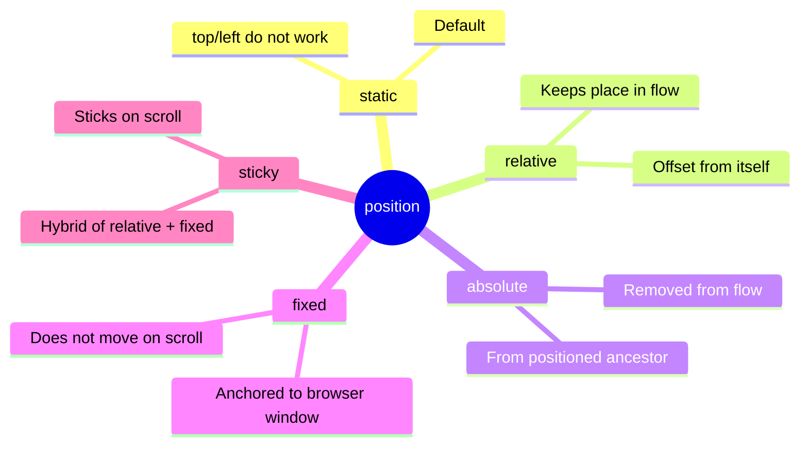
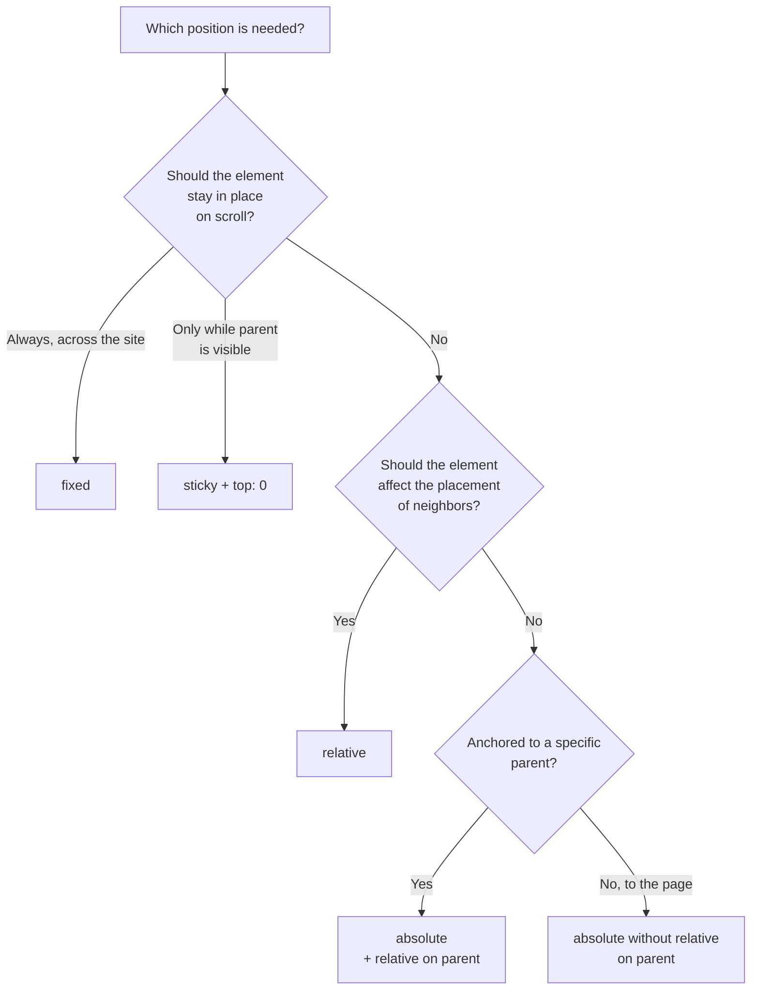

## Elementlarni joylashtirish

> **Oldingi dars bilan bog'liqlik:** o'tgan darsda biz har bir element nimalardan tashkil topganini (box model) va elementlar sahifaning oddiy oqimida qanday xulq-atvor ko'rsatishini ko'rib chiqdik (`block`/`inline`/`inline-block`). Bugun elementlarni ushbu oddiy oqimdan **chiqarishni** va ularni aynan kerakli joyga joylashtirishni o'rganamiz.

---

## Darsning maqsadi

Sahifada elementlarning joylashuvini `position` xossasi orqali boshqarishni o'rganish - "yopishqoq" sarlavhalar va qolgan kontent ustiga joylashtirilgan elementlarni ham qamrab oladi.

## Dars oxiriga qadar nimani o'rganasiz

- `position` ning besh qiymatini farqlash: `static`, `relative`, `absolute`, `fixed`, `sticky`.
- Joylashuvni `top`/`right`/`bottom`/`left` orqali boshqarish.
- `absolute` elementning joylashuvi nisbatan qaysi narsaga hisoblanishini tushunish.
- Qatlamlar qoplanish tartibini boshqarish uchun `z-index` dan foydalanish.
- Amaliy naqunalarni yig'ish: yopishqoq sarlavha, qadalgan tugma.

---

## Darsning vaqt jadvali

|Blok|Mazmun|
|---|---|
|1. position: static - hisob boshlanishi|Standart xulq-atvor|
|2. position: relative|"O'zidan o'zini" siljitish|
|3. position: absolute|Joylashuv konteksti - darsning eng muhim qismi|
|4. Mini-vazifa|Elementni mustaqil ravishda joylashtirish|
|5. position: fixed va sticky|Ekranga qadash va aylanish paytida "yopishish"|
|6. z-index|Qatlamlar qoplanish tartibi|
|7. Xulosalar va amaliyot|Yopishqoq sarlavha + "tezga" tugmasi|


---

## 1-Blok. `position: static` - hisob boshlanishi

**Oddiy qilib aytganda:** elementlarni oddiy joylashuvdan "chiqarishni" o'rganishdan oldin, ushbu joylashuvning o'zi `position` ning standart qiymati ekanini tushunish muhim - u `static` deb ataladi.

```css
.box {
    position: static;
}
```

`static` - bu xulq-atvorni biz o'tgan dars davomida kuzatdik: elementlar hujjatning oddiy tartibida biridan keyin biri joylashadi, blok elementlar yuqoridan pastga, qator elementlar matn oqimida. **`static` elementlarda `top`/`right`/`bottom`/`left` xossalari ishlamaydi** - ular brauzer to'liq e'tiborga olmaydi.

**`position` ning boshqa to'rtta qiymati** (`relative`, `absolute`, `fixed`, `sticky`), bugun ko'rib chiqadiganlarimiz, ma'lum darajada **elementni oddiy oqimdan chiqaradi** yoki uni asl joyidan siljitishga imkon beradi - va shuning uchun ular da `top`/`right`/`bottom`/`left` ishlay boshlaydi.



---

## 2-Blok. `position: relative`

**Oddiy qilib aytganda:** `relative` - eng "yumshoq" joylashuv turi. Element hujjat oqimidagi **o'zining oddiy joyida qoladi** (`static` dagidek), lekin siz uni asl joyidan **vizual siljitishingiz** mumkin, yaqin atrofdagi elementlarning joylashuviga ta'sir qilmagan holda.

```html
<div class="box-one">Birinchi blok</div>
<div class="box-two">Ikkinchi blok (siljitilgan)</div>
<div class="box-three">Uchinchi blok</div>
```

```css
.box-two {
    position: relative;
    top: 20px;
    left: 30px;
}
```

Bu yerda `.box-two` vizual ravishda o'zining asl joyidan **20px pastga** va **30px o'ngga** siljiydi. Lekin muhim tafsilot: **`.box-three` bu siljishdan "xabar olmaydi"** - u o'z joyida qoladi, agar `.box-two` umuman siljitilmagan bo'lgan bo'lsa. Ya'ni, oldin `.box-two` bo'lgan joyda endi bo'sh joy qoladi (chunki element hali ham **mantiqan** o'zining asl joyini egallaydi - faqat vizual ravishda boshqa joyda "chizilgan").

**Analogiya:** sinfdagi o'z o'rnida o'tirib turgan talabani tasavvur qiling (bu uning "oqimdagi" o'rni), lekin u vaqtincha qo'shnisidan bir narsa olish uchun yon tomga qiyaladi. O'rn o'sha talabaniki bo'lib qoladi - boshqa hech kim o'sha yerga o'tirmaydi - lekin vizual ravishda talaba hozir o'zining kursi ustida emas.

### Siljish yo'nalishi: muhim tafsilot

- `top: 20px;` - elementni **pastga** 20px siljitadi (yuqori qirradan 20px pastga).
- `left: 30px;` - elementni **o'ngga** 30px siljitadi (chap qirradan 30px o'ngga).

Birinchi qaraganda mantiqsiz ko'rinishi mumkin ("top - lekin pastga siljitadi?"), lekin aslida mantiq oddiy: qiymat elementning qirrasi qaysi tomondan **necha uzoqlikda** siljishini ko'rsatadi. `top: 20px` degani "yuqori chegaradan 20px uzoqlash" - va biz yuqoridan pastga uzoqlashganimiz uchun, element vizual ravishda tushadi.

---

### Yangi boshlovchilarning tez-tez uchraydigan xatolari

|Xato|Qanday tuzatish|
|---|---|
|`position: relative` elementni oqimdan chiqaradi, degan fikrda, `absolute` kabi|`relative` elementning o'rnini oqimda **saqlab qoladi** - faqat vizual ko'rinish siljyapti|
|Siljish yo'nalishini adashtirish (`top: 20px` - bu pastga, yuqoriga emas)|Eslab qo'ying: qiymat - bu **ko'rsatilgan tomondan** orqaga qaytish, unga qarab harakatlanish yo'nalishi emas|
|Haqiqiy zarurat bo'lmasdan `position: relative` dan foydalanish|Eslab qo'ying: `relative` ko'pincha elementning o'zini siljitish uchun emas, balki `absolute` avlodlari uchun kontekst yaratish uchun qo'llaniladi - keyingi blokda ko'rib chiqamiz|

---

## 3-Blok. `position: absolute` - darsning eng muhim qismi

Bu, ehtimol, joylashuv mavzusidagi yangi boshlovchilar uchun eng muhim va eng ko'p uchraydigan qiyinchilik - shuning uchun uni alohida batafsil ko'rib chiqamiz.

**Oddiy qilib aytganda:** `absolute` elementni hujjatning oddiy oqimidan **to'liq chiqaradi** - u boshqa elementlar orasida o'rnini egallashni to'xtatadi (hech qachon u yerda bo'lmagandek), va boshqa elementlar uni "sezmaydi", absolute element yo'qday yopishadi. Elementning o'zi esa `top`/`right`/`bottom`/`left` orqali joylashtiriladi - lekin `relative` dagidek "o'zidan" emas, balki **eng yaqin ajdodiga nisbatan**.

### Asosiy savol: `absolute` nisbatan qaysi narsaga hisoblanadi?

Bu mavzuning eng muhim (va ko'pincha yangi boshlovchilarni eng ko'p chalg'itadigan) qismi. Qoida shunday:

**`absolute` element o'zining eng yaqin ota-onasiga nisbatan joylashtiriladi, uning `position` `static` dan **farqli** (`relative`, `absolute`, `fixed` yoki `sticky`). Agar bunday ota-onaning umuman bo'lmasa - element butun sahifaga nisbatan (`<html>`) joylashtiriladi.**

Aniq misolda ko'rib chiqamiz:

```html
<div class="card">
    <span class="badge">Yangi</span>
    
    <p>Mahsulot tavsifi</p>
```

```css
.card {
    position: relative;  /* bolalar absolute element uchun "kontekst" yaratamiz */
    width: 300px;
    padding: 20px;
}

.badge {
    position: absolute;
    top: 10px;
    right: 10px;
}
```

Bu yerda `.badge` (masalan, mahsulot kartochkasining burchagidagi "Yangi" yorlig'i) **nisbatan `.card`** joylashtiriladi - chunki `.card` da `position: relative` bor va u `.badge` uchun `static` dan farqli joylashuvga ega eng yaqin ajdod hisoblanadi. Natijada yorliq aynan kartochkaning o'ng yuqori burchagida, ushbu kartochkaning yuqorisidan 10px va o'ng qirrasidan 10px masofada joylashadi - butun sahifadan emas.

### Agar ota-onadan `position: relative` olib tashlansa nima bo'ladi

```css
.card {
    /* position: relative; - olib tashlandi */
    width: 300px;
    padding: 20px;
}

.badge {
    position: absolute;
    top: 10px;
    right: 10px;
}
```

Endi `.card` da yana `position: static` (standart) - ya'ni u "hisob boshlanishi" sifatida **mos kelmaydi**. Brauzer ajdodlar daraxtini yuqoriga ko'tarilaveradi, joylashuvi bo'lgan birorini qidiradi - va agar yuqorida bunday ajdod bo'lmasa, `.badge` oxir-oqibat butun sahifaning o'ng yuqori burchagiga "yopishib qoladi", kartochkaning emas - bu deyarli albatta siz xohlagan narsa emas.

**Shuning uchun mavjud klassik usul**, uni haqiqiy loyihalarda albatta uchratasiz: `position: relative;` ko'pincha ota-onaga **uni siljitish niyatisiz qo'shiladi** (ota-onaning o'zida `top`/`left` ishlatmasdan) - bunday `relative` ning yagona maqsadi "hisob boshlanishi" yaratish - bolalar `absolute` elementlarini joylashtirish uchun.

**Analogiya:** siz stikerni daftar sahifasiga, stolning umumiy joyiga emas, aniq bir sahifaga yashirasiz degan holda tasavvur qiling. Agar daftar (ota-ona) stol ustida yotgan bo'lsa va siz "stikerni o'ng yuqori burchakka yashiring" desangiz, standart holatda noma'lum: qaysi burchak - sahifaningmi yoki butun stolningmi? Daftarga `position: relative` ko'rsatish orqali siz aniq aytasiz: "burchaklarni aynan shu daftardan hisobla" - shunda stiker kerakli sahifaning burchagiga tushadi, stolning biror joyiga emas.

### `absolute` dan amaliy foydalanish misollari

**Rasm ustidagi yorliq/badge:**

```html
<div class="product">
    
    <span class="sale-badge">-20%</span>
</div>
```

```css
.product {
    position: relative;
}

.sale-badge {
    position: absolute;
    top: 10px;
    left: 10px;
    background-color: red;
    color: white;
    padding: 5px 10px;
}
```

**Qidiruv maydonidagi ikonka:**

```html
<div class="search-wrapper">
    <input type="text" placeholder="Qidirish...">
    <span class="search-icon">🔍</span>
</div>
```

```css
.search-wrapper {
    position: relative;
}

.search-icon {
    position: absolute;
    top: 50%;
    right: 10px;
    transform: translateY(-50%);
}
```

_(`transform` xossasini biz bu darsda batafsil ko'rib chiqmaymiz - bu yerda u faqat ikonkaning aniq vertikal markazlashuvi uchun ishlatilgan; umumiy sintaksis zarurat bo'lganda osongina topiladi, va biz kerak bo'lganda kelajakdagi darslarda batafsil qaytib ko'rib chiqamiz.)_



---

### Yangi boshlovchilarning tez-tez uchraydigan xatolari

|Xato|Qanday tuzatish|
|---|---|
|Bola elementga `absolute` berishadi, ota-onada `relative` borligini unutishadi|Har doim kerakli ota-onaga `position: relative;` qo'shing - aks holda joylashuv butun sahifaga nisbatan "siljydi"|
|Element `absolute` dan keyin oddiy oqimdan "yo'qolib ketganini" tushunmaslik|Bu kutilgan xulq-atvor - `absolute` elementni oqimdan to'liq chiqaradi; qo'shni elementlar uni yo'qday yopishadi|
|`absolute` ni `fixed` bilan adashtirish (keyingi blok)|`absolute` joylashgan ota-onaga bog'langan va sahifa aylanishi bilan siljiydi; `fixed` - brauzer oynasiga bog'langan, keyinroq ko'rib chiqamiz|

---

## 4-Blok. Mini-vazifa

Ko'rishmasdan, mustaqil ravishda, `<div class="modal">` kartochkasining o'ng yuqori burchagiga kichik "X" tugmasini (`<button class="close">×</button>`) `relative`/`absolute` juftligini ishlatib joylashtiring.

**Yechim:**

```css
.modal {
    position: relative;
    padding: 20px;
}

.close {
    position: absolute;
    top: 10px;
    right: 10px;
}
```

---

## 5-Blok. `position: fixed` va `position: sticky`

### `position: fixed` - brauzer oynasiga nisbatan qadash

**Oddiy qilib aytganda:** `fixed` `absolute` ga o'xshab ishlaydi (hujjat oqimidan ham chiqadi), lekin uning hisob boshlanishi eng yaqin joylashgan ota-ona emas, balki **butun brauzer oynasi**. Bu shuni anglatadiki, `fixed` ga ega element **sahifa aylansay ham, ekranning bir xil joyida qoladi** - garchi u sahifaga emas, monitor stekliga yopishtirilgandek.

```css
.back-to-top {
    position: fixed;
    bottom: 20px;
    right: 20px;
}
```

Klassik misol - ekraning o'ng pastki burchagidagi "tezga" tugmasi, uzoq sahifani qancha pastga aylansangiz ham ko'rinaveradi. Modall oynalar (qolgan kontentni yopadigan oyna dialoglari) ham odatda `fixed` dan foydalanadi.

**Analogiya:** `absolute` - bu daftarning aniq bir sahifasiga yopishtirilgan stiker (daftarni aylantirsangiz, stiker sahifa bilan birga siljiydi). `fixed` - bu kompyuter monitoriga yopishtirilgan stiker, siz daftarni elektron shaklda o'qiyapsiz - matnni qancha aylantirsangiz ham, stiker ekranning o'sha joyida qoladi.

### `position: sticky` - `relative` va `fixed` ning gibridi

**Oddiy qilib aytganda:** `sticky** ma'lum bir momentgacha `relative` kabi xulq-atvor ko'rsatadi, keyin aylanish chegarasiga yetganda "yopishib qoladi" va `fixed` kabi ishlaydi - lekin faqat o'zining ota-ona konteyneri doirasida.

```css
.site-header {
    position: sticky;
    top: 0;
}
```

Bu yerda `top: 0;` shartni belgilaydi: "sahifa sahifa yuqori qirrasi ekraning yuqorisiga yetgacha aylanmagan bo'lsa - odatdagidek xulq-atvor ko'rsat (`relative`/`static` kabi). Sahifa yuqori qirrasi ekraning yuqorisiga "tegishi" bilanoq - o'sha joyda qadagin (`fixed` kabi) va keyingi aylanish paytida ko'rinaver."

**Amaliy misol: saytning "yopishqoq" sarlavhasi** - oddiy aylanishda sarlavha avval sahifa bilan birga aylanadi, lekin ekraning yuqorisiga yetishi bilanoq "yopishib qoladi" va qolgan kontent ustida ko'rinaveradi, sahifa aylanishda davom etar ekan.

**`sticky` ning muhim cheklovi, yangi boshlovchilar tez-tez "xatolarga" yo'l qo'yadigan:** element faqat o'zining **ota-ona konteyneri** doirasida "yopishadi" - ota-onaning o'zi aylanib tugashi bilan (uning pastki qirrasi ekraning yuqorisiga yetishi), `sticky` element "yoyilib ketadi" va ota-onasi bilan birga ketadi, ekranda abadiy qolmaydi (`fixed` dan asosiy farqi - `fixed` sahifaning oxirigacha qoladi). Shuningdek `sticky` ota-ona elementda `overflow: hidden` yoki aylanish hududini cheklaydigan boshqa xossalar bo'lsa ishlamaydi - bu nozik jihat, "yopishish" amalda ishlamasa foydali bilish kerak.

### Besh ta `position` qiymatining taqqoslash jadvali

|Qiymat|Oqimda qoladimi?|Hisob boshlanishi (top/left uchun)|Aylanish paytida xulq-atvor|
|---|---|---|---|
|`static`|Ha|Qo'llanilmaydi (`top`/`left` ishlamaydi)|Sahifa bilan birga oddiygina siljiydi|
|`relative`|Ha (joy saqlanadi)|O'zining asl joyidan|Sahifa bilan birga siljiydi|
|`absolute`|Yo'q|Eng yaqin joylashgan ajdod (yoki `<html>`)|Sahifa bilan birga siljiydi (agar ajdod fixed bo'lmasa)|
|`fixed`|Yo'q|Brauzer oynasi|Har doim ekranning o'z joyida qoladi|
|`sticky`|Ha, "yopishish" momentigacha|Ota-ona konteyneri + shart (`top`/`bottom`)|Avval relative kabi, keyin fixed kabi, ota-ona doirasida|

---

### Yangi boshlovchilarning tez-tez uchraydigan xatolari

|Xato|Qanday tuzatish|
|---|---|
|Haqiqatda `sticky` xulq-atvorini xohlab `fixed` dan foydalanish (masalan, sarlavha faqat ma'lum blok doirasida yopishishi kerak, butun sayt doim emas)|Tekshiring, element haqiqatan butun sahifa qolig'i davomida ko'rinishi kerakmi (`fixed`) yoki faqat ota-ona blok ko'rinayotgan vaqtda (`sticky`)|
|`sticky` uchun aniq `top`/`bottom` kerakligini unutish (masalan, `top: 0;`) - bu bo'lmasa xossa ishlamaydi|Har doim `top`, `bottom` yoki o'xshash qiymatni `position: sticky;` bilan birga ko'rsating|
|Ota-onada `overflow: hidden` bormi va `sticky` ishiga xalaqit berayaptimi tekshirmaslik|Agar `sticky` "yopishmasa", ota-ona konteynerlarining CSS xossalarida `overflow` borligini tekshiring|

---

## 6-Blok. `z-index` - qatlamlar qoplanish tartibi

Bir nechta joylashgan elementlar (`position` `static` dan farqli) vizual ravishda bir-birini **yopsa**, qaysi biri "ustida", qaysi biri "ostida" bo'ladi degan savol tug'iladi. Aynan shu savolni `z-index` hal qiladi.

**Oddiy qilib aytganda:** ustma-ust yotgan shaffof qog'oz varaqalarini tasavvur qiling. `z-index` - bu varaqalar tartibini belgilovchi raqam: katta raqamli varaq **yuqorida** (kichik raqamli varaqni yopadi) yotadi.

```html
<div class="layer-one">1-Qatlam</div>
<div class="layer-two">2-Qatlam</div>
```

```css
.layer-one {
    position: absolute;
    top: 0;
    left: 0;
    z-index: 1;
}

.layer-two {
    position: absolute;
    top: 20px;
    left: 20px;
    z-index: 2;
}
```

Bu yerda `.layer-two` **vizual ravishda `.layer-one` ustida** bo'ladi, chunki uning `z-index` qiymati (2) `.layer-one` (1) dan katta - HTML kodida qaysi biri oldin yoki keyin yozilganligidan qat'i nazar.

**Muhim cheklovi:** `z-index` **faqat joylashgan elementlarda** ishlaydi - ya'ni `position` allaqachon `relative`, `absolute`, `fixed` yoki `sticky` deb belgilangan elementlarda. `position: static` (standart) ga ega elementlarda `z-index` **hech qanday ta'sir ko'rsatmaydi**, hatto siz ko'rsatgan bo'lsangiz ham.

### Amaliy misol: qolgan kontent ustidagi modall oyna

```css
.modal-overlay {
    position: fixed;
    top: 0;
    left: 0;
    width: 100%;
    height: 100%;
    background-color: rgba(0, 0, 0, 0.5);
    z-index: 100;
}

.site-header {
    position: sticky;
    top: 0;
    z-index: 10;
}
```

Bu yerda `.modal-overlay` (modall oynaning qorong'i fonu) `z-index: 100` bilan `.site-header` (`z-index: 10`) dan **yuqorida** bo'ladi - ya'ni hatto "yopishqoq" sayt sarlavhasi ham modall oyna ochilganda qorong'ulik ostida qoladi, bu odatda kutilgan xulq-atvordir.

**Amaliy tavsiya:** haqiqiy loyihalarda z-indexni tartibsiz (1, 2, 3...) emas, ma'nomiy qatlamlar orasida katta "zaxira" bilan ishlatish qabul qilingan (masalan, oddiy kontent - umuman z-index yo'q, sarlavha - `z-index: 10`, ochiladigan menyu - `z-index: 50`, modall oynalar - `z-index: 100`, bildirishnomalar - `z-index: 1000`) - bu kelajakda yangi oraliq qatlamlar qo'shish uchun joy qoldiradi, mavjud qiymatlarni qayta yozmasdan.

---

### Yangi boshlovchilarning tez-tez uchraydigan xatolari

|Xato|Qanday tuzatish|
|---|---|
|`position: static` ga ega elementga `width` berish, nega ishlamasligini tushunmasdan|`z-index` faqat joylashgan elementlarga ta'sir qiladi - avval `position: relative` (yoki `static` dan farqli) belgilang|
|Loyiha bo'ylab tartibsiz yaqin `z-index` qiymatlarini (1, 2, 3, 4...) ishlatish|Turli ma'nomiy qatlamlar uchun "zaxirali" qiymatlardan (10, 50, 100, 1000) foydalaning - ular orasiga yangi qatlamlar qo'shish osonroq bo'ladi|
|Katta `z-index` ga ega elementning nega "ostida" qolganini tushunmaslik|Tekshiring: ehtimol elementlar turli "qoplama kontekstlarida" - bu ko'proq rivojlangan mavzu, lekin kurs davomida ko'pchilik o'rganish holatlari uchun "katta z-index - ustinda" asosiy qoidani tushunish yetarli bo'ladi|

---

## Dars xulosalari

Bugun siz quyidagilarni bilib oldingiz:

- `position: static` - standart xulq-atvor, `top`/`left` ishlamaydi.
- `position: relative` - element oqimda qoladi, vizual ravishda "o'zidan" siljitish mumkin; ko'pincha bola `absolute` elementlar uchun hisob boshlanishi yaratish maqsadida qo'llaniladi.
- `position: absolute` - element oqimdan to'liq chiqadi, eng yaqin joylashgan ajdodga nisbatan joylashtiriladi (agar bunday ajdod bo'lmasa, butun sahifaga nisbatan).
- `position: fixed` - element brauzer oynasiga nisbatan qadalgan, qanday aylanishda ham o'z joyida qoladi.
- `position: sticky` - gibrid: aylanish chegarasiga yetmaguncha oddiy, keyin ota-onasi doirasida "yopishadi".
- `z-index` qatlamlar qoplanish tartibini belgilaydi, lekin faqat `static` dan farqli joylashuvga ega elementlarda ishlaydi.

---

## Amaliyot (dars paytida)

O'zingizning HTML loyihangiz asosida ikkita klassik naqna yig'ing:

1. **Saytning yopishqoq sarlavhasi:**

```css
.site-header {
    position: sticky;
    top: 0;
    background-color: white;
    z-index: 10;
}
```

Tekshiringki, uzoq sahifani aylantirishda sarlavha yuqoriga "yopishadi" va ko'rinaveradi.

2. **Rasm ustidagi yorliq/badge** (masalan, portfoliodagi loyiha kartochkasida "Yangi") - `relative` (ota-ona) + `absolute` (bola element) juftligini ishlatib.

---

## Uy vazifasi

1. Saytingizga `position: fixed` ga ega "tezga" tugmasini qo'shing, u ekraning o'ng pastki burchagida joylashgan, uzoq sahifani aylantirishda ko'rinadigan bo'lsin (uni `#top` ga ankor link sifatida qilishingiz mumkin, HTML kursining 3-darsini eslab).
2. O'zingizning loyihalar sahifangizda (`projects.html`) kartochkani toping va birortasiga `position: absolute` (kartochkaga nisbatan `position: relative` bilan) ishlatib "Tanlangan" yorlig'ini qo'shing.
3. Sarlavhangizga `position: sticky` bering va u aylanishda "yopishishini" tekshiring.
4. **Tadqiqot vazifasi:** "yopishqoq" sarlavhaga ega istalgan katta saytda (masalan, yangiliklar sayti yoki marketpleys) DevTools ni oching va shu sarlavhaning CSS uslublarida qaysi `position` qiymati ishlatilganini toping - `sticky` yoki `fixed`? Sahifaning oxirigacha aylanishda sarlavha yoyilib ketishini tekshiring (bu qaysi qiymat ishlatilganini ko'rsatadi).

---

[Keyingi dars: Flexbox — asoslar →](Lesson-5/uz/Flexbox%20—%20asoslar.md)
