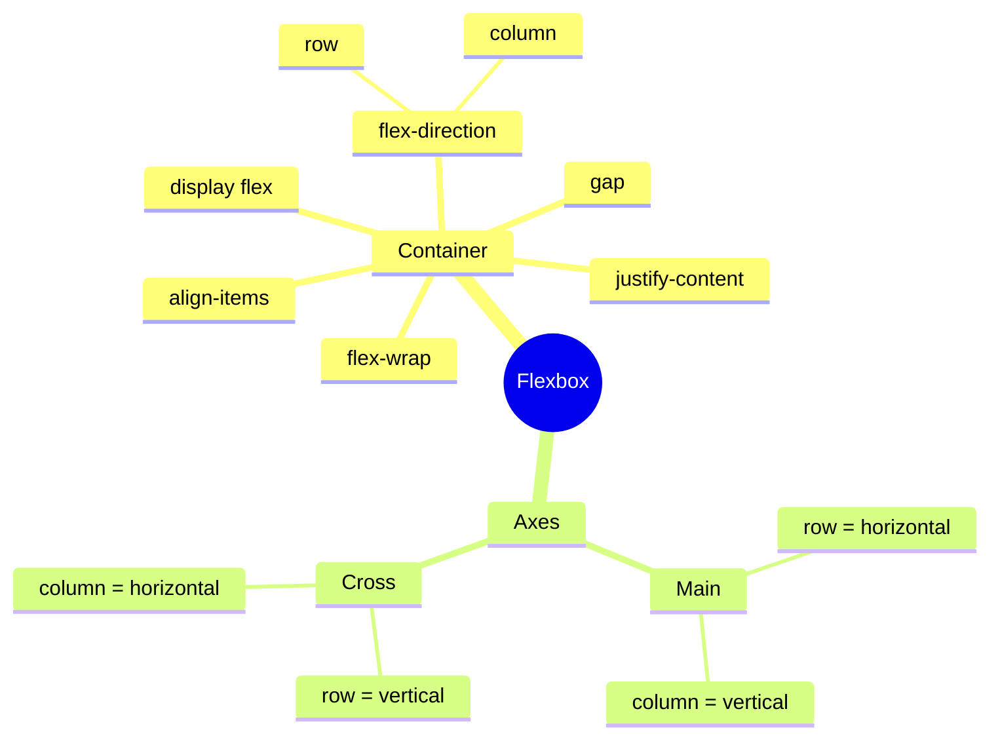
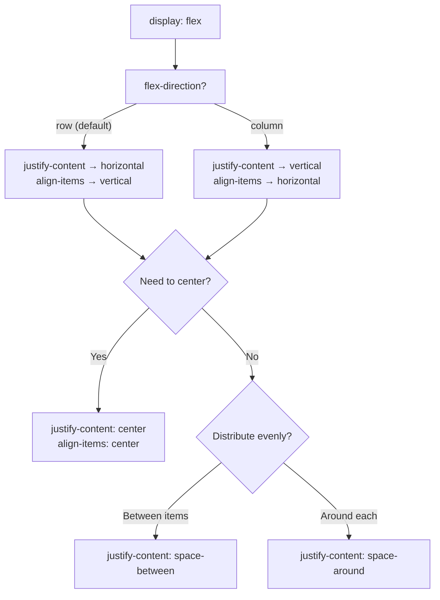

## Flexbox - Basics

> **Connection with the previous lesson:** in the last lesson we learned to individually position individual elements using `position`. Today we move on to the main "workhorse" of modern layouts - Flexbox, which solves a completely different task: not positioning a single element, but **distributing and aligning a group of elements** inside a container.

---

## Lesson Goal

Master the basics of Flexbox - understand what problem it solves compared to older layout methods, and learn to arrange and align groups of elements horizontally and vertically.

## What You Will Learn by the End of the Lesson

- Explain what problem Flexbox solves.
- Enable Flexbox via `display: flex` and set direction via `flex-direction`.
- Align elements along the main and cross axes using `justify-content` and `align-items`.
- Control element wrapping to a new line using `flex-wrap`.
- Build a horizontal navigation menu and a row of cards using Flexbox.

---

## Lesson Timeline

|Block|Content|
|---|---|
|1. What problem does Flexbox solve|Before Flexbox - using float, problems with the old approach|
|2. display: flex and flex-direction|Enabling, axes, row/column|
|3. justify-content|Main axis alignment, all values|
|4. align-items|Cross axis alignment|
|5. Mini-task|Center a block independently|
|6. flex-wrap|Wrapping to a new line|
|7. Summary and practice|Navigation menu + product cards|


---

## Block 1. What Problem Does Flexbox Solve

**In simple terms:** recall lesson 3 - we covered that block-level elements (`display: block`) by default always wrap to a new line, and the only way to place them side by side was `inline-block`. But `inline-block` has some unpleasant quirks: for example, between adjacent `inline-block` elements in code, due to regular spaces/line breaks in the HTML markup, unexpected extra gaps sometimes appear, and aligning elements in height requires additional workarounds.

**Before the appearance of Flexbox** (and before browsers had sufficiently wide support for it), developers often used the `float` property (literally "floating") - it allowed placing elements side by side, but it was originally designed for a completely different task (wrapping text around images, as in newspaper layouts) and was poorly suited for building full-fledged layouts: you had to use special "hacks" to clear floats, it was difficult to precisely center elements or evenly distribute space between them.

**Flexbox** (Flexible Box Layout) was created specifically to solve exactly this task - **convenient distribution and alignment of elements along a single axis** (either strictly horizontally or strictly vertically). This is both its main limitation (and its core essence): Flexbox is a **one-dimensional** tool - it works great with a single row or a single column of elements. If you need a full-fledged grid with both rows and columns (two-dimensional layout) - that's what CSS Grid is for, which we'll study in the next lesson.

**Analogy:** imagine Flexbox as a shelf in a closet: you can place items side by side on it, evenly distribute space between them, align them to the top or bottom edge of the shelf. But if you need an entire wall of shelving - with shelves and columns at once - a single shelf is no longer enough, you need a more complex structure (that's the analogy with Grid).

---

## Block 2. `display: flex` and `flex-direction`

### Enabling Flexbox

Flexbox is enabled on the **parent** element (the container), which is called the **flex container**. All of its **direct** child elements automatically become **flex items**.

```html
<div class="container">
    <div class="item">1</div>
    <div class="item">2</div>
    <div class="item">3</div>
</div>
```

```css
.container {
    display: flex;
}
```

This single line `display: flex;` instantly changes the behavior of all child `.item` elements - before (as `block` by default, from lesson 3) they would have been stacked one below another, but now they automatically line up **in a single horizontal row**, without any `inline-block` and its associated inconveniences.

### The Two Axes of Flexbox: Main and Cross

This is a fundamental concept without which the subsequent properties will be difficult to understand.

- **Main axis** - the direction in which elements are arranged (by default: left to right, horizontally).
- **Cross axis** - the direction perpendicular to the main axis (by default: top to bottom, vertically).

```
Cross axis (vertical)
        │
        │
────────┼──────────────────  Main axis (horizontal)
        │
        │
```

**The direction of the main axis is set by the `flex-direction` property:**

```css
.container {
    display: flex;
    flex-direction: row;  /* default - left to right, horizontally */
}
```

```css
.container {
    display: flex;
    flex-direction: column;  /* top to bottom, vertically */
}
```

With `flex-direction: row` (the default value), the main axis is horizontal, and the cross axis is vertical. With `flex-direction: column`, they **swap places**: the main axis becomes vertical, and the cross axis becomes horizontal.

**It is extremely important to understand this in advance**, because the next two properties (`justify-content` and `align-items`) always work **relative to these axes**, not relative to "top/bottom" or "left/right" in the conventional sense - when you change `flex-direction`, their visual effect also "rotates" along with the axes.



---

### Common Beginner Mistakes

|Mistake|How to Fix|
|---|---|
|Applying `display: flex` to the wrong element (e.g., to the `.item` elements instead of the `.container`)|Flexbox is enabled on the **parent**, child elements become flex items automatically|
|Forgetting that with `flex-direction: column` the axes "swap places"|Remember: the main axis is the direction set by `flex-direction`, not always "horizontal"|
|Expecting Flexbox to create a two-dimensional grid (rows and columns simultaneously) on its own|Flexbox is a one-dimensional tool; for a two-dimensional grid use Grid (lesson 6)|

---

## Block 3. `justify-content` - alignment along the main axis

This property controls how elements are distributed **along the main axis** - meaning, with `flex-direction: row` (the default), how they are arranged horizontally.

```css
.container {
    display: flex;
    justify-content: flex-start;  /* default value */
}
```

Let's cover all the main values in practice:

### `flex-start` (default)

Elements are pushed to the start of the main axis (with `row` - to the left edge).

### `flex-end`

Elements are pushed to the end of the main axis (with `row` - to the right edge).

### `center`

Elements are gathered at the center of the main axis.

```css
.container {
    display: flex;
    justify-content: center;
}
```

**This is arguably the most common practical use** - the simplest way to horizontally center a group of elements, much more convenient than the old `margin: 0 auto;` trick from lesson 3, which only worked for a single block.

### `space-between`

The first element is pushed to the very start, the last to the very end, and all remaining space is **evenly distributed between** the elements (but not at the edges).

### `space-around`

Equal space is added **around each** element - because of this, the distances at the edges (before the first and after the last element) visually appear **half as large** as the distances between the elements themselves (because the container edges "share" space with only one neighboring element, not two).

### `space-evenly`

All distances - between elements **and** at the edges - are strictly **equal**, without the visual bias characteristic of `space-around`.

### Visual comparison

```
flex-start:    [1][2][3]                    
flex-end:                      [1][2][3]    
center:              [1][2][3]              
space-between: [1]        [2]        [3]    
space-around:    [1]     [2]     [3]        
space-evenly:     [1]    [2]    [3]         
```

**Practical recommendation:** `space-between` is the most common choice for navigation menus (logo on the left, links on the right, with automatic space distribution between them); `center` is the most common choice for centering a group of elements (e.g., buttons or cards).

---

## Block 4. `align-items` - alignment along the cross axis

If `justify-content` controls the main axis, then `align-items` controls the **cross** axis. With `flex-direction: row` (the default), this means alignment along the **vertical** axis.

```css
.container {
    display: flex;
    align-items: center;
}
```

Main values:

- **`stretch`** (default) - elements stretch to the full height of the container along the cross axis.
- **`flex-start`** - elements are pushed to the start of the cross axis (with `row` - to the top edge).
- **`flex-end`** - elements are pushed to the end of the cross axis (with `row` - to the bottom edge).
- **`center`** - elements are centered along the cross axis (with `row` - vertically).

### The classic technique: perfect centering both horizontally and vertically at the same time

```css
.container {
    display: flex;
    justify-content: center;  /* horizontally (main axis with row) */
    align-items: center;      /* vertically (cross axis with row) */
    height: 300px;
}
```

This is, without exaggeration, one of the most in-demand patterns in all of CSS layout - before (without Flexbox), perfect centering of a block along both axes simultaneously required cumbersome workarounds, but with Flexbox it's literally two lines of code.

**Analogy for `justify-content` and `align-items`:** imagine a bookshelf (main axis is horizontal along the shelf). `justify-content` determines how books are distributed **along** the shelf (tightly at one edge, centered, or evenly spread out). `align-items` determines how books are aligned **in height** on the shelf - are they all "standing" from the bottom edge of the shelf, or, for example, "hanging" from the top edge.



---

### Common Beginner Mistakes

|Mistake|How to Fix|
|---|---|
|Confusing `justify-content` (main axis) and `align-items` (cross axis)|Remember the mnemonic: **justify** for the main axis, **align** for the cross axis - these two properties almost always go together|
|Expecting `align-items: center` to center elements horizontally with `flex-direction: row`|With `row`, `align-items` controls **vertical** alignment; horizontal alignment is controlled by `justify-content`|
|Forgetting that when changing to `flex-direction: column`, the two properties "swap roles" (justify-content now controls vertical, align-items controls horizontal)|Always remember: `justify-content` is about the main axis, and which axis is main depends on `flex-direction`|

---

## Block 5. Mini-Task

On your own, without looking at references, center a single button `<button>Click me</button>` inside a container `<div class="hero">` - both horizontally and vertically, with a container height of `400px`.

**Solution:**

```css
.hero {
    display: flex;
    justify-content: center;
    align-items: center;
    height: 400px;
}
```

---

## Block 6. `flex-wrap` - wrapping to a new line

By default, Flexbox tries to fit **all** elements into a single line (or column, with `column`), **shrinking** them if necessary, even if there isn't enough space - because of this, elements can become too narrow or "overflow" beyond the container.

```css
.container {
    display: flex;
    flex-wrap: nowrap;  /* default value - everything in one line */
}
```

The `flex-wrap: wrap` property allows elements to **wrap to a new line** if they don't fit within the container's width - meaning Flexbox starts behaving more flexibly, "flowing" onto the next line instead of compressing elements:

```css
.container {
    display: flex;
    flex-wrap: wrap;
}
```

**Practical example: a product card grid** that should show as many cards per row as fit across the screen width, with extras automatically wrapping to the next line:

```css
.products {
    display: flex;
    flex-wrap: wrap;
    gap: 20px;
}

.product-card {
    width: 250px;
}
```

Here `gap: 20px;` is another extremely useful property: it sets an **equal distance** between all flex items at once, both horizontally and vertically (when wrapping to a new line) - without needing to manually set `margin` on each individual card and deal with margin collapse from lesson 3 (by the way, `gap` is **not affected** by margin collapse - yet another advantage).

---

### Common Beginner Mistakes

|Mistake|How to Fix|
|---|---|
|Forgetting `flex-wrap: wrap` and wondering why elements "shrink" on small screens instead of wrapping|Add `flex-wrap: wrap;` if elements should wrap to a new line when space runs out|
|Using `margin` instead of `gap` for spacing between flex items|`gap` is simpler and more predictable - one line sets even spacing in all directions at once, with no risk of margin collapse|
|Not setting a width on child elements (e.g., cards), causing wrapping to work unpredictably|Set a reasonable `width` (or `min-width`) for elements inside `flex-wrap: wrap` so the browser knows when to wrap them to a new line|

---

## Lesson Summary

Today you learned:

- Flexbox is a one-dimensional tool for distributing and aligning a group of elements along a single axis (unlike the old `float` approach, which wasn't originally designed for building layouts).
- `display: flex` is enabled on the parent (the flex container), child elements automatically become flex items.
- `flex-direction: row` (default) - main axis is horizontal; `column` - main axis is vertical, and then `justify-content`/`align-items` "swap roles."
- `justify-content` aligns elements along the **main** axis (values: `flex-start`, `flex-end`, `center`, `space-between`, `space-around`, `space-evenly`).
- `align-items` aligns elements along the **cross** axis (values: `stretch`, `flex-start`, `flex-end`, `center`).
- `flex-wrap: wrap` allows elements to wrap to a new line when space runs out; `gap` sets even spacing between them without the risk of margin collapse.

---

## Practice (in class)

Build two classic patterns based on your own HTML project:

1. **Horizontal navigation menu using Flexbox:**

```html
<nav class="main-nav">
    <div class="logo">My Site</div>
    <ul class="nav-links">
        <li><a href="index.html">Home</a></li>
        <li><a href="about.html">About</a></li>
        <li><a href="contact.html">Contact</a></li>
    </ul>
</nav>
```

```css
.main-nav {
    display: flex;
    justify-content: space-between;
    align-items: center;
}

.nav-links {
    display: flex;
    gap: 20px;
}
```

2. **Product/project cards in a row** using `flex-wrap: wrap` and `gap`, based on the `projects.html` page from the HTML course.

---

## Homework

1. Rebuild the navigation (`<nav>`) of your HTML project using Flexbox if you haven't done it in class yet - use `justify-content: space-between` for distributing the logo and menu links.
2. On the `projects.html` page, build a project card grid using `display: flex; flex-wrap: wrap;` with `gap` between them.
3. Center (both horizontally and vertically at the same time) the main heading and subtitle on your homepage `index.html` using the combination of `justify-content: center` + `align-items: center` on a container with a set height.
4. **Research task:** open DevTools on any website with a horizontal navigation menu, find the parent element of the menu, and check whether it uses `display: flex` - what `justify-content`/`align-items` values are set there?

---

[Next lesson: Flexbox Advanced and Grid →](../6/en/Flexbox%20Advanced%20and%20Grid.md)
