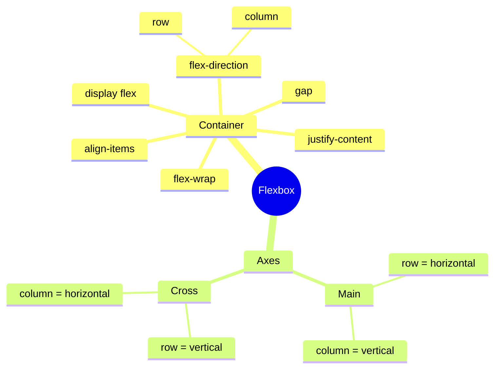
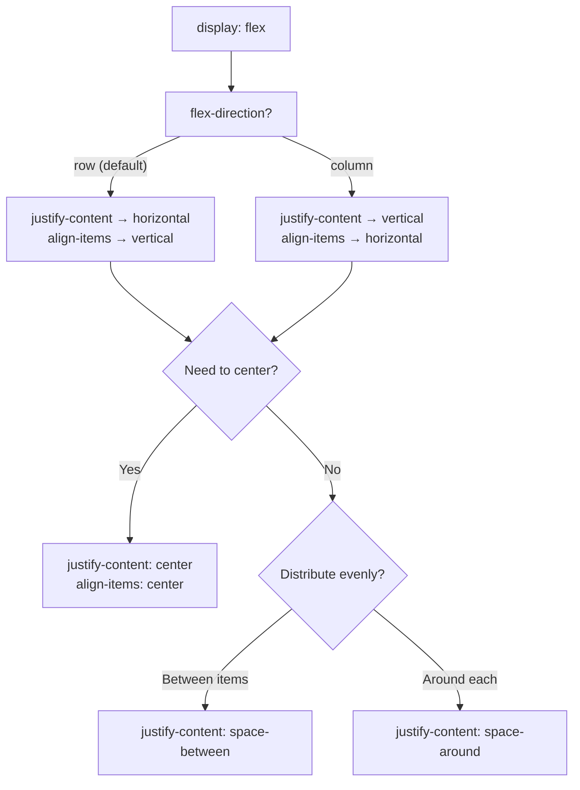

## Flexbox - основы

> **Связь с предыдущим уроком:** на прошлом уроке мы научились точечно позиционировать отдельные элементы через `position`. Сегодня переходим к главному "рабочему инструменту" современной вёрстки - Flexbox, который решает совершенно другую задачу: не позиционирование одного элемента, а **распределение и выравнивание группы элементов** внутри контейнера.

---

## Цель урока

Освоить базовый Flexbox - понять, какую проблему он решает по сравнению со старыми способами вёрстки, и научиться выстраивать и выравнивать группы элементов по горизонтали и вертикали.

## Чему вы научитесь к концу урока

- Объяснять, какую проблему решает Flexbox.
- Включать Flexbox через `display: flex` и задавать направление через `flex-direction`.
- Выравнивать элементы по главной и поперечной оси через `justify-content` и `align-items`.
- Управлять переносом элементов на новую строку через `flex-wrap`.
- Собирать горизонтальное меню навигации и ряд карточек на Flexbox.

---

## Хронометраж урока

|Блок|Содержание|
|---|---|
|1. Какую проблему решает Flexbox|До Flexbox - через float, проблемы старого подхода|
|2. display: flex и flex-direction|Включение, оси, row/column|
|3. justify-content|Выравнивание по главной оси, все значения|
|4. align-items|Выравнивание по поперечной оси|
|5. Мини-задание|Отцентрировать блок самостоятельно|
|6. flex-wrap|Перенос на новую строку|
|7. Итоги и практика|Меню навигации + карточки товаров|


---

## Блок 1. Какую проблему решает Flexbox

**Простыми словами:** вспомните урок 3 - мы разобрали, что блочные элементы (`display: block`) по умолчанию всегда переносятся на новую строку, и единственным способом расположить их рядом был `inline-block`. Но `inline-block` имеет неприятные особенности: например, между соседними `inline-block`-элементами в коде из-за обычных пробелов/переносов строк в HTML-разметке иногда появляются неожиданные лишние промежутки, а выравнивание элементов по высоте требует дополнительных ухищрений.

**До появления Flexbox** (и до его достаточно широкой поддержки браузерами) верстальщики часто использовали свойство `float` (буквально «плавающий») - оно позволяло расположить элементы рядом, но изначально было создано совсем для другой задачи (обтекание текстом изображений, как в газетных вёрстках) и плохо подходило для построения полноценных макетов: приходилось использовать специальные "хаки" для сброса обтекания, было сложно точно выровнять элементы по центру или равномерно распределить пространство между ними.

**Flexbox** (Flexible Box Layout, «гибкая блочная модель») был создан специально для решения именно этой задачи - **удобного распределения и выравнивания элементов вдоль одной оси** (либо строго по горизонтали, либо строго по вертикали). Это и есть его главное ограничение (и одновременно суть): Flexbox - **одномерный** инструмент, он прекрасно работает с одним рядом или одной колонкой элементов. Если нужна полноценная сетка сразу и по строкам, и по столбцам (двумерная раскладка) - для этого существует CSS Grid, который мы изучим в следующем уроке.

**Аналогия:** представьте, что Flexbox - это полка в шкафу: вы можете разместить на ней предметы рядом друг с другом, равномерно распределить между ними пространство, выровнять их по верхнему или нижнему краю полки. Но если вам нужна сразу целая стена стеллажей - с полками и столбцами одновременно - одной полки уже недостаточно, нужна более сложная конструкция (это и есть аналогия с Grid).

---

## Блок 2. `display: flex` и `flex-direction`

### Включение Flexbox

Flexbox включается на **родительском** элементе (контейнере), который называется **flex-контейнером**. Все его **непосредственные** дочерние элементы автоматически становятся **flex-элементами**.

```html
<div class="container">
    <div class="item">1</div>
    <div class="item">2</div>
    <div class="item">3</div>
</div>
```

```css
.container {
    display: flex;
}
```

Одна эта строчка `display: flex;` мгновенно меняет поведение всех дочерних `.item` - раньше (как `block` по умолчанию, из урока 3) они располагались бы друг под другом, а теперь автоматически выстроятся **в один ряд по горизонтали**, без всякого `inline-block` и связанных с ним неудобств.

### Две оси Flexbox: главная и поперечная

Это фундаментальное понятие, без которого дальнейшие свойства будет сложно понять.

- **Главная ось (main axis)** - направление, в котором выстраиваются элементы (по умолчанию - слева направо, горизонтально).
- **Поперечная ось (cross axis)** - направление, перпендикулярное главной оси (по умолчанию - сверху вниз, вертикально).

```
Поперечная ось (вертикаль)
        │
        │
────────┼──────────────────  Главная ось (горизонталь)
        │
        │
```

**Направление главной оси задаётся свойством `flex-direction`:**

```css
.container {
    display: flex;
    flex-direction: row;  /* по умолчанию - слева направо, горизонтально */
}
```

```css
.container {
    display: flex;
    flex-direction: column;  /* сверху вниз, вертикально */
}
```

При `flex-direction: row` (значение по умолчанию) главная ось - горизонтальная, поперечная - вертикальная. При `flex-direction: column` они **меняются местами**: главная ось становится вертикальной, поперечная - горизонтальной.

**Это крайне важно понимать заранее**, потому что следующие два свойства (`justify-content` и `align-items`) всегда работают **относительно этих осей**, а не относительно "верха/низа" или "лева/права" в привычном смысле - при смене `flex-direction` их визуальный эффект тоже "поворачивается" вместе с осями.



---

### Частые ошибки новичков

|Ошибка|Как исправить|
|---|---|
|Применяют `display: flex` не к тому элементу (например, к самим `.item`, а не к `.container`)|Flexbox включается на **родителе**, дочерние элементы становятся flex-элементами автоматически|
|Забывают, что при `flex-direction: column` оси "меняются местами"|Помните: главная ось - это направление, заданное `flex-direction`, а не всегда "горизонталь"|
|Ожидают, что Flexbox сам по себе создаёт двумерную сетку (строки и столбцы одновременно)|Flexbox - одномерный инструмент; для двумерной сетки используйте Grid (урок 6)|

---

## Блок 3. `justify-content` - выравнивание по главной оси

Это свойство управляет тем, как элементы распределяются **вдоль главной оси** - то есть, при `flex-direction: row` (по умолчанию), как они располагаются по горизонтали.

```css
.container {
    display: flex;
    justify-content: flex-start;  /* значение по умолчанию */
}
```

Разберём все основные значения на практике:

### `flex-start` (по умолчанию)

Элементы прижаты к началу главной оси (при `row` - к левому краю).

### `flex-end`

Элементы прижаты к концу главной оси (при `row` - к правому краю).

### `center`

Элементы собраны по центру главной оси.

```css
.container {
    display: flex;
    justify-content: center;
}
```

**Это, пожалуй, самое частое практическое применение** - простейший способ горизонтально отцентрировать группу элементов, гораздо удобнее, чем старый приём `margin: 0 auto;` из урока 3, который годился только для одного блока.

### `space-between`

Первый элемент прижат к самому началу, последний - к самому концу, а всё оставшееся пространство **равномерно распределяется между** элементами (но не по краям).

### `space-around`

Вокруг **каждого** элемента добавляется одинаковое пространство - из-за этого расстояния по краям (перед первым и после последнего элемента) визуально выглядят **в два раза меньше**, чем расстояния между самими элементами (потому что края контейнера "делят" пространство только с одним соседним элементом, а не с двумя).

### `space-evenly`

Все расстояния - между элементами **и** по краям - строго **одинаковые**, без визуального перекоса, характерного для `space-around`.

### Наглядное сравнение

```
flex-start:    [1][2][3]                    
flex-end:                      [1][2][3]    
center:              [1][2][3]              
space-between: [1]        [2]        [3]    
space-around:    [1]     [2]     [3]        
space-evenly:     [1]    [2]    [3]         
```

**Практическая рекомендация:** `space-between` - самый частый выбор для навигационных меню (логотип слева, ссылки справа, с автоматическим распределением пространства между ними), `center` - самый частый выбор для центрирования группы элементов (например, кнопок или карточек).

---

## Блок 4. `align-items` - выравнивание по поперечной оси

Если `justify-content` управляет главной осью, то `align-items` - **поперечной**. При `flex-direction: row` (по умолчанию) это означает выравнивание по **вертикали**.

```css
.container {
    display: flex;
    align-items: center;
}
```

Основные значения:

- **`stretch`** (по умолчанию) - элементы растягиваются на всю высоту контейнера по поперечной оси.
- **`flex-start`** - элементы прижаты к началу поперечной оси (при `row` - к верхнему краю).
- **`flex-end`** - элементы прижаты к концу поперечной оси (при `row` - к нижнему краю).
- **`center`** - элементы центрированы по поперечной оси (при `row` - по вертикали).

### Классический приём: идеальное центрирование и по горизонтали, и по вертикали одновременно

```css
.container {
    display: flex;
    justify-content: center;  /* по горизонтали (главная ось при row) */
    align-items: center;      /* по вертикали (поперечная ось при row) */
    height: 300px;
}
```

Это, без преувеличения, один из самых востребованных паттернов во всей CSS-вёрстке - раньше (без Flexbox) идеальное центрирование блока одновременно по обеим осям требовало громоздких обходных решений, а с Flexbox это буквально две строчки кода.

**Аналогия с `justify-content` и `align-items`:** представьте книжную полку (главная ось - горизонталь вдоль полки). `justify-content` решает, как книги распределены **вдоль** полки (плотно у одного края, по центру, или равномерно раскиданы). `align-items` решает, как книги выровнены **по высоте** полки - все ли они "стоят" от нижнего края полки, или, например, "висят" от верхнего края.



---

### Частые ошибки новичков

|Ошибка|Как исправить|
|---|---|
|Путают `justify-content` (главная ось) и `align-items` (поперечная ось)|Запомните мнемонику: **justify** для главной оси, **align** для поперечной - эти два свойства почти всегда идут парой|
|Ожидают, что `align-items: center` отцентрирует элементы по горизонтали при `flex-direction: row`|При `row` `align-items` управляет **вертикальным** выравниванием, горизонтальным - `justify-content`|
|Забывают, что при смене `flex-direction: column` два свойства меняются "ролями" (justify-content теперь управляет вертикалью, align-items - горизонталью)|Всегда помните: `justify-content` - это про главную ось, а какая ось главная, зависит от `flex-direction`|

---

## Блок 5. Мини-задание

Самостоятельно, без подглядывания, отцентрируйте одну кнопку `<button>Нажми меня</button>` внутри контейнера `<div class="hero">` - и по горизонтали, и по вертикали, при высоте контейнера `400px`.

**Решение:**

```css
.hero {
    display: flex;
    justify-content: center;
    align-items: center;
    height: 400px;
}
```

---

## Блок 6. `flex-wrap` - перенос на новую строку

По умолчанию Flexbox пытается уместить **все** элементы в одну строку (или колонку, при `column`), **сжимая** их при необходимости, даже если места объективно не хватает - из-за этого элементы могут стать слишком узкими или "вылезти" за пределы контейнера.

```css
.container {
    display: flex;
    flex-wrap: nowrap;  /* значение по умолчанию - всё в одну строку */
}
```

Свойство `flex-wrap: wrap` разрешает элементам **переноситься на новую строку**, если они не помещаются по ширине контейнера - то есть Flexbox начинает вести себя более гибко, "перетекая" на следующую строку вместо сжатия элементов:

```css
.container {
    display: flex;
    flex-wrap: wrap;
}
```

**Практический пример: сетка карточек товаров**, которая должна показывать столько карточек в ряд, сколько помещается по ширине экрана, а лишние - автоматически переносить на следующую строку:

```css
.products {
    display: flex;
    flex-wrap: wrap;
    gap: 20px;
}

.product-card {
    width: 250px;
}
```

Здесь `gap: 20px;` - ещё одно крайне полезное свойство: оно задаёт **одинаковое расстояние** между всеми flex-элементами сразу, и по горизонтали, и по вертикали (при переносе на новую строку) - без необходимости вручную задавать `margin` каждой отдельной карточке и разбираться с margin collapse из урока 3 (кстати, `gap` **не подвержен** схлопыванию отступов - ещё один плюс в его пользу).

---

### Частые ошибки новичков

|Ошибка|Как исправить|
|---|---|
|Забывают `flex-wrap: wrap` и удивляются, почему элементы "сжимаются" на маленьком экране вместо переноса|Добавляйте `flex-wrap: wrap;`, если элементы должны переноситься на новую строку при нехватке места|
|Используют `margin` вместо `gap` для расстояния между flex-элементами|`gap` проще и предсказуемее - одна строка задаёт равномерный отступ сразу во всех направлениях, без риска margin collapse|
|Не задают ширину дочерним элементам (например, карточкам), из-за чего перенос работает непредсказуемо|Указывайте разумную `width` (или `min-width`) для элементов внутри `flex-wrap: wrap`, чтобы браузер понимал, когда именно переносить их на новую строку|

---

## Итоги урока

Сегодня вы узнали:

- Flexbox - одномерный инструмент для распределения и выравнивания группы элементов вдоль одной оси (в отличие от старого подхода через `float`, изначально не предназначенного для построения макетов).
- `display: flex` включается на родителе (flex-контейнере), дочерние элементы автоматически становятся flex-элементами.
- `flex-direction: row` (по умолчанию) - главная ось горизонтальная; `column` - главная ось вертикальная, и тогда `justify-content`/`align-items` меняются "ролями".
- `justify-content` выравнивает элементы вдоль **главной** оси (значения: `flex-start`, `flex-end`, `center`, `space-between`, `space-around`, `space-evenly`).
- `align-items` выравнивает элементы вдоль **поперечной** оси (значения: `stretch`, `flex-start`, `flex-end`, `center`).
- `flex-wrap: wrap` разрешает перенос элементов на новую строку при нехватке места, `gap` задаёт равномерное расстояние между ними без риска margin collapse.

---

## Практика (на занятии)

Соберите два классических паттерна на основе своего HTML-проекта:

1. **Горизонтальное меню навигации на Flexbox:**

```html
<nav class="main-nav">
    <div class="logo">Мой сайт</div>
    <ul class="nav-links">
        <li><a href="index.html">Главная</a></li>
        <li><a href="about.html">О сайте</a></li>
        <li><a href="contact.html">Контакты</a></li>
    </ul>
</nav>
```

```css
.main-nav {
    display: flex;
    justify-content: space-between;
    align-items: center;
}

.nav-links {
    display: flex;
    gap: 20px;
}
```

2. **Карточки товаров/проектов в ряд**, с `flex-wrap: wrap` и `gap`, на основе страницы `projects.html` из курса HTML.

---

## Домашнее задание

1. Переверстайте навигацию (`<nav>`) своего HTML-проекта на Flexbox, если ещё не сделали это на занятии - используйте `justify-content: space-between` для распределения логотипа и ссылок меню.
2. На странице `projects.html` соберите сетку карточек проектов через `display: flex; flex-wrap: wrap;` с `gap` между ними.
3. Отцентрируйте (и по горизонтали, и по вертикали одновременно) главный заголовок и подзаголовок на своей главной странице `index.html`, используя связку `justify-content: center` + `align-items: center` на контейнере с заданной высотой.
4. **Исследовательское задание:** откройте DevTools на любом сайте с горизонтальным меню навигации, найдите родительский элемент меню и проверьте, использует ли он `display: flex` - какие значения `justify-content`/`align-items` там заданы?

---

[Следующий урок: Flexbox — продвинутый и Grid →](Lesson-6/ru/Flexbox%20—%20продвинутый%20уровень%20и%20Grid.md)
