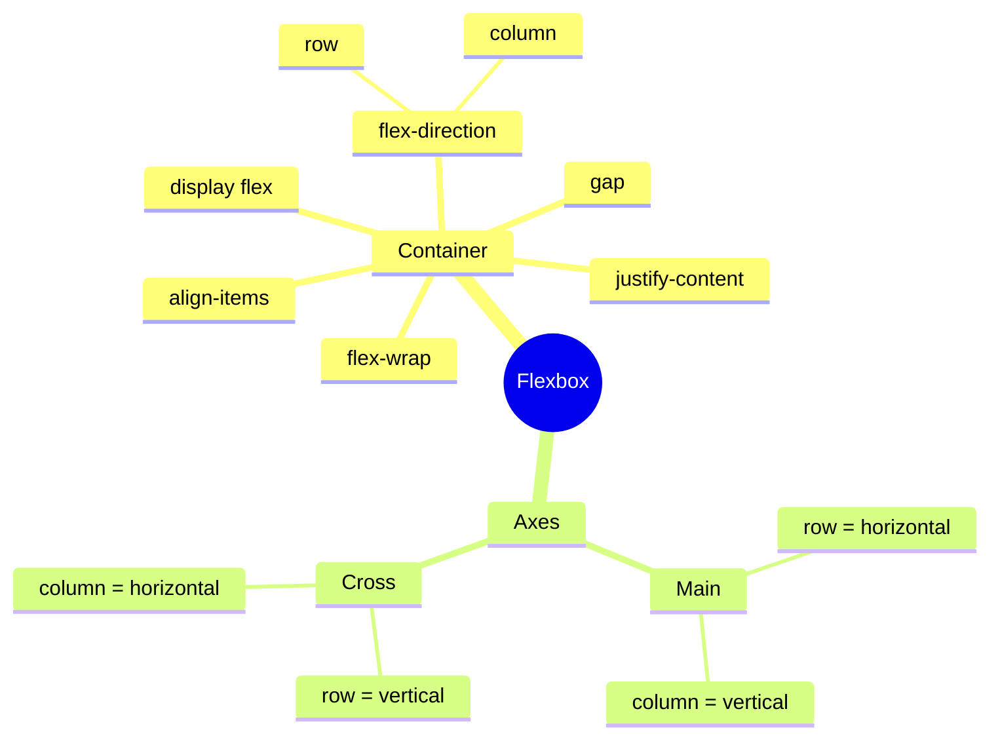
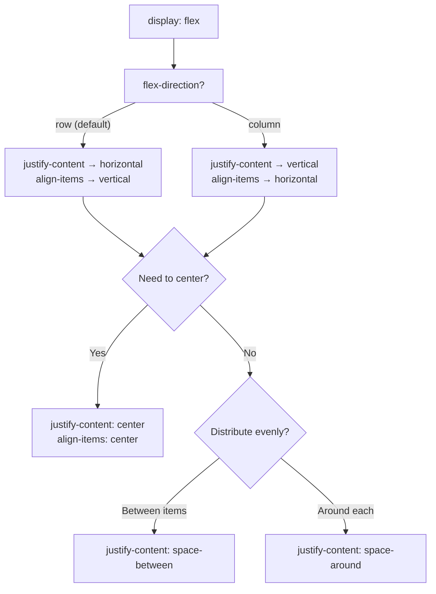

## Flexbox - asoslar

> **Oldingi dars bilan bog'liqlik:** o'tgan darsda biz alohida elementlarni `position` orqali aniq joylashtirishni o'rgandik. Bugun zamonaviy veb-dizaynning asosiy "ish vositasiga" - Flexbox ga o'tamiz, u butun boshqa muammoni hal qiladi: bitta elementni joylashtirish emas, balki **konteyner ichidagi guruh elementlarini taqsimlash va tekislash**.

---

## Darsning maqsadi

Asosiy Flexbox ni o'zlashtirish - u qadimgi usullarga nisbatan qanday muammoni hal qilishini tushunish va guruh elementlarini gorizontal va vertikal tekislashni o'rganish.

## Dars oxiriga qadar nimani o'rganasiz

- Flexbox qanday muammoni hal qilishini tushuntirish.
- `display: flex` orqali Flexbox ni yoqish va `flex-direction` orqali yo'nalishni belgilash.
- `justify-content` va `align-items` orqali elementlarni asosiy va ko'ndalang o'qlar bo'yicha tekislash.
- `flex-wrap` orqali elementlarning yangi qatorga o'tishini boshqarish.
- Flexbox asosida gorizontal navigatsiya menyusi va kartochkalar qatorini yig'ish.

---

## Darsning vaqt jadvali

|Blok|Mazmun|
|---|---|
|1. Flexbox qanday muammoni hal qiladi|Flexbox dan oldin - float orqali, qadimgi usulning muammolari|
|2. display: flex va flex-direction|Yoqish, o'qlar, row/column|
|3. justify-content|Asosiy o'q bo'yicha tekislash, barcha qiymatlar|
|4. align-items|Ko'ndalang o'q bo'yicha tekislash|
|5. Mini-vazifa|Blokni mustaqil ravishda markazlash|
|6. flex-wrap|Yangi qatorga o'tkazish|
|7. Xulosalar va amaliyot|Navigatsiya menyusi + mahsulot kartochkalari|


---

## 1-Blok. Flexbox qanday muammoni hal qiladi

**Oddiy qilib aytganda:** 3-darsni eslang - biz blok elementlari (`display: block`) standart holatda har doim yangi qatorga o'tishini ko'rib chiqdik, va ularni yonma-yon joylashtirishning yagona yo'li `inline-block` edi. Lekin `inline-block` ning yoqimsiz xususiyatlari bor: masalan, HTML kodidagi oddgi bo'sh joylar/qator o'tishlari tufayli qo'shni `inline-block` elementlar orasida kutilmagan ortiqcha bo'sh joylar paydo bo'lishi mumkin, va elementlarni bo'yicha tekislash qo'shimcha murakkablashuvlarni talab qiladi.

**Flexbox dan oldin** (va brauzerlar tomonidan yetarli darajada qo'llab-quvvatlanishdan oldin) veb-dizaynerlar ko'pincha `float` xossasidan (so'zma-so'z "suzuvchi") foydalanishardi - u elementlarni yonma-yon joylashtirishga imkon berardi, lekin aslida bu boshqa maqsad uchun yaratilgan edi (matn orasidan rasmlarni o'tkazib yuborish, gazeta dizaynlari kabi) va to'liq maketlar qurishga mos kelmasdi: suzuvchanlikni qayta tiklash uchun maxsus "haklar" ishlatish kerak edi, elementlarni markazga yoki ular orasidagi joyni tekis taqsimlashga aniq tekislash qiyin edi.

**Flexbox** (Flexible Box Layout, "moslashuvchan blok modeli") aynan shu muammoni hal qilish uchun maxsus yaratilgan - **elementlarni bir o'q bo'yicha qulay taqsimlash va tekislash** (yoki qat'iy gorizontal, yoki qat'iy vertikal). Bu uning asosiy cheklovi (va bir vaqtda mohiyati): Flexbox - **bir o'lchamli** vosita, u bitta qator yoki bitta ustun elementlar bilan ajoyib ishlaydi. Agar satrlar va ustunlar bo'yicha to'liq kerak bo'lsa (ikki o'lchamli tartib) - bu uchun CSS Grid mavjud, uni keyingi darsda o'rganamiz.

**Analogiya:** Flexbox ni shkafdagi polka deb tasavvur qiling: siz unga buyumlarni yonma-yon qo'yishingiz, ular orasidagi joyni tekis taqsimlashingiz, ularni polkaning yuqori yoki pastki qirrasiga tekislashingiz mumkin. Lekin sizga butun devor turli polkalar va ustunlar kerak bo'lsa - bir polka yetarli emas, murakkabroq tuzilma kerak (bu Grid bilan analogiya).

---

## 2-Blok. `display: flex` va `flex-direction`

### Flexbox ni yoqish

Flexbox **ota-ona** elementda (konteynerda) yoqiladi, u **flex-konteyner** deb ataladi. Uning barcha **to'g'ridan-to'g'ri** bolalari avtomatik ravishda **flex-elementlar** ga aylanadi.

```html
<div class="container">
    <div class="item">1</div>
    <div class="item">2</div>
    <div class="item">3</div>
</div>
```

```css
.container {
    display: flex;
}
```

Faqat `display: flex;` qatori barcha bolalar `.item` ning xulq-atvorini darhol o'zgartiradi - oldin (standart `block` kabi, 3-darsdan) ular birining ostiga joylashgan bo'lar edi, endi avtomatik ravishda **gorizontal qatorda** joylashadi, hech qanday `inline-block` va uning bilan bog'liq noqulayliklarsiz.

### Flexbox ning ikki o'qi: asosiy va ko'ndalang

Bu asosiy tushuncha, unisiz keyingi xossalarni tushunish qiyin.

- **Asosiy o'q (main axis)** - elementlar joylashadigan yo'nalish (standart - chapdan o'ngga, gorizontal).
- **Ko'ndalang o'q (cross axis)** - asosiy o'qqa perpendikulyar yo'nalish (standart - yuqoridan pastga, vertikal).

```
Ko'ndalang o'q (vertikal)
        │
        │
────────┼──────────────────  Asosiy o'q (gorizontal)
        │
        │
```

**Asosiy o'q yo'nalishi `flex-direction` xossasi bilan belgilanadi:**

```css
.container {
    display: flex;
    flex-direction: row;  /* standart - chapdan o'ngga, gorizontal */
}
```

```css
.container {
    display: flex;
    flex-direction: column;  /* yuqoridan pastga, vertikal */
}
```

`flex-direction: row` (standart qiymat) da asosiy o'q gorizontal, ko'ndalang vertikal. `flex-direction: column` da ular **o'rnini almashtiradi**: asosiy o'q vertikal, ko'ndalang gorizontal bo'ladi.

**Buni oldindan tushunish juda muhim**, chunki keyingi ikki xossa (`justify-content` va `align-items`) har doim **shu o'qlarga nisbatan** ishlaydi, "yuqori/past" yoki "chap/o'ng" odatdagidek ma'noda emas - `flex-direction` o'zgarganda ularning vizual effekti ham o'qlar bilan birga "buriladi".



---

### Yangi boshlovchilarning tez-tez uchraydigan xatolari

|Xato|Qanday tuzatish|
|---|---|
|`display: flex` ni noto'g'ri elementga qo'llash (masalan, o'zlari `.item` ga emas, `.container` ga)|Flexbox **ota-onada** yoqiladi, bolalar avtomatik ravishda flex-elementlar bo'ladi|
|`flex-direction: column` da o'qlar "o'rnini almashtirishini" unutish|Eslab qo'ling: asosiy o'q - bu `flex-direction` bilan belgilangan yo'nalish, har doim "gorizontal" emas|
|Flexbox o'zi ikki o'lchamli to'r (satrlar va ustunlar) yaratadi degan fikrda bo'lish|Flexbox bir o'lchamli vosita; ikki o'lchamli to'r uchun Grid dan foydalaning (6-dars)|

---

## 3-Blok. `justify-content` - asosiy o'q bo'yicha tekislash

Bu xossa elementlarning **asosiy o'q bo'yicha** qanday taqsimlanishini boshqaradi - ya'ni, `flex-direction: row` (standart) da ular gorizontal qanday joylashadi.

```css
.container {
    display: flex;
    justify-content: flex-start;  /* standart qiymat */
}
```

Barcha asosiy qiymatlarni amalda ko'rib chiqamiz:

### `flex-start` (standart)

Elementlar asosiy o'qning boshiga mahkamlanadi (`row` da - chap qirraga).

### `flex-end`

Elementlar asosiy o'qning oxiriga mahkamlanadi (`row` da - o'ng qirraga).

### `center`

Elementlar asosiy o'qning markazida to'planadi.

```css
.container {
    display: flex;
    justify-content: center;
}
```

**Bu, ehtimol, eng ko'p qo'llaniladigan amaliy foydalanish** - guruh elementlarini gorizontal markazlashning eng oson usuli, 3-darsdagi `margin: 0 auto;` qadimgi usulidan ancha qulay, u faqat bitta blok uchun mos edi.

### `space-between`

Birinchi element boshiga, oxirgisi oxiriga mahkamlanadi, qolgan barcha joy **elementlar orasida tekis taqsimlanadi** (lekin qirralarda emas).

### `space-around`

**Har bir** element atrofida teng joy qo'shiladi - shuning uchun qirralardagi masofalar (birinchi elementdan oldin va oxirisidan keyin) vizual ravishda elementlar o'zidagi masofalardan **ikki marta kichikroq** ko'rinadi (chunki konteynerning qirralari faqat bitta qo'shni element bilan joyni "bo'lishadi", ikki bilan emas).

### `space-evenly`

Barcha masofalar - elementlar orasida **va** qirralarda - qat'iy **bir xil**, `space-around` ga xos vizual buzilmasdan.

### Vizual taqqoslash

```
flex-start:    [1][2][3]                    
flex-end:                      [1][2][3]    
center:              [1][2][3]              
space-between: [1]        [2]        [3]    
space-around:    [1]     [2]     [3]        
space-evenly:     [1]    [2]    [3]         
```

**Amaliy tavsiya:** `space-between` navigatsiya menyalari uchun eng ko'p tanlov (logotip chapda, havolalar o'ngda, ular orasidagi joy avtomatik taqsimlanadi), `center` guruh elementlarini markazlash uchun eng ko'p tanlov (masalan, tugmalar yoki kartochkalar).

---

## 4-Blok. `align-items` - ko'ndalang o'q bo'yicha tekislash

Agar `justify-content` asosiy o'qni boshqarsa, `align-items` - **ko'ndalang** o'qni. `flex-direction: row` (standart) da bu vertikal tekislashni anglatadi.

```css
.container {
    display: flex;
    align-items: center;
}
```

Asosiy qiymatlar:

- **`stretch`** (standart) - elementlar konteynerning to'liq bo'yi bo'yicha ko'ndalang o'qda cho'ziladi.
- **`flex-start`** - elementlar ko'ndalang o'qning boshiga mahkamlanadi (`row` da - yuqori qirraga).
- **`flex-end`** - elementlar ko'ndalang o'qning oxiriga mahkamlanadi (`row` da - pastki qirraga).
- **`center`** - elementlar ko'ndalang o'q bo'yicha markazlangan (`row` da - vertikal).

### Klassik usul: gorizontal hamda vertikal ravishdagi ideal markazlash

```css
.container {
    display: flex;
    justify-content: center;  /* gorizontal (row da asosiy o'q) */
    align-items: center;      /* vertikal (row da ko'ndalang o'q) */
    height: 300px;
}
```

Bu, ortiqcha aytmagan holda, butun CSS veb-dizayndagi eng talab qilinadigan naqnalardan biri - oldin (Flexbox dan oldin) ikkala o'q bo'yicha bir vaqtda ideal markazlash uchun hajmli chiqish yechimlari kerak edi, Flexbox bilan bu literally ikki qator kod.

**`justify-content` va `align-items` analogiyasi:** kitob polkasini tasavvur qiling (asosiy o'q - polka bo'ylab gorizontal). `justify-content` kitoblar polka bo'ylab **qanday** taqsimlanishini hal qiladi (bir qirrada zich, markazda yoki tekis tarqalgan). `align-items` kitoblar polkaning **bo'yi bo'yicha** qanday tekislanishini hal qiladi - barchasi pastki qirradan "turadimi" yoki masalan, yuqori qirradan "osiladimi".



---

### Yangi boshlovchilarning tez-tez uchraydigan xatolari

|Xato|Qanday tuzatish|
|---|---|
|`justify-content` (asosiy o'q) va `align-items` (ko'ndalang o'q) ni adashtirish|Xotirada saqlang: **justify** asosiy o'q uchun, **align** ko'ndalang o'q uchun - bu ikki xossa deyarli har doim birga keladi|
|`align-items: center` `flex-direction: row` da gorizontal markazlash beradi degan fikrda bo'lish|`row` da `align-items` **vertikal** tekislishni boshqaradi, gorizontalni - `justify-content`|
|`flex-direction: column` o'zgarganda ikki xossaning "vazifalari" almashtirilishini unutish|Har doim eslab qo'ling: `justify-content` asosiy o'q haqida, qaysi o'q asosiy bo'lsa, `flex-direction` ga bog'liq|

---

## 5-Blok. Mini-vazifa

Ko'rishmasdan, mustaqil ravishda, `<button>Bosing menga</button>` tugmasini `<div class="hero">` konteyneri ichida gorizontal hamda vertikal markazlang, konteynerning bo'yi `400px` bo'lsin.

**Yechim:**

```css
.hero {
    display: flex;
    justify-content: center;
    align-items: center;
    height: 400px;
}
```

---

## 6-Blok. `flex-wrap` - yangi qatorga o'tkazish

Standart holatda Flexbox **barcha** elementlarni bitta qatorda (yoki ustunda, `column` da) sig'dirishga harakat qiladi, **siqib** qo'yadi, hatto joy ob'ektiv ravishda yetarli bo'lmasa - shuning uchun elementlar juda tor bo'lib qolishi yoki konteyner chegarasidan "chiqib ketishi" mumkin.

```css
.container {
    display: flex;
    flex-wrap: nowrap;  /* standart qiymati - hamma narsa bitta qatorda */
}
```

`flex-wrap: wrap` xossasi elementlarga konteyner kengligiga sig'masa **yangi qatorga o'tishga** ruxsat beradi - ya'ni Flexbox ko'proq moslashuvchan bo'lib, elementlarni siqish o'rniga keyingi qatorga "o'tkazadi":

```css
.container {
    display: flex;
    flex-wrap: wrap;
}
```

**Amaliy misol: mahsulot kartochkalari to'ri**, u ekranning kengligiga sig'adigan kartochkalar sonini qatorda ko'rsatishi kerak, ortiqchalarini esa avtomatik ravishda keyingi qatorga o'tkazishi kerak:

```css
.products {
    display: flex;
    flex-wrap: wrap;
    gap: 20px;
}

.product-card {
    width: 250px;
}
```

Bu yerda `gap: 20px;` - boshqa juda foydali xossa: u **teng masofani** barcha flex-elementlar orasida birdan belgilaydi, gorizontal hamda vertikal (yangi qatorga o'tkazishda) - har bir kartochkaga alohida `margin` berish va 3-darsdagi margin collapse muammosini hal qilish zarurati yo'q (qiziqarli, `gap` **margin collapse** ga bo'ysunmaydi - bu uning yana bir afzalligi).

---

### Yangi boshlovchilarning tez-tez uchraydigan xatolari

|Xato|Qanday tuzatish|
|---|---|
|`flex-wrap: wrap` ni unutish va elementlarning kichik ekranda o'rniga siqilishiga hayron bo'lish|Elementlar joy yetmaganda yangi qatorga o'tishi kerak bo'lsa, `flex-wrap: wrap;` qo'shing|
|Flex-elementlar orasidagi masofa uchun `gap` o'rniga `margin` ishlatish|`gap` osonroq va bashorat qilinadigan - bitta qator barcha yo'nalishlarda teng masofani birdan belgilaydi, margin collapse xavfi bilan|
|Bolalarga (masalan, kartochkalarga) kenglik bermaslik, shuning uchun o'tkazish bashorat qilinmaydigan bo'lib qolishi|`flex-wrap: wrap` ichidagi elementlarga maqul `width` (yoki `min-width`) ko'rsating, shunda brauzer qachan ularni yangi qatorga o'tkazishni tushunadi|

---

## Dars xulosalari

Bugun siz quyidagilarni bilib oldingiz:

- Flexbox - bir o'q bo'yicha guruh elementlarini taqsimlash va tekislash uchun bir o'lchamli vosita (qadimgi `float` usulidan farqli, u aslida maketlar qurish uchun mo'ljalanmagan).
- `display: flex` ota-onada (flex-konteynerda) yoqiladi, bolalar avtomatik ravishda flex-elementlar bo'ladi.
- `flex-direction: row` (standart) da asosiy o'q gorizontal; `column` da asosiy o'q vertikal, va keyin `justify-content`/`align-items` "vazifalarini" almashtiradi.
- `justify-content` elementlarni **asosiy** o'q bo'yicha tekislaydi (qiymatlar: `flex-start`, `flex-end`, `center`, `space-between`, `space-around`, `space-evenly`).
- `align-items` elementlarni **ko'ndalang** o'q bo'yicha tekislaydi (qiymatlar: `stretch`, `flex-start`, `flex-end`, `center`).
- `flex-wrap: wrap` joy yetmaganda elementlarning yangi qatorga o'tishiga ruxsat beradi, `gap` ular orasida margin collapse xavfisiz teng masofani belgilaydi.

---

## Amaliyot (dars paytida)

O'zingizning HTML loyihangiz asosida ikkita klassik naqna yig'ing:

1. **Flexbox asosidagi gorizontal navigatsiya menyusi:**

```html
<nav class="main-nav">
    <div class="logo">Mening saytim</div>
    <ul class="nav-links">
        <li><a href="index.html">Bosh sahifa</a></li>
        <li><a href="about.html">Sayt haqida</a></li>
        <li><a href="contact.html">Aloqa</a></li>
    </ul>
</nav>
```

```css
.main-nav {
    display: flex;
    justify-content: space-between;
    align-items: center;
}

.nav-links {
    display: flex;
    gap: 20px;
}
```

2. **Mahsulot/loyiha kartochkalari qatori**, `flex-wrap: wrap` va `gap` bilan, HTML kursidagi `projects.html` sahifasi asosida.

---

## Uy vazifasi

1. HTML loyihangizning navigatsiyasini (`<nav>`) Flexbox ga qayta ishlang, agar darsda hali qilmagan bo'lsangiz - logotip va menyu havolalarini taqsimlash uchun `justify-content: space-between` ishlating.
2. `projects.html` sahifasida `display: flex; flex-wrap: wrap;` va ular orasida `gap` bilan loyiha kartochkalari to'rini yig'ing.
3. Bosh sahifangiz `index.html` da asosiy sarlavha va tag-sarlavhani (gorizontal hamda vertikal) bir vaqtda markazlang, konteynerda belgilangan bo'yi bilan `justify-content: center` + `align-items: center` juftligini ishlatib.
4. **Tadqiqot vazifasi:** gorizontal navigatsiya menyusiga ega istalgan saytda DevTools ni oching, menyuning ota-ona elementini toping va u `display: flex` ishlatayaptimi tekshiring - `justify-content`/`align-items` da qaysi qiymatlar belgilangan?

---

[Keyingi dars: Flexbox — rivojlangan va Grid →](../6/uz/Flexbox%20—%20rivojlangan%20daraja%20va%20Grid.md)
