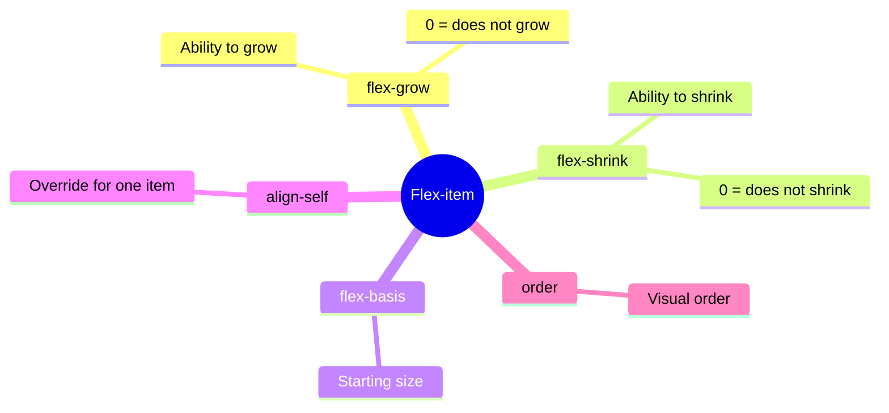
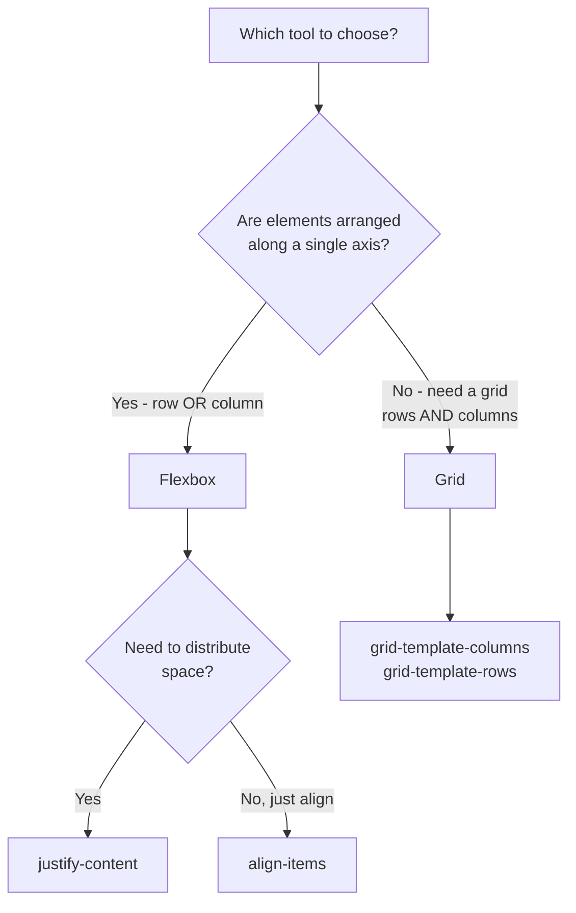

## Flexbox - Advanced Level and Grid

> **Connection with the previous lesson:** in the last lesson we mastered basic Flexbox - the container and overall alignment of a group of elements. Today we learn to manage **individual** flex items separately, and then get introduced to CSS Grid - a tool for truly two-dimensional layouts.

---

## Lesson Goal

Solidify Flexbox at the level of individual items (not just the container) and master the basics of CSS Grid - understand when to use Flexbox and when to use Grid.

## What You Will Learn by the End of the Lesson

- Manage individual flex items using `flex-grow`, `flex-shrink`, `flex-basis`, `align-self`, `order`.
- Create a grid using `display: grid`, `grid-template-columns`/`grid-template-rows`.
- Use `gap` in the context of Grid.
- Understand the practical rule for choosing between Flexbox (1D) and Grid (2D).
- Build a card grid (gallery) using Grid.

---

## Lesson Timeline

|Block|Content|
|---|---|
|1. Individual flex item properties|flex-grow, flex-shrink, flex-basis, align-self, order|
|2. Mini-task|Stretch an element independently|
|3. Introduction to CSS Grid|display: grid, grid-template-columns/rows|
|4. gap in Grid|Spacing between grid cells|
|5. Flexbox vs Grid: when to use which|Practical rule for 1D vs 2D|
|6. Summary and practice|Card grid (gallery) using Grid|


---

## Block 1. Individual Flex Item Properties

In the last lesson, all properties (`justify-content`, `align-items`, `flex-wrap`) were applied to the **container** and equally affected all child elements at once. Today we cover properties that are set on an **individual element** inside the flex container - and allow that specific element to behave differently from its "neighbors."

### `flex-grow` - the ability to grow

**In simple terms:** imagine that after all elements are placed in a container, there is free space remaining. By default, it simply stays empty. `flex-grow` determines **how eagerly** an element will "take" a portion of that free space, increasing in size.

```css
.item {
    flex-grow: 0;  /* default value - don't grow at all */
}
```

```html
<div class="container">
    <div class="item item-1">1</div>
    <div class="item item-2">2</div>
    <div class="item item-3">3</div>
</div>
```

```css
.item-2 {
    flex-grow: 1;
}
```

Here **only** `.item-2` will take all the available free space, increasing in size, while `.item-1` and `.item-3` will remain as they were originally (because their `flex-grow` defaults to `0`).

If you set `flex-grow: 1;` on **all three** elements - the free space will be distributed **equally** among all three. If you set different values (e.g., `1`, `2`, `1`) - the space will be distributed **proportionally** to those numbers: the element with `flex-grow: 2` will take twice as much free space as its neighbors with `flex-grow: 1`.

**Analogy:** imagine three people sharing a remaining piece of pizza. If all three have the same "appetite" (`flex-grow: 1` each) - the piece is split equally. If one has twice the appetite (`flex-grow: 2`) - they get twice as big a slice compared to the others.

### `flex-shrink` - the ability to shrink

Works on reverse logic - determines **how eagerly** an element will **decrease** in size if the container doesn't have enough space to fit all elements at their original size.

```css
.item {
    flex-shrink: 1;  /* default value - shrink when space runs out */
}
```

If you set `flex-shrink: 0;` - the element will **refuse** to shrink, even if it "overflows" beyond the container or pushes out its neighbors. This is useful, for example, for a logo in a site header that shouldn't distort or compress under any circumstances, unlike the other, more flexible elements next to it.

### `flex-basis` - the starting size before distribution

Sets the **initial** size of the element along the main axis, **before** `flex-grow`/`flex-shrink` come into play.

```css
.item {
    flex-basis: 200px;
}
```

This is similar to `width` (with `flex-direction: row`), but with an important difference: `flex-basis` is the "starting point" for growth/shrink calculations, whereas regular `width` may be ignored or recalculated if the element has too little or, conversely, excess space.

### Shorthand: `flex`

In practice, these three properties are often set with a single shorthand:

```css
.item {
    flex: 1 1 200px;  /* flex-grow flex-shrink flex-basis */
}
```

A particularly common and useful pattern:

```css
.item {
    flex: 1;  /* equivalent to flex-grow: 1; flex-shrink: 1; flex-basis: 0; */
}
```

This makes all elements **equal width**, automatically filling all available container space evenly - a classic technique for, for example, equal-width columns.

### `align-self` - overriding alignment for a single element

We covered `align-items` in the last lesson - it's set on the **container** and equally aligns **all** elements along the cross axis. `align-self` allows **one specific element** to "step out of formation" and align differently from the rest.

```css
.container {
    display: flex;
    align-items: center;  /* all elements centered */
}

.item-special {
    align-self: flex-end;  /* but this one - at the bottom edge */
}
```

The values for `align-self` are the same as for `align-items` (`flex-start`, `flex-end`, `center`, `stretch`) - the only difference is that `align-self` is applied to a single element, overriding the container's general rule just for that element.

### `order` - visual order without changing the HTML code

By default, all flex items are displayed in the order they appear in the HTML (the default `order` value is `0` for all). The `order` property allows you to **visually** change their order without touching the HTML code.

```css
.item-1 { order: 2; }
.item-2 { order: 1; }
.item-3 { order: 3; }
```

Here, despite `.item-1` coming first in the HTML, it will visually appear **second** (because its `order` is `2`, while `.item-2` has the lower value of `1`). Elements with a lower `order` display earlier, those with a higher value later.

**Practical application:** often used in responsive design (lesson 8) - for example, to make a certain block display above others on a mobile screen, even if in the HTML code (which matters for the correct reading order for screen readers - recall lesson 8 of the HTML course!) it comes later for semantic and accessibility reasons.

**Important accessibility note:** changing the visual order via `order` **does not change** the order in which elements will be read by a screen reader or navigated via the Tab key (lesson 8 of the HTML course) - they still follow the order in the HTML code. Use `order` carefully, avoiding situations where the visual order drastically diverges from the navigation order - this can confuse users who rely on the keyboard or a screen reader.



---

### Common Beginner Mistakes

|Mistake|How to Fix|
|---|---|
|Confusing `flex-grow` (grow) and `flex-shrink` (shrink)|`grow` - "grow," taking free space; `shrink` - "shrink," when space runs out|
|Setting `align-items` on the container and expecting to then "turn it off" for a specific element using the same `align-items`|For an individual element use `align-self`, not repeated `align-items`|
|Overusing `order` where Tab navigation/screen reader order matters|Use `order` sparingly and verify that the visual order doesn't critically diverge from the code order|

---

## Block 2. Mini-Task

On your own, without looking at references, make the middle block (`.item-2`) in a row of three blocks take up **twice as much** space as its neighbors using `flex-grow`.

**Solution:**

```css
.item-1 { flex-grow: 1; }
.item-2 { flex-grow: 2; }
.item-3 { flex-grow: 1; }
```

---

## Block 3. Introduction to CSS Grid

**In simple terms:** if Flexbox is a shelf along which items are arranged in a single row (or a single column - recall the analogy from the last lesson), then **CSS Grid** is an actual shelving unit with cells organized **simultaneously** in both rows and columns. This is a **two-dimensional** tool - exactly the limitation of Flexbox that we identified at the start of the last lesson.

### Enabling Grid

```html
<div class="gallery">
    <div class="photo">1</div>
    <div class="photo">2</div>
    <div class="photo">3</div>
    <div class="photo">4</div>
    <div class="photo">5</div>
    <div class="photo">6</div>
</div>
```

```css
.gallery {
    display: grid;
}
```

On its own, `display: grid;` doesn't change anything visually yet (unlike `display: flex`, which immediately arranges elements in a row) - because we haven't described **the structure** of the grid yet: how many columns and rows it has. This is done with the following properties.

### `grid-template-columns` - defining columns

```css
.gallery {
    display: grid;
    grid-template-columns: 200px 200px 200px;
}
```

This creates a grid of **three columns**, each exactly `200px` wide. The child `.photo` elements will automatically be distributed across these columns, and when the first row's columns are filled - Grid will **automatically** start a new row below them.

### The `repeat()` function - shorthand

Writing `200px 200px 200px` for, say, 6 identical columns would be tedious. For this, there is the `repeat()` function:

```css
.gallery {
    display: grid;
    grid-template-columns: repeat(3, 200px);
}
```

This is completely equivalent to the previous example - "repeat `200px` three times."

### `fr` - flexible unit of measurement (fraction)

A much more flexible and commonly used approach is the `fr` unit, which represents a **fraction of the available space**, rather than a fixed size in pixels:

```css
.gallery {
    display: grid;
    grid-template-columns: 1fr 1fr 1fr;
}
```

This creates **three equal-width** columns that together take up **the full available width** of the container, automatically adapting to the screen size - unlike fixed `200px` values, these columns won't require additional manual adjustments for different screen sizes.

You can also combine it with `repeat()`:

```css
.gallery {
    display: grid;
    grid-template-columns: repeat(3, 1fr);
}
```

You can also set unequal fractions:

```css
.layout {
    display: grid;
    grid-template-columns: 1fr 3fr;
}
```

Here the first column will take up **one quarter** of the width (1 part out of 4 total), and the second - **three quarters** (3 parts out of 4) - a classic pattern for a "sidebar + main content" layout.

### `grid-template-rows` - defining rows

Works entirely analogously, but for **rows** instead of columns:

```css
.gallery {
    display: grid;
    grid-template-columns: repeat(3, 1fr);
    grid-template-rows: 150px 150px;
}
```

**Important detail:** if you don't explicitly specify `grid-template-rows` (as we did in most examples above) - Grid still creates the necessary number of rows **automatically**, sizing them based on content. Explicitly setting `grid-template-rows` is only useful when you need **specific** row sizes rather than automatic ones.

---

### Common Beginner Mistakes

|Mistake|How to Fix|
|---|---|
|Forgetting that `display: grid;` on its own doesn't change anything without `grid-template-columns`|Always describe the grid structure via `grid-template-columns` (and, if needed, `grid-template-rows`)|
|Using only fixed `px` values for columns, causing the grid to not adapt to different screens|Prefer `fr` for flexible columns that automatically adapt to available width|
|Confusing `grid-template-columns` (for columns, i.e., vertical strips) and `grid-template-rows` (for rows, horizontal strips)|Columns (columns) are vertical divisions; rows (rows) are horizontal|

---

## Block 4. `gap` in the Context of Grid

We already encountered `gap` in the last lesson on Flexbox - in Grid, this property works exactly the same way, but becomes even more intuitive because it sets spacing **both between columns and between rows** at once.

```css
.gallery {
    display: grid;
    grid-template-columns: repeat(3, 1fr);
    gap: 20px;
}
```

If you need different spacing between columns and between rows, you can set them separately:

```css
.gallery {
    display: grid;
    grid-template-columns: repeat(3, 1fr);
    row-gap: 30px;
    column-gap: 15px;
}
```

Or using the two-value shorthand (rows first, then columns):

```css
.gallery {
    gap: 30px 15px;  /* row-gap column-gap */
}
```

---

## Block 5. Flexbox vs Grid: the Practical Rule for Choosing

This is the final conceptual block of the lesson - we bring both tools together and provide a clear practical criterion for choosing between them.

### The main rule: 1D vs 2D

**Use Flexbox** when you need to distribute elements along a **single** direction - either strictly horizontally or strictly vertically:

- navigation menu (a row of links);
- a row of buttons;
- centering a single block (horizontally and vertically at the same time - this still "fits" within Flexbox's capabilities, since it's about a single element, not a grid of many);
- elements inside a card (image on top, heading, text, button - a vertical column).

**Use Grid** when you need a **full-fledged grid** - control over both rows and columns simultaneously:

- an image gallery or product card grid with uniform cells;
- the overall page layout as a whole (header on top, sidebar on the left, main content on the right, footer on the bottom - multiple areas organized both horizontally and vertically);
- any structure that you would draw as a table (but not using `<table>` from the HTML course - remember that tables are for data, not for layout).

### Important nuance: they can (and often should) be combined

Flexbox and Grid are not mutually exclusive tools - in real projects they are constantly used **together**, at different levels of nesting:

```css
/* Grid for the overall page structure */
.page-layout {
    display: grid;
    grid-template-columns: 250px 1fr;
}

/* Flexbox for the content inside one of the grid cells */
.sidebar {
    display: flex;
    flex-direction: column;
    gap: 15px;
}
```

**Practical advice for this course:** don't try to decide in advance "I'll use only Grid" or "only Flexbox" for the entire project - the right approach is to look at the **specific task** of each individual block on the page and choose the tool that truly fits it.



---

### Common Beginner Mistakes

|Mistake|How to Fix|
|---|---|
|Using Grid where simple Flexbox would suffice (e.g., for a single row of buttons)|If the layout is one-dimensional (only a row or only a column) - Flexbox is usually simpler and sufficient|
|Trying to build a complex two-dimensional grid with a single Flexbox using `flex-wrap`|For full control over columns and rows simultaneously, use Grid instead of "hacking" with Flexbox element wrapping|
|Believing you need to choose "either Flexbox or Grid" for the entire project once and for all|Combine both tools at different nesting levels - Grid for the overall structure, Flexbox for content inside individual blocks (this is a common and absolutely normal approach)|

---

## Lesson Summary

Today you learned:

- Individual flex item properties: `flex-grow` (ability to grow), `flex-shrink` (ability to shrink), `flex-basis` (starting size), `align-self` (individual alignment), `order` (visual order without changing HTML).
- CSS Grid is enabled via `display: grid` and requires explicit structure definition via `grid-template-columns`/`grid-template-rows`.
- The `fr` unit creates flexible, proportional columns/rows that automatically adapt to available space - preferred over fixed `px` in most cases.
- `gap` in Grid sets spacing between both columns and rows of the grid simultaneously.
- Practical rule: Flexbox for one-dimensional layouts (row/column), Grid for two-dimensional (grid) - and they can be freely combined in one project at different levels.

---

## Practice (in class)

Build a card grid (gallery) using Grid based on the `projects.html` page from your HTML project:

```html
<div class="portfolio-grid">
    <div class="project-card">Project 1</div>
    <div class="project-card">Project 2</div>
    <div class="project-card">Project 3</div>
    <div class="project-card">Project 4</div>
    <div class="project-card">Project 5</div>
    <div class="project-card">Project 6</div>
</div>
```

```css
.portfolio-grid {
    display: grid;
    grid-template-columns: repeat(3, 1fr);
    gap: 20px;
}
```

Inside each `.project-card`, use Flexbox for vertical arrangement of content (image, heading, description) with even space distribution.

---

## Homework

1. Build a "services" or "my skills" block (based on `about.html`) as a Grid layout - minimum 4 cells, using `fr` for columns.
2. On the `contact.html` page, try building the overall layout using Grid: for example, `grid-template-columns: 1fr 2fr;` - a narrow column on the left (e.g., with a map or contact icons) and a wide one on the right (the feedback form from the HTML course).
3. Inside one of the Grid cells from task 1, use Flexbox for internal content arrangement (e.g., centering an icon and text inside a service card).
4. **Research task:** open DevTools on any marketplace with a product grid (e.g., an online store catalog) - find the parent grid container and check whether it uses `display: grid` or `display: flex` with `flex-wrap`. Many real projects use Grid for such grids - try to find `grid-template-columns` in their CSS.

---

[Next lesson: Typography, Color, and Background →](../7/en/Typography,%20Color,%20and%20Background.md)
