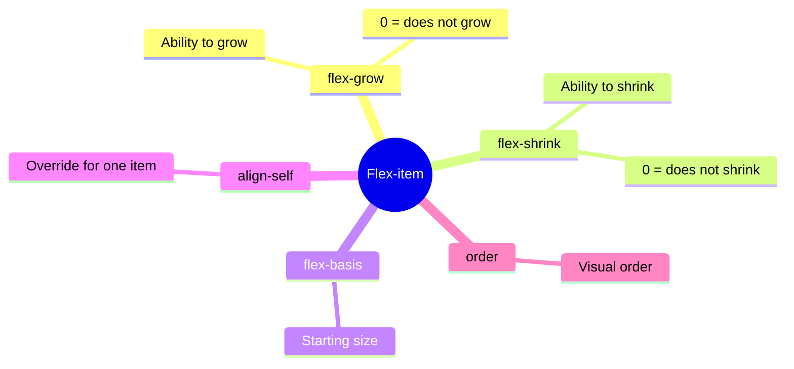
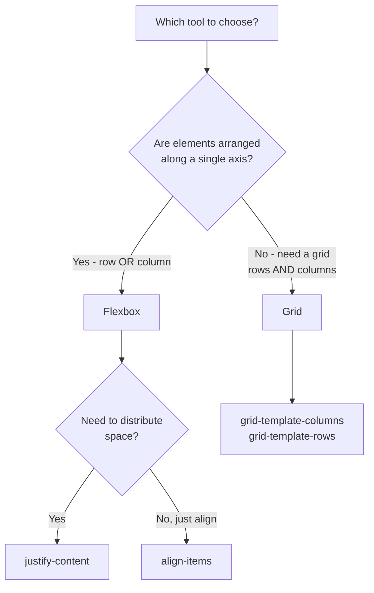

## Flexbox - продвинутый уровень и Grid

> **Связь с предыдущим уроком:** на прошлом уроке мы освоили базовый Flexbox - контейнер и общее выравнивание группы элементов. Сегодня учимся управлять **отдельными** flex-элементами по отдельности, а затем знакомимся с CSS Grid - инструментом для по-настоящему двумерных макетов.

---

## Цель урока

Закрепить Flexbox на уровне отдельных элементов (не только контейнера) и освоить основы CSS Grid - понять, когда использовать Flexbox, а когда Grid.

## Чему вы научитесь к концу урока

- Управлять отдельными flex-элементами через `flex-grow`, `flex-shrink`, `flex-basis`, `align-self`, `order`.
- Создавать сетку через `display: grid`, `grid-template-columns`/`grid-template-rows`.
- Использовать `gap` в контексте Grid.
- Понимать практическое правило выбора между Flexbox (1D) и Grid (2D).
- Собирать сетку карточек (галерею) на Grid.

---

## Хронометраж урока

|Блок|Содержание|
|---|---|
|1. Свойства отдельных flex-элементов|flex-grow, flex-shrink, flex-basis, align-self, order|
|2. Мини-задание|Растянуть элемент самостоятельно|
|3. Введение в CSS Grid|display: grid, grid-template-columns/rows|
|4. gap в Grid|Расстояние между ячейками сетки|
|5. Flexbox vs Grid: когда что использовать|Практическое правило 1D vs 2D|
|6. Итоги и практика|Сетка карточек (галерея) на Grid|


---

## Блок 1. Свойства отдельных flex-элементов

На прошлом уроке все свойства (`justify-content`, `align-items`, `flex-wrap`) применялись к **контейнеру** и одинаково влияли на все дочерние элементы разом. Сегодня разбираем свойства, которые задаются **отдельному элементу** внутри flex-контейнера - и позволяют этому конкретному элементу вести себя иначе, чем его "соседи".

### `flex-grow` - способность расти

**Простыми словами:** представьте, что в контейнере после размещения всех элементов остаётся свободное пространство. По умолчанию оно просто остаётся пустым. `flex-grow` определяет, **насколько охотно** элемент "заберёт" себе часть этого свободного пространства, увеличившись в размере.

```css
.item {
    flex-grow: 0;  /* значение по умолчанию - не расти вообще */
}
```

```html
<div class="container">
    <div class="item item-1">1</div>
    <div class="item item-2">2</div>
    <div class="item item-3">3</div>
</div>
```

```css
.item-2 {
    flex-grow: 1;
}
```

Здесь **только** `.item-2` заберёт себе всё доступное свободное пространство, увеличившись в размере, а `.item-1` и `.item-3` останутся такими, какими были изначально (потому что их `flex-grow` по умолчанию равен `0`).

Если задать `flex-grow: 1;` **всем трём** элементам - свободное пространство распределится **поровну** между всеми тремя. Если задать разные значения (например, `1`, `2`, `1`) - пространство распределится **пропорционально** этим числам: элемент с `flex-grow: 2` заберёт в два раза больше свободного места, чем соседи с `flex-grow: 1`.

**Аналогия:** представьте трёх людей, делящих оставшийся кусок пиццы. Если у всех троих одинаковый "аппетит" (`flex-grow: 1` у каждого) - кусок делится поровну. Если у одного аппетит вдвое больше (`flex-grow: 2`) - он получит вдвое больший кусок по сравнению с остальными.

### `flex-shrink` - способность сжиматься

Работает по обратной логике - определяет, **насколько охотно** элемент **уменьшится** в размере, если контейнеру не хватает места для размещения всех элементов в их изначальном размере.

```css
.item {
    flex-shrink: 1;  /* значение по умолчанию - сжиматься при нехватке места */
}
```

Если поставить `flex-shrink: 0;` - элемент **откажется** сжиматься, даже если из-за этого он "вылезет" за пределы контейнера или вытеснит соседей. Это полезно, например, для логотипа в шапке сайта, который не должен искажаться и сжиматься ни при каких условиях, в отличие от остальных, более гибких элементов рядом с ним.

### `flex-basis` - базовый размер до распределения

Задаёт **исходный** размер элемента вдоль главной оси, **до того**, как в дело вступят `flex-grow`/`flex-shrink`.

```css
.item {
    flex-basis: 200px;
}
```

Это похоже на `width` (при `flex-direction: row`), но с важным отличием: `flex-basis` - это именно "стартовая точка" для расчётов роста/сжатия, тогда как обычный `width` может быть проигнорирован или пересчитан, если элементу не хватает или, наоборот, останется избыток места.

### Сокращённая запись: `flex`

На практике эти три свойства часто задают одной сокращённой записью:

```css
.item {
    flex: 1 1 200px;  /* flex-grow flex-shrink flex-basis */
}
```

Особенно частый и полезный паттерн:

```css
.item {
    flex: 1;  /* эквивалентно flex-grow: 1; flex-shrink: 1; flex-basis: 0; */
}
```

Это делает все элементы **равной ширины**, автоматически заполняющими всё доступное пространство контейнера поровну - классический приём для, например, равных по ширине колонок.

### `align-self` - переопределение выравнивания для одного элемента

Мы разобрали `align-items` на прошлом уроке - оно задаётся **контейнеру** и одинаково выравнивает **все** элементы по поперечной оси. `align-self` позволяет **одному конкретному элементу** "выйти из общего строя" и выровняться иначе, чем остальные.

```css
.container {
    display: flex;
    align-items: center;  /* все элементы по центру */
}

.item-special {
    align-self: flex-end;  /* но именно этот - у нижнего края */
}
```

Значения у `align-self` те же самые, что и у `align-items` (`flex-start`, `flex-end`, `center`, `stretch`) - разница только в том, что `align-self` применяется к одному элементу, переопределяя общее правило контейнера именно для него.

### `order` - визуальный порядок без изменения HTML-кода

По умолчанию все flex-элементы отображаются в том порядке, в котором они написаны в HTML (значение `order` по умолчанию - `0` у всех). Свойство `order` позволяет **визуально** поменять их порядок, не трогая сам HTML-код.

```css
.item-1 { order: 2; }
.item-2 { order: 1; }
.item-3 { order: 3; }
```

Здесь, несмотря на то что в HTML `.item-1` идёт первым, визуально он отобразится **вторым** (потому что его `order` равен `2`, а у `.item-2` - меньшее значение `1`). Элементы с меньшим `order` отображаются раньше, с большим - позже.

**Практическое применение:** часто используется в адаптивной вёрстке (урок 8) - например, чтобы на мобильном экране какой-то блок отображался выше остальных, даже если в HTML-коде (важном для правильного порядка чтения скринридером - вспомните урок 8 курса HTML!) он идёт позже по смысловым, доступным причинам.

**Важная оговорка про доступность:** изменение визуального порядка через `order` **не меняет** порядок, в котором элементы будут прочитаны скринридером или обойдены клавишей Tab (урок 8 курса HTML) - они по-прежнему следуют порядку в HTML-коде. Используйте `order` осторожно, не создавая ситуацию, где визуальный порядок кардинально расходится с порядком навигации - это может запутать пользователей, полагающихся на клавиатуру или скринридер.



---

### Частые ошибки новичков

|Ошибка|Как исправить|
|---|---|
|Путают `flex-grow` (рост) и `flex-shrink` (сжатие)|`grow` - «расти», забирая свободное место; `shrink` - «сжиматься», если места не хватает|
|Задают `align-items` контейнеру, ожидая, что potом можно "выключить" его для конкретного элемента через тот же `align-items`|Для отдельного элемента используйте `align-self`, а не повторный `align-items`|
|Злоупотребляют `order` там, где важен порядок Tab-навигации/чтения скринридером|Используйте `order` умеренно и проверяйте, что визуальный порядок не расходится критично с порядком в коде|

---

## Блок 2. Мини-задание

Самостоятельно, без подглядывания, сделайте так, чтобы в ряду из трёх блоков средний блок (`.item-2`) занимал **вдвое больше** пространства, чем соседние, используя `flex-grow`.

**Решение:**

```css
.item-1 { flex-grow: 1; }
.item-2 { flex-grow: 2; }
.item-3 { flex-grow: 1; }
```

---

## Блок 3. Введение в CSS Grid

**Простыми словами:** если Flexbox - это полка, вдоль которой в один ряд (или в одну колонку) выстраиваются предметы (вспомните аналогию из прошлого урока), то **CSS Grid** - это уже настоящий стеллаж с ячейками, организованными **одновременно** и по строкам, и по столбцам. Это **двумерный** инструмент - именно то ограничение Flexbox, которое мы обозначили в начале прошлого урока.

### Включение Grid

```html
<div class="gallery">
    <div class="photo">1</div>
    <div class="photo">2</div>
    <div class="photo">3</div>
    <div class="photo">4</div>
    <div class="photo">5</div>
    <div class="photo">6</div>
</div>
```

```css
.gallery {
    display: grid;
}
```

Само по себе `display: grid;` пока ничего визуально не меняет (в отличие от `display: flex`, который сразу выстраивает элементы в ряд) - потому что мы ещё не описали **саму структуру** сетки: сколько в ней столбцов и строк. Это делается следующими свойствами.

### `grid-template-columns` - определение столбцов

```css
.gallery {
    display: grid;
    grid-template-columns: 200px 200px 200px;
}
```

Это создаёт сетку из **трёх столбцов**, каждый шириной ровно `200px`. Дочерние элементы `.photo` автоматически распределятся по этим столбцам, а когда столбцы первой строки заполнятся - Grid **сам** начнёт новую строку под ними.

### Функция `repeat()` - сокращённая запись

Писать `200px 200px 200px` для, скажем, 6 одинаковых столбцов было бы утомительно. Для этого существует функция `repeat()`:

```css
.gallery {
    display: grid;
    grid-template-columns: repeat(3, 200px);
}
```

Это полностью эквивалентно предыдущему примеру - «повтори `200px` три раза».

### `fr` - гибкая единица измерения (fraction, «доля»)

Гораздо более гибкий и часто используемый подход - единица `fr`, которая означает **долю доступного пространства**, а не фиксированный размер в пикселях:

```css
.gallery {
    display: grid;
    grid-template-columns: 1fr 1fr 1fr;
}
```

Это создаёт **три равные по ширине** колонки, которые вместе занимают **всю доступную ширину** контейнера, автоматически подстраиваясь под размер экрана - в отличие от фиксированных `200px`, эти колонки не потребуют дополнительной ручной настройки под разные размеры экрана.

Можно комбинировать и с `repeat()`:

```css
.gallery {
    display: grid;
    grid-template-columns: repeat(3, 1fr);
}
```

Можно задавать и неравные доли:

```css
.layout {
    display: grid;
    grid-template-columns: 1fr 3fr;
}
```

Здесь первый столбец займёт **четверть** ширины (1 часть из 4 общих), а второй - **три четверти** (3 части из 4) - классический паттерн для макета "боковая колонка + основной контент".

### `grid-template-rows` - определение строк

Работает полностью аналогично, но для **строк**, а не столбцов:

```css
.gallery {
    display: grid;
    grid-template-columns: repeat(3, 1fr);
    grid-template-rows: 150px 150px;
}
```

**Важная деталь:** если вы не указываете `grid-template-rows` явно (как мы делали в большинстве примеров выше) - Grid всё равно создаёт нужное количество строк **автоматически**, подбирая их высоту по содержимому. Явное указание `grid-template-rows` полезно, только когда вам нужны **конкретные** заданные размеры строк, а не автоматические.

---

### Частые ошибки новичков

|Ошибка|Как исправить|
|---|---|
|Забывают, что `display: grid;` само по себе ничего не меняет без `grid-template-columns`|Обязательно опишите структуру сетки через `grid-template-columns` (и, при необходимости, `grid-template-rows`)|
|Используют только фиксированные `px`-значения для столбцов, из-за чего сетка не подстраивается под разные экраны|Предпочитайте `fr` для гибких колонок, которые сами адаптируются под доступную ширину|
|Путают `grid-template-columns` (для столбцов, то есть вертикальных полос) и `grid-template-rows` (для строк, горизонтальных полос)|Столбцы (columns) - вертикальные разделения, строки (rows) - горизонтальные|

---

## Блок 4. `gap` в контексте Grid

Мы уже встречали `gap` в прошлом уроке про Flexbox - в Grid это свойство работает точно так же, но становится ещё нагляднее, потому что задаёт расстояние сразу **и между столбцами, и между строками**.

```css
.gallery {
    display: grid;
    grid-template-columns: repeat(3, 1fr);
    gap: 20px;
}
```

Если нужно разное расстояние между столбцами и между строками, можно задать их отдельно:

```css
.gallery {
    display: grid;
    grid-template-columns: repeat(3, 1fr);
    row-gap: 30px;
    column-gap: 15px;
}
```

Или сокращённой записью двух значений сразу (сначала строки, потом столбцы):

```css
.gallery {
    gap: 30px 15px;  /* row-gap column-gap */
}
```

---

## Блок 5. Flexbox vs Grid: практическое правило выбора

Это финальный концептуальный блок урока - сводим воедино оба инструмента и даём чёткий практический критерий выбора между ними.

### Главное правило: 1D vs 2D

**Используйте Flexbox**, когда вам нужно распределить элементы вдоль **одного** направления - либо строго по горизонтали, либо строго по вертикали:

- меню навигации (ряд ссылок);
- ряд кнопок;
- центрирование одного блока (по горизонтали и вертикали одновременно - это всё ещё "укладывается" в возможности Flexbox, поскольку речь об одном элементе, а не о сетке из многих);
- элементы внутри карточки (изображение сверху, заголовок, текст, кнопка - вертикальная колонка).

**Используйте Grid**, когда вам нужна **полноценная сетка** - контроль одновременно и над строками, и над столбцами:

- галерея изображений или сетка карточек товаров с одинаковыми ячейками;
- общий макет страницы целиком (шапка сверху, боковая колонка слева, основной контент справа, подвал снизу - сразу несколько областей, организованных и по горизонтали, и по вертикали);
- любая структура, которую вы бы нарисовали в виде таблицы (но не через `<table>` из курса HTML - вспомните, что таблицы предназначены для данных, а не для вёрстки макета).

### Важный нюанс: их можно (и часто нужно) комбинировать

Flexbox и Grid не являются взаимоисключающими инструментами - в реальных проектах они постоянно используются **вместе**, на разных уровнях вложенности:

```css
/* Grid для общей структуры страницы */
.page-layout {
    display: grid;
    grid-template-columns: 250px 1fr;
}

/* Flexbox для содержимого внутри одной из ячеек сетки */
.sidebar {
    display: flex;
    flex-direction: column;
    gap: 15px;
}
```

**Практический совет для этого курса:** не пытайтесь заранее решить "я буду использовать только Grid" или "только Flexbox" для всего проекта - правильный подход - смотреть на **конкретную задачу** каждого отдельного блока страницы и выбирать инструмент, который ей действительно подходит.



---

### Частые ошибки новичков

|Ошибка|Как исправить|
|---|---|
|Используют Grid там, где хватило бы простого Flexbox (например, для одного ряда кнопок)|Если раскладка одномерная (только ряд или только колонка) - Flexbox обычно проще и достаточен|
|Пытаются построить сложную двумерную сетку через один Flexbox с `flex-wrap`|Для полноценного контроля над столбцами и строками одновременно используйте Grid, а не "костыли" с переносом Flexbox-элементов|
|Считают, что нужно выбрать "или Flexbox, или Grid" для всего проекта раз и навсегда|Комбинируйте оба инструмента на разных уровнях вложенности - Grid для общей структуры, Flexbox для содержимого внутри отдельных блоков (это частый и абсолютно нормальный подход)|

---

## Итоги урока

Сегодня вы узнали:

- Свойства отдельных flex-элементов: `flex-grow` (способность расти), `flex-shrink` (способность сжиматься), `flex-basis` (стартовый размер), `align-self` (индивидуальное выравнивание), `order` (визуальный порядок без изменения HTML).
- CSS Grid включается через `display: grid` и требует явного описания структуры через `grid-template-columns`/`grid-template-rows`.
- Единица `fr` создаёт гибкие, пропорциональные колонки/строки, автоматически адаптирующиеся под доступное пространство - предпочтительнее фиксированных `px` в большинстве случаев.
- `gap` в Grid задаёт расстояние одновременно между столбцами и строками сетки.
- Практическое правило: Flexbox - для одномерных раскладок (ряд/колонка), Grid - для двумерных (сетка) - и их можно свободно комбинировать в одном проекте на разных уровнях.

---

## Практика (на занятии)

Соберите сетку карточек (галерею) на Grid на основе страницы `projects.html` из вашего HTML-проекта:

```html
<div class="portfolio-grid">
    <div class="project-card">Проект 1</div>
    <div class="project-card">Проект 2</div>
    <div class="project-card">Проект 3</div>
    <div class="project-card">Проект 4</div>
    <div class="project-card">Проект 5</div>
    <div class="project-card">Проект 6</div>
</div>
```

```css
.portfolio-grid {
    display: grid;
    grid-template-columns: repeat(3, 1fr);
    gap: 20px;
}
```

Внутри каждой `.project-card` используйте Flexbox для вертикального расположения содержимого (изображение, заголовок, описание) с одинаковым распределением пространства.

---

## Домашнее задание

1. Сверстайте блок "услуги" или "мои навыки" (на основе `about.html`) в виде сетки на Grid - минимум 4 ячейки, с использованием `fr` для колонок.
2. На странице `contact.html` попробуйте построить общий макет через Grid: например, `grid-template-columns: 1fr 2fr;` - узкая колонка слева (например, с картой или иконками контактов) и широкая справа (форма обратной связи из курса HTML).
3. Внутри одной из ячеек Grid из задания 1 используйте Flexbox для внутреннего расположения содержимого (например, центрирование иконки и текста внутри карточки услуги).
4. **Исследовательское задание:** откройте DevTools на любом маркетплейсе с сеткой товаров (например, каталог интернет-магазина) - найдите родительский контейнер сетки и проверьте, использует ли он `display: grid` или `display: flex` с `flex-wrap`. Многие реальные проекты используют именно Grid для таких сеток - попробуйте найти `grid-template-columns` в их CSS.

---

[Следующий урок: Типографика, цвет, фон →](../7/ru/Типографика,%20цвет,%20фон.md)
