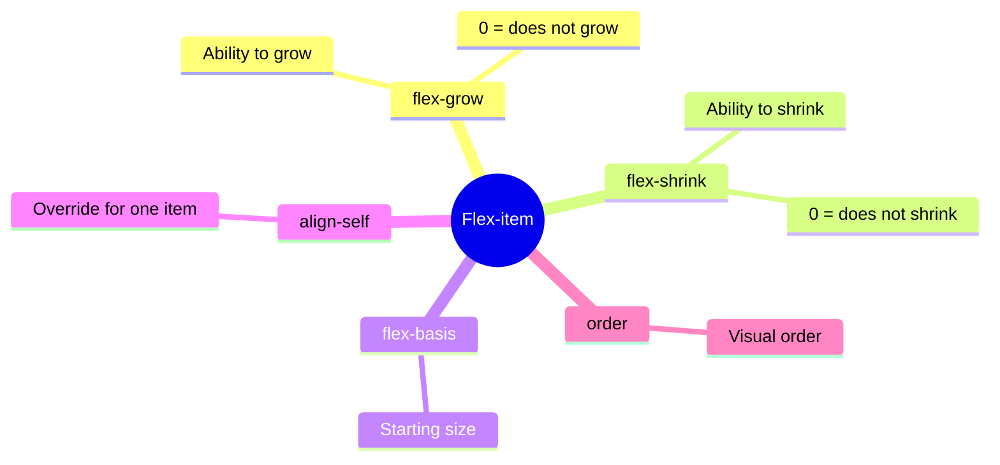
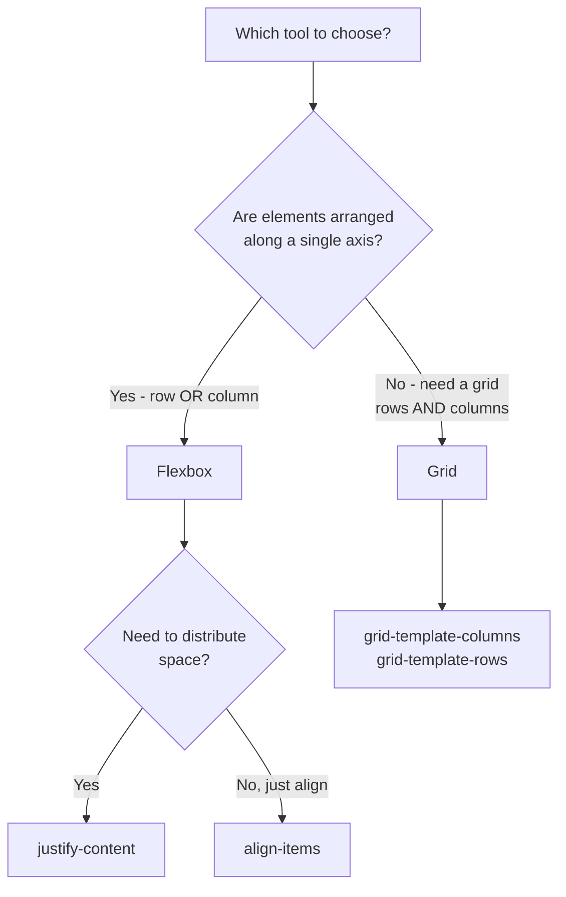

## Flexbox - rivojlangan daraja va Grid

> **Oldingi dars bilan bog'liqlik:** o'tgan darsda biz asosiy Flexbox ni o'rgandik - konteyner va guruh elementlarining umumiy tekislashini. Bugun **alohida** flex-elementlarni boshqarishni o'rganamiz, keyin esa CSS Grid bilan tanishamiz - haqiqatan ikki o'lchamli maketlar uchun vosita.

---

## Darsning maqsadi

Flexbox ni alohida elementlar darajasida mustahkamlash (faqat konteyner emas) va CSS Grid asoslarini o'zlashtirish - qachon Flexbox, qachon Grid ishlatilishini tushunish.

## Dars oxiriga qadar nimani o'rganasiz

- Alohida flex-elementlarni `flex-grow`, `flex-shrink`, `flex-basis`, `align-self`, `order` orqali boshqarish.
- `display: grid`, `grid-template-columns`/`grid-template-rows` orqali to'r yaratish.
- Grid kontekstida `gap` dan foydalanish.
- Flexbox (1D) va Grid (2D) o'rtasidagi tanlovning amaliy qoidasini tushunish.
- Grid asosida kartochkalar to'rini (galeriyani) yig'ish.

---

## Darsning vaqt jadvali

|Blok|Mazmun|
|---|---|
|1. Alohida flex-elementlar xossalari|flex-grow, flex-shrink, flex-basis, align-self, order|
|2. Mini-vazifa|Elementni mustaqil ravishda cho'zish|
|3. CSS Grid ga kirish|display: grid, grid-template-columns/rows|
|4. Grid da gap|To'r kataklari orasidagi masofa|
|5. Flexbox vs Grid: qachon nimani ishlatish|Amaliy qoida 1D vs 2D|
|6. Xulosalar va amaliyot|Kartochkalar to'ri (galeriya) Grid da|


---

## 1-Blok. Alohida flex-elementlar xossalari

O'tgan darsda barcha xossalar (`justify-content`, `align-items`, `flex-wrap`) **konteynerga** qo'llanilgan va barcha bolalarga bir xilda ta'sir qilgan. Bugun flex-konteyner ichidagi **alohida element** uchun belgilanadigan xossalarni ko'rib chiqamiz - bu aniq elementga "qo'shnilaridan" farqli xulq-atvor ko'rsatishga imkon beradi.

### `flex-grow` - o'sish qobiliyati

**Oddiy qilib aytganda:** konteynerda barcha elementlar joylashgandan keyin bo'sh joy qolishini tasavvur qiling. Standart holatda u bo'sh qoladi. `flex-grow` element ushbu bo'sh joyning qismini o'ziga **qanchalik chog'ishtirib** olishini, kattalashishini belgilaydi.

```css
.item {
    flex-grow: 0;  /* standart qiymati - umuman o'smaslik */
}
```

```html
<div class="container">
    <div class="item item-1">1</div>
    <div class="item item-2">2</div>
    <div class="item item-3">3</div>
</div>
```

```css
.item-2 {
    flex-grow: 1;
}
```

Bu yerda **faqat** `.item-2` mavjud bo'sh joyni o'ziga oladi, kattalashadi, `.item-1` va `.item-3` dastlabki holatiga qoladi (chunki ularning `flex-grow` standart qiymati `0` ga teng).

Agar **uchala** elementga `flex-grow: 1;` belgilansa - bo'sh joy uchala orasida **tekis taqsimlanadi**. Turli qiymatlar belgilansa (masalan, `1`, `2`, `1`) - joy shu sonlarga **proporsional taqsimlanadi**: `flex-grow: 2` ga ega element qo'shnilariga nisbatan bo'sh joyni **ikki marta ko'p** oladi.

**Analogiya:** qolgan pitsa bo'lagini bo'layotgan uch kishini tasavvur qiling. Agar uchalasining "ishhtiyoqi" bir xil bo'lsa (`flex-grow: 1`) - bo'lak teng bo'linadi. Agar bittasining ishtiyoqi ikki baravar katta bo'lsa (`flex-grow: 2`) - u qolganlariga nisbatan ikki baravar katta bo'lak oladi.

### `flex-shrink` - siqilish qobiliyati

Teskari mantiq bilan ishlaydi - konteynerda barcha elementlarning dastlabki o'lchamida joylashish uchun joy yetmaganda, element o'lchamini **qanchalik chog'ishtirib** kamaytirishini belgilaydi.

```css
.item {
    flex-shrink: 1;  /* standart qiymati - joy yetmaganda siqilish */
}
```

Agar `flex-shrink: 0;` qo'ysangiz - element siqilishdan **bosh tortadi**, hatto shu tufayli konteyner chegarasidan "chiqib ketsa" yoki qo'shnilarini siqib chiqarsa. Bu masalan, sayt sarlavhasidagi logotip uchun foydali, u hech qanday sharoitda buzilishi va siqilishi kerak emas, yonidagi boshqa ko'proq moslashuvchan elementlardan farqli o'laroq.

### `flex-basis` - taqsimlashdan oldingi asosiy o'lcham

Elementning asosiy o'q bo'yicha **dastlabki** o'lchamini belgilaydi, `flex-grow`/`flex-shrink` ishga kirishidan **oldin**.

```css
.item {
    flex-basis: 200px;
}
```

Bu `width` ga o'xshaydi (`flex-direction: row` da), lekin muhim farqi bor: `flex-basis` - bu o'sish/siqilish hisob-kitoblarining "boshlang'ich nuqtasi", oddiy `width` esa elementga joy yetmasa yoki ortiqcha bo'lsa e'tiborga olinishi yoki qayta hisoblanishi mumkin.

### Qisqacha yozuv: `flex`

Amalda bu uchta xossa ko'pincha bir qisqacha yozuvda belgilanadi:

```css
.item {
    flex: 1 1 200px;  /* flex-grow flex-shrink flex-basis */
}
```

Ayniqsa ko'p va foydali naqna:

```css
.item {
    flex: 1;  /* flex-grow: 1; flex-shrink: 1; flex-basis: 0; ga teng */
}
```

Bu barcha elementlarni **bir xil kenglikda** qiladi, avtomatik ravishda konteynerning mavjud joyni teng to'ldiradi - masalan, teng kenglikdagi ustunlar uchun klassik usul.

### `align-self` - bitta element uchun tekislashni qayta belgilash

Biz o'tgan darsda `align-items` ni ko'rib chiqdik - u **konteynerga** belgilanadi va **barcha** elementlarni ko'ndalang o'q bo'yicha tekislaydi. `align-self` **bitta aniq elementga** "umumiy qatordan chiqish" va qolganlardan boshqacha tekislanishga imkon beradi.

```css
.container {
    display: flex;
    align-items: center;  /* barcha elementlar markazda */
}

.item-special {
    align-self: flex-end;  /* lekin aynan shu - pastki qirrada */
}
```

`align-self` qiymatlari `align-items` bilan bir xil (`flex-start`, `flex-end`, `center`, `stretch`) - farqi faqat `align-self` bitta elementga qo'llaniladi, konteynerning umumiy qoidasini aynan shu element uchun qayta belgilaydi.

### `order` - HTML kodini o'zgartirmasdan vizual tartib

Standart holatda barcha flex-elementlar HTML da yozilgan tartibda ko'rsatiladi (`order` ning standart qiymati barchada `0`). `order` xossasi HTML kodiga tegmasdan ularning **vizual** tartibini o'zgartirishga imkon beradi.

```css
.item-1 { order: 2; }
.item-2 { order: 1; }
.item-3 { order: 3; }
```

Bu yerda, HTML da `.item-1` birinchi bo'lsa ham, vizual ravishda u **ikkinchi** ko'rsatiladi (chunki uning `order` qiymati `2`, `.item-2` ning qiymati esa kamroq `1`). Kamroq `order` ga ega elementlar avval, kattaroq - keyin ko'rsatiladi.

**Amaliy foydalanish:** ko'pincha moslashuvchan veb-dizaynda (8-dars) qo'llaniladi - masalan, mobil ekranda biror blok qolganlaridan yuqorida ko'rsatilsin, hatto HTML da (skrinrider to'g'ri o'qish tartibi uchun muhim - HTML kursining 8-darsini eslang!) u mazmunan keyinroq bo'lsa ham.

**Muhim eslatma:** `order` orqali vizual tartibni o'zgartirish elementlarning skrinrider yoki Tab tugmasi bilan o'qilish tartibini **o'zgartirmaydi** (HTML kursining 8-dars) - ular hali ham HTML kodidagi tartibga amal qiladi. `order` dan ehtiyotkorlik bilan foydalaning, vizual tartib navigatsiya tartibidan jiddiy ravishda farqlanadigan holat yaratmasdan - bu klaviatura yoki skrinrejderni ishlatadigan foydalanuvchilarni chalkashtirishi mumkin.



---

### Yangi boshlovchilarning tez-tez uchraydigan xatolari

|Xato|Qanday tuzatish|
|---|---|
|`flex-grow` (o'sish) va `flex-shrink` (siqilish) ni adashtirish|`grow` - "o'sish", bo'sh joyni olish; `shrink` - "siqilish", joy yetmasa kamayish|
|Konteynerga `align-items` berish, keyin uni alohida element uchun "o'chirish" mumkinligini o'ylash|Alohida element uchun `align-items` emas, `align-self` dan foydalaning|
|`order` ni Tab-navigatsiya/skrinrider o'qish tartibi muhim bo'lgan joyda haddan tashqari ishlatish|`order` ni me'yorida ishlating va vizual tartibning kod tartibidan jiddiy ravishda farqlanmasligini tekshiring|

---

## 2-Blok. Mini-vazifa

Ko'rishmasdan, mustaqil ravishda, uchta blokdan iborat qatorda o'rtadagi blok (`.item-2`) qo'shnilaridan **ikki baravar ko'p** joy egallashini ta'minlang, `flex-grow` dan foydalanib.

**Yechim:**

```css
.item-1 { flex-grow: 1; }
.item-2 { flex-grow: 2; }
.item-3 { flex-grow: 1; }
```

---

## 3-Blok. CSS Grid ga kirish

**Oddiy qilib aytganda:** Flexbox bu polka bo'lib, unga bir qator (yoki bitta ustun) bo'ylab buyumlar joylashadi (o'tgan darsdagi analogiyani eslang), **CSS Grid** esa haqiqiy javon - kataklar simultaneously satrlar va ustunlar bo'yicha tashkil etilgan. Bu **ikki o'lchamli** vosita - Flexbox ning o'sha cheklovi, uni o'tgan dars boshida belgilagandik.

### Grid ni yoqish

```html
<div class="gallery">
    <div class="photo">1</div>
    <div class="photo">2</div>
    <div class="photo">3</div>
    <div class="photo">4</div>
    <div class="photo">5</div>
    <div class="photo">6</div>
</div>
```

```css
.gallery {
    display: grid;
}
```

O'z-o'zidan `display: grid;` hali vizual hech narsa o'zgartirmaydi (`display: flex` dan farqli, u darhol elementlarni qatorda joylashtiradi) - chunki biz hali **to'rning tuzilmasini** tavsiflamadik: nechta ustun va satr bor. Bu quyidagi xossalar bilan amalga oshiriladi.

### `grid-template-columns` - ustunlarni aniqlash

```css
.gallery {
    display: grid;
    grid-template-columns: 200px 200px 200px;
}
```

Bu **uchta ustunli** to'r yaratadi, har biri aynan `200px` kenglikda. Bolalar `.photo` elementlari avtomatik ravishda shu ustunlarga taqsimlanadi, va birinchi qatorning ustunlari to'lganda - Grid **o'zi** ularning ostida yangi satr boshlaydi.

### `repeat()` funksiyasi - qisqacha yozuv

6 ta bir xil ustun uchun `200px 200px 200px` deb yozish charchatadi. Bu uchun `repeat()` funksiyasi mavjud:

```css
.gallery {
    display: grid;
    grid-template-columns: repeat(3, 200px);
}
```

Bu oldingi misolga to'liq teng - "`200px` ni uch marta takrorla".

### `fr` - moslashuvchan o'lchov birligi (fraction, "qism")

Ancha moslashuvchan va ko'p qo'llaniladigan usul - `fr` birligi, u **mavjud joyning qismini** anglatadi, pikselda belgilangan qattiq o'lchamni emas:

```css
.gallery {
    display: grid;
    grid-template-columns: 1fr 1fr 1fr;
}
```

Bu **uchta teng kenglikdagi** ustun yaratadi, ular birgalikda konteynerning **butun mavjud kengligini** egallaydi, ekran o'lchamiga avtomatik moslashadi - qattiq `200px` dan farqli, bu ustunlar turli ekran o'lchamlari uchun qo'shimcha qo'lda sozlashni talab qilmaydi.

`repeat()` bilan birlashtirish mumkin:

```css
.gallery {
    display: grid;
    grid-template-columns: repeat(3, 1fr);
}
```

Tengsiz qismlarni ham belgilash mumkin:

```css
.layout {
    display: grid;
    grid-template-columns: 1fr 3fr;
}
```

Bu yerda birinchi ustun kenglikning **to'rtdan birini** egallaydi (4 umumiy qismdan 1), ikkinchisi esa **uchdan to'rtini** (4 dan 3) - "yon ustun + asosiy kontent" maketi uchun klassik naqna.

### `grid-template-rows` - satrlarni aniqlash

Aynan shunday ishlaydi, lekin **satrlar** uchun, ustunlar emas:

```css
.gallery {
    display: grid;
    grid-template-columns: repeat(3, 1fr);
    grid-template-rows: 150px 150px;
}
```

**Muhim tafsilot:** agar siz `grid-template-rows` ni aniq ko'rsatmasangiz (yuqoridagi ko'pchilik misollarda qilganimizdek) - Grid baribir kerakli satrlar sonini **avtomatik** yaratadi, ularning balandligini kontentga moslab. `grid-template-rows` ni aniq ko'rsatish faqat satrlarning **aniq** belgilangan o'lchamlari kerak bo'lganda foydali, avtomatik emas.

---

### Yangi boshlovchilarning tez-tez uchraydigan xatolari

|Xato|Qanday tuzatish|
|---|---|
|`display: grid;` o'zi `grid-template-columns` dan boshqa hech narsa o'zgartirmaydi deb unutish|Albatta to'rning tuzilmasini `grid-template-columns` (va zarurat bo'lganda `grid-template-rows`) orqali tasvirlang|
|Faqat qattiq `px` qiymatlarini ishlatish, shuning uchun to'r turli ekranlarga moslashmaydi|Moslashuvchan ustunlar uchun `fr` ni afzal ko'ring, ular mavjud kenglikka avtomatik moslashadi|
|`grid-template-columns` (ustunlar, ya'ni vertikal chiziqlar) va `grid-template-rows` (satrlar, gorizontal chiziqlar) ni adashtirish|Ustunlar (columns) - vertikal ajratuvchilar, satrlar (rows) - gorizontal ajratuvchilar|

---

## 4-Blok. Grid kontekstidagi `gap`

Biz `gap` ni o'tgan Flexbox darsida allaqachon ko'rgan edik - Grid da bu xossa aynan shunday ishlaydi, lekin yanada ko'rinadi, chunki u masofani birdan **ustunlar orasida ham, satrlar orasida ham** belgilaydi.

```css
.gallery {
    display: grid;
    grid-template-columns: repeat(3, 1fr);
    gap: 20px;
}
```

Agar ustunlar va satrlar orasidagi masofa turlicha bo'lsa, ularni alohida belgilash mumkin:

```css
.gallery {
    display: grid;
    grid-template-columns: repeat(3, 1fr);
    row-gap: 30px;
    column-gap: 15px;
}
```

Yoki ikkita qiymatni birdan qisqacha yozish (avval satrlar, keyin ustunlar):

```css
.gallery {
    gap: 30px 15px;  /* row-gap column-gap */
}
```

---

## 5-Blok. Flexbox vs Grid: tanlovning amaliy qoidasi

Bu darsning yakuniy tushuncha bloki - ikkala vositani birlashtirib, ular o'rtasidagi aniq amaliy mezonni beramiz.

### Asosiy qoida: 1D vs 2D

**Flexbox dan foydalaning**, elementlarni **bitta** yo'nalish bo'yicha taqsimlash kerak bo'lganda - yoki qat'iy gorizontal, yoki qat'iy vertikal:

- navigatsiya menyusi (havolalar qatori);
- tugmalar qatori;
- bitta blokni markazlash (gorizontal hamda vertikal - bu hali Flexbox imkoniyatlariga "mos keladi", chunki bir element haqida gap ketmoqda, ko'plik to'ri emas);
- kartochka ichidagi elementlar (rasm yuqorida, sarlavha, matn, tugma - vertikal ustun).

**Grid dan foydalaning**, **to'liq to'r** kerak bo'lganda - satrlar va ustunlarni bir vaqtda boshqarish:

- rasmlar galeriyasi yoki teng katakli mahsulot kartochkalari to'ri;
- butun sahifaning umumiy maketi (sarlavha yuqorida, yon ustun chapda, asosiy kontent o'ngda, pastki qism pastda - birdan bir nechta hudud, gorizontal hamda vertikal tashkil etilgan);
- jadval shaklida chizilgan har qanday tuzilma (lekin HTML kursidagi `<table>` emas - jadvallar ma'lumotlar uchun, maket dizayni emasligini eslang).

### Muhim jihat: ularni (va ko'pincha kerak) birlashtirish mumkin

Flexbox va Grid bir-birini istisno qilmaydigan vositalar emas - haqiqiy loyihalarda ular doimiy ravishda **birga** ishlatiladi, turli qatlamlar darajasida:

```css
/* Grid - sahifaning umumiy tuzilmasi uchun */
.page-layout {
    display: grid;
    grid-template-columns: 250px 1fr;
}

/* Flexbox - to'rlarning biri ichidagi kontent uchun */
.sidebar {
    display: flex;
    flex-direction: column;
    gap: 15px;
}
```

**Ush kurs uchun amaliy maslahat:** "Men faqat Grid yoki faqat Flexbox ishlataman" deb oldindan qaror qilmang - to'g'ri yondashuv - har bir sahifaning alohida blokining **aniq vazifasiga** qarab va haqiqatan mos keladigan vositani tanlash.



---

### Yangi boshlovchilarning tez-tez uchraydigan xatolari

|Xato|Qanday tuzatish|
|---|---|
|Oddiy Flexbox yetadigan joyda Grid ishlatish (masalan, bitta tugmalar qatori)|Agar tartib bir o'lchamli (faqat qator yoki faqat ustun) bo'lsa - Flexbox odatda osonroq va yetarli|
|`flex-wrap` bilan bitta Flexbox orqali murakkab ikki o'lchamli to'r qurishga harakat qilish|Ustunlarni va satrlarni bir vaqtda to'liq boshqarish uchun Grid dan foydalaning, Flexbox elementlarini o'tkazish bilan "kostyalar" emas|
|"Faqat Flexbox yoki faqat Grid" tanlash kerak, butun loyiha uchun abadiy deb hisoblash|Ikkala vositani turli qatlamlar darajasida birlashtiring - Grid umumiy tuzilma uchun, Flexbox alohida bloklar ichidagi kontent uchun (bu ko'p uchraydigan va to'liq normal yondashuv)|

---

## Dars xulosalari

Bugun siz quyidagilarni bilib oldingiz:

- Alohida flex-elementlar xossalari: `flex-grow` (o'sish qobiliyati), `flex-shrink` (siqilish qobiliyati), `flex-basis` (boshlang'ich o'lcham), `align-self` (individual tekislash), `order` (HTML ni o'zgartirmasdan vizual tartib).
- CSS Grid `display: grid` orqali yoqiladi va `grid-template-columns`/`grid-template-rows` orqali tuzilmaning aniq tavsifini talab qiladi.
- `fr` birligi moslashuvchan, proporsional ustunlar/satrlar yaratadi, mavjud joyni avtomatik moslaydi - ko'pchilik hollarda qattiq `px` dan afzal.
- Grid da `gap` to'rning ustunlari va satrlari orasidagi masofani birdan belgilaydi.
- Amaliy qoida: Flexbox - bir o'lchamli tartiblar (qator/ustun) uchun, Grid - ikki o'lchamli (to'r) uchun - va ularni bir loyihada turli qatlamlar darajasida erkin birlashtirish mumkin.

---

## Amaliyot (dars paytida)

HTML loyihangizdagi `projects.html` sahifasi asosida kartochkalar to'rini (galeriyani) Grid da yig'ing:

```html
<div class="portfolio-grid">
    <div class="project-card">Loyiha 1</div>
    <div class="project-card">Loyiha 2</div>
    <div class="project-card">Loyiha 3</div>
    <div class="project-card">Loyiha 4</div>
    <div class="project-card">Loyiha 5</div>
    <div class="project-card">Loyiha 6</div>
</div>
```

```css
.portfolio-grid {
    display: grid;
    grid-template-columns: repeat(3, 1fr);
    gap: 20px;
}
```

Har bir `.project-card` ichida kontentning vertikal joylashuvi (rasm, sarlavha, tavsif) uchun Flexbox dan foydalaning, teng taqsimlangan joy bilan.

---

## Uy vazifasi

1. "Xizmatlar" yoki "Mening ko'nikmalarim" blokini (`about.html` asosida) Grid to'ri shaklida ishlang - kamida 4 katak, ustunlar uchun `fr` ishlatib.
2. `contact.html` sahifasida umumiy maketni Grid orqali qurishga harakat qiling: masalan, `grid-template-columns: 1fr 2fr;` - chapda tor ustun (masalan, xarita yoki aloqa ikonkalari bilan) va o'ngda keng (HTML kursidagi aloqa shakli).
3. 1-vazifadagi Grid kataklaridan birida Flexbox dan kontentning ichki joylashuvi uchun foydalaning (masalan, xizmat kartochkasidagi ikonka va matnni markazlash).
4. **Tadqiqot vazifasi:** mahsulotlar to'riga ega istalgan marketpleysda (masalan, internet-do'kon katalogi) DevTools ni oching - to'rning ota-ona konteynerini toping va u `display: grid` yoki `flex-wrap` bilan `display: flex` ishlatayaptimi tekshiring. Ko'pchilik haqiqiy loyihalar ana shunday to'rlar uchun Grid dan foydalanadi - ularning CSS da `grid-template-columns` topishga harakat qiling.

---

[Keyingi dars: Tipografiya, rang, fon →](Lesson-7/uz/Tipografiya,%20rang,%20fon.md)
