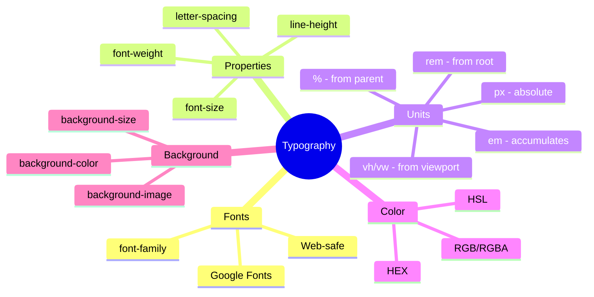
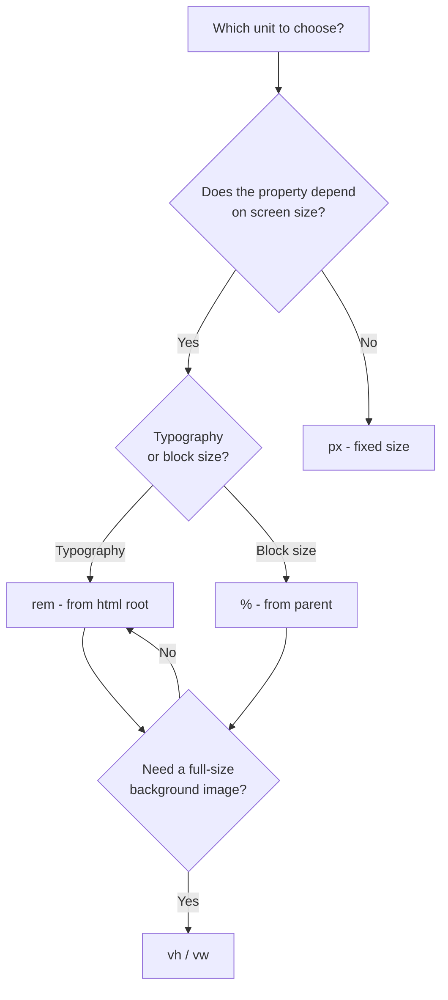

## Typography, Color, and Background

> **Connection to the previous lesson:** over the past two lessons we learned how to position blocks on a page (Flexbox and Grid). Today we switch from "positioning" to "visual appearance" - how to make text readable and pleasant, and how to make a page visually cohesive in terms of color.

---

## Lesson Objective

Learn to work with text and visual styling at a professional level: selecting fonts, configuring text readability, using different color formats, and working with background images.

## What You Will Learn by the End of the Lesson

- How to connect fonts via `font-family`, including web-safe fonts and Google Fonts.
- How to configure `font-size`, `font-weight`, `line-height`, `letter-spacing`.
- How to intentionally choose measurement units: `px`, `%`, `em`, `rem`, `vh`/`vw`.
- How to set color via HEX, RGB, RGBA, HSL and understand the differences between them.
- How to configure an element's background: `background-color`, `background-image`, `background-size`, `background-position`.

---

## Lesson Timeline

|Block|Content|
|---|---|
|1. Fonts: font-family, web-safe, Google Fonts|Font stack, connecting external fonts|
|2. font-size, font-weight, line-height, letter-spacing|Text typography|
|3. Measurement units|px, %, em, rem, vh/vw - when to use each|
|4. Mini-exercise|Configure typography on your own|
|5. Color: HEX, RGB, RGBA, HSL|Color notation formats, practical differences|
|6. Background: background-*|Color, image, size, position|
|7. Summary and practice|Styling the heading and body text of an article|


---

## Block 1. Fonts: `font-family`, Web-safe Fonts, Google Fonts

### `font-family` Syntax

```css
body {
    font-family: Arial, sans-serif;
}
```

**An important detail often overlooked by beginners:** the `font-family` value is not a single font, but a **priority list** called a **font stack**. The browser tries to use the **first** font in the list; if it's not installed on the user's device - it moves to the next one, and so on.

```css
body {
    font-family: "Helvetica Neue", Arial, sans-serif;
}
```

Here the browser will first try to apply `"Helvetica Neue"` (note the quotes - they are required if the font name consists of multiple words); if it's not available, it will try `Arial`, and if that's not available either, it will use **any** available font from the general `sans-serif` category (sans-serif font).

### General Font Categories (the required "fallback" at the end)

- **`serif`** - fonts with serifs (small "tails" at the ends of letters) - for example, Times New Roman. Often associated with printed publications and official documents.
- **`sans-serif`** - fonts without serifs, with simpler, "cleaner" letter lines - for example, Arial. The most common choice for web interfaces due to better readability on screens.
- **`monospace`** - monospaced fonts where all characters take up the same width - used, for example, for displaying program code.

**Rule of good practice:** always end your font stack with one of these general categories - this ensures that even if none of the specific fonts listed are available on the user's device, the browser will still pick a **visually similar** font rather than showing something completely unexpected.

### Web-safe Fonts

These are fonts that are highly likely to be **already installed** on most devices (Windows, macOS, mobile systems) without needing to be loaded separately - for example, Arial, Georgia, Times New Roman, Verdana, Courier New. Using only such fonts ensures that the page will look predictably the same for all users without additional loading.

### Google Fonts - Connecting an External Font

When web-safe fonts aren't sufficient for the desired visual style, you can connect one of thousands of free fonts from the **Google Fonts** service (fonts.google.com).

**Step 1.** On the Google Fonts website, select a font you like (for example, "Roboto") and add the needed weights (usually Regular and Bold are sufficient).

**Step 2.** Google will provide ready-to-use code for inserting into the `<head>` of your HTML document (we already saw the mechanism for connecting external resources via `<link>` in lesson 9 of the HTML course):

```html
<link rel="preconnect" href="https://fonts.googleapis.com">
<link rel="preconnect" href="https://fonts.gstatic.com" crossorigin>
<link href="https://fonts.googleapis.com/css2?family=Roboto:wght@400;700&display=swap" rel="stylesheet">
```

**Step 3.** Use the connected font in CSS as usual, remembering the fallback:

```css
body {
    font-family: "Roboto", sans-serif;
}
```

**Important practical recommendation:** don't overload a single page with too many different fonts - usually **one or two** fonts for the entire project are sufficient (for example, one for headings, another for body text); otherwise the page starts to look visually chaotic and unprofessional.



---

### Common Beginner Mistakes

|Mistake|How to Fix|
|---|---|
|Specifying only one specific font without a fallback: `font-family: "Roboto";`|Always end the stack with a general category: `font-family: "Roboto", sans-serif;`|
|Forgetting quotes around multi-word font names|Wrap multi-word font names in quotes: `"Helvetica Neue"`, `"Times New Roman"`|
|Connecting 4-5 different fonts for one project "for variety"|Limit yourself to one or two fonts - it looks more cohesive and professional|

---

## Block 2. `font-size`, `font-weight`, `line-height`, `letter-spacing`

### `font-size` - Text Size

```css
p {
    font-size: 16px;
}
```

We'll discuss measurement units for this property in detail in the next block - for now, let's use familiar pixels.

### `font-weight` - Font Weight (Thickness)

```css
h1 {
    font-weight: bold;      /* bold */
}

p {
    font-weight: normal;    /* normal, the default value */
}
```

You can also use numeric values for more precise control (these are only available if the specific connected font supports the desired "weights" - as we specified when connecting Google Fonts above, `wght@400;700`):

```css
h1 {
    font-weight: 700;  /* equivalent to bold */
}

p {
    font-weight: 400;  /* equivalent to normal */
}
```

The numbers are typically multiples of 100 (from 100 - thinnest, to 900 - boldest), but the actually available values depend on which weights were connected for the specific font.

### `line-height` - Line Height

```css
p {
    line-height: 1.6;
}
```

Defines the distance between lines of text within a single paragraph. **This is one of the most underestimated properties by beginners** and has a huge impact on readability: lines that are too tight (`line-height: 1;` or less) strain the eyes when reading long text, while lines that are too spaced apart visually "fall apart," losing the sense of a unified paragraph.

**Practical recommendation:** for body text in articles, a comfortable value is typically around **1.5–1.6** (without units - this is a multiplier of the current `font-size`, which makes it convenient and adaptive when the font size changes).

### `letter-spacing` - Letter Spacing

```css
h1 {
    letter-spacing: 2px;
}
```

Increases (positive value) or decreases (negative value) the distance between individual characters. Often used for headings written in uppercase (`text-transform: uppercase;`) - a small positive `letter-spacing` makes such text visually neater and more "airy," less "clumped together."

```css
.section-title {
    text-transform: uppercase;
    letter-spacing: 1px;
}
```

**Caution:** don't overuse `letter-spacing` for body text in paragraphs - a noticeable increase in letter spacing **reduces** readability of long text; it's mainly appropriate for short headings or labels.

---

### Common Beginner Mistakes

|Mistake|How to Fix|
|---|---|
|Leaving `line-height` at the default value (usually around 1.2) for long paragraphs of text|Set `line-height: 1.5;`–`1.6;` explicitly for body text - it noticeably improves readability|
|Using `letter-spacing` for long paragraphs of text|Apply `letter-spacing` only for short headings/labels, not for body text|
|Confusing `font-weight: bold` (a CSS text property) with the `<strong>` tag from the HTML course (semantic importance)|Remember: `<strong>` is about meaning (importance), CSS `font-weight` is purely about visual thickness, applicable to any text regardless of its semantic meaning|

---

## Block 3. Measurement Units: `px`, `%`, `em`, `rem`, `vh`/`vw`

This is one of the most important practical blocks of the lesson - the correct choice of measurement units greatly affects how easily your site will adapt to different screens (the topic of lesson 8).

### `px` (Pixels) - Absolute Unit

```css
p {
    font-size: 16px;
}
```

A fixed, absolute value - it doesn't depend on anything around it. Simple and predictable, but inflexible: if you want to proportionally increase **all** sizes on the page (for example, for better adaptability), you'll have to manually change each `px` value individually.

### `%` (Percentages) - Relative to the Parent

```css
.sidebar {
    width: 30%;
}
```

The value is calculated as a percentage of the corresponding size of the **parent** element. If the parent has a width of `1000px`, then `width: 30%;` will give `300px`. When the parent's size changes (for example, when adapting to a different screen), the child element **automatically** recalculates its size.

### `em` - Relative to the Parent's Font Size (or Its Own)

```css
.card {
    font-size: 20px;
    padding: 1.5em;  /* 1.5 × 20px = 30px */
}
```

One `em` unit equals the current `font-size` of **the same element** (when used for properties other than `font-size`, as in the `padding` example above) or the `font-size` of **the parent** (when used directly for `font-size` itself).

**An important and often confusing feature for beginners:** `em` **accumulates** when nested. If nested elements each have, for example, `font-size: 1.2em;` - the final font size at each nesting level will **multiply** by the previous one, quickly becoming unexpectedly large or small:

```css
.parent {
    font-size: 16px;
}

.child {
    font-size: 1.2em;  /* 1.2 × 16px = 19.2px */
}

.grandchild {
    font-size: 1.2em;  /* 1.2 × 19.2px = 23.04px, not 1.2 × 16px! */
}
```

### `rem` - Relative to the Root Element (Solving the Accumulation Problem)

```css
html {
    font-size: 16px;  /* base size from which all rem values are calculated */
}

.card {
    padding: 1.5rem;  /* always 1.5 × 16px = 24px, regardless of nesting */
}
```

`rem` (root em) stands for "em from the root" - unlike regular `em`, the value of `rem` is **always** calculated from the `font-size` of the root `<html>` element, **regardless** of the nesting level at which you use it. This completely solves the "accumulation" problem described above for `em`.

**Practical recommendation of this course:** for most modern projects, it is recommended to use **`rem`** for font sizes and spacing throughout the project (this gives the predictability of `em` without the risk of unexpected accumulation), and **`%`** where the size truly needs to depend on the specific parent (for example, the width of a column inside a Grid/Flexbox container).

### `vh` and `vw` - Relative to the Browser Window Size

```css
.hero {
    height: 100vh;  /* exactly the height of the visible screen area */
}
```

- **`vh`** (viewport height) - 1 unit equals **1%** of the browser's visible area height.
- **`vw`** (viewport width) - 1 unit equals **1%** of the browser's visible area width.

`height: 100vh;` means "height exactly equal to the full screen height" - a classic technique for, for example, a "splash screen" (hero section) on the main page, which should occupy the entire first visible screen, regardless of the user's monitor size.

### Comparison Table

|Unit|Relative to What|When to Use|
|---|---|---|
|`px`|Absolute value|Small details where precision is needed (border, sometimes margins)|
|`%`|Parent element|Width of columns inside a container|
|`em`|Parent's font-size (or own)|Local spacing that depends on the text size of this specific block|
|`rem`|Root `<html>` font-size|Font sizes and spacing throughout the project (recommended default choice)|
|`vh`/`vw`|Browser window size|Full-screen blocks, hero sections|



---

### Common Beginner Mistakes

|Mistake|How to Fix|
|---|---|
|Using `px` for absolutely everything in the project|Switch to `rem` for typography and spacing - it will make adaptation easier in lesson 8|
|Not understanding the "accumulation" effect of `em` when nesting|Use `rem` instead of `em` if you want to avoid unpredictable size accumulation|
|Setting `height: 100vh;` on an element that might contain more content than fits on screen - the content gets "clipped"|Use `min-height: 100vh;` instead of a hard `height: 100vh;` if the content might be longer than the screen|

---

## Block 4. Mini-Exercise

Configure the typography of a paragraph on your own, without looking: font size `1rem`, line height `1.6`, normal weight.

**Solution:**

```css
p {
    font-size: 1rem;
    line-height: 1.6;
    font-weight: normal;
}
```

---

## Block 5. Color: HEX, RGB, RGBA, HSL

There are several ways to write the same color in CSS - each has its own practical advantages.

### HEX - Hexadecimal Notation

```css
.box {
    color: #2c3e50;
}
```

The most common format - six characters (or three in shorthand), each pair represents the intensity of the red, green, and blue channels (`RRGGBB`) in hexadecimal notation (from `00` - minimum to `ff` - maximum).

```css
.box {
    color: #333;    /* shorthand, equivalent to #333333 */
}
```

**Pros:** compact, widely used, easy to copy from graphic editors and palettes. **Cons:** hard to understand what a specific hexadecimal value means at a glance, and impossible to set transparency directly.

### RGB - Explicit Numeric Channels

```css
.box {
    color: rgb(44, 62, 80);
}
```

The same color as `#2c3e50` in the example above, but written as explicit decimal numbers (from `0` to `255`) for the red, green, and blue channels. **Pros:** a more "human-readable" format - you can immediately see the color is dark, with a slight dominance of blue.

### RGBA - RGB with Transparency

```css
.overlay {
    background-color: rgba(0, 0, 0, 0.5);
}
```

The fourth value (`0.5`) is the **alpha channel**, which determines transparency: `0` means fully transparent (invisible), `1` means fully opaque. We already used `rgba()` in lesson 4 of this course, for the semi-transparent darkening of the modal window background.

### HSL - Intuitive Format (Hue, Saturation, Lightness)

```css
.box {
    color: hsl(210, 29%, 24%);
}
```

- **H (Hue)** - from `0` to `360` degrees on the color wheel (`0`/`360` - red, `120` - green, `240` - blue).
- **S (Saturation)** - from `0%` (completely gray, no color) to `100%` (maximumly vivid, "pure" color).
- **L (Lightness)** - from `0%` (black) to `100%` (white), `50%` - "normal" lightness of the color itself.

**Practical advantage of HSL:** this format is much more intuitive for **deliberately changing** colors manually. For example, if you have a site's primary color `hsl(210, 70%, 50%)`, and you want to get a **lighter** shade of the same color (for example, for a button hover state, topic of lesson 9) - simply increase the last value (`L`) without recalculating the entire HEX or RGB code:

```css
.button {
    background-color: hsl(210, 70%, 50%);
}

.button:hover {
    background-color: hsl(210, 70%, 40%);  /* same hue, but darker */
}
```

There's also `hsla()` - with a fourth transparency parameter, analogous to `rgba()`.

### Practical Recommendation of This Course

For specific colors copied from design mockups, **HEX** is most commonly used (because that's usually how designers provide colors). For cases where transparency is needed - **RGBA**. For situations where you're **choosing** and deliberately varying shades yourself (lighter/darker versions of the same color) - **HSL** is more convenient.

---

### Common Beginner Mistakes

|Mistake|How to Fix|
|---|---|
|Trying to set transparency through regular HEX or RGB|For transparency, use `rgba()` or `hsla()` - regular `HEX`/`RGB` don't support the alpha channel|
|Confusing the order of channels in HSL (not RGB!) - thinking the first number is "red"|In HSL, the first number is the **hue** (0-360°), not the amount of red - completely different logic than RGB|
|Mixing colors written in different formats without any system within one project|Try to stick to one primary format within a project for code consistency - it's not a strict rule, but a good practice|

---

## Block 6. Background: `background-color`, `background-image`, `background-size`, `background-position`

### `background-color`

```css
.box {
    background-color: #f4f4f4;
}
```

We've been using this property since the first lesson of the course - simply filling the background with a solid color, in any of the formats discussed above.

### `background-image` - Background Image

```css
.hero {
    background-image: url("images/hero-background.jpg");
}
```

The path to the image is specified inside `url()`, following the same rules of relative/absolute paths that we covered back in lesson 3 of the HTML course.

**Important difference from the `` tag in the HTML course:** a background image set via CSS is a **purely decorative** element - it has no equivalent of the `alt` attribute, and a screen reader will simply "not see" it and won't announce it. **Practical rule:** if an image carries meaningful information (for example, a product photo that a non-sighted user needs to "see" through a description) - use `` with a meaningful `alt` from HTML. If the image is purely decorative (texture, pattern, atmospheric background) - use `background-image` in CSS.

### `background-size` - Controlling Background Image Size

```css
.hero {
    background-image: url("images/hero-background.jpg");
    background-size: cover;
}
```

- **`cover`** - the image is scaled to **completely** cover the entire area of the element while preserving proportions (however, part of the image may be "cropped" at the edges if the element's and image's proportions don't match).
- **`contain`** - the image is scaled to **completely fit** inside the element's area while preserving proportions (however, empty areas may appear at the edges if the proportions don't match).

**Practical recommendation:** `cover` is the most common choice for "atmospheric" background images (hero sections, banners) where filling all the space without empty gaps is more important than preserving every pixel of the original image.

### `background-position` - Positioning the Image Within the Area

```css
.hero {
    background-image: url("images/hero-background.jpg");
    background-size: cover;
    background-position: center;
}
```

Determines which part of the image will be "visible" first if the image itself is larger than the available area (which usually happens with `background-size: cover`). The value `center` (both horizontally and vertically at the same time) is the safest and most commonly used default. You can also set it more precisely: `background-position: top center;`, `background-position: 20% 50%;` and so on.

### `background-repeat` - Image Repeating (Briefly)

By default, if the image is smaller than the element's area, it **repeats** (tiling the entire area like a tile) - this is useful for small textures/patterns but usually undesirable for large photos:

```css
.hero {
    background-image: url("images/hero-background.jpg");
    background-repeat: no-repeat;  /* disable repeat for large photos */
}
```

---

### Common Beginner Mistakes

|Mistake|How to Fix|
|---|---|
|Forgetting `background-size: cover;` - a large background image is displayed at its original size, cropping unpredictably|Add `background-size: cover;` for full-screen/large background images|
|Using `background-image` for images that carry important meaningful information|For meaningful content, use `` with `alt` from HTML - backgrounds in CSS are not accessible to screen readers|
|Forgetting `background-repeat: no-repeat;` for large photos that shouldn't be "tiled"|Explicitly disable repeat for photos - by default the browser will attempt to tile the area|

---

## Lesson Summary

Today you learned:

- `font-family` is set as a priority stack, always ending with a general category (`sans-serif`/`serif`/`monospace`); external fonts are connected, for example, through Google Fonts.
- `font-size`, `font-weight`, `line-height` (recommended ~1.5-1.6 for text), `letter-spacing` (moderately, mainly for headings) control typography.
- Measurement units: `px` (absolute), `%` (from parent), `em` (accumulates when nested), `rem` (from root, recommended by default for typography), `vh`/`vw` (from browser window size).
- Color: HEX (compact, the standard from design mockups), RGB/RGBA (explicit numbers, RGBA with transparency), HSL (intuitive for manually choosing shades).
- Background: `background-color`, `background-image` (decorative, not accessible to screen readers), `background-size: cover`/`contain`, `background-position`.

---

## Practice (In Class)

Style the heading and body text of an article based on your `about.html` page:

1. Connect one font from Google Fonts for headings and keep the web-safe `sans-serif` for body text (or use the same font for everything, with different `font-weight` values).
2. Set `line-height: 1.6;` for paragraphs - compare readability before and after.
3. Set the text and background color via HSL, try creating a lighter/darker variant of the same shade by changing only the last value.
4. Add a `hero` section (for example, at the top of the main page) with `background-image`, `background-size: cover;`, `background-position: center;`.

---

## Homework

1. Connect a Google Font and apply it to the entire project (at least to the headings of all pages), with a mandatory fallback of `sans-serif`/`serif` in the stack.
2. Configure readable text sizes throughout the project using `rem` - set `html { font-size: 16px; }` and use `rem` for all `font-size`/`padding`/`margin` values where `px` was used before.
3. Choose the primary color for your site (in HSL) and create at least two additional shades based on it (a lighter and a darker variant), applying them to different elements (for example, a regular button and its hover state - looking a bit ahead to lesson 9).
4. **Exploratory exercise:** open DevTools on your favorite website, find the rule for `body` (usually where the main `font-family` of the entire site is set) - what font is used? Check if there's a fallback at the end of the stack.

---

[Next lesson: Responsive Design →](Lesson-8/en/Responsive%20Design.md)
