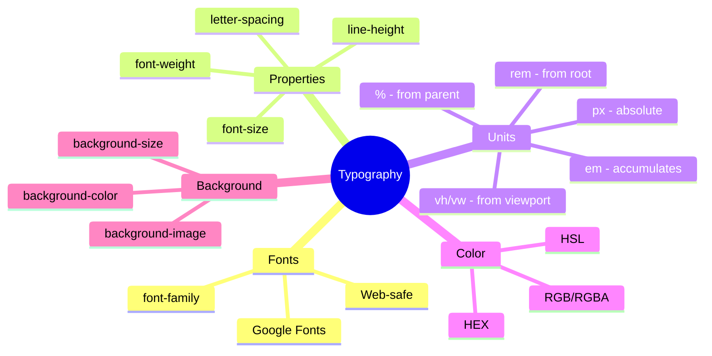
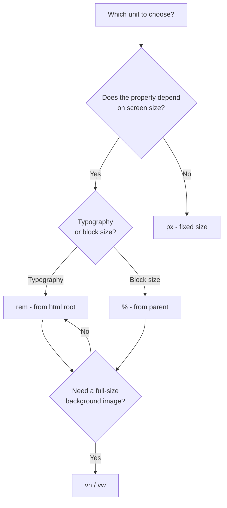

## Типографика, цвет, фон

> **Связь с предыдущим уроком:** на прошлых двух уроках мы научились располагать блоки на странице (Flexbox и Grid). Сегодня переключаемся с "расположения" на "внешний вид" - как сделать текст читаемым и приятным, а страницу - визуально согласованной по цвету.

---

## Цель урока

Научиться работать с текстом и визуальным оформлением на профессиональном уровне: подбирать шрифты, настраивать читаемость текста, использовать разные форматы цвета и работать с фоновыми изображениями.

## Чему вы научитесь к концу урока

- Подключать шрифты через `font-family`, включая веб-безопасные шрифты и Google Fonts.
- Настраивать `font-size`, `font-weight`, `line-height`, `letter-spacing`.
- Осознанно выбирать единицы измерения: `px`, `%`, `em`, `rem`, `vh`/`vw`.
- Задавать цвет через HEX, RGB, RGBA, HSL и понимать различия между ними.
- Настраивать фон элемента: `background-color`, `background-image`, `background-size`, `background-position`.

---

## Хронометраж урока

|Блок|Содержание|
|---|---|
|1. Шрифты: font-family, веб-безопасные, Google Fonts|Стек шрифтов, подключение внешнего шрифта|
|2. font-size, font-weight, line-height, letter-spacing|Типографика текста|
|3. Единицы измерения|px, %, em, rem, vh/vw - когда что уместно|
|4. Мини-задание|Настроить типографику самостоятельно|
|5. Цвет: HEX, RGB, RGBA, HSL|Форматы записи цвета, практические различия|
|6. Фон: background-*|Цвет, изображение, размер, позиция|
|7. Итоги и практика|Оформление заголовка и текста статьи|


---

## Блок 1. Шрифты: `font-family`, веб-безопасные шрифты, Google Fonts

### Синтаксис `font-family`

```css
body {
    font-family: Arial, sans-serif;
}
```

**Важная деталь, которую часто упускают новички:** значение `font-family` - это не один шрифт, а **список приоритетов**, называемый **стеком шрифтов** (font stack). Браузер пытается использовать **первый** шрифт из списка; если он не установлен на устройстве пользователя - переходит к следующему, и так далее.

```css
body {
    font-family: "Helvetica Neue", Arial, sans-serif;
}
```

Здесь браузер сначала попробует применить `"Helvetica Neue"` (обратите внимание на кавычки - они обязательны, если название шрифта состоит из нескольких слов), если его нет - попробует `Arial`, а если и его нет - использует **любой** доступный шрифт из общей категории `sans-serif` (шрифт без засечек).

### Общие категории шрифтов (обязательный "запасной вариант" в конце)

- **`serif`** - шрифты с засечками (маленькими "хвостиками" на концах букв) - например, Times New Roman. Часто ассоциируются с печатными изданиями, официальными документами.
- **`sans-serif`** - шрифты без засечек, с более простыми, "чистыми" линиями букв - например, Arial. Наиболее распространённый выбор для веб-интерфейсов благодаря лучшей читаемости на экранах.
- **`monospace`** - моноширинные шрифты, где все символы занимают одинаковую ширину - используются, например, для отображения программного кода.

**Правило хорошего тона:** всегда завершайте стек шрифтов одной из этих общих категорий - это гарантирует, что даже если ни один из указанных конкретных шрифтов недоступен на устройстве пользователя, браузер всё равно подберёт **визуально похожий** шрифт, а не покажет что-то совсем неожиданное.

### Веб-безопасные шрифты

Это шрифты, которые с высокой вероятностью **уже установлены** на большинстве устройств (Windows, macOS, мобильные системы) без необходимости их отдельно подключать - например, Arial, Georgia, Times New Roman, Verdana, Courier New. Использование только таких шрифтов гарантирует, что страница будет выглядеть одинаково предсказуемо у всех пользователей без дополнительной загрузки.

### Google Fonts - подключение внешнего шрифта

Когда веб-безопасных шрифтов недостаточно для нужного визуального стиля, можно подключить один из тысяч бесплатных шрифтов с сервиса **Google Fonts** (fonts.google.com).

**Шаг 1.** На сайте Google Fonts выберите понравившийся шрифт (например, "Roboto") и добавьте нужные начертания (обычно достаточно Regular и Bold).

**Шаг 2.** Google предоставит готовый код для вставки в `<head>` вашего HTML-документа (мы уже видели механику подключения внешних ресурсов через `<link>` в уроке 9 курса HTML):

```html
<link rel="preconnect" href="https://fonts.googleapis.com">
<link rel="preconnect" href="https://fonts.gstatic.com" crossorigin>
<link href="https://fonts.googleapis.com/css2?family=Roboto:wght@400;700&display=swap" rel="stylesheet">
```

**Шаг 3.** Используйте подключённый шрифт в CSS, как обычно, не забывая про запасной вариант:

```css
body {
    font-family: "Roboto", sans-serif;
}
```

**Важная практическая рекомендация:** не злоупотребляйте количеством разных шрифтов на одной странице - обычно достаточно **одного-двух** шрифтов на весь проект (например, один - для заголовков, другой - для основного текста), иначе страница начинает выглядеть визуально хаотичной и непрофессиональной.



---

### Частые ошибки новичков

|Ошибка|Как исправить|
|---|---|
|Указывают только один конкретный шрифт без запасного варианта: `font-family: "Roboto";`|Всегда завершайте стек общей категорией: `font-family: "Roboto", sans-serif;`|
|Забывают кавычки у названий шрифтов из нескольких слов|Многословные названия шрифтов оборачивайте в кавычки: `"Helvetica Neue"`, `"Times New Roman"`|
|Подключают 4-5 разных шрифтов на один проект "для разнообразия"|Ограничьтесь одним-двумя шрифтами - это выглядит согласованнее и профессиональнее|

---

## Блок 2. `font-size`, `font-weight`, `line-height`, `letter-spacing`

### `font-size` - размер текста

```css
p {
    font-size: 16px;
}
```

Про единицы измерения для этого свойства подробно поговорим в следующем блоке - пока используем знакомые пиксели.

### `font-weight` - насыщенность (толщина) шрифта

```css
h1 {
    font-weight: bold;      /* жирный */
}

p {
    font-weight: normal;    /* обычный, значение по умолчанию */
}
```

Можно использовать и числовые значения, дающие более точный контроль (доступны, только если конкретный подключённый шрифт поддерживает нужные "насыщенности" - как мы указывали при подключении Google Fonts выше, `wght@400;700`):

```css
h1 {
    font-weight: 700;  /* эквивалентно bold */
}

p {
    font-weight: 400;  /* эквивалентно normal */
}
```

Числа обычно кратны 100 (от 100 - самый тонкий, до 900 - самый жирный), но реально доступные значения зависят от того, какие начертания были подключены у конкретного шрифта.

### `line-height` - межстрочный интервал

```css
p {
    line-height: 1.6;
}
```

Определяет расстояние между строками текста внутри одного абзаца. **Это одно из самых недооценённых новичками свойств** с огромным влиянием на читаемость: слишком плотные строки (`line-height: 1;` или меньше) утомляют глаза при чтении длинного текста, слишком разреженные - визуально "разваливают" текст, теряя ощущение единого абзаца.

**Практическая рекомендация:** для основного текста статей обычно комфортное значение - примерно **1.5–1.6** (без единиц измерения - это множитель от текущего `font-size`, что делает его удобным и адаптивным при изменении размера шрифта).

### `letter-spacing` - расстояние между буквами

```css
h1 {
    letter-spacing: 2px;
}
```

Увеличивает (положительное значение) или уменьшает (отрицательное значение) расстояние между отдельными символами. Часто используется для заголовков, написанных заглавными буквами (`text-transform: uppercase;`) - небольшой положительный `letter-spacing` делает такой текст визуально более аккуратным и "воздушным", менее "слипшимся".

```css
.section-title {
    text-transform: uppercase;
    letter-spacing: 1px;
}
```

**Предостережение:** не злоупотребляйте `letter-spacing` для основного текста абзацев - заметное увеличение расстояния между буквами **ухудшает** читаемость длинного текста, это уместно в основном для коротких заголовков или надписей.

---

### Частые ошибки новичков

|Ошибка|Как исправить|
|---|---|
|Оставляют `line-height` по умолчанию (обычно около 1.2) для длинных абзацев текста|Задавайте явно `line-height: 1.5;`–`1.6;` для основного текста - заметно улучшает читаемость|
|Используют `letter-spacing` для длинных абзацев текста|Применяйте `letter-spacing` только для коротких заголовков/надписей, не для основного текста|
|Путают `font-weight: bold` (свойство самого текста) с тегом `<strong>` из курса HTML (семантика важности содержимого)|Помните: `<strong>` - это про смысл (важность), CSS `font-weight` - это про чисто визуальную толщину, применимую к любому тексту независимо от его смыслового значения|

---

## Блок 3. Единицы измерения: `px`, `%`, `em`, `rem`, `vh`/`vw`

Это один из самых важных практических блоков урока - правильный выбор единиц измерения сильно влияет на то, насколько легко ваш сайт будет адаптироваться под разные экраны (тема урока 8).

### `px` (пиксели) - абсолютная единица

```css
p {
    font-size: 16px;
}
```

Фиксированное, абсолютное значение - не зависит ни от чего вокруг. Простое и предсказуемое, но негибкое: если вы захотите пропорционально увеличить **все** размеры на странице (например, для лучшей адаптивности), придётся вручную менять каждое значение `px` по отдельности.

### `%` (проценты) - относительно родителя

```css
.sidebar {
    width: 30%;
}
```

Значение вычисляется как процент от соответствующего размера **родительского** элемента. Если родитель имеет ширину `1000px`, то `width: 30%;` даст `300px`. При изменении размера родителя (например, при адаптации под другой экран) дочерний элемент **автоматически** пересчитает свой размер.

### `em` - относительно размера шрифта родителя (или собственного)

```css
.card {
    font-size: 20px;
    padding: 1.5em;  /* 1.5 × 20px = 30px */
}
```

Одна единица `em` равна текущему `font-size` **этого же элемента** (при использовании для свойств, отличных от `font-size`, как в примере с `padding` выше) или `font-size` **родителя** (при использовании непосредственно для самого `font-size`).

**Важная и часто запутывающая новичков особенность:** `em` **накапливается** при вложенности. Если у вложенных друг в друга элементов у каждого стоит, например, `font-size: 1.2em;` - итоговый размер шрифта на каждом уровне вложенности будет **умножаться** на предыдущий, быстро становясь неожиданно большим или маленьким:

```css
.parent {
    font-size: 16px;
}

.child {
    font-size: 1.2em;  /* 1.2 × 16px = 19.2px */
}

.grandchild {
    font-size: 1.2em;  /* 1.2 × 19.2px = 23.04px, а не 1.2 × 16px! */
}
```

### `rem` - относительно корневого элемента (решение проблемы накопления)

```css
html {
    font-size: 16px;  /* базовый размер, от которого считаются все rem */
}

.card {
    padding: 1.5rem;  /* всегда 1.5 × 16px = 24px, независимо от вложенности */
}
```

`rem` (root em) расшифровывается как «em от корня» - в отличие от обычного `em`, значение `rem` **всегда** вычисляется от `font-size` корневого элемента `<html>`, **независимо** от того, на каком уровне вложенности вы его используете. Это полностью решает проблему "накопления", описанную выше для `em`.

**Практическая рекомендация этого курса:** для большинства современных проектов рекомендуется использовать **`rem`** для размеров шрифта и отступов по всему проекту (это даёт предсказуемость `em`, но без риска неожиданного накопления), а **`%`** - там, где размер действительно должен зависеть от конкретного родителя (например, ширина колонки внутри Grid/Flexbox-контейнера).

### `vh` и `vw` - относительно размера окна браузера

```css
.hero {
    height: 100vh;  /* ровно высота видимой области экрана */
}
```

- **`vh`** (viewport height) - 1 единица равна **1%** от высоты видимой области браузера.
- **`vw`** (viewport width) - 1 единица равна **1%** от ширины видимой области браузера.

`height: 100vh;` означает «высота ровно равна полной высоте экрана» - классический приём для, например, "экрана-заставки" (hero-секции) на главной странице, которая должна занимать весь первый видимый экран целиком, независимо от размера монитора пользователя.

### Сравнительная таблица

|Единица|Относительно чего|Когда уместно|
|---|---|---|
|`px`|Абсолютное значение|Мелкие детали, где нужна точность (border, иногда отступы)|
|`%`|Родительского элемента|Ширина колонок внутри контейнера|
|`em`|Font-size родителя (или своего)|Локальные отступы, зависящие от размера текста именно этого блока|
|`rem`|Font-size корневого `<html>`|Размеры шрифта и отступов по всему проекту (рекомендуемый выбор по умолчанию)|
|`vh`/`vw`|Размера окна браузера|Полноэкранные блоки, hero-секции|



---

### Частые ошибки новичков

|Ошибка|Как исправить|
|---|---|
|Используют `px` абсолютно для всего в проекте|Переходите на `rem` для типографики и отступов - это облегчит адаптивность в уроке 8|
|Не понимают эффект "накопления" `em` при вложенности|Используйте `rem` вместо `em`, если хотите избежать непредсказуемого накопления размеров|
|Задают `height: 100vh;` элементу, внутри которого может оказаться больше контента, чем помещается на экран - контент "обрезается"|Используйте `min-height: 100vh;` вместо жёсткого `height: 100vh;`, если содержимое может быть длиннее экрана|

---

## Блок 4. Мини-задание

Настройте типографику абзаца самостоятельно, без подглядывания: размер шрифта `1rem`, межстрочный интервал `1.6`, обычная насыщенность.

**Решение:**

```css
p {
    font-size: 1rem;
    line-height: 1.6;
    font-weight: normal;
}
```

---

## Блок 5. Цвет: HEX, RGB, RGBA, HSL

Существует несколько способов записи одного и того же цвета в CSS - у каждого свои практические удобства.

### HEX - шестнадцатеричная запись

```css
.box {
    color: #2c3e50;
}
```

Самый распространённый формат - шесть символов (или три, в сокращённой записи), каждая пара обозначает интенсивность красного, зелёного и синего каналов (`RRGGBB`) в шестнадцатеричной системе счисления (от `00` - минимум - до `ff` - максимум).

```css
.box {
    color: #333;    /* сокращённая запись, эквивалентна #333333 */
}
```

**Плюс:** компактность, широко распространён, легко копируется из графических редакторов и палитр. **Минус:** сложно "на глаз" понять, что означает конкретное шестнадцатеричное значение, и невозможно напрямую задать прозрачность.

### RGB - явные числовые каналы

```css
.box {
    color: rgb(44, 62, 80);
}
```

Тот же самый цвет, что и `#2c3e50` в примере выше, но записанный явными десятичными числами (от `0` до `255`) для красного, зелёного и синего каналов. **Плюс:** более "человекочитаемый" формат - сразу видно, что цвет тёмный, с небольшим преобладанием синего.

### RGBA - RGB с прозрачностью

```css
.overlay {
    background-color: rgba(0, 0, 0, 0.5);
}
```

Четвёртое значение (`0.5`) - это **альфа-канал**, определяющий прозрачность: `0` означает полностью прозрачный (невидимый), `1` - полностью непрозрачный. Мы уже использовали `rgba()` в уроке 4 этого курса, для полупрозрачного затемнения фона модального окна.

### HSL - интуитивный формат (оттенок, насыщенность, светлота)

```css
.box {
    color: hsl(210, 29%, 24%);
}
```

- **H (Hue, оттенок)** - от `0` до `360` градусов на цветовом круге (`0`/`360` - красный, `120` - зелёный, `240` - синий).
- **S (Saturation, насыщенность)** - от `0%` (полностью серый, без цвета) до `100%` (максимально яркий, "чистый" цвет).
- **L (Lightness, светлота)** - от `0%` (чёрный) до `100%` (белый), `50%` - "нормальная" светлота самого цвета.

**Практическое преимущество HSL:** этот формат гораздо интуитивнее для **осознанного изменения** цвета вручную. Например, если у вас есть основной цвет сайта `hsl(210, 70%, 50%)`, и вы хотите получить более **светлый** оттенок того же самого цвета (например, для состояния hover кнопки, тема урока 9) - достаточно просто увеличить последнее значение (`L`), не пересчитывая заново весь HEX или RGB код:

```css
.button {
    background-color: hsl(210, 70%, 50%);
}

.button:hover {
    background-color: hsl(210, 70%, 40%);  /* тот же оттенок, но темнее */
}
```

Есть и `hsla()` - с четвёртым параметром прозрачности, по аналогии с `rgba()`.

### Практическая рекомендация этого курса

Для конкретных, скопированных из дизайн-макета цветов чаще всего используется **HEX** (потому что именно в таком формате цвета обычно передают дизайнеры). Для случаев, где нужна прозрачность - **RGBA**. Для ситуаций, где вы **сами** подбираете и осознанно варьируете оттенки (более светлые/тёмные версии одного и того же цвета) - удобнее **HSL**.

---

### Частые ошибки новичков

|Ошибка|Как исправить|
|---|---|
|Пытаются задать прозрачность через обычный HEX или RGB|Для прозрачности используйте `rgba()` или `hsla()` - обычные `HEX`/`RGB` не поддерживают альфа-канал|
|Путают порядок каналов в HSL (не RGB!) - думают, что первое число это "красный"|В HSL первое число - это **оттенок** (0-360°), а не количество красного - совершенно другая логика, чем у RGB|
|Смешивают в одном проекте цвета, записанные вперемешку разными форматами без системы|Старайтесь придерживаться одного основного формата в рамках проекта для консистентности кода - это не строгое правило, но хорошая практика|

---

## Блок 6. Фон: `background-color`, `background-image`, `background-size`, `background-position`

### `background-color`

```css
.box {
    background-color: #f4f4f4;
}
```

Мы уже использовали это свойство с первого урока курса - просто заливка фона сплошным цветом, в любом из разобранных выше форматов.

### `background-image` - фоновое изображение

```css
.hero {
    background-image: url("images/hero-background.jpg");
}
```

Путь к изображению указывается внутри `url()`, по тем же правилам относительных/абсолютных путей, что мы разбирали ещё в уроке 3 курса HTML.

**Важное отличие от тега `` из курса HTML:** фоновое изображение, заданное через CSS, - это **чисто декоративный** элемент, у него нет аналога атрибуту `alt` - скринридер его попросту "не увидит" и не озвучит. **Практическое правило:** если изображение несёт смысловую информацию (например, фотография товара, которую важно "увидеть" и незрячему пользователю через описание) - используйте `` с осмысленным `alt` из HTML. Если изображение чисто декоративное (текстура, узор, атмосферный фон) - уместно использовать `background-image` в CSS.

### `background-size` - управление размером фонового изображения

```css
.hero {
    background-image: url("images/hero-background.jpg");
    background-size: cover;
}
```

- **`cover`** - изображение масштабируется так, чтобы **полностью** покрыть всю область элемента, сохраняя пропорции (при этом часть изображения может "обрезаться" по краям, если пропорции элемента и картинки не совпадают).
- **`contain`** - изображение масштабируется так, чтобы **полностью поместиться** внутри области элемента, сохраняя пропорции (при этом могут появиться пустые области по краям, если пропорции не совпадают).

**Практическая рекомендация:** `cover` - самый частый выбор для "атмосферных" фоновых изображений (hero-секции, баннеры), где важнее заполнить всё пространство без пустых зазоров, чем сохранить каждый пиксель исходного изображения.

### `background-position` - позиционирование изображения внутри области

```css
.hero {
    background-image: url("images/hero-background.jpg");
    background-size: cover;
    background-position: center;
}
```

Определяет, какая именно часть изображения будет "видна" в первую очередь, если само изображение больше доступной области (что обычно и происходит при `background-size: cover`). Значение `center` (по горизонтали и вертикали одновременно) - самый безопасный и часто используемый вариант по умолчанию. Можно задавать и более точно: `background-position: top center;`, `background-position: 20% 50%;` и так далее.

### `background-repeat` - повтор изображения (кратко)

По умолчанию, если изображение меньше области элемента, оно **повторяется** (замощая всю область, как плитка) - это полезно для мелких текстур/паттернов, но обычно нежелательно для крупных фотографий:

```css
.hero {
    background-image: url("images/hero-background.jpg");
    background-repeat: no-repeat;  /* отключаем повтор для крупных фото */
}
```

---

### Частые ошибки новичков

|Ошибка|Как исправить|
|---|---|
|Забывают `background-size: cover;` - крупное фоновое изображение отображается в исходном размере, обрезаясь непредсказуемо|Добавляйте `background-size: cover;` для полноэкранных/крупных фоновых изображений|
|Используют `background-image` для изображений, несущих важную смысловую информацию|Для смыслового содержимого используйте `` с `alt` из HTML - фон в CSS недоступен для скринридеров|
|Забывают `background-repeat: no-repeat;` для крупных фотографий, которые не должны "замащиваться"|Явно отключайте повтор для фото - по умолчанию браузер попытается замостить область|

---

## Итоги урока

Сегодня вы узнали:

- `font-family` задаётся стеком приоритетов, всегда завершаемым общей категорией (`sans-serif`/`serif`/`monospace`); внешние шрифты подключаются, например, через Google Fonts.
- `font-size`, `font-weight`, `line-height` (рекомендуется ~1.5-1.6 для текста), `letter-spacing` (умеренно, в основном для заголовков) управляют типографикой.
- Единицы измерения: `px` (абсолютная), `%` (от родителя), `em` (накапливается при вложенности), `rem` (от корня, рекомендуется по умолчанию для типографики), `vh`/`vw` (от размера окна браузера).
- Цвет: HEX (компактный, стандарт из дизайн-макетов), RGB/RGBA (явные числа, RGBA с прозрачностью), HSL (интуитивный для ручного подбора оттенков).
- Фон: `background-color`, `background-image` (декоративный, недоступен скринридерам), `background-size: cover`/`contain`, `background-position`.

---

## Практика (на занятии)

Оформите заголовок и абзац текста статьи на основе своей страницы `about.html`:

1. Подключите один шрифт с Google Fonts для заголовков и оставьте веб-безопасный `sans-serif` для основного текста (или используйте один и тот же шрифт для всего, с разными `font-weight`).
2. Настройте `line-height: 1.6;` для абзацев - сравните читаемость до и после.
3. Задайте цвет текста и фона через HSL, попробуйте создать более светлый/тёмный вариант того же оттенка, меняя только последнее значение.
4. Добавьте секции `hero` (например, в начало главной страницы) с `background-image`, `background-size: cover;`, `background-position: center;`.

---

## Домашнее задание

1. Подключите Google Font и примените его ко всему проекту (минимум - к заголовкам всех страниц), обязательно с запасным вариантом `sans-serif`/`serif` в стеке.
2. Настройте читаемые размеры текста через `rem` по всему проекту - задайте `html { font-size: 16px; }` и используйте `rem` для всех `font-size`/`padding`/`margin`, где раньше были `px`.
3. Выберите основной цвет своего сайта (в HSL) и создайте на его основе минимум два дополнительных оттенка (более светлый и более тёмный вариант), применив их к разным элементам (например, обычная кнопка и её hover-состояние - забегая немного вперёд к уроку 9).
4. **Исследовательское задание:** откройте DevTools на любимом сайте, найдите правило для `body` (обычно там задаётся основной `font-family` всего сайта) - какой шрифт используется? Проверьте, есть ли запасной вариант в конце стека.

---

[Следующий урок: Адаптивная вёрстка →](../8/ru/Адаптивная%20вёрстка%20(Responsive%20Design).md)
