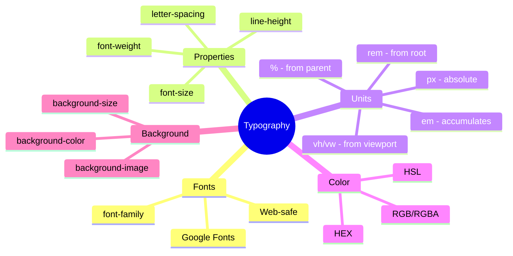
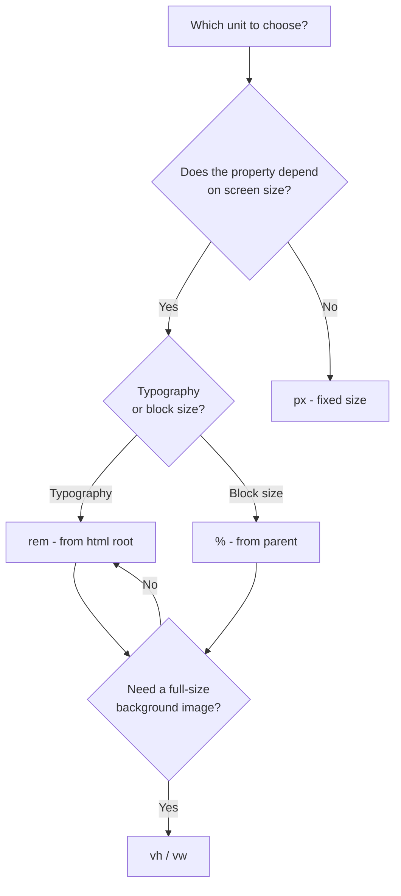

## Tipografiya, rang, fon

> **Oldingi dars bilan bog'liqlik:** o'tgan ikki darsda biz sahifada bloklarni joylashtirishni o'rgandik (Flexbox va Grid). Bugun "joylashtirish" dan "tashqi ko'rinish" ga o'tamiz - matnni qanday o'qiladigan va yoqimli qilishni, sahifani esa rang jihatidan vizual ravishda muvofiqlashtirilganini o'rganamiz.

---

## Darsning maqsadi

Matn va vizual bezatish bilan professional darajada ishlashni o'rganish: shriftlarni tanlash, matn o'qiladiganligini sozlash, rangning turli formatlarini ishlatish va fon rasmlari bilan ishlash.

## Dars oxiriga qadar nimalarni o'rganasiz

- `font-family` orqali shriftlarni ulashni, shu jumladan veb-xavfsiz shriftlar va Google Fonts.
- `font-size`, `font-weight`, `line-height`, `letter-spacing` ni sozlashni.
- O'lchov birliklarini ongli tanlashni: `px`, `%`, `em`, `rem`, `vh`/`vw`.
- Rangni HEX, RGB, RGBA, HSL orqali berishni va ular o'rtasidagi farqlarni tushunishni.
- Elementning fonini sozlashni: `background-color`, `background-image`, `background-size`, `background-position`.

---

## Darsning vaqt jadvali

|Blok|Mazmun|
|---|---|
|1. Shriftlar: font-family, veb-xavfsiz, Google Fonts|Shriftlar steki, tashqi shriftni ulash|
|2. font-size, font-weight, line-height, letter-spacing|Matn tipografiyasi|
|3. O'lchov birliklari|px, %, em, rem, vh/vw - qachon qaysi biri mos|
|4. Mini-topshiriq|Tipografiyani mustaqil sozlash|
|5. Rang: HEX, RGB, RGBA, HSL|Rang yozuv formatlari, amaliy farqlar|
|6. Fon: background-*|Rang, rasm, o'lcham, joylashuv|
|7. Xulosalar va amaliyot|Maqola sarlavhasi va matnini bezatish|


---

## 1-blok. Shriftlar: `font-family`, veb-xavfsiz shriftlar, Google Fonts

### `font-family` sintaksisi

```css
body {
    font-family: Arial, sans-serif;
}
```

**Yangi boshlovchilar ko'p e'tiborsiz qoldiradigan muhim tafsilot:** `font-family` qiymati - bu bitta shrift emas, balki **ustunliklar ro'yxati**, deb ataladigan **shriftlar steki** (font stack). Brauzer ro'yxatdagi **birinchi** shriftni ishlatishga harakat qiladi; u foydalanuvchi qurilmasida o'rnatilmagan bo'lsa - keyingisiga o'tadi va hokazo.

```css
body {
    font-family: "Helvetica Neue", Arial, sans-serif;
}
```

Bu erda brauzer avval `"Helvetica Neue"` ni qo'llashga urinadi (diqqat qiling, tirnoq majburiy - shrift nomi bir necha so'dan iborat bo'lsa), u yo'q bo'lsa - `Arial` ni sinab ko'radi, agar u ham yo'q bo'lsa - `sans-serif` umumiy kategoriyasidan **istalgan** mavjud shriftni ishlatadi (chiziqsiz shrift).

### Shriftlarning umumiy kategoriyalari (oxirida majburiy "zaxira variant")

- **`serif`** - chiziqli shriftlar (harflarning uchida kichik " dumchalar" bor) - masalan, Times New Roman. Ko'pincha bosma nashrlar, rasmiy hujjatlar bilan bog'lanadi.
- **`sans-serif`** - chiziqsiz shriftlar, harflarning qizilroq, "toza" chiziqlari bilan - masalan, Arial. Ekranlarda eng yaxshi o'qilganlik tufayli veb-interfeyslar uchun eng keng tarqalgan tanlov.
- **`monospace`** - monokenglikli shriftlar, barcha belgilar bir xil kenglikka ega - masalan, dastur kodini ko'rsatish uchun ishlatiladi.

**Yaxshi odob qoidasi:** har doim shriftlar stekini shu umumiy kategoriyalardan biri bilan tugating - bu, hatto ko'rsatilgan aniq shriftlarning hech biri foydalanuvchi qurilmasida mavjud bo'lmasa, brauzer hali ham **vizual ravishda o'xshash** shriftni tanlashini kafolatlaydi, va butunlay kutilmagan narsa ko'rsatilmaydi.

### Veb-xavfsiz shriftlar

Bu shriftlar aksariyat qurilmalarga (Windows, macOS, mobil tizimlar) yuqori ehtimollik bilan **allaqachon o'rnatilgan** bo'lib, ularni alohida ulashning hojati yo'q - masalan, Arial, Georgia, Times New Roman, Verdana, Courier New. Faqat shu shriftlarni ishlatish sahifaning barcha foydalanuvchilar uchun oldindan aytib bo'lmaydigan darajada bir xil ko'rinishini kafolatlaydi, qo'shimcha yuklash talab qilinmaydi.

### Google Fonts - tashqi shriftni ulash

Veb-xavfsiz shriftlar kerakli vizual uslub uchun yetarli bo'lmaganda, **Google Fonts** (fonts.google.com) xizmatidan minglab bepul shriftlardan birini ulashingiz mumkin.

**1-qadam.** Google Fonts saytida yoqtirgan shriftni tanlang (masalan, "Roboto") va kerakli yozuv uslublarini qo'shing (oddatda Regular va Bold yetarli).

**2-qadam.** Google HTML hujjatining `<head>` qismiga kiritish uchun tayyor kod beradi (biz HTML kursining 9-darsida `<link>` orqali tashqi resurslarni ulash mexanikasini allaqachon ko'rgandik):

```html
<link rel="preconnect" href="https://fonts.googleapis.com">
<link rel="preconnect" href="https://fonts.gstatic.com" crossorigin>
<link href="https://fonts.googleapis.com/css2?family=Roboto:wght@400;700&display=swap" rel="stylesheet">
```

**3-qadam.** Ulangan shriftni CSS da odatdagi kabi ishlating, zaxira variantni unutmasdan:

```css
body {
    font-family: "Roboto", sans-serif;
}
```

**Muhim amaliy tavsiya:** bitta sahifada turli shriftlar sonini suiiste'mal qilmang - odatda butun loyiha uchun **bitta-ikkita** shrift yetarli (masalan, bittasi - sarlavhalar uchun, ikkinchisi - asosiy matn uchun), aks holda sahifasi vizual ravishda tartibsiz va professional emas ko'rinishga boshlaydi.



---

### Yangi boshlovchilarning ko'p uchraydigan xatolari

|Xato|Qanday tuzatish|
|---|---|
|Faqat bitta aniq shriftni zaxira variantisiz ko'rsatishlar: `font-family: "Roboto";`|Har doim stekni umumiy kategoriya bilan tugating: `font-family: "Roboto", sans-serif;`|
|Ko'p so'zli shrift nomlarida tirnoqni unutishlar|Ko'p so'zli shrift nomlarini tirnoqqa oling: `"Helvetica Neue"`, `"Times New Roman"`|
|Loyiha uchun "turlichalik" uchun 4-5 ta turli shrift ulashlar|Bitta-ikkita shrift bilan cheklangan bo'ling - bu muvofiq va professional ko'rinadi|

---

## 2-blok. `font-size`, `font-weight`, `line-height`, `letter-spacing`

### `font-size` - matn o'lchami

```css
p {
    font-size: 16px;
}
```

Bu xususiyat uchun o'lchov birliklari haqida keyingi blokda batafsil gaplashamiz - hozircha tanish piksellarni ishlatamiz.

### `font-weight` - shrift to'yinganligi (qalinligi)

```css
h1 {
    font-weight: bold;      /* qalin */
}

p {
    font-weight: normal;    /* oddiy, standart qiymat */
}
```

Aniqroq boshqaruv beradigan raqamli qiymatlar ham ishlatish mumkin (ular faqat ulangan aniq shrift kerakli "to'yinganliklarni" qo'llab-quvvatlasa mavjud - Google Fonts ni ulaganda ko'rsatgandek, `wght@400;700`):

```css
h1 {
    font-weight: 700;  /* bold ga teng */
}

p {
    font-weight: 400;  /* normal ga teng */
}
```

Raqamlar odatda 100 ga karrali (100 - eng ingichka, 900 - eng qalin), lekin mavjud qiymatlar aniq shriftga qanday yozuv uslublari ulanganligiga bog'liq.

### `line-height` - satrlararo masofa

```css
p {
    line-height: 1.6;
}
```

Bitta abzacsdagi matn satrlari o'rtasidagi masofani belgilaydi. **Bu yangi boshlovchilar tomonidan eng past baholanadigan xususiyatlardan biri** bo'lib, o'qiladiganlikka katta ta'sir ko'rsatadi: juda zich satrlar (`line-length: 1;` yoki kamroq) uzoq matn o'qishda ko'zni charchatadi, juda sekin satrlar - matnni vizual ravishda "tarqatib yuboradi", yaxlit abzacs hissini yo'qotadi.

**Amaliy tavsiya:** maqolalarning asosiy matni uchun qulay qiymat - taxminan **1.5–1.6** (o'lchov birliklarisiz - bu joriy `font-size` ning ko'paytmasi, bu shrift o'lchamini o'zgartirganda qulay va moslashuvchan qiladi).

### `letter-spacing` - harflar orasidagi masofa

```css
h1 {
    letter-spacing: 2px;
}
```

Alohida belgilar o'rtasidagi masofani oshiradi (musbat qiymat) yoki kamaytiradi (manfiy qiymat). Ko'pincha katta harflar bilan yozilgan sarlavhalar uchun ishlatiladi (`text-transform: uppercase;`) - kichik musbat `letter-spacing` bunday matnni vizual ravishda yanada tartibli va "havo"liroq, kamroq "yopishgan" qiladi.

```css
.section-title {
    text-transform: uppercase;
    letter-spacing: 1px;
}
```

**Ogohlantirish:** abzacs matnining asosiy qismi uchun `letter-spacing` ni suiiste'mal qilmang - harflar orasidagi masofaning sezilarli oshishi uzoq matnning o'qiladiganligini **yomonlashtiradi**, bu asosan qisqa sarlavhalar yoki yozuvlar uchun mos.

---

### Yangi boshlovchilarning ko'p uchraydigan xatolari

|Xato|Qanday tuzatish|
|---|---|
|Uzoq matn abzacschlari uchun `line-height` ni standart holatda qoldirishlar (odatda ~1.2)|Asosiy matn uchun aniq `line-height: 1.5;`–`1.6;` belgilang - o'qiladiganlik sezilarli yaxshilanadi|
|Uzoq matn abzacschlari uchun `letter-spacing` ishlatishlar|`letter-spacing` ni faqat qisqa sarlavhalar/yozuvlar uchun qo'llang, asosiy matn uchun emas|
|`font-weight: bold` (matnning o'zining xususiyati) ni HTML kursidagi `<strong>` tegi (kontentning muhimligi semantikasi) bilan adashtirishlar|Eslab qoling: `<strong>` - bu ma'no haqida (muhimlik), CSS `font-weight` - bu sof vizual qalinlik haqida, uning ma'no qiymatidan qat'i nazar istalgan matnga qo'llaniladi|

---

## 3-blok. O'lchov birliklari: `px`, `%`, `em`, `rem`, `vh`/`vw`

Bu darsning eng muhim amaliy bloklaridan biri - o'lchov birliklarining to'g'ri tanlovi saytingizning turli ekranlarga qanday moslashishiga katta ta'sir ko'rsatadi (8-dars mavzusi).

### `px` (piksellar) - mutlaq o'lchov birlik

```css
p {
    font-size: 16px;
}
```

Qat'iy, mutlaq qiymat - hech narsaga bog'liq emas. Oddiy va bashorat qilinadigan, lekin qattiq: sahifadagi **barcha** o'lchlarni proporsional oshirmoqchi bo'lsangiz (masalan, yaxshiroq moslashuvchanlik uchun), har bir `px` qiymatini alohida qo'lda o'zgartirishingiz kerak bo'ladi.

### `%` (foiz) - ota-elementga nisbatan

```css
sidebar {
    width: 30%;
}
```

Qiymat mos **ota**-elementning o'lchamiga nisbatan foiz sifatida hisoblanadi. Agar ota-elementning kengligi `1000px` bo'lsa, `width: 30%;` natijada `300px` beradi. Ota-element o'lchami o'zgarganda (masalan, boshqa ekranga moslashganda) bola-element o'z o'lchamini **avtomatik ravishda** qayta hisoblaydi.

### `em` - ota-elementning shrift o'lchamiga nisbatan (yoki o'ziniki)

```css
.card {
    font-size: 20px;
    padding: 1.5em;  /* 1.5 × 20px = 30px */
}
```

Bir `em` birlik `font-size` ga teng **shu elementning o'zining** joriy `font-size` (yuqoridagi `padding` misolida ko'rsatilgandek, `font-size` dan boshqa xususiyatlarda ishlatilganda) yoki **ota**-elementning `font-size` (to'g'ridan-to'g'ri `font-size` uchun ishlatilganda).

**Muhim va ko'pincha yangi boshlovchalarni chalg'itadigan xususiyat:** `em` ichki qatlamlilikda **yig'iladi**. Agar bir-biriga ichki qatlamdagi elementlarning har birida masalan, `font-size: 1.2em;` bo'lsa - har bir qatlamdagi yakuniy shrift o'lchami oldingisiga **ko'paytiriladi**, tezda kutilmagan darajada katta yoki kichik bo'lib qoladi:

```css
.parent {
    font-size: 16px;
}

.child {
    font-size: 1.2em;  /* 1.2 × 16px = 19.2px */
}

.grandchild {
    font-size: 1.2em;  /* 1.2 × 19.2px = 23.04px, 1.2 × 16px emas! */
}
```

### `rem` - ildiz elementga nisbatan (yig'ilish muammosining yechimi)

```css
html {
    font-size: 16px;  /* barcha rem hisoblanadigan asosiy o'lcham */
}

.card {
    padding: 1.5rem;  /* har doim 1.5 × 16px = 24px, qatlamlilikdan qat'i nazar */
}
```

`rem` (root em) "ildizdan em" deb talqin qilinadi - oddiy `em` dan farqli o'laroq, `rem` qiymati **har doim** `<html>` ildiz elementning `font-size` dan hisoblanadi, uni qaysi qatlamlik darajasida ishlatmasligingizdan qat'i nazar. Bu yuqorida `em` uchun tasvirlangan "yig'ilish" muammosini to'liq hal qiladi.

**Ushbu kursning amaliy tavsiyasi:** ko'pchilik zamonaviy loyihalar uchun shrift o'lchamlari va oraliqlari uchun butun loyiha bo'ylab **`rem`** ishlatish tavsiya etiladi (bu `em` ning bashorat qilinadiganligini beradi, lekin kutilmagan yig'ilish xavfisiz), va **`%`** - o'lcham haqiqatan ham aniq ota-elementga bog'liq bo'lishi kerak bo'lgan joylarda (masalan, Grid/Flexbox konteyneridagi ustun kengligi).

### `vh` va `vw` - brauzer oynasining o'lchamiga nisbatan

```css
.hero {
    height: 100vh;  /* ekranning ko'rinadigan qismi bilan aniq balandlik */
}
```

- **`vh`** (viewport height) - 1 birlik brauzerning ko'rinadigan qismi balandligining **1%** ga teng.
- **`vw`** (viewport width) - 1 birlik brauzerning ko'rinadigan qismi kengligining **1%** ga teng.

`height: 100vh;` degani "balandlik ekranning to'liq balandligiga aniq teng" - bu, masalan, bosh sahifadagi "ekran-zaqovat" (hero-sektsiya) uchun klassik usul, u foydalanuvchining monitori o'lchamidan qat'i nazar, butun birinchi ko'rinadigan ekanni egallashi kerak.

### Taqqoslash jadvali

|Birlik|Nisbatan nima|Qachon mos|
|---|---|---|
|`px`|Mutlaq qiymat|Kichik tafsilotlar, aniqlik kerak bo'lganda (border, ba'zan oraliqlar)|
|`%`|Ota-elementning|Konteyner ichidagi ustunlar kengligi|
|`em`|Ota-elementning font-size (yoki o'ziniki)|Shu blokning matn o'lchamiga bog'liq lokal oraliqlar|
|`rem`|Ildiz `<html>` ning font-size|Butun loyihadagi shrift o'lchamlari va oraliqlari (standart tanlov sifatida tavsiya etiladi)|
|`vh`/`vw`|Brauzer oynasining o'lchami|To'liq ekran bloklari, hero-sektsiyalar|



---

### Yangi boshlovchilarning ko'p uchraydigan xatolari

|Xato|Qanday tuzatish|
|---|---|
|Loyihada hamma narsa uchun `px` ishlatishlar|Tipografiya va oraliqlar uchun `rem` ga o'ting - bu 8-darsda moslashuvchanlikni osonlashtiradi|
|Ichki qatlamlilikda `em` ning "yig'ilish" ta'sirini tushunmasliklar|Kutilmagan o'lchamlar yig'ilishini oldini olmoqchi bo'lsangiz `em` o'rniga `rem` ishlating|
|Ichida ekrandan ko'proq kontent bo'lishi mumkin bo'lgan elementga `height: 100vh;` berishlar - kontent "qirqiladi"|Agar kontent ekrandan uzun bo'lishi mumkin bo'lsa, qattiq `height: 100vh;` o'rniga `min-height: 100vh;` ishlating|

---

## 4-blok. Mini-topshiriq

Tipografiyani nusxalab ko'rmadan mustaqil sozlang: shrift o'lchami `1rem`, satrlararo masofa `1.6`, oddiy to'yinganlik.

**Yechim:**

```css
p {
    font-size: 1rem;
    line-height: 1.6;
    font-weight: normal;
}
```

---

## 5-blok. Rang: HEX, RGB, RGBA, HSL

Bitta rangni CSS da yozishning bir necha usuli mavjud - har birining o'z amaliy qulayligi bor.

### HEX - o'n oltilik yozuv

```css
.box {
    color: #2c3e50;
}
```

Eng keng tarqalgan format - olti belgi (yoki qisqartirilgan yozuvda uchta), har bir juftlik qizil, yashil va ko'k kanallarning intensivligini (`RRGGBB`) o'n oltilik sanoq tizimida (`00` - minimum dan `ff` - maximum gacha) bildiradi.

```css
.box {
    color: #333;    /* qisqartirilgan yozuv, #333333 ga teng */
}
```

**Afzallik:** ixchamlik, keng tarqalgan, grafik muharrirlar va palitralardan oson nusxalanadi. **Kamchilik:** aniq o'n oltilik qiymatning nimani anglatishini "ko'z bilan" tushunish qiyin, va shaffoflikni to'g'ridan-to'g'ri berish mumkin emas.

### RGB - aniq raqamli kanallar

```css
.box {
    color: rgb(44, 62, 80);
}
```

Yuqoridagi misoldagi `#2c3e50` bilan bir xil rang, lekin qizil, yashil va ko'k kanallar uchun aniq o'nlik raqamlar (`0` dan `255` gacha) bilan yozilgan. **Afzallik:** ko'proq "inson o'qiydigan" format - rang qorong'u, ozgina ko'k ustunlik bilan ekanini darhol ko'rish mumkin.

### RGBA - RGB shaffoflik bilan

```css
.overlay {
    background-color: rgba(0, 0, 0, 0.5);
}
```

To'rtinchi qiymat (`0.5`) - bu **alfa-kanal**, shaffoflikni belgilaydi: `0` to'liq shaffof (ko'rinmas), `1` - to'liq shaffof emas. Biz allaqachon ushbu kursning 4-darsida modal oynaning fonini yarim shaffof qorong'ilashtirish uchun `rgba()` ni ishlatgan edik.

### HSL - intuitiv format (ton, to'yinganlik, yorug'lik)

```css
.box {
    color: hsl(210, 29%, 24%);
}
```

- **H (Hue, ton)** - ranglar doirasidagi `0` dan `360` gacha daraja (`0`/`360` - qizil, `120` - yashil, `240` - ko'k).
- **S (Saturation, to'yinganlik)** - `0%` (butunlay kulrang, rangsiz) dan `100%` (maksimal yorqin, "toza" rang) gacha.
- **L (Lightness, yorug'lik)** - `0%` (qora) dan `100%` (oq) gacha, `50%` - rangning "oddiy" yorug'ligi.

**HSL ning amaliy ustunligi:** bu format qo'lda rangni **ongli o'zgartirish** uchun ancha intuitiv. Masalan, agar saytning asosiy rangi `hsl(210, 70%, 50%)` bo'lsa va siz xuddi shu rangning **yorug'roq** tonini olishni istasangiz (masalan, tugmaning hover holati uchun, 9-dars mavzusi) - barcha HEX yoki RGB kodni qayta hisoblamasdan, oxirgi qiymatni (`L`) oshirish yetarli:

```css
.button {
    background-color: hsl(210, 70%, 50%);
}

.button:hover {
    background-color: hsl(210, 70%, 40%);  /* xuddi shu ton, lekin qorong'iroq */
}
```

Shuningdek `hsla()` ham bor - `rgba()` ga o'xshab to'rtinchi shaffoflik parametri bilan.

### Ushbu kursning amaliy tavsiyasi

Aniq, dizayn maketidan nusxalangan ranglar uchun ko'pincha **HEX** ishlatiladi (chunki ranglar odatda dizaynerlar tomonidan aynan shu formatda beriladi). Shaffoflik kerak bo'lgan holatlar uchun - **RGBA**. Siz **o'zingiz** tonlarni tanlaydigan va ongli ravishda o'zgartiradigan (bitta rangning yorug'roq/qorong'roq versiyalari) vaziyatlar uchun - **HSL** qulayroq.

---

### Yangi boshlovchilarning ko'p uchraydigan xatolari

|Xato|Qanday tuzatish|
|---|---|
|Oddiy HEX yoki RGB orqali shaffoflik berishga harakat qilishlar|Shaffoflik uchun `rgba()` yoki `hsla()` ishlating - oddiy `HEX`/`RGB` alfa-kanalni qo'llab-quvvatlamaydi|
|HSL da kanallar tartibini adashtirishlar (RGB emas!) - birinchi raqam "qizil" deb o'ylashlar|HSL da birinchi raqam - bu **ton** (0-360°), qizil miqdori emas - RGB dan butunlay boshqa mantiq|
|Bitta loyihada turli formatlar aralashtirib yozilgan ranglarni aralashtirishlar|Loyiha doirasida kodning izchilligi uchun asosiy formatdan biriga rioya qilishga harakat qiling - bu qat'iy qoida emas, lekin yaxshi amaliyot|

---

## 6-blok. Fon: `background-color`, `background-image`, `background-size`, `background-position`

### `background-color`

```css
.box {
    background-color: #f4f4f4;
}
```

Biz bu xususiyatni kursning birinchi darsidan beri ishlatyapmiz - oddiy fonni yuqorida tushuntirilgan formatlardan birida to'liq rang bilan to'ldirish.

### `background-image` - fon rasmi

```css
.hero {
    background-image: url("images/hero-background.jpg");
}
```

Rasmga yo'l `url()` ichida ko'rsatiladi, biz HTML kursining 3-darsida tushuntirgan nisbiy/absolyut yo'llar qoidalari bo'yicha.

**HTML kursidagi `` tegidan muhim farq:** CSS orqali belgilangan fon rasmi - bu **sof dekorativ** element, uning `alt` atributiga o'xshashi yo'q - ekran o'quvchi uni oddiygina "ko'rmaydi" va ovoz chiqarmaydi. **Amaliy qoida:** agar rasm ma'nomiy axborot o'lsa (masalan, ko'zi ojiz foydalanuvchi uchun tavsif orqali "ko'rish" muhim bo'lgan mahsulot fotosi) - HTML dan ma'noli `alt` bilan `` ishlating. Agar rasm butunlay dekorativ bo'lsa (tekstura, naqsh, muhitli fon) - CSS da `background-image` ishlatish mos.

### `background-size` - fon rasmining o'lchamini boshqarish

```css
.hero {
    background-image: url("images/hero-background.jpg");
    background-size: cover;
}
```

- **`cover`** - rasm proporsiyalarni saqlab, elementning butun maydonini **to'liq** qoplash uchun masshtablanadi (bu paytda element va rasm proporsiyalari mos kelmasa, rasmning bir qismi "qirqilishi" mumkin).
- **`contain`** - rasm proporsiyalarni saqlab, elementning butun maydoniga **to'liq** sig'ishi uchun masshtablanadi (bu paytda proporsiyalar mos kelmasa, chetroqlarda bo'sh joylar paydo bo'lishi mumkin).

**Amaliy tavsiya:** `cover` - "atmosferali" fon rasmlari (hero-sektsiyalar, bannerlar) uchun eng ko'p tanlov, bu erda har bir pikselni saqlashdan ko'ra, bo'sh joylarsiz hamma joyni to'ldirish muhimroq.

### `background-position` - rasimning maydon ichidagi joylashuvi

```css
.hero {
    background-image: url("images/hero-background.jpg");
    background-size: cover;
    background-position: center;
}
```

Agar rasm o'zi mavjud maydonidan katta bo'lsa (bu odatda `background-size: cover` bilan sodir bo'ladi), qaysi qismi birinchi navbatda "ko'rinadi"ini belgilaydi. `center` qiymati (gorizontal va vertikal ravishda bir vaqtda) - eng xavfsiz va ko'p ishlatiladigan standart variant. Aniqroq ham berish mumkin: `background-position: top center;`, `background-position: 20% 50%;` va hokazo.

### `background-repeat` - rasimning takrorlanishi (qisqacha)

Standart holatda, agar rasm element maydonidan kichik bo'lsa, u **takrorlanadi** (butun maydonni, kafel kabi, to'ldiradi) - bu kichik teksturalar/patternlar uchun foydali, lekin odatda katta fotolar uchun istalmagan:

```css
.hero {
    background-image: url("images/hero-background.jpg");
    background-repeat: no-repeat;  /* katta foto uchun takrorlanishni o'chiramiz */
}
```

---

### Yangi boshlovchilarning ko'p uchraydigan xatolari

|Xato|Qanday tuzatish|
|---|---|
|`background-size: cover;` ni unutishlar - katta fon rasmi asosiy o'lchamda ko'rinadi, kutilmagan tarzda qirqiladi|To'liq ekran/katta fon rasmlari uchun `background-size: cover;` qo'shing|
|Ma'nomiy axborot olib yurgan rasmlar uchun `background-image` ishlatishlar|Ma'noli kontent uchun HTML dan `alt` bilan `` ishlating - CSS da fon ekran o'quvchilari uchun mavjud emas|
|Katta fotolar uchun `background-repeat: no-repeat;` ni unutishlar - ular "kafellanmasligi" kerak|Foto uchun takrorlanishni aniq o'chiring - standart holatda brauzer maydonni kafellashga urinadi|

---

## Dars xulosalari

Bugun siz bilib oldingiz:

- `font-family` ustunliklar steki bilan belgilanadi, har doim umumiy kategoriya (`sans-serif`/`serif`/`monospace`) bilan tugaydi; tashqi shriftlar, masalan, Google Fonts orqali ulanadi.
- `font-size`, `font-weight`, `line-height` (matn uchun ~1.5-1.6 tavsiya etiladi), `letter-spacing` (me'yorida, asosan sarlavhalar uchun) tipografiyani boshqaradi.
- O'lchov birliklari: `px` (mutlaq), `%` (otadan), `em` (ichki qatlamlilikda yig'iladi), `rem` (ildizdan, tipografiya uchun standart sifatida tavsiya etiladi), `vh`/`vw` (brauzer oynasining o'lchamidan).
- Rang: HEX (ixcham, dizayn maketlaridan standart), RGB/RGBA (aniq raqamlar, RGBA shaffoflik bilan), HSL (qo'lda ton tanlash uchun intuitiv).
- Fon: `background-color`, `background-image` (dekorativ, ekran o'quvchilari uchun mavjud emas), `background-size: cover`/`contain`, `background-position`.

---

## Amaliyot (darsda)

O'z `about.html` sahifangiz asosida maqola sarlavhasi va matn abzacsini bezating:

1. Sarlavhalar uchun Google Fonts dan bitta shrift ulang va asosiy matn uchun veb-xavfsiz `sans-serif` qoldiring (yoki butun narsa uchun bir xil shriftni turli `font-weight` bilan ishlating).
2. Abzacslar uchun `line-height: 1.6;` sozlang - o'qiladiganlikni oldindan va keyin solishtiring.
3. Matn va fon rangini HSL orqali bering, xuddi shu tonning yorug'roq/qorong'roq variantini yaratishga urinib, faqat oxirgi qiymatni o'zgartiring.
4. `background-image`, `background-size: cover;`, `background-position: center;` bilan `hero` sektsiyasini qo'shing (masalan, bosh sahifaning boshida).

---

## Uy vazifasi

1. Google Font ulang va uni butun loyhaga qo'llang (kamida - barcha sahifalar sarlavhalariga), stekda albatta zaxira variant `sans-serif`/`serif` bo'lsin.
2. Butun loyiha bo'ylab `rem` orqali o'qiladigan shrift o'lchamlarini sozlang - `html { font-size: 16px; }` belgilang va avval `px` bo'lgan barcha `font-size`/`padding`/`margin` uchun `rem` ishlating.
3. Saytning asosiy rangini tanlang (HSL da) va uning asosida kamida ikkita qo'shimcha ton yarating (yorug'roq va qorong'roq variant), ularni turli elementlarga qo'llang (masalan, oddiy tugma va uning hover holati - 9-darsga ozgina oldindan qarab).
4. **Tadqiqot topshirig'i:** sevimli saytingizda DevTools ni oching, `body` uchun qoidani toping (odatda butun saytning asosiy `font-family` si belgilanadi) - qaysi shrift ishlatiladi? Stekning oxirida zaxira variant borligini tekshiring.

---

[Keyingi dars: Moslashuvchan tiklash →](Lesson-8/uz/Moslashuvchan%20tiklash%20(Responsive%20Design).md)
