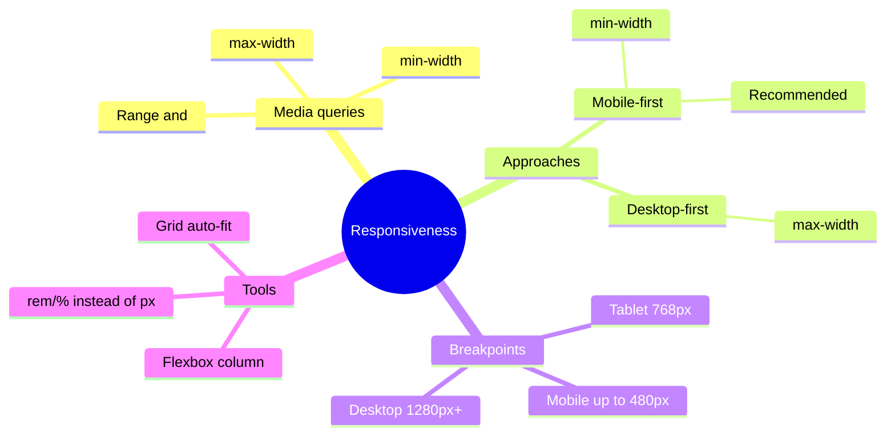
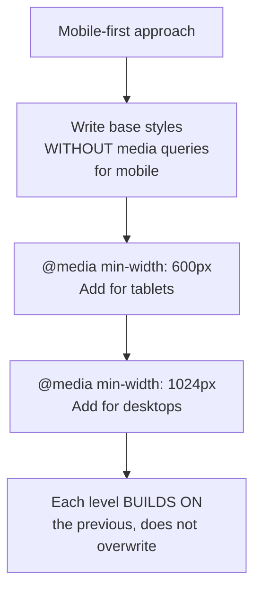

## Responsive Design

> **Connection to the previous lesson:** in the last lesson we covered typography, color, and measurement units - including preparing the groundwork in advance by choosing `rem` over hard-coded `px`. Today we assemble everything studied throughout the course (Box model, Flexbox, Grid, measurement units) into a unified system that makes the page look equally good on a phone and on a huge monitor.

---

## Lesson Objective

Learn to create pages that look correct and comfortable at any screen size - from a small smartphone to a wide desktop monitor.

## What You Will Learn by the End of the Lesson

- Explain why responsiveness is needed and how it connects to `meta viewport` from the HTML course.
- Write `@media` media queries and understand the difference between mobile-first and desktop-first approaches.
- Intentionally use relative units instead of fixed pixels in a responsive context.
- Adapt Flexbox/Grid layouts for different screen sizes.
- Test responsiveness through the device mode in DevTools.

---

## Lesson Timeline

|Block|Content|
|---|---|
|1. Why responsiveness is needed|Mobile traffic, connection to viewport from HTML|
|2. Media queries @media: syntax|Basic syntax, conditions|
|3. Breakpoints and approaches|Mobile-first vs desktop-first|
|4. Relative units in responsive design|Why rem/% are better than px for responsive projects|
|5. Mini-exercise|Write a media query on your own|
|6. Flexbox/Grid adaptation|flex-direction: column, changing grid-template-columns|
|7. Testing in DevTools|Device mode|
|8. Summary and practice|Adapting navigation and card grid|


---

## Block 1. Why Responsiveness Is Needed

**In simple terms:** just 15 years ago, virtually everyone accessed the internet from a desktop computer with one, relatively predictable screen size. Today, the same website can open on a small smartphone screen (320–430px wide), on a tablet (768–1024px), on a laptop (1280–1440px), and on a huge desktop monitor (1920px and above) - and in all these cases, the website must remain **easy to use**, not just "not broken."

**Responsive design** is an approach where the same HTML/CSS code automatically adapts to the screen width of the device on which the site is opened - without creating separate "mobile" and "desktop" versions of the site.

### Connection to `meta viewport` from the HTML Course

Recall lesson 9 of the HTML course - we already laid the foundation for today's topic:

```html
<meta name="viewport" content="width=device-width, initial-scale=1.0">
```

We said back then: "without this tag, any responsive design done later through CSS won't work correctly on mobile devices." Today has come when we finally reach that "later" - if your pages don't have this meta tag yet, add it right now, before starting the practice in this lesson, otherwise everything we do from here on simply won't work as expected on real mobile devices.

### Why This Is Not an Optional "Feature" but a Necessity

A significant (often - the majority) portion of traffic on most websites today comes from mobile devices. A site that looks normal only on a wide screen but turns into an unreadable chaos of overlapping elements on a phone is not a minor oversight - it's a serious problem that can cost the site the majority of its visitors.



---

## Block 2. Media Queries `@media`: Syntax

**In simple terms:** a media query is a conditional construct in CSS of the form "if the screen meets such-and-such condition - apply these additional styles." This allows you to write **different** sets of CSS rules for **different** screen width ranges.

### Basic Syntax

```css
.container {
    width: 100%;
}

@media (max-width: 768px) {
    .container {
        width: 100%;
        padding: 10px;
    }
}
```

Let's break down the structure: `@media` - the keyword, `(max-width: 768px)` - the **condition** (means "if the browser window width is **no more** than 768px"), and inside the curly braces - regular CSS rules that will apply **only** when this condition is met.

### Main Conditions

```css
@media (max-width: 768px) {
    /* styles will apply when screen width ≤ 768px */
}

@media (min-width: 1024px) {
    /* styles will apply when screen width ≥ 1024px */
}
```

- **`max-width`** - "maximum" - the condition triggers when the screen is **narrower** than or equal to this value (usually used for "styles for small screens").
- **`min-width`** - "minimum" - the condition triggers when the screen is **wider** than or equal to this value (usually used for "styles for large screens").

### Combining Conditions (Range)

```css
@media (min-width: 768px) and (max-width: 1023px) {
    /* styles will apply only in the range from 768px to 1023px - for example, specifically for tablets */
}
```

The keyword `and` combines multiple conditions - styles will apply only if **all** listed conditions are met simultaneously.

### Important Detail: the Order of Rules in the File Matters

```css
.box {
    background-color: blue;
}

@media (max-width: 600px) {
    .box {
        background-color: red;
    }
}
```

Here, at a screen width of 600px or less, the **later** rule (inside the media query) will win - because, as we discussed in lesson 2 about the cascade, when specificity is equal, what is written later in the file wins. If you had **mistakenly** placed the media query **above** and the regular rule `.box { background-color: blue; }` **below** it, the regular rule would override the media query, and the responsive style would simply never take effect, regardless of screen size.

**Practical rule: place media queries at the end of the file (or immediately after the styles of the block they override), not at the beginning.**

---

### Common Beginner Mistakes

|Mistake|How to Fix|
|---|---|
|Confusing `min-width` and `max-width`|`max-width` - "apply when the screen is **no wider** than this," `min-width` - "apply when the screen is **no narrower** than this"|
|Placing media queries **before** regular rules in the CSS file, causing them to be "overridden"|Place media queries **after** the main rules - order in the cascade matters|
|Forgetting `meta viewport` in HTML - media queries technically work, but the mobile browser shows a scaled-down desktop version|Make sure to add `<meta name="viewport" content="width=device-width, initial-scale=1.0">` to the `<head>` of every page|

---

## Block 3. Breakpoints and Approaches: Mobile-first vs Desktop-first

### What Are Breakpoints

A **breakpoint** is a specific screen width value at which the layout changes its behavior via a media query. There is no single "official" list of breakpoints - they are chosen based on the actual content of a specific project, but there are generally accepted reference values:

|Device|Approximate Width|
|---|---|
|Smartphone|up to 480px|
|Smartphone (large) / small tablet|480px – 768px|
|Tablet|768px – 1024px|
|Desktop (small)|1024px – 1280px|
|Desktop (wide)|1280px and above|

**Important practical recommendation:** don't try to "guess" breakpoints for specific device models in advance - instead, resize the browser window (or use DevTools, block 7) and observe **at exactly what point** your specific layout starts to look bad (text becomes too narrow, elements overlap each other) - that's exactly where you should place a breakpoint, regardless of whether it matches the "standard" values in the table above.

### Desktop-first - Starting with a Wide Screen

Historically the older approach: styles for a **wide** (desktop) screen are written first as the base, and then via `@media (max-width: ...)` these styles are **overridden** for narrower screens.

```css
.sidebar {
    width: 300px;
}

@media (max-width: 768px) {
    .sidebar {
        width: 100%;
    }
}
```

### Mobile-first - Starting with a Narrow Screen

The more modern, recommended approach: styles for the **narrowest** (mobile) screen are written first as the base (without any media query), and then via `@media (min-width: ...)` they are **extended** for wider screens.

```css
.sidebar {
    width: 100%;
}

@media (min-width: 768px) {
    .sidebar {
        width: 300px;
    }
}
```

### Why Mobile-first Is Considered the More Correct Approach Today

1. **Matches real traffic statistics** - since a significant portion of visitors come from mobile devices, it makes sense for the **main**, "base" set of styles (without any media queries) to be optimized for them, rather than being an "add-on" as with desktop-first.
2. **Forces you to think about content first.** A narrow screen is a natural constraint that forces you to immediately consider what's truly important to show the user and what can be removed/simplified - rather than trying to "cram" an already complex desktop layout into a small screen retroactively.
3. **Usually requires less code.** Simple, "base" styles for a mobile layout are often shorter than complex desktop styles - which means with mobile-first, fewer lines of code typically need to be **overridden** inside media queries, compared to the reverse approach.

**Practical recommendation of this course:** use **mobile-first** as your main approach - write base styles without a media query, targeting a small screen, and then add `@media (min-width: ...)` to progressively "expand" the layout on larger screens.



---

### Common Beginner Mistakes

|Mistake|How to Fix|
|---|---|
|Mixing `min-width` and `max-width` in one project without any system, complicating the logic|Choose one approach (mobile-first with `min-width` is recommended) and stick to it consistently throughout the project|
|Trying to guess "perfect" breakpoints based on device names (iPhone, iPad, etc.)|Place breakpoints where your specific layout actually "breaks," not based on specific device models|
|Starting a project with the desktop version "out of habit," then struggling to adapt it for mobile|Practice starting layout work immediately with the mobile layout (mobile-first) - it leads to results faster and works better for all sizes|

---

## Block 4. Relative Units in Responsive Design

Recall lesson 7 - we recommended `rem` over `px` for typography. In the context of responsiveness, this recommendation becomes especially important.

### Why `%` Is Useful for Width in Responsive Layouts

```css
.card {
    width: 100%;
    max-width: 400px;
}
```

`width: 100%;` means "take up all the available width of the parent" - on a small screen this automatically means "narrow card," on a large screen - "wide card," without a single media query. `max-width: 400px;` meanwhile prevents the card from becoming **too** wide on very large screens - the combination of `%` + `max-width` often eliminates the need for media queries altogether for many simple cases.

### Why `rem` Is Useful for Typography in Responsive Layouts

The classic technique is to **change only the base `font-size`** on `<html>` inside a media query, and **all** other text on the page (set via `rem`) automatically scales proportionally, without needing to override `font-size` on each individual element:

```css
html {
    font-size: 14px;  /* base size for small screens */
}

@media (min-width: 768px) {
    html {
        font-size: 16px;  /* slightly larger on big screens */
    }
}
```

Since all other text in the project is set via `rem` (as we recommended in lesson 7), when this single media query triggers, **all** headings, paragraphs, margins set in `rem` will automatically increase proportionally - without needing to write dozens of individual overrides inside the media query itself.

---

## Block 5. Mini-Exercise

On your own, without looking, write a media query in the mobile-first approach that changes the `<body>` background color to `lightblue` when the screen width is 768px or more.

**Solution:**

```css
@media (min-width: 768px) {
    body {
        background-color: lightblue;
    }
}
```

---

## Block 6. Adapting Flexbox/Grid for Different Screens

This is the most practical block of the lesson - applying media queries to the tools studied in lessons 5-6.

### Adapting Flexbox: Changing Direction

The classic pattern - a navigation menu that is laid out **horizontally** (`row`) on a wide screen and switches to a **vertical** arrangement (`column`) on a narrow (mobile) screen, so menu items don't "squeeze" into an unreadable state:

```css
.nav-links {
    display: flex;
    flex-direction: column;  /* base variant - for mobile, mobile-first */
    gap: 10px;
}

@media (min-width: 768px) {
    .nav-links {
        flex-direction: row;  /* on wide screens - horizontal */
        gap: 20px;
    }
}
```

### Adapting Grid: Changing the Number of Columns

Another classic pattern - a product/project card grid where the number of columns **decreases** on narrow screens:

```css
.gallery {
    display: grid;
    grid-template-columns: 1fr;  /* base variant - one column on mobile */
    gap: 15px;
}

@media (min-width: 600px) {
    .gallery {
        grid-template-columns: repeat(2, 1fr);  /* two columns on medium screen */
    }
}

@media (min-width: 1024px) {
    .gallery {
        grid-template-columns: repeat(3, 1fr);  /* three columns on wide screen */
    }
}
```

Notice the mobile-first logic: the base rule (without a media query) sets the **simplest** case - one column. Each subsequent media query (with an increasing `min-width`) **progressively builds** layout complexity, adding more columns as more free space becomes available on screen.

### Advanced Technique: `auto-fit` and `minmax()` - Responsive Grid Without Media Queries

This is not part of the mandatory basic topics of the lesson, but it's useful to know about this technique - it often allows you to **avoid writing** media queries for card grids altogether:

```css
.gallery {
    display: grid;
    grid-template-columns: repeat(auto-fit, minmax(250px, 1fr));
    gap: 15px;
}
```

Here `minmax(250px, 1fr)` says: "each column is at least `250px`, but can stretch (`1fr`) to take up available space," and `auto-fit` - "automatically determine how many such columns will fit in the current container width." As a result, the grid **itself** decides how many columns to show - on a narrow screen it might be one column, on a medium screen two or three, on a wide screen four or more, completely without a single manually written media query.

---

### Common Beginner Mistakes

|Mistake|How to Fix|
|---|---|
|Forgetting to adapt navigation - on mobile, a horizontal menu "squeezes" into an unreadable state|Switch `flex-direction` to `column` for the mobile menu variant|
|Setting Grid with a large fixed number of columns (`repeat(4, 1fr)`) without adapting for narrow screens|Reduce the number of columns via media queries for smaller screen widths, or use `auto-fit`/`minmax()`|
|Not checking what happens to text/images inside cards when the number of columns is reduced|Check the entire card as a whole at different widths, not just the outer grid|

---

## Block 7. Testing Responsiveness in DevTools

We've already mentioned checking on a mobile screen several times (HTML course, lesson 8 and 9) - today we'll cover it in detail as the primary working tool for this lesson.

### How to Enable Device Mode

1. Open DevTools (F12).
2. Find the **device mode toggle icon** - usually a phone/tablet icon in the top panel of DevTools (in Chrome - next to the element inspector buttons).
3. Click on it - the page will switch to mobile device screen emulation mode, and a panel will appear with options to select specific models (iPhone, iPad, Galaxy, etc.) or a **custom** size.

### What You Can Do in This Mode

- **Select a specific device** from the dropdown list - DevTools will show the page with the real screen size of that device.
- **Set a custom width and height** manually - especially useful for finding the exact point where your layout "breaks" (as we noted in block 3 - that's exactly where you need to place a breakpoint).
- **Toggle orientation** (portrait/landscape) - using the button next to the size settings.
- **Test touch event triggering** - device mode emulates not only screen size but also partially the specifics of touch controls.

### Practical Workflow

1. Open your page via Live Server.
2. Enable device mode in DevTools.
3. Slowly **drag the edge of the emulation window**, reducing width from desktop to mobile - carefully observe at exactly what point something starts to "break" visually (text overlaps, buttons compress, images overflow their container).
4. Note down (or remember) this width - this is the appropriate breakpoint specifically for this particular block of your page.
5. Repeat for all key blocks of the page (navigation, card grid, form).

**Important habit for the future:** test responsiveness **throughout the** development process, not just at the very end - it's much easier to notice and fix a small problem immediately than to discover at the end of the project that the entire structure adapts poorly and have to redo a significant portion of the work.

---

## Lesson Summary

Today you learned:

- Responsiveness is needed because websites are opened on screens of drastically different sizes, and without it part of the audience gets an unreadable or uncomfortable experience - this is a direct continuation of `meta viewport` from the HTML course.
- A media query `@media (condition) { ... }` applies CSS rules only when the given screen width condition is met (`min-width`/`max-width`), and it should be placed **after** the main styles in the file.
- Mobile-first (starting with base mobile styles, extending via `min-width`) - the recommended approach, more aligned with modern realities than desktop-first.
- `%`/`max-width` for flexible block widths, `rem` for scalable typography through changing a single base value on `<html>` - reduce the need for a large number of media queries.
- Flexbox adapts by changing `flex-direction`, Grid by changing `grid-template-columns` (or the advanced `auto-fit`/`minmax()` technique, nearly without media queries).
- DevTools in device mode - the primary tool for finding "breaking points" in your specific layout and choosing appropriate breakpoints.

---

## Practice (In Class)

Adapt two key blocks of your HTML project for mobile screens:

1. **Navigation menu** - switch `flex-direction` from `column` (base, mobile) to `row` (at `min-width: 768px`).
2. **Project/product card grid** - reduce the number of Grid columns on narrow screens (for example, from 3 columns on desktop to 1 column on mobile), using at least two media queries, in the mobile-first approach.

Check both blocks using device mode in DevTools at several different screen widths.

---

## Homework

1. Go through your **entire** HTML project in DevTools device mode at three resolutions: mobile (~375px), tablet (~768px), desktop (~1280px) - mark down (even just on paper) all places where the layout "breaks" visually.
2. Fix the found issues using media queries in the mobile-first approach - add the necessary `@media (min-width: ...)` for navigation, grids, and forms.
3. If you haven't already, replace all `font-size`/significant margins from `px` to `rem` - and add one media query that changes the base `font-size` on `<html>` for larger screens.
4. Try rewriting one of your Grid card grids using `repeat(auto-fit, minmax(...))` instead of manual media queries - compare the result with the "manual" approach.

---

[Next lesson: Transitions, Animations →](Lesson-9/en/Transitions,%20Animations,%20Pseudo-classes%20and%20Pseudo-elements.md)
