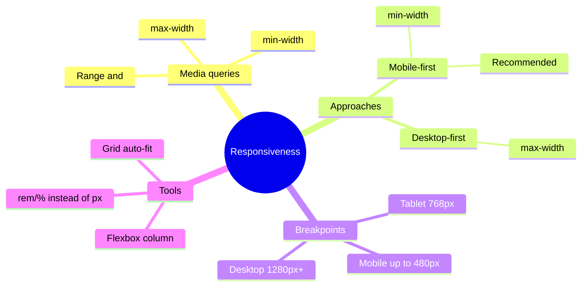
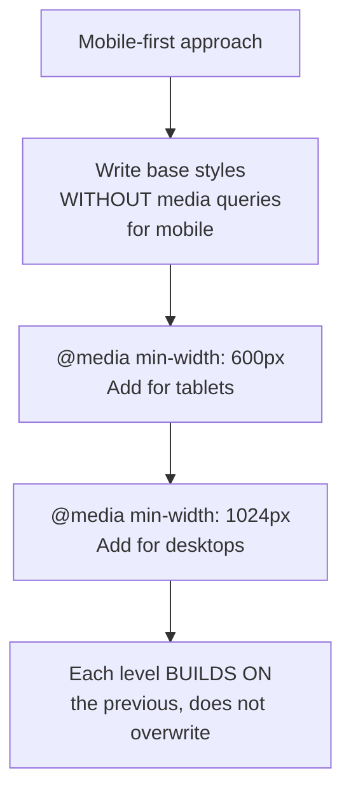

## Адаптивная вёрстка (Responsive Design)

> **Связь с предыдущим уроком:** на прошлом уроке мы разобрались с типографикой, цветом и единицами измерения - в том числе заранее подготовили почву, выбрав `rem` вместо жёстких `px`. Сегодня собираем всё изученное в курсе (Box model, Flexbox, Grid, единицы измерения) в единую систему, которая заставляет страницу одинаково хорошо выглядеть и на телефоне, и на огромном мониторе.

---

## Цель урока

Научиться делать страницы, которые корректно и удобно выглядят на любом размере экрана - от небольшого смартфона до широкого десктопного монитора.

## Чему вы научитесь к концу урока

- Объяснять, зачем нужна адаптивность, и как она связана с `meta viewport` из курса HTML.
- Писать медиазапросы `@media` и понимать разницу между mobile-first и desktop-first подходами.
- Осознанно применять относительные единицы вместо фиксированных пикселей в адаптивном контексте.
- Адаптировать Flexbox/Grid-раскладки под разные размеры экрана.
- Тестировать адаптивность через режим устройства в DevTools.

---

## Хронометраж урока

|Блок|Содержание|
|---|---|
|1. Зачем нужна адаптивность|Мобильный трафик, связь с viewport из HTML|
|2. Медиазапросы @media: синтаксис|Базовый синтаксис, условия|
|3. Брейкпоинты и подходы|Mobile-first vs desktop-first|
|4. Относительные единицы в адаптивности|Почему rem/% лучше px для адаптивных проектов|
|5. Мини-задание|Написать медиазапрос самостоятельно|
|6. Адаптация Flexbox/Grid|flex-direction: column, изменение grid-template-columns|
|7. Тестирование в DevTools|Режим устройства|
|8. Итоги и практика|Адаптируем меню и сетку карточек|


---

## Блок 1. Зачем нужна адаптивность

**Простыми словами:** ещё каких-то 15 лет назад практически все заходили в интернет с настольного компьютера с одним, относительно предсказуемым размером экрана. Сегодня один и тот же сайт может открываться на маленьком экране смартфона (320–430px в ширину), на планшете (768–1024px), на ноутбуке (1280–1440px) и на огромном настольном мониторе (1920px и больше) - и во всех этих случаях сайт должен оставаться **удобным для использования**, а не просто "не сломанным".

**Адаптивная вёрстка (responsive design)** - это подход, при котором один и тот же HTML/CSS-код автоматически подстраивается под ширину экрана устройства, на котором открыт сайт, - без создания отдельных "мобильной" и "десктопной" версий сайта.

### Связь с `meta viewport` из курса HTML

Вспомните урок 9 курса HTML - мы уже тогда закладывали фундамент для сегодняшней темы:

```html
<meta name="viewport" content="width=device-width, initial-scale=1.0">
```

Мы говорили тогда: «без этого тега никакая адаптивная вёрстка, сделанная позже через CSS, не будет работать корректно на мобильных устройствах». Сегодня настал момент, когда мы наконец это "позже" - если у вас на страницах ещё нет этого мета-тега, добавьте его прямо сейчас, до начала практики этого урока, иначе всё, что мы будем делать дальше, попросту не будет работать так, как ожидается, на реальных мобильных устройствах.

### Почему это не опциональная "фича", а необходимость

Значительная (часто - большая) часть трафика большинства сайтов сегодня приходится именно на мобильные устройства. Сайт, который выглядит нормально только на широком экране, а на телефоне превращается в нечитаемый хаос из наезжающих друг на друга элементов - это не мелкая недоработка, а серьёзная проблема, которая может стоить сайту большей части его посетителей.



---

## Блок 2. Медиазапросы `@media`: синтаксис

**Простыми словами:** медиазапрос - это условная конструкция в CSS вида «если экран соответствует такому-то условию - применяй вот эти дополнительные стили». Это позволяет писать **разные** наборы CSS-правил для **разных** диапазонов ширины экрана.

### Базовый синтаксис

```css
.container {
    width: 100%;
}

@media (max-width: 768px) {
    .container {
        width: 100%;
        padding: 10px;
    }
}
```

Разберём структуру: `@media` - ключевое слово, `(max-width: 768px)` - **условие** (означает «если ширина окна браузера **не больше** 768px»), и внутри фигурных скобок - обычные CSS-правила, которые применятся **только** при выполнении этого условия.

### Основные условия

```css
@media (max-width: 768px) {
    /* стили применятся, когда ширина экрана ≤ 768px */
}

@media (min-width: 1024px) {
    /* стили применятся, когда ширина экрана ≥ 1024px */
}
```

- **`max-width`** - «максимум» - условие срабатывает, когда экран **уже** этого значения или равен ему (обычно используется для "стилей под маленькие экраны").
- **`min-width`** - «минимум» - условие срабатывает, когда экран **шире** этого значения или равен ему (обычно используется для "стилей под большие экраны").

### Комбинирование условий (диапазон)

```css
@media (min-width: 768px) and (max-width: 1023px) {
    /* стили применятся только в диапазоне от 768px до 1023px - например, специально для планшетов */
}
```

Ключевое слово `and` объединяет несколько условий - стили применятся, только если **все** перечисленные условия выполнены одновременно.

### Важная деталь: порядок правил в файле имеет значение

```css
.box {
    background-color: blue;
}

@media (max-width: 600px) {
    .box {
        background-color: red;
    }
}
```

Здесь при ширине экрана 600px и меньше сработает **более позднее** правило (внутри медиазапроса) - потому что, как мы разобрали в уроке 2 про каскад, при равной специфичности побеждает то, что написано позже в файле. Если бы вы **по ошибке** поставили медиазапрос **выше**, а обычное правило `.box { background-color: blue; }` - **ниже** него, обычное правило "перебило" бы медиазапрос, и адаптивный стиль попросту никогда бы не сработал, независимо от размера экрана.

**Практическое правило: располагайте медиазапросы в конце файла (или сразу после стилей того блока, который они переопределяют), а не в начале.**

---

### Частые ошибки новичков

|Ошибка|Как исправить|
|---|---|
|Путают `min-width` и `max-width`|`max-width` - «применить, когда экран **не шире** этого», `min-width` - «применить, когда экран **не уже** этого»|
|Помещают медиазапрос **раньше** обычных правил в CSS-файле, из-за чего он "перебивается"|Располагайте медиазапросы **после** основных правил - порядок в каскаде имеет значение|
|Забывают `meta viewport` в HTML - медиазапросы формально работают, но мобильный браузер показывает уменьшенную десктопную версию|Обязательно добавьте `<meta name="viewport" content="width=device-width, initial-scale=1.0">` в `<head>` каждой страницы|

---

## Блок 3. Брейкпоинты и подходы: mobile-first vs desktop-first

### Что такое брейкпоинты

**Брейкпоинт** (breakpoint, «точка перелома») - это конкретное значение ширины экрана, при котором вёрстка меняет своё поведение через медиазапрос. Не существует единого "официального" списка брейкпоинтов - они выбираются исходя из реального содержимого конкретного проекта, но есть общепринятые ориентировочные значения:

|Устройство|Примерная ширина|
|---|---|
|Смартфон|до 480px|
|Смартфон (крупный) / малый планшет|480px – 768px|
|Планшет|768px – 1024px|
|Десктоп (небольшой)|1024px – 1280px|
|Десктоп (широкий)|1280px и больше|

**Важная практическая рекомендация:** не старайтесь заранее "угадать" брейкпоинты под конкретные модели устройств - вместо этого меняйте размер окна браузера (или используйте DevTools, блок 7) и наблюдайте, **в какой именно момент** ваша конкретная вёрстка начинает выглядеть плохо (текст становится слишком узким, элементы налезают друг на друга) - именно в этой точке и стоит поставить брейкпоинт, вне зависимости от того, совпадает ли она с "стандартными" значениями из таблицы выше.

### Desktop-first - начинаем с широкого экрана

Исторически более старый подход: сначала пишутся стили для **широкого** (десктопного) экрана как основные, а затем через `@media (max-width: ...)` эти стили **переопределяются** для более узких экранов.

```css
.sidebar {
    width: 300px;
}

@media (max-width: 768px) {
    .sidebar {
        width: 100%;
    }
}
```

### Mobile-first - начинаем с узкого экрана

Более современный, рекомендуемый подход: сначала пишутся стили для **самого узкого** (мобильного) экрана как основные (без всякого медиазапроса), а затем через `@media (min-width: ...)` они **дополняются** для более широких экранов.

```css
.sidebar {
    width: 100%;
}

@media (min-width: 768px) {
    .sidebar {
        width: 300px;
    }
}
```

### Почему mobile-first считается более правильным подходом сегодня

1. **Соответствует реальной статистике трафика** - раз значительная доля посетителей заходит именно с мобильных устройств, логично, чтобы **основной**, "базовый" набор стилей (без всяких медиазапросов) был оптимизирован именно под них, а не был "довеском", как при desktop-first.
2. **Заставляет думать о содержимом в первую очередь.** Узкий экран - это естественное ограничение, которое вынуждает сразу продумывать, что действительно важно показать пользователю, а что можно убрать/упростить - а не "впихивать" уже готовый сложный десктопный макет в маленький экран задним числом.
3. **Обычно требует меньше кода.** Простые, "базовые" стили для мобильного макета часто короче, чем сложные десктопные стили, - а значит, при mobile-first обычно меньше строк кода приходится **переопределять** внутри медиазапросов, по сравнению с обратным подходом.

**Практическая рекомендация этого курса:** используйте **mobile-first** как основной подход - пишите базовые стили без медиазапроса, ориентируясь на маленький экран, а затем добавляйте `@media (min-width: ...)` для последовательного "расширения" макета на больших экранах.



---

### Частые ошибки новичков

|Ошибка|Как исправить|
|---|---|
|Смешивают в одном проекте `min-width` и `max-width` без системы, что усложняет логику|Выберите один подход (рекомендуется mobile-first с `min-width`) и придерживайтесь его последовательно по всему проекту|
|Пытаются угадать "идеальные" брейкпоинты по названиям устройств (iPhone, iPad и т.д.)|Ставьте брейкпоинты там, где реально "ломается" именно ваша конкретная вёрстка, а не ориентируясь на конкретные модели устройств|
|Начинают проект с десктопной версии "по привычке", а потом с трудом адаптируют под мобильные|Тренируйтесь начинать вёрстку сразу с мобильного макета (mobile-first) - это быстрее приводит к результату, лучше работающему для всех размеров|

---

## Блок 4. Относительные единицы в адаптивной вёрстке

Вспомним урок 7 - там мы уже рекомендовали `rem` вместо `px` для типографики. В контексте адаптивности эта рекомендация становится особенно важной.

### Почему `%` полезен для ширины в адаптивных макетах

```css
.card {
    width: 100%;
    max-width: 400px;
}
```

`width: 100%;` означает «занимай всю доступную ширину родителя» - на маленьком экране это автоматически означает "узкая карточка", на большом - "широкая карточка", без единого медиазапроса. `max-width: 400px;` при этом не даёт карточке стать **слишком** широкой на очень больших экранах - комбинация `%` + `max-width` часто заменяет необходимость в медиазапросах вообще для многих простых случаев.

### Почему `rem` полезен для типографики в адаптивных макетах

Классический приём - **менять только базовый `font-size`** у `<html>` внутри медиазапроса, и **весь** остальной текст на странице (заданный через `rem`) автоматически пропорционально масштабируется, без необходимости переопределять `font-size` у каждого отдельного элемента по отдельности:

```css
html {
    font-size: 14px;  /* базовый размер для маленьких экранов */
}

@media (min-width: 768px) {
    html {
        font-size: 16px;  /* чуть крупнее на больших экранах */
    }
}
```

Поскольку весь остальной текст в проекте задан через `rem` (как мы рекомендовали в уроке 7), при срабатывании этого единственного медиазапроса **все** заголовки, абзацы, отступы, заданные в `rem`, автоматически пропорционально увеличатся - без необходимости писать десятки отдельных переопределений внутри самого медиазапроса.

---

## Блок 5. Мини-задание

Самостоятельно, без подглядывания, напишите медиазапрос в подходе mobile-first, который меняет цвет фона `<body>` на `lightblue`, когда ширина экрана составляет 768px и больше.

**Решение:**

```css
@media (min-width: 768px) {
    body {
        background-color: lightblue;
    }
}
```

---

## Блок 6. Адаптация Flexbox/Grid под разные экраны

Это самый практический блок урока - применяем медиазапросы к инструментам, изученным в уроках 5-6.

### Адаптация Flexbox: смена направления

Классический паттерн - навигационное меню, которое на широком экране выстроено **горизонтально** (`row`), а на узком экране (мобильном) переключается на **вертикальное** расположение (`column`), чтобы пункты меню не "сжимались" до нечитаемого состояния:

```css
.nav-links {
    display: flex;
    flex-direction: column;  /* базовый вариант - для мобильных, mobile-first */
    gap: 10px;
}

@media (min-width: 768px) {
    .nav-links {
        flex-direction: row;  /* на широких экранах - горизонтально */
        gap: 20px;
    }
}
```

### Адаптация Grid: изменение количества колонок

Другой классический паттерн - сетка карточек товаров/проектов, где количество колонок **уменьшается** на узких экранах:

```css
.gallery {
    display: grid;
    grid-template-columns: 1fr;  /* базовый вариант - одна колонка на мобильном */
    gap: 15px;
}

@media (min-width: 600px) {
    .gallery {
        grid-template-columns: repeat(2, 1fr);  /* две колонки на среднем экране */
    }
}

@media (min-width: 1024px) {
    .gallery {
        grid-template-columns: repeat(3, 1fr);  /* три колонки на широком экране */
    }
}
```

Обратите внимание на mobile-first логику: базовое правило (без медиазапроса) задаёт **самый простой** случай - одну колонку. Каждый следующий медиазапрос (с всё бо́льшим `min-width`) **последовательно наращивает** сложность макета, добавляя больше колонок по мере того, как на экране становится больше свободного места.

### Продвинутый приём: `auto-fit` и `minmax()` - адаптивная сетка почти без медиазапросов

Это не входит в число обязательных базовых тем урока, но полезно знать о существовании этого приёма - он часто позволяет **вообще избежать** написания медиазапросов для сетки карточек:

```css
.gallery {
    display: grid;
    grid-template-columns: repeat(auto-fit, minmax(250px, 1fr));
    gap: 15px;
}
```

Здесь `minmax(250px, 1fr)` говорит: «каждая колонка минимум `250px`, но может растягиваться (`1fr`), занимая доступное пространство», а `auto-fit` - «автоматически определи, сколько таких колонок поместится в текущей ширине контейнера». В результате сетка **сама** решает, сколько колонок показать - на узком экране это может быть одна колонка, на среднем - две-три, на широком - четыре и больше, полностью без единого написанного вручную медиазапроса.

---

### Частые ошибки новичков

|Ошибка|Как исправить|
|---|---|
|Забывают адаптировать навигацию - на мобильном горизонтальное меню "сжимается" до нечитаемого состояния|Переключайте `flex-direction` на `column` для мобильного варианта меню|
|Задают Grid с большим фиксированным числом колонок (`repeat(4, 1fr)`) без адаптации для узких экранов|Уменьшайте количество колонок через медиазапросы для меньших ширин экрана, или используйте `auto-fit`/`minmax()`|
|Не проверяют, что происходит с текстом/изображениями внутри карточек при уменьшении числа колонок|Проверяйте всю карточку целиком на разных ширинах, а не только внешнюю сетку|

---

## Блок 7. Тестирование адаптивности в DevTools

Мы уже несколько раз упоминали проверку на мобильном экране (курс HTML, урок 8 и 9) - сегодня разберём это подробно, как основной рабочий инструмент этого урока.

### Как включить режим устройства

1. Откройте DevTools (F12).
2. Найдите иконку **переключения режима устройства** - обычно это значок телефона/планшета в верхней панели DevTools (в Chrome - рядом с кнопками элементов инспектора).
3. Кликните по ней - страница переключится в режим эмуляции экрана мобильного устройства, появится панель с выбором конкретных моделей (iPhone, iPad, Galaxy и т.д.) или **произвольного** размера.

### Что можно делать в этом режиме

- **Выбрать конкретное устройство** из выпадающего списка - DevTools покажет страницу с реальными размерами экрана этого устройства.
- **Задать произвольную ширину и высоту** вручную - особенно полезно, чтобы найти именно ту точку, где ваша вёрстка "ломается" (напомним из блока 3 - именно там и нужно ставить брейкпоинт).
- **Переключать ориентацию** (портретная/альбомная) - специальной кнопкой рядом с размерами.
- **Проверить срабатывание touch-событий** - режим устройства эмулирует не только размер экрана, но частично и особенности сенсорного управления.

### Практический рабочий процесс

1. Откройте свою страницу через Live Server.
2. Включите режим устройства в DevTools.
3. Медленно **тяните за край окна эмуляции**, уменьшая ширину от desktop к мобильной - внимательно наблюдайте, в какой именно момент что-то начинает "ломаться" визуально (текст налезает, кнопки сжимаются, изображения переполняют контейнер).
4. Запишите (или запомните) эту ширину - это и есть подходящий брейкпоинт именно для этого конкретного блока вашей страницы.
5. Повторите для всех ключевых блоков страницы (навигация, сетка карточек, форма).

**Важная привычка на будущее:** тестируйте адаптивность **на протяжении всей** разработки, а не только в самом конце - гораздо проще сразу заметить и исправить небольшую проблему, чем в конце проекта обнаружить, что вся структура плохо адаптируется, и переделывать значительную часть работы.

---

## Итоги урока

Сегодня вы узнали:

- Адаптивность нужна, потому что сайт открывают на экранах кардинально разных размеров, и без неё часть аудитории получает нечитаемый или неудобный опыт - это прямое продолжение `meta viewport` из курса HTML.
- Медиазапрос `@media (условие) { ... }` применяет CSS-правила только при выполнении заданного условия ширины экрана (`min-width`/`max-width`), и его следует располагать **после** основных стилей в файле.
- Mobile-first (начинаем с базовых мобильных стилей, дополняем через `min-width`) - рекомендуемый подход, более соответствующий современным реалиям, чем desktop-first.
- `%`/`max-width` для гибкой ширины блоков, `rem` для масштабируемой типографики через изменение одного базового значения у `<html>` - снижают необходимость в большом количестве медиазапросов.
- Flexbox адаптируется через смену `flex-direction`, Grid - через изменение `grid-template-columns` (или продвинутый приём `auto-fit`/`minmax()` почти без медиазапросов).
- DevTools в режиме устройства - основной инструмент для поиска "точек перелома" вашей конкретной вёрстки и выбора подходящих брейкпоинтов.

---

## Практика (на занятии)

Адаптируйте два ключевых блока своего HTML-проекта под мобильный экран:

1. **Навигационное меню** - переключите `flex-direction` с `column` (базовый, мобильный) на `row` (при `min-width: 768px`).
2. **Сетка карточек проектов/товаров** - уменьшите количество колонок Grid на узких экранах (например, с 3 колонок на десктопе до 1 колонки на мобильном), используя минимум два медиазапроса, в подходе mobile-first.

Проверьте оба блока через режим устройства в DevTools на нескольких разных ширинах экрана.

---

## Домашнее задание

1. Пройдитесь по **всему** своему HTML-проекту в режиме устройства DevTools на трёх разрешениях: мобильный (~375px), планшет (~768px), десктоп (~1280px) - зафиксируйте (можно просто на бумаге) все места, где вёрстка "ломается" визуально.
2. Исправьте найденные проблемы через медиазапросы в подходе mobile-first - добавьте необходимые `@media (min-width: ...)` для навигации, сеток, форм.
3. Замените, если ещё не сделали, все `font-size`/значимые отступы с `px` на `rem` - и добавьте один медиазапрос, меняющий базовый `font-size` у `<html>` для более крупных экранов.
4. Попробуйте переписать одну из своих Grid-сеток карточек через `repeat(auto-fit, minmax(...))` вместо ручных медиазапросов - сравните результат с "ручным" подходом.

---

[Следующий урок: Переходы, анимации →](Lesson-9/ru/Переходы,%20анимации,%20псевдоклассы%20и%20псевдоэлементы.md)
