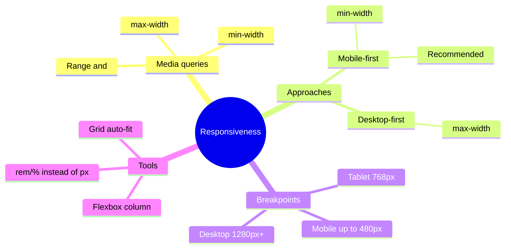
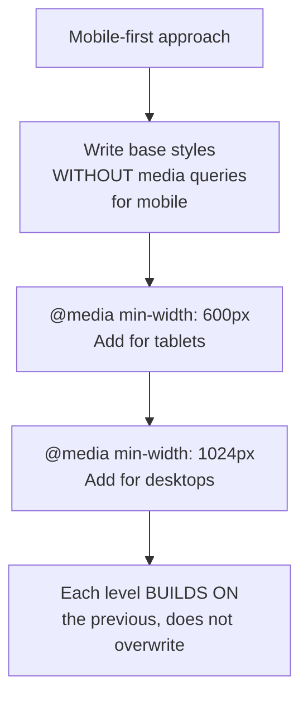

## Moslashuvchan tiklash (Responsive Design)

> **Oldingi dars bilan bog'liqlik:** o'tgan darsda biz tipografiya, rang va o'lchov birliklari bilan ishlashni o'rgandik - shu jumladan, qattiq `px` o'rniga `rem` tanlash orqali oldindan tayyorgarlik ko'rdik. Bugun kursda o'rgangan hamma narsani (Box model, Flexbox, Grid, o'lchov birliklari) bitta yagona tizimga jamlash vaqti keldi - bu tizim sahifani kichik smartfondan katta desktop monitorigacha bir xil yaxshi ko'rinishini ta'minlaydi.

---

## Darsning maqsadi

Turli ekran o'lchamlarida - kichik smartfondan keng desktop monitorigacha - to'g'ri va qulay ko'rinadigan sahifalar yaratishni o'rganish.

## Dars oxiriga qadar nimalarni o'rganasiz

- Nega moslashuvchanlik kerakligini tushuntirishni va u HTML kursidagi `meta viewport` bilan qanday bog'liqligini.
- `@media` media-so'rovlarini yozishni va mobile-first hamda desktop-first yondashuvlari o'rtasidagi farqni tushunishni.
- Moslashuvchan kontekstda qat'iy piksellar o'rniga nisbiy o'lchov birliklarini ongli qo'llashni.
- Flexbox/Grid tartiblarini turli ekran o'lchamlariga moslashtirishni.
- DevTools qurilma rejimida moslashuvchanlikni sinashni.

---

## Darsning vaqt jadvali

|Blok|Mazmun|
|---|---|
|1. Nega moslashuvchanlik kerak|Mobil trafik, HTML dan viewport bilan bog'liqlik|
|2. @media media-so'rovlari: sintaksis|Asosiy sintaksis, shartlar|
|3. Breakpointlar va yondashuvlar|Mobile-first vs desktop-first|
|4. Moslashuvchanlikda nisbiy o'lchov birliklari|Nega rem/% px dan yaxshi|
|5. Mini-topshiriq|Media-so'rovni mustaqil yozish|
|6. Flexbox/Grid moslashuvi|flex-direction: column, grid-template-columns o'zgartirish|
|7. DevTools da sinash|Qurilma rejimi|
|8. Xulosalar va amaliyot|Menyu va kartochkalar tarmog'ini moslashtiramiz|


---

## 1-blok. Nega moslashuvchanlik kerak

**Oddiy qilib aytganda:** atigi 15 yil oldin deyarli barcha internetga nisbatan oldindan aytib bo'lmaydigan ekran o'lchamiga ega stol kompyuteridan kirgan. Bugun bir xil sayt kichik smartfon ekranida (kenglikda 320–430px), planshetda (768–1024px), noutbukda (1280–1440px) va ulkan stol monitorida (1920px va undan katta) ochilishi mumkin - va barcha holatlarda sayt **foydalanish uchun qulay** bo'lishi kerak, shunchaki "buzilmagan" emas.

**Moslashuvchan tiklash (responsive design)** - bu bir xil HTML/CSS kodini sayt ochilgan qurilma ekranining kengligiga avtomatik moslashtiruvchi yondashuv - alohida "mobil" va "desktop" versiyalarini yaratmasdan.

### HTML kursidagi `meta viewport` bilan bog'liqlik

HTML kursining 9-darsini eslang - biz o'sha paytda bugungi mavzu uchun asos qo'ygan edik:

```html
<meta name="viewport" content="width=device-width, initial-scale=1.0">
``>

Biz o'shanda aytgan edik: «bu tegsiz CSS orqali keyinroq qilingan hech qanday moslashuvchan tiklash mobil qurilmalarda to'g'ri ishlamaydi». Bugun o'sha "keyinroq" vaqti keldi - agar sahifalaringizda hali bu meta-teg bo'lmasa, dars amaliyotini boshlashdan oldin hozir qo'shing, aks holda biz keyin qiladigan hamma narsa haqiqiy mobil qurilmalarda kutilgandek ishlamaydi.

### Nega bu ixtiyoriy "funktsiya" emas, balki zarurat

Ko'pchilik saytlarning trafikining katta (ko'pincha - aksariyat) qismi bugun aynan mobil qurilmalarga to'g'ri keladi. Faqat keng ekranda normal ko'rinadigan, telefon esa bir-biriga yopishgan elementlardan iborat o'qib bo'lmaydigan xaosga aylanadigan sayt - bu kichik kamchilik emas, balki saytning ko'pchilik mehmonlarini yo'qotishi mumkin bo'lgan jiddiy muammo.



---

## 2-blok. `@media` media-so'rovlari: sintaksis

**Oddiy qilib aytganda:** media-so'rov - bu CSS dagi shartli tuzilma, "agar ekran shunday shartga mos kelsa - mana bu qo'shimcha uslublarni qo'lla" turidagi. Bu turli ekran kengliklari diapazonlari uchun **turli** CSS qoidalar to'plamini yozishga imkon beradi.

### Asosiy sintaksis

```css
.container {
    width: 100%;
}

@media (max-width: 768px) {
    .container {
        width: 100%;
        padding: 10px;
    }
}
```

Tuzilmasini tahlil qilamiz: `@media` - kalit so'z, `(max-width: 768px)` - **shart** (brauzer oynasining kengligi **768px dan katta emas**ligini anglatadi), va figurali qavslar ichida - oddiy CSS qoidalari, bu shart bajarilganda **faqat** qo'llaniladi.

### Asosiy shartlar

```css
@media (max-width: 768px) {
    /* uslublar ekran kengligi ≤ 768px bo'lganda qo'llaniladi */
}

@media (min-width: 1024px) {
    /* uslublar ekran kengligi ≥ 1024px bo'lganda qo'llaniladi */
}
```

- **`max-width`** - "maksimum" - shart ekran bu qiymatdan **torroq** yoki teng bo'lganda ishlaydi (odatda "kichik ekranlar uchun uslublar" uchun ishlatiladi).
- **`min-width`** - "minimum" - shart ekran bu qiymatdan **kengroq** yoki teng bo'lganda ishlaydi (odatda "katta ekranlar uchun uslublar" uchun ishlatiladi).

### Shartlarni birlashtirish (diapazon)

```css
@media (min-width: 768px) and (max-width: 1023px) {
    /* uslublar faqat 768px dan 1023px gacha diapazonda qo'llaniladi - masalan, planshetlar uchun maxsus */
}
```

`and` kalit so'zi bir necha shartni birlashtiradi - uslublar faqat barcha ko'rsatilgan shartlar bir vaqtda bajarilganda qo'llaniladi.

### Muhim tafsilot: faylda qoidalar tartibi muhim

```css
.box {
    background-color: blue;
}

@media (max-width: 600px) {
    .box {
        background-color: red;
    }
}
```

Bu erda ekran kengligi 600px yoki kamroq bo'lganda **keyingi** qoida (media-so'rov ichidagi) ishlaydi - chunki, 2-darsda o'rgangan kaskad qoidalari bo'yicha, bir xil maxsuslikda faylda keyinroq yozilgan g'alaba qozonadi. Agar media-so'rovni **xato bilan yuqoriga**, oddiy `.box { background-color: blue; }` qoidasini esa **pastga** qo'ysangiz, oddiy qoida media-so'rovni "bosib tushiradi" va moslashuvchan uslub hech qachon ishlamaydi, ekran o'lchamidan qat'i nazar.

**Amaliy qoida: media-so'rovlarni faylning oxiriga (yoki ular qayta belgilaydigan blok uslublaridan darhol keyin) joylashtiring, boshida emas.**

---

### Yangi boshlovchilarning ko'p uchraydigan xatolari

|Xato|Qanday tuzatish|
|---|---|
|`min-width` va `max-width` ni adashtirishlar|`max-width` - "ekran bu qiymatdan **kengroq bo'lmaganda** qo'llash", `min-width` - "ekran bu qiymatdan **torroq bo'lmaganda** qo'llash"|
|Media-so'rovni CSS faylida oddiy qoidalardan **oldinroq** joylashtirishlar, shu tufayli u "bosib tushiriladi"|Media-so'rovlarni asosiy qoidalardan **keyin** joylashtiring - kaskaddagi tartib muhim|
|HTML da `meta viewport` ni unutishlar - media-so'rovlar rasman ishlaydi, lekin mobil brauzer kichiklashtirilgan desktop versiyasini ko'rsatadi|Har bir sahifaning `<head>` qismiga albatta `<meta name="viewport" content="width=device-width, initial-scale=1.0">` qo'shing|

---

## 3-blok. Breakpointlar va yondashuvlar: mobile-first vs desktop-first

### Breakpointlar nima

**Breakpoint** (breakpoint, "sinish nuqtasi") - bu ekran kengligining aniq qiymati, unda tiklash media-so'rov orqali o'z xulqini o'zgartiradi. Breakpointlarning yagona "rasmiy" ro'yxati mavjud emas - ular aniq loyihaning haqiqiy kontentiga qarab tanlanadi, lekin umum qabul qilingan taxminiy qiymatlar bor:

|Qurilma|Taxminiy kenglik|
|---|---|
|Smartfon|480px gacha|
|Smartfon (katta) / kichik planshet|480px – 768px|
|Planshet|768px – 1024px|
|Desktop (kichik)|1024px – 1280px|
|Desktop (keng)|1280px va undan katta|

**Muhim amaliy tavsiya:** aniq qurilma modellari uchun oldindan breakpointlarni "taxmin qilishga" urinmang - o'rniga brauzer oynasining o'lchamini o'zgartiring (yoki DevTools, 7-blokni ishlating) va **qaysi aniq daqiqada** sizning aniq tiklashingiz yomon ko'rina boshlashini kuzating (matn juda tor bo'ladi, elementlar bir-biriga yopishadi) - mana shu nuqtada breakpoint qo'ying, u yuqoridagi jadvaldagi "standart" qiymatlar bilan mos kelmasa ham.

### Desktop-first - keng ekrandan boshlaymiz

Tarixan eskiroq yondashuv: avval **keng** (desktop) ekran uchun uslublar asosiy sifatida yoziladi, keyin `@media (max-width: ...)` orqali bu uslublar torroq ekranlar uchun **qayta belgilanadi**.

```css
.sidebar {
    width: 300px;
}

@media (max-width: 768px) {
    .sidebar {
        width: 100%;
    }
}
```

### Mobile-first - tor ekrandan boshlaymiz

Zamonaviyroq, tavsiya etiladigan yondashuv: avval **eng tor** (mobil) ekran uchun uslublar asosiy sifatida yoziladi (hech qanday media-so'rovsiz), keyin `@media (min-width: ...)` orqali ular keng ekranlar uchun **qo'shimcha qilinadi**.

```css
.sidebar {
    width: 100%;
}

@media (min-width: 768px) {
    .sidebar {
        width: 300px;
    }
}
```

### Nega mobile-first bugun to'g'riroq yondashuv deb hisoblanadi

1. **Haqiqiy trafik statistikasiga mos keladi** - trafikning katta qismi aynan mobil qurilmalardan kelganda, **asosiy**, "boshlang'ich" uslublar to'plami (hech qanday media-so'rovsiz) aynan ular uchun optimallashtirilgan bo'lishi mantiqiy, desktop-first dagi kabi "qo'shimcha" emas.
2. **Kontent haqida avval o'ylashga majbur qiladi.** Tor ekran - bu tabiiy cheklov, u darhol nima foydalanuvchiga ko'rsatish kerakligini va nima olib tashlash/soddalashtirish mumkinligini o'ylashga majbur qiladi - tayyor murakkab desktop maketini kichik ekronga keyinchalik "tiqishtirish" emas.
3. **Odatda kamroq kod talab qiladi.** Mobil maket uchun oddiy, "boshlang'ich" uslublar ko'pincha murakkab desktop uslublaridan qisqaroq - ya'ni, mobile-first bilan odatda kamroq kod satrlarini media-so'rovlarda **qayta belgilash** kerak, teskari yondashuvga nisbatan.

**Ushbu kursning amaliy tavsiyasi:** **mobile-first** ni asosiy yondashuv sifatida ishlating - asosiy uslublarni media-so'rovsiz, kichik ekran uchun yozing, keyin katta ekranlarda maketni bosqichma-bosqich "kengaytirish" uchun `@media (min-width: ...)` qo'shing.



---

### Yangi boshlovchilarning ko'p uchraydigan xatolari

|Xato|Qanday tuzatish|
|---|---|
|Bitta loyihada tizimsiz ravishda `min-width` va `max-width` ni aralashtirishlar, bu mantiqni murakkablashtiradi|Bitta yondashuv tanlang (mobile-first bilan `min-width` tavsiya etiladi) va butun loyiha bo'ylab unga rioya qiling|
|"Ideal" breakpointlarni qurilma nomlari (iPhone, iPad va h.k.) bo'yicha taxmin qilishga urinishlar|Breakpointlarni haqiqatan "buziladigan" joyga, aniq qurilma modellariga qarab emas, o'z tiklashingizga qarab qo'ying|
|Odatan desktop versiyasidan boshlab, keyin mobilga moslashishga qiynalishlar|Tiklashni darhol mobil maketdan (mobile-first) boshlashni mashq qiling - bu natijaga tezroq olib keladi, barcha o'lchamlar uchun yaxshiroq ishlaydi|

---

## 4-blok. Moslashuvchan tiklashda nisbiy o'lchov birliklari

7-darsni eslang - biz allaqachon tipografiya uchun `px` o'rniga `rem` ni tavsiya qilgan edik. Moslashuvchanlik kontekstida bu tavsiya ayniqsa muhim bo'ladi.

### Nega `%` moslashuvchan maketlarda kenglik uchun foydali

```css
.card {
    width: 100%;
    max-width: 400px;
}
```

`width: 100%;` degani "ota-elementning mavjud kengligini to'liq egalla" - kichik ekranda bu avtomatik ravishda "tor kartochka", katta ekranda - "keng kartochka" degan ma'noni anglatadi, bitta media-so'rovsiz. `max-width: 400px;` bu paytda kartochkaning juda katta ekranlarda **haddan tashqari** keng bo'lishiga yo'l qo'ymaydi - `%` + `max-width` kombinatsiyasi ko'pchilik oddiy holatlar uchun media-so'rovlarga ehtiyojning o'rnini bosadi.

### Nega `rem` moslashuvchan maketlarda tipografiya uchun foydali

Klassik usul - media-so'rovi ichida `<html>` ning faqat **asosiy `font-size`** ni o'zgartirish, va sahifadagi qolgan barcha matn (`rem` orqali belgilangan) avtomatik ravishda proporsional masshtablanadi, har bir alohida elementning `font-size` ni alohida qayta belgilashning hojati yo'q:

```css
html {
    font-size: 14px;  /* kichik ekranlar uchun asosiy o'lcham */
}

@media (min-width: 768px) {
    html {
        font-size: 16px;  /* katta ekranlarda biroz kattaroq */
    }
}
```

Loyihadagi qolgan barcha matn `rem` orqali belgilanganligi sababli (7-darsda tavsiya qilgandek), ushbu yagona media-so'rov ishlaganda, `rem` da belgilangan barcha sarlavhalar, abzacslar, oraliqlar avtomatik ravishda proporsional oshadi - media-so'rov ichida o'nlab alohida qayta belgilashlar yozishning hojati yo'q.

---

## 5-blok. Mini-topshiriq

Nusxalab ko'rmadan mustaqil ravishda mobile-first yondashuvida media-so'rov yozing, u ekran kengligi 768px va undan katta bo'lganda `<body>` ning fon rangini `lightblue` ga o'zgartiradi.

**Yechim:**

```css
@media (min-width: 768px) {
    body {
        background-color: lightblue;
    }
}
```

---

## 6-blok. Flexbox/Grid ni turli ekranlarga moslashtirish

Bu darsning eng amaliy bloki - 5-6-darslarda o'rgangan vositalarga media-so'rovlarni qo'llaymiz.

### Flexbox moslashuvi: yo'nalishni o'zgartirish

Klassik naqsh - navigatsiya menyusi, keng ekranda **gorizontal** (`row`) joylashgan, lekin tor ekranda (mobil) **vertikal** (`column`) joylashuvga o'tadi, menyuning nuqtalari o'qib bo'lmaydigan holatga "siqilmasligi" uchun:

```css
.nav-links {
    display: flex;
    flex-direction: column;  /* asosiy variant - mobil uchun, mobile-first */
    gap: 10px;
}

@media (min-width: 768px) {
    .nav-links {
        flex-direction: row;  /* keng ekranlarda - gorizontal */
        gap: 20px;
    }
}
```

### Grid moslashuvi: ustunlar sonini o'zgartirish

Boshqa klassik naqsh - mahsulot/loyiha kartochkalari tarmog'i, unda ustunlar soni tor ekranlarda **kamayadi**:

```css
.gallery {
    display: grid;
    grid-template-columns: 1fr;  /* asosiy variant - mobil da bitta ustun */
    gap: 15px;
}

@media (min-width: 600px) {
    .gallery {
        grid-template-columns: repeat(2, 1fr);  /* o'rta ekranda ikki ustun */
    }
}

@media (min-width: 1024px) {
    .gallery {
        grid-template-columns: repeat(3, 1fr);  /* keng ekranda uchta ustun */
    }
}
```

Mobile-first mantiqiga e'tibor bering: asosiy qoida (media-so'rovsiz) **eng oddiy** holatni - bitta ustunni belgilaydi. Har keyingi media-so'rov (kattaroq `min-width` bilan) maketning murakkabligini **bosqichma-bosqich oshiradi**, ekranda ko'proq bo'sh joy paydo bo'lganda ko'proq ustunlar qo'shadi.

### Ilg'or usul: `auto-fit` va `minmax()` - deyarli media-so'rovlarsiz moslashuvchan tarmoq

Bu darsning majburiy asosiy mavzulariga kirmaydi, lekin bu usulning mavjudligini bilish foydali - u ko'pincha kartochkalar tarmog'i uchun media-so'rovlarni yozishdan **butunlay qochishga** imkon beradi:

```css
.gallery {
    display: grid;
    grid-template-columns: repeat(auto-fit, minmax(250px, 1fr));
    gap: 15px;
}
```

Bu erda `minmax(250px, 1fr)` shuni aytadi: "har bir ustun kamida `250px`, lekin kengayishi mumkin (`1fr`), mavjud joyni egallab", `auto-fit` esa - "avtomatik ravishda aniqlang, joriy konteyner kengligiga nechta bunday ustun sig'adi". Natijada tarmoq **o'zi** nechta ustun ko'rsatishni hal qiladi - tor ekranda bitta ustun, o'rta ekranda ikki-uchta, keng ekranda to'rtta yoki undan ko'p, butunlay bitta qo'lda yozilgan media-so'rovsiz.

---

### Yangi boshlovchilarning ko'p uchraydigan xatolari

|Xato|Qanday tuzatish|
|---|---|
|Navigatsiyani moslashtirishni unutishlar - mobil da gorizontal menyu o'qib bo'lmaydigan holatga "siqiladi"|Mobil versiya uchun menyuning `flex-direction` ni `column` ga o'zgartiring|
|Katta qat'iy ustunlar soni (`repeat(4, 1fr)`) bilan Grid belgilashlar, tor ekranlar uchun moslashuvsiz|Kichik ekran kengliklari uchun media-so'rovlari orqali ustunlar sonini kamaytiring yoki `auto-fit`/`minmax()` ishlating|
|Ustunlar soni kamayganda kartochkalar ichidagi matn/rasmlar bilan nima bo'lishini tekshirmaydilar|Har bir kartochkani turli kengliklarda butunlay tekshiring, faqat tashqi tarmoqni emas|

---

## 7-blok. DevTools da moslashuvchanlikni sinash

Biz allaqachon bir necha marta mobil ekran tekshiruvi haqida eslatdik (HTML kursi, 8 va 9-darslar) - bugun buni batafsil ko'rib chiqamiz, bu darsning asosiy ish vositasi sifatida.

### Qurilma rejimini qanday yoqish

1. DevTools ni oching (F12).
2. **Qurilma rejimiga o'tish** belgisini toping - odatda DevTools yuqori panelidagi telefon/planshet belgisi (Chrome da inspektor tugmalari yonida).
3. Uning ustiga bosing - sahifani mobil qurilma ekranini emulyatsiya qilish rejimiga o'tkazadi, aniq modellar (iPhone, iPad, Galaxy va h.k.) yoki **istalgan** o'lchamni tanlash paneli paydo bo'ladi.

### Bu rejimda nima qilish mumkin

- **Aniq qurilmani** ro'yxatdan tanlash - DevTools sahifani shu qurilmaning haqiqiy ekran o'lchamlari bilan ko'rsatadi.
- **Istalgan kenglik va balandlikni** qo'lda belgilash - ayniqsa, sizning tiklashingiz "buziladigan" aniqlik nuqtasini topish foydali (3-blokdan eslatma - shu nuqtada breakpoint qo'yish kerak).
- **Yo'nalishni o'zgartirish** (portret/landshaft) - o'lchamlar yonidagi maxsus tugma bilan.
- **Touch-hodisalar ishlashini tekshirish** - qurilma rejimi faqat ekran o'lchamini emas, balki qisman sensorli boshqaruvning xususiyatlarini ham emulyatsiya qiladi.

### Amaliy ish jarayoni

1. Sahifangizni Live Server orqali oching.
2. DevTools da qurilma rejimini yoqing.
3. **Emulyatsiya oynasining chetini sekin torting**, kenglikni desktop dan mobillikga qarab kichiklashtiring - diqqat bilan kuzating, **qaysi aniq daqiqada** narsa vizual ravishda "buzila" boshlaydi (matn yopishadi, tugmalar siqiladi, rasmlar konteynerdan to'lib tashadi).
4. Bu kenglikni yozing (yoki yodda saqlang) - bu sizning sahifangizning shu aniq bloki uchun mos breakpoint.
5. Sahifaning barcha asosiy bloklari (navigatsiya, kartochkalar tarmog'i, shakl) uchun takrorlang.

**Kelajak uchun muhim odat:** moslashuvchanlikni **butun ishlab chiqish davomida** sinang, faqat eng oxirida emas - kichik muammoni darhol sezish va tuzatish ancha oson, loyiha oxirida butun tuzilmaning yomon moslashuvchanligini aniqlab, ishning katta qismini qayta qilishdan ko'ra.

---

## Dars xulosalari

Bugun siz bilib oldingiz:

- Moslashuvchanlik kerak, chunki sayt butunlay turli o'lchamdagi ekranlarda ochiladi, unda auditoriyaning bir qismi o'qib bo'lmaydigan yoki noqulay tajriba oladi - bu HTML kursidagi `meta viewport` ning to'g'ridan-to'g'ri davomi.
- `@media (shart) { ... }` media-so'rovi CSS qoidalarini faqat ekran kengligining belgilangan sharti bajarilganda qo'llaydi (`min-width`/`max-width`), uni faylda asosiy uslublardan **keyin** joylashtirish kerak.
- Mobile-first (asosiy mobil uslublardan boshlab, `min-width` orqali qo'shimcha qilish) - zamonaviy haqiqatlarga mos keladigan, desktop-first dan ko'ra tavsiya etiladigan yondashuv.
- Bloklarning moslashuvchan kengligi uchun `%`/`max-width`, masshtablanadigan tipografiya uchun `<html>` da bitta asosiy qiymatni o'zgartirish orqali `rem` - ko'p sonli media-so'rovlarga ehtiyojni kamaytiradi.
- Flexbox `flex-direction` o'zgartirish orqali moslashadi, Grid - `grid-template-columns` o'zgartirish orqali (yoki deyarli media-so'rovlarsiz ilg'or `auto-fit`/`minmax()` usuli).
- DevTools qurilma rejimi - sizning aniq tiklashingizning "sinish nuqtalarini" topish va mos breakpointlarni tanlash uchun asosiy vosita.

---

## Amaliyot (darsda)

HTML loyihangizning ikkita asosiy blokini mobil ekran uchun moslashtiring:

1. **Navigatsiya menyusi** - `flex-direction` ni `column` (asosiy, mobil) dan `row` ga (`min-width: 768px` da) o'zgartiring.
2. **Loyiha/mahsulot kartochkalari tarmog'i** - Grid ustunlar sonini tor ekranlarda kamaytiring (masalan, desktop da 3 ta ustundan mobil da 1 ta ustunga), kamida ikkita media-so'rov ishlatib, mobile-first yondashuvida.

Ikkala blokni DevTools qurilma rejimida bir nechta turli ekran kengliklarida tekshiring.

---

## Uy vazifasi

1. DevTools qurilma rejimida **barcha** HTML loyihangizni uchta rozlikda tekshiring: mobil (~375px), planshet (~768px), desktop (~1280px) - tiklashingiz vizual ravishda "buziladigan" barcha joylarni qayd eting (oddiy qog'ozga ham bo'ladi).
2. Topilgan muammolarni mobile-first yondashuvida media-so'rovlari orqali tuzating - navigatsiya, tarmoqlar, shakllar uchun zaruriy `@media (min-width: ...)` qo'shing.
3. Agar hali qilmagan bo'lsangiz, barcha `font-size`/muhim oraliqlarni `px` dan `rem` ga almashtiring - va katta ekranlar uchun `<html>` ning asosiy `font-size` ni o'zgartiradigan bitta media-so'rov qo'shing.
4. O'z Grid kartochkalar tarmog'ingizdan birini qo'lda media-so'rovlari o'rniga `repeat(auto-fit, minmax(...))` orqali qayta yozishga urinib ko'ring - natijani "qo'lda" yondashuv bilan solishtiring.

---

[Keyingi dars: O'tishlar, animatsiyalar →](Lesson-9/uz/O'tishlar,%20animatsiyalar,%20soxta-sinflar%20va%20soxta-elementlar.md)
