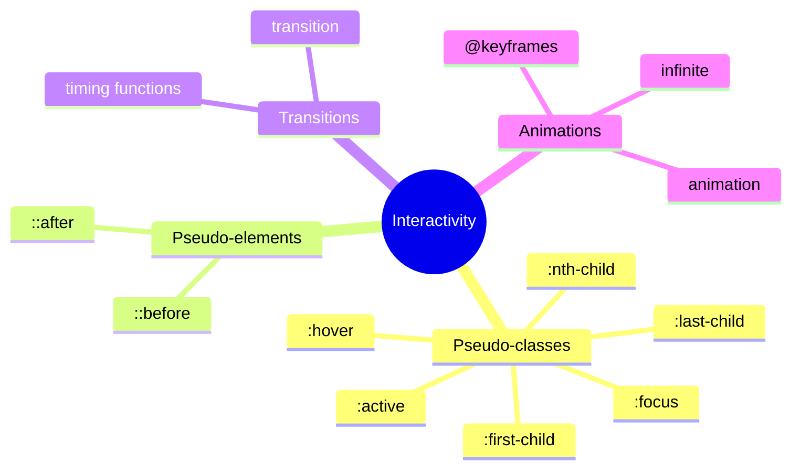
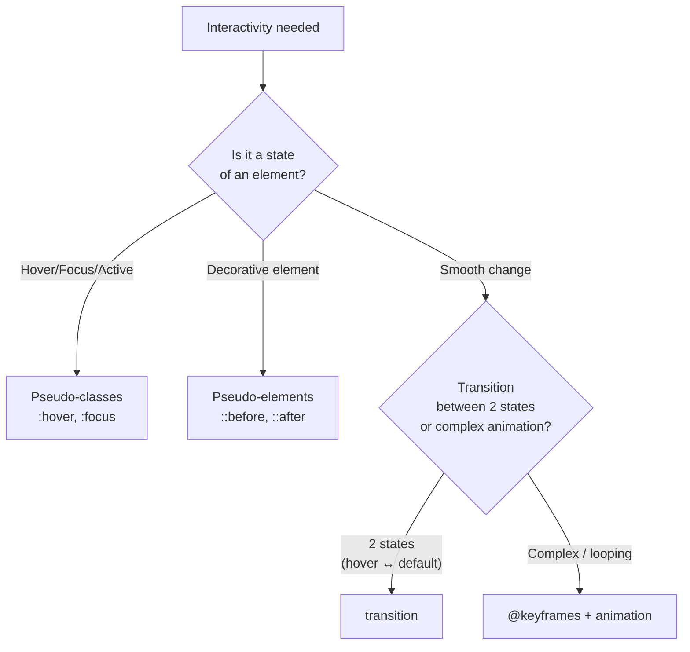

## Transitions, Animations, Pseudo-classes and Pseudo-elements

> **Connection to the previous lesson:** in the last lesson we made the page responsive for any screen size. Today we add the final touch before the final project - "liveliness": smooth reactions to user actions and light animation that make the interface pleasant to use.

---

## Lesson Objective

Learn to add interactivity to a page through pseudo-classes and pseudo-elements, as well as smoothness through transitions and basic animation - without using JavaScript.

## What You Will Learn by the End of the Lesson

- Use pseudo-classes `:hover`, `:focus`, `:active`, `:nth-child()`, `:first-child`/`:last-child`.
- Create decorative elements without extra markup through `::before`/`::after`.
- Configure smooth property transitions via `transition`.
- Write simple animation through `@keyframes` and `animation`.
- Understand when animation helps and when it hinders - including basic consideration for `prefers-reduced-motion`.

---

## Lesson Timeline

|Block|Content|
|---|---|
|1. Pseudo-classes: hover, focus, active|Interactive element states|
|2. Pseudo-classes: nth-child, first-child, last-child|Selecting elements by position|
|3. Pseudo-elements: before, after|Decorative content without extra markup|
|4. Mini-exercise|Style a hover state on your own|
|5. transition|Smooth property changes|
|6. @keyframes and animation|Basic animation|
|7. Moderation and prefers-reduced-motion|When animation hinders|
|8. Summary and practice|Button with hover + animated appearance|


---

## Block 1. Pseudo-classes: `:hover`, `:focus`, `:active`

**In simple terms:** a pseudo-class is a special "addition" to a regular selector that selects an element not by what it always represents (like a class or id), but by its **current state** or **position** at a given moment. It's written with a colon after the selector.

### `:hover` - Hovering the Mouse Cursor

```css
.button {
    background-color: #3498db;
    transition: background-color 0.2s;
}

.button:hover {
    background-color: #2980b9;
}
```

Styles inside `:hover` apply **only while** the mouse cursor is over the element - as soon as the cursor leaves, the element returns to its normal state. This is probably the most commonly used pseudo-class on the web - virtually any clickable button or link gets some visual hover reaction to give the user a clear signal "this element is interactive."

**Important caveat:** `:hover` only works where there is a physical mouse cursor - on touch devices (phones, tablets), this state either doesn't trigger at all or behaves unpredictably (sometimes the browser shows the hover style immediately after a tap). Don't build **mission-critical** functionality exclusively on `:hover` - use it as a pleasant visual enhancement, not the only way to indicate an element is clickable.

### `:focus` - Element in Focus (e.g., via Tab)

```css
input:focus {
    border-color: #3498db;
    outline: 2px solid #3498db;
}
```

Triggers when an element **receives focus** - this happens either when clicking on a form field or (which is especially important, recalling lesson 8 of the HTML course about `tabindex`) when navigating to an element with the **Tab** key. `:focus` is critically important for accessibility - a keyboard-only user navigates specifically by the visible focus ring to understand which element they're currently on.

**Important accessibility warning:** never remove the standard visible focus ring without replacing it with an **alternative** but equally noticeable one:

```css
/* Bad: completely removes the focus indicator */
input:focus {
    outline: none;
}

/* Good: replaces the standard ring with its own but still visible style */
input:focus {
    outline: none;
    box-shadow: 0 0 0 3px rgba(52, 152, 219, 0.5);
}
```

Completely removing the focus indicator without replacement makes the site unusable with a keyboard - a direct violation of the accessibility principles we covered in detail in lesson 8 of the HTML course.

### `:active` - The Moment of Clicking

```css
.button:active {
    transform: scale(0.98);
}
```

Triggers in the brief moment **while** the mouse button (or finger on a touch screen) is physically pressed on the element - that is, between the start and end of a click. Often used for a slight visual "press-in" effect on buttons, simulating physical feedback.

### Order of Writing Matters

There's a common mnemonic for the order of these (and related) pseudo-classes in a CSS file: **LVHA** (Link, Visited, Hover, Active - a historical mnemonic from the context of links). For our three pseudo-classes, the order is typically:

```css
.button:hover {
    /* ... */
}

.button:focus {
    /* ... */
}

.button:active {
    /* ... */
}
```



The reason lies in specificity and the cascade (lesson 2) - all three selectors have **equal** specificity (class weight + pseudo-class weight), so when states potentially "overlap" (e.g., an element is simultaneously in focus and under the cursor), what is written **later** in the file wins. Writing `:active` last guarantees that the "pressed" state is always visually noticeable, even if the element is simultaneously in focus and under the cursor.

---

### Common Beginner Mistakes

|Mistake|How to Fix|
|---|---|
|Removing `outline` from `:focus` without replacing it with an alternative visible indicator|Always replace rather than simply remove - for example, using `box-shadow`, as in the example above|
|Building the only way to understand an element's clickability solely on `:hover`|Add other visual cues (cursor shape, button color) that don't rely on mouse hovering|
|Confusing `:active` (the moment of clicking) with the `.active` class (often used in JavaScript projects for the "currently selected" state - e.g., an active menu item)|Remember: `:active` is a pseudo-class of the pressed state, while `.active` is a regular, manually applied class unrelated to any built-in browser behavior|

---

## Block 2. Pseudo-classes `:nth-child()`, `:first-child`, `:last-child`

This group of pseudo-classes selects elements not by state, but by their **position** among "siblings" - neighboring elements with the same parent.

### `:first-child` and `:last-child`

```html
<ul class="menu">
    <li>Item 1</li>
    <li>Item 2</li>
    <li>Item 3</li>
</ul>
```

```css
.menu li:first-child {
    border-top: none;
}

.menu li:last-child {
    border-bottom: none;
}
```

`:first-child` selects an element if it is the **first** among its parent's child elements; `:last-child` - if it is the **last**. A classic practical application is removing the "extra" border from the first/last list element when all other elements have a uniform separator border (`border-top` or `border-bottom`) that isn't visually needed on the very first/last element.

### `:nth-child()` - Selection by Formula or Specific Number

```css
.menu li:nth-child(2) {
    font-weight: bold;
}
```

Selects an element by its **specific ordinal number** - here exactly the second `<li>` among `.menu`'s child elements. But the real power of `:nth-child()` lies in its support for **formulas** that define an entire **sequence** of elements:

```css
.table-row:nth-child(odd) {
    background-color: #f4f4f4;
}
```

`odd` and `even` are special, frequently used keywords. This is the classic **zebra striping** technique for table rows - alternating background color every other row significantly improves readability of large tables (a topic we covered purely structurally in lesson 5 of the HTML course, and today we add visual styling).

You can also use more flexible mathematical formulas:

```css
.item:nth-child(3n) {
    /* selects every third element: 3rd, 6th, 9th, and so on */
}

.item:nth-child(3n + 1) {
    /* selects 1st, 4th, 7th, and so on (with an offset) */
}
```

**This is a survey-level detail for the course** - you just need to know about the existence of `odd`/`even` (the most common practical case) and the general principle of `An+B` formulas; diving into complex formulas is not necessary for the basic level.

---

### Common Beginner Mistakes

|Mistake|How to Fix|
|---|---|
|Confusing `:first-child` (first among **all** of the parent's child elements) with "the first element of a given type"|If, for example, the first child element is not `<li>` but some other tag, `li:first-child` won't work - because that `<li>` isn't the first among **all** of the parent's children (for such cases there's a more specific pseudo-class `:first-of-type`, which goes beyond this basic lesson)|
|Forgetting about `odd`/`even` and writing a long formula by hand for simple alternating rows|Use the ready-made keywords `odd`/`even` - they're more readable and cover the most common practical case|
|Applying `:nth-child()` to an element whose parent contains mixed types of child tags, getting a different result than expected|Check the actual HTML structure - `:nth-child()` counts **all** child elements in sequence, regardless of their tag|

---

## Block 3. Pseudo-elements: `::before` and `::after`

**In simple terms:** pseudo-elements (note - they are written with **two** colons `::`, unlike pseudo-classes with one `:`) allow you to add **additional decorative content** to an element through pure CSS, **without adding** any new HTML markup for it.

### Basic Syntax

```css
.quote::before {
    content: "\00AB";
}

.quote::after {
    content: "\00BB";
}
```

```html
<p class="quote">Here is a quote example</p>
```

The result on screen will look like `"«Here is a quote example»"` - quotation marks are visually added through CSS, even though they don't exist in the actual HTML code. `::before` inserts content **before** the element's main content, `::after` - **after**.

**Required property:** `content` - without it the pseudo-element simply won't render, even if you set other styles on it. The value can be an empty string (`content: "";`) - this is also a perfectly valid and frequently used case, which we'll explore below.

### Practical Example: Decorative Icon Without Extra Markup

```css
.external-link::after {
    content: " ↗";
}
```

```html
<a href="https://github.com" class="external-link">My GitHub profile</a>
```

This adds a small arrow right after the link text, visually signaling to the user "this link leads to an external site" - without adding an extra `<span>` to the HTML markup just for one decorative arrow.

### Practical Example: Decorative Geometric Shape (`content: ""`)

```css
.card {
    position: relative;
}

.card::before {
    content: "";
    position: absolute;
    top: 0;
    left: 0;
    width: 100%;
    height: 4px;
    background-color: #3498db;
}
```

Here `content: "";` is an empty string - no text is added, but the pseudo-element **exists** as a separate visual "block" that can be positioned (notice the familiar combination of `position: relative` on the parent + `position: absolute` on the pseudo-element, covered in lesson 4) and styled as an independent decorative element - in this case, it's a thin colored strip at the top of the card.

**Important accessibility rule:** the content of `::before`/`::after` (when it's textual, as in the quote marks or arrow example) is **not always** reliably announced by screen readers consistently across all browsers - don't put important, meaningful information there that is critical for understanding the page. Use pseudo-elements **only for purely decorative** content - the same rule of "decorative in CSS, meaningful in HTML" that we already applied for `background-image` in lesson 7.

---

### Common Beginner Mistakes

|Mistake|How to Fix|
|---|---|
|Forgetting the required `content` property|Without `content` (even an empty `content: "";`) the pseudo-element won't render at all|
|Confusing one colon (pseudo-class `:hover`) with two colons (pseudo-element `::before`)|The modern CSS3 standard uses `::` specifically for pseudo-elements - this helps visually distinguish them from pseudo-classes|
|Putting semantically important text in the pseudo-element's `content`|Use pseudo-elements only for decorative content - meaningful content should be in the HTML itself|

---

## Block 4. Mini-Exercise

On your own, without looking, style a hover state for a link: normal color `#333`, and on hover - color `#3498db` with underline.

**Solution:**

```css
a {
    color: #333;
}

a:hover {
    color: #3498db;
    text-decoration: underline;
}
```

---

## Block 5. `transition` - Smooth Property Changes

Until now, all changes on `:hover`/`:focus`/`:active` happened **instantly** - the color "snapped" abruptly from one state to another. `transition` makes this change **smooth**, stretching it over time.

### Basic Syntax

```css
.button {
    background-color: #3498db;
    transition: background-color 0.3s;
}

.button:hover {
    background-color: #2980b9;
}
```

The `transition` property is set on the **original** (not `:hover`) state of the element - this is an important detail often overlooked by beginners. It's the original rule that "tells" the browser that **any** change to the `background-color` property of this element (regardless of the reason for the change - hover, adding a class via JavaScript, etc.) should happen smoothly, over `0.3` seconds, not instantly.

### Multi-part Syntax

```css
.button {
    transition: background-color 0.3s ease-in-out;
}
```

- **`background-color`** - which specific property to animate (you can specify `all` to smoothly animate **all** changing properties at once, but this is less performant and less predictable than explicitly listing specific properties).
- **`0.3s`** - transition duration (can also be in milliseconds: `300ms`).
- **`ease-in-out`** - the timing function, determining exactly how the transition speed changes over the specified time.

### Main Timing Functions (Overview)

- **`ease`** (the default value) - smooth start, acceleration in the middle, smooth deceleration to the end.
- **`linear`** - uniform, constant speed throughout.
- **`ease-in`** - slow start, acceleration toward the end.
- **`ease-out`** - fast start, deceleration toward the end.
- **`ease-in-out`** - smooth slow start and equally smooth ending, similar to `ease` but more pronounced on both sides.

**Practical recommendation:** for most simple UI transitions (button and link hover effects), `ease` (the default value, which you don't even need to specify) or `ease-in-out` look the most natural - a sharp `linear` often feels "mechanical" for such short interactions.

### Animating Multiple Properties Simultaneously

```css
.button {
    background-color: #3498db;
    transform: scale(1);
    transition: background-color 0.3s, transform 0.2s;
}

.button:hover {
    background-color: #2980b9;
    transform: scale(1.05);
}
```

You can list multiple properties with individual durations separated by a comma - here the background color changes over 0.3 seconds, while the scale over 0.2 seconds, creating a slightly more "lively" combined effect.

---

### Common Beginner Mistakes

|Mistake|How to Fix|
|---|---|
|Placing `transition` inside `:hover` instead of on the element's original state|`transition` should be on the **base** rule - then the transition will apply to any state change, including both "to" and "back"|
|Using `transition: all;` instead of explicitly listing the needed properties|Specify specific properties (`background-color`, `transform`, etc.) - it's more predictable and better for performance|
|Making transitions too long (e.g., 2 seconds) for simple button hover effects|For short UI interactions, 0.15–0.35 seconds is usually sufficient - longer transitions feel "laggy" and become annoying with frequent interaction|

---

## Block 6. `@keyframes` and `animation` - Basic Animation

`transition` is only suitable for transitioning **between two** states (normal ↔ hover). When a more complex sequence of changes is needed - for example, cyclic pulsing or an appearance animation with multiple intermediate "steps" - the `@keyframes` + `animation` combination is used.

### Defining Animation with `@keyframes`

```css
@keyframes fadeIn {
    from {
        opacity: 0;
    }
    to {
        opacity: 1;
    }
}
```

`@keyframes` defines a **name** for the animation (here - `fadeIn`, you can name it anything) and describes how CSS properties should change at different "stages" - `from` (start, corresponds to `0%`) and `to` (end, corresponds to `100%`).

You can also define more detailed intermediate steps in percentages:

```css
@keyframes pulse {
    0% {
        transform: scale(1);
    }
    50% {
        transform: scale(1.1);
    }
    100% {
        transform: scale(1);
    }
}
```

Here the element first scales up to the middle of the animation (`50%`), then returns to its original size at the end (`100%`) - a simple "pulsation."

### Applying Animation with `animation`

`@keyframes` by itself only **describes** the animation - to actually make it work on a specific element, you need to connect it via the `animation` property:

```css
.hero-title {
    animation: fadeIn 1s ease-in;
}
```

- **`fadeIn`** - the animation name defined in `@keyframes` above.
- **`1s`** - duration of one animation playthrough.
- **`ease-in`** - the timing function (the same values we covered for `transition`).

### Looping Animation

```css
.loading-spinner {
    animation: pulse 1.5s ease-in-out infinite;
}
```

The keyword **`infinite`** makes the animation repeat **endlessly** rather than playing once and stopping - a classic technique for, for example, loading indicators.

### Practical Example: Animated Block Appearance

```css
@keyframes slideUp {
    from {
        opacity: 0;
        transform: translateY(20px);
    }
    to {
        opacity: 1;
        transform: translateY(0);
    }
}

.welcome-block {
    animation: slideUp 0.6s ease-out;
}
```

Here the block simultaneously "fades in" (`opacity` changes from `0` to `1`) and slightly "slides in" from bottom to top (`transform: translateY()` changes from `20px` offset to `0`) - a common, unobtrusive content appearance effect.



---

### Common Beginner Mistakes

|Mistake|How to Fix|
|---|---|
|Defining `@keyframes` but forgetting to connect them via `animation` on the needed element|`@keyframes` by itself doesn't animate anything - you must bind it to an element via `animation: animation-name ...;`|
|Confusing `transition` (transition between two states, requires a trigger like `:hover`) and `animation` (can play on its own, without a trigger, including in a loop)|For simple hover effects, use `transition`; for automatic, complex, or cyclical animations - use `@keyframes`/`animation`|
|Forgetting `infinite` where the animation should repeat endlessly|Without `infinite`, the animation plays **once** and stops on the final frame|

---

## Block 7. Moderation in Using Animations

**In simple terms:** animation is a spice, not the main dish. A small, appropriate animation makes the interface more lively and pleasant; excessive, overly intrusive, or too long animation distracts the user from the actual task and becomes annoying upon repeated interaction.

**Practical guidelines:**

- Short transitions (0.15–0.35s) for everyday UI interactions (button hovers, menu opening).
- Avoid animating **everything at once** on the page - use animation only for truly important, accent elements.
- Animation that plays **every time** during a regular user interaction (for example, on every hover over any link) should be especially short and unobtrusive - unlike, for example, a welcome screen animation that plays only once.

### `prefers-reduced-motion` - Caring for Users Sensitive to Motion

Some users (for example, those with vestibular disorders, migraines, or simply personal preference) configure an "reduce motion" option in their operating system - CSS can detect this through a special media query (we already covered `@media` syntax in the last lesson - this case uses it too, but with a different condition):

```css
@media (prefers-reduced-motion: reduce) {
    * {
        animation-duration: 0.01ms !important;
        transition-duration: 0.01ms !important;
    }
}
```

This rule effectively "disables" all animations and transitions (making their duration extremely small - virtually imperceptible) for users who have explicitly requested reduced on-screen motion in their device settings.

**This is an overview-level but important detail of the course** - you don't necessarily need to implement this in every learning project, but it's useful to know about this capability as a sign of accessibility care, continuing the theme from lesson 8 of the HTML course.

---

## Lesson Summary

Today you learned:

- Pseudo-classes `:hover`, `:focus`, `:active` respond to the user's interaction state with an element - `:focus` is especially important for accessibility and should not be removed without replacement.
- `:nth-child()` (including convenient `odd`/`even`), `:first-child`, `:last-child` select elements by their position among "siblings."
- Pseudo-elements `::before`/`::after` add decorative content through CSS without extra HTML markup - they require the `content` property.
- `transition` makes property changes (set on the element's original state) smooth when transitioning between states (for example, on `:hover`).
- `@keyframes` describes the sequence of animation frames, `animation` applies it to an element, `infinite` loops it.
- Animation should be used moderately and appropriately - and `prefers-reduced-motion` allows respecting the preferences of users who are sensitive to on-screen motion.

---

## Practice (In Class)

1. Add smooth `:hover` effects to all buttons and links in your HTML project, using `transition` (background color change and/or slight scaling via `transform: scale()`).
2. Add a visible but aesthetically pleasing `:focus` style for form fields from the HTML course (lesson 6-7) - replace the standard `outline` with your own, but don't remove it entirely.
3. Create one simple appearance animation (`fadeIn` or `slideUp`) for the welcome heading on the main page `index.html`.

---

## Homework

1. Add hover effects to all interactive elements in your project (links, buttons, project cards from `projects.html`) - use `transition` for smoothness everywhere that previously changed state instantly.
2. Add `::before` or `::after` for a decorative element - for example, an arrow next to external links (as in the example from block 3) or a decorative strip at the top of cards.
3. Use `:nth-child(odd)`/`:nth-child(even)` for "zebra striping" in any table in your project (recall the tables from lesson 5 of the HTML course).
4. **Exploratory exercise:** open DevTools on any major website, click on a button with a noticeable hover effect, and check in the CSS styles whether it uses `transition` - what duration and timing function are specified?

---

[Next lesson: Final Project →](Lesson-10/en/Final%20Project%20—%20Complete%20Styling%20and%20Publishing.md)
