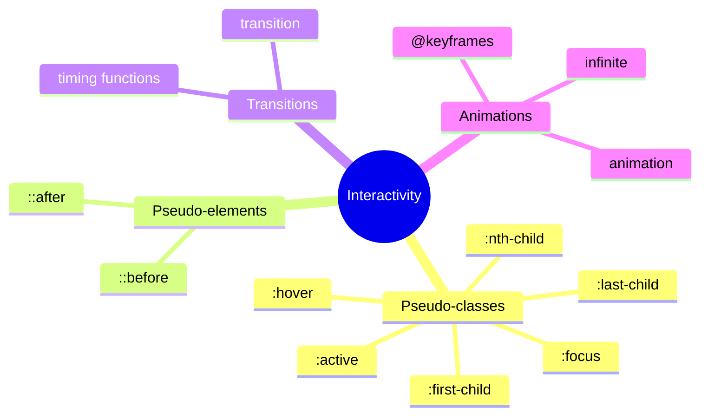
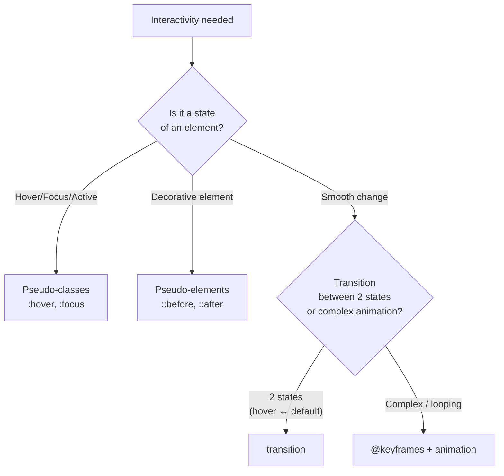

## Переходы, анимации, псевдоклассы и псевдоэлементы

> **Связь с предыдущим уроком:** на прошлом уроке мы сделали страницу адаптивной под любой размер экрана. Сегодня добавляем последний штрих перед итоговым проектом - "живость": плавные реакции на действия пользователя и лёгкую анимацию, которые делают интерфейс приятным в использовании.

---

## Цель урока

Научиться добавлять странице интерактивность через псевдоклассы и псевдоэлементы, а также плавность через переходы и базовую анимацию - без использования JavaScript.

## Чему вы научитесь к концу урока

- Использовать псевдоклассы `:hover`, `:focus`, `:active`, `:nth-child()`, `:first-child`/`:last-child`.
- Создавать декоративные элементы без лишней разметки через `::before`/`::after`.
- Настраивать плавные переходы свойств через `transition`.
- Писать простую анимацию через `@keyframes` и `animation`.
- Понимать, когда анимация помогает, а когда мешает - включая базовую заботу о `prefers-reduced-motion`.

---

## Хронометраж урока

|Блок|Содержание|
|---|---|
|1. Псевдоклассы: hover, focus, active|Состояния интерактивных элементов|
|2. Псевдоклассы: nth-child, first-child, last-child|Выбор элементов по позиции|
|3. Псевдоэлементы: before, after|Декоративный контент без лишней разметки|
|4. Мини-задание|Стилизовать hover самостоятельно|
|5. transition|Плавные изменения свойств|
|6. @keyframes и animation|Базовая анимация|
|7. Умеренность и prefers-reduced-motion|Когда анимация мешает|
|8. Итоги и практика|Кнопка с hover + анимированное появление|


---

## Блок 1. Псевдоклассы: `:hover`, `:focus`, `:active`

**Простыми словами:** псевдокласс - это специальное "дополнение" к обычному селектору, которое выбирает элемент не по тому, что он из себя представляет всегда (как класс или id), а по его **текущему состоянию** или **положению** в определённый момент. Записывается через двоеточие после селектора.

### `:hover` - наведение курсора мыши

```css
.button {
    background-color: #3498db;
    transition: background-color 0.2s;
}

.button:hover {
    background-color: #2980b9;
}
```

Стили внутри `:hover` применяются **только пока** курсор мыши находится над элементом - как только курсор уходит, элемент возвращается к своему обычному состоянию. Это, пожалуй, самый часто используемый псевдокласс в вебе - практически любая кликабельная кнопка или ссылка получает какую-то визуальную реакцию на наведение, чтобы дать пользователю понятный сигнал "этот элемент интерактивен".

**Важная оговорка:** `:hover` работает только там, где физически есть курсор мыши - на сенсорных устройствах (телефоны, планшеты) это состояние либо вообще не срабатывает, либо ведёт себя не совсем предсказуемо (иногда браузер показывает hover-стиль сразу после тапа). Не стройте **критически важную** функциональность исключительно на `:hover` - используйте его как приятное визуальное дополнение, а не единственный способ понять, что элемент кликабелен.

### `:focus` - элемент в фокусе (например, через Tab)

```css
input:focus {
    border-color: #3498db;
    outline: 2px solid #3498db;
}
```

Срабатывает, когда элемент **получил фокус** - это происходит либо при клике на поле формы, либо (что особенно важно, вспоминая урок 8 курса HTML про `tabindex`) при переходе к элементу клавишей **Tab**. `:focus` критически важен для доступности - пользователь, работающий только клавиатурой, ориентируется именно по видимой рамке фокуса, чтобы понимать, на каком элементе он сейчас находится.

**Важное предупреждение про доступность:** никогда не убирайте стандартную видимую рамку фокуса без замены её на **альтернативную**, но столь же заметную:

```css
/* Плохо: полностью убирает индикатор фокуса */
input:focus {
    outline: none;
}

/* Хорошо: заменяет стандартную рамку на собственный, но всё ещё заметный стиль */
input:focus {
    outline: none;
    box-shadow: 0 0 0 3px rgba(52, 152, 219, 0.5);
}
```

Полное удаление индикатора фокуса без замены делает сайт непригодным для использования с клавиатуры - прямое нарушение принципов доступности, которые мы подробно разбирали в уроке 8 курса HTML.

### `:active` - момент нажатия

```css
.button:active {
    transform: scale(0.98);
}
```

Срабатывает в короткий момент, **пока** кнопка мыши (или палец на сенсорном экране) физически нажата на элементе - то есть между началом и концом клика. Часто используется для лёгкого визуального "вжатия" кнопки, имитирующего физическую обратную связь.

### Порядок написания имеет значение

Есть распространённая мнемоника для порядка этих (и близких) псевдоклассов в CSS-файле: **LVHA** (Link, Visited, Hover, Active - историческая мнемоника из контекста ссылок). Применительно к нашим трём псевдоклассам порядок обычно такой:

```css
.button:hover {
    /* ... */
}

.button:focus {
    /* ... */
}

.button:active {
    /* ... */
}
```



Причина в специфичности и каскаде (урок 2) - все три селектора имеют **одинаковую** специфичность (вес класса + вес псевдокласса), значит, при потенциальном "наложении" состояний (например, элемент одновременно в фокусе и под курсором) побеждает то, что написано **позже** в файле. Написание `:active` последним гарантирует, что состояние "нажатия" всегда визуально заметно, даже если элемент одновременно и в фокусе, и под курсором.

---

### Частые ошибки новичков

|Ошибка|Как исправить|
|---|---|
|Убирают `outline` у `:focus` без замены на альтернативный видимый индикатор|Всегда заменяйте, а не просто удаляйте - например, через `box-shadow`, как в примере выше|
|Строят единственный способ понять кликабельность элемента только на `:hover`|Добавляйте и другие визуальные подсказки (форма курсора, цвет самой кнопки), не полагающиеся на наведение мыши|
|Путают `:active` (момент нажатия) с классом `.active` (часто используется в JavaScript-проектах для "текущего выбранного" состояния - например, активного пункта меню)|Помните: `:active` - псевдокласс состояния нажатия, а `.active` - это обычный, вручную задаваемый класс, никак не связанный со встроенным поведением браузера|

---

## Блок 2. Псевдоклассы `:nth-child()`, `:first-child`, `:last-child`

Эта группа псевдоклассов выбирает элементы не по состоянию, а по их **позиции** среди "братьев" - соседних элементов с тем же родителем.

### `:first-child` и `:last-child`

```html
<ul class="menu">
    <li>Пункт 1</li>
    <li>Пункт 2</li>
    <li>Пункт 3</li>
</ul>
```

```css
.menu li:first-child {
    border-top: none;
}

.menu li:last-child {
    border-bottom: none;
}
```

`:first-child` выбирает элемент, если он **первый** среди дочерних элементов своего родителя; `:last-child` - если он **последний**. Классическое практическое применение - убрать "лишнюю" границу у первого/последнего элемента списка, если у всех остальных элементов задана единая граница-разделитель (`border-top` или `border-bottom`), а на самом первом/последнем элементе она визуально не нужна.

### `:nth-child()` - выбор по формуле или конкретному номеру

```css
.menu li:nth-child(2) {
    font-weight: bold;
}
```

Выбирает элемент по **конкретному порядковому номеру** - здесь ровно второй `<li>` среди дочерних элементов `.menu`. Но настоящая сила `:nth-child()` - в поддержке **формул**, которые задают целую **последовательность** элементов:

```css
.table-row:nth-child(odd) {
    background-color: #f4f4f4;
}
```

`odd` (нечётный) и `even` (чётный) - специальные, часто используемые ключевые слова. Это классический приём **зебра-полос** (zebra striping) для строк таблицы - чередование цвета фона через одну строку заметно улучшает читаемость больших таблиц (тема, которую мы разбирали чисто структурно в уроке 5 курса HTML, а сегодня добавляем визуальное оформление).

Можно использовать и более гибкие математические формулы:

```css
.item:nth-child(3n) {
    /* выбирает каждый третий элемент: 3-й, 6-й, 9-й и так далее */
}

.item:nth-child(3n + 1) {
    /* выбирает 1-й, 4-й, 7-й и так далее (со сдвигом) */
}
```

**Это обзорная деталь курса** - вам достаточно знать про существование `odd`/`even` (самый частый практический случай) и общий принцип формул `An+B`; углубляться в сложные формулы не обязательно для базового уровня.

---

### Частые ошибки новичков

|Ошибка|Как исправить|
|---|---|
|Путают `:first-child` (первый среди **всех** дочерних элементов родителя) с "первым элементом данного типа"|Если, например, первый дочерний элемент - не `<li>`, а какой-то другой тег, `li:first-child` не сработает - потому что этот `<li>` не является первым **среди всех** детей родителя (для такого случая существует более специфичный псевдокласс `:first-of-type`, который выходит за рамки этого базового урока)|
|Забывают об `odd`/`even` и пишут длинную формулу вручную для простого чередования строк|Используйте готовые ключевые слова `odd`/`even` - они читаемее и покрывают самый частый практический случай|
|Применяют `:nth-child()` к элементу, у которого родитель содержит смешанные типы дочерних тегов, не тот результат, что ожидали|Проверяйте реальную структуру HTML - `:nth-child()` считает **все** дочерние элементы подряд, независимо от их тега|

---

## Блок 3. Псевдоэлементы: `::before` и `::after`

**Простыми словами:** псевдоэлементы (обратите внимание - записываются через **два** двоеточия `::`, в отличие от псевдоклассов с одним `:`) позволяют добавить **дополнительное декоративное содержимое** к элементу через чистый CSS, **не добавляя** для этого никакой новой HTML-разметки.

### Базовый синтаксис

```css
.quote::before {
    content: "«";
}

.quote::after {
    content: "»";
}
```

```html
<p class="quote">Здесь пример цитаты</p>
```

Результат на экране будет выглядеть как `«Здесь пример цитаты»` - кавычки визуально добавлены через CSS, хотя в реальном HTML-коде их нет вообще. `::before` вставляет содержимое **перед** основным содержимым элемента, `::after` - **после**.

**Обязательное свойство:** `content` - без него псевдоэлемент попросту не отобразится, даже если вы зададите ему другие стили. Значение может быть пустой строкой (`content: "";`) - это тоже абсолютно рабочий и часто используемый случай, разберём его ниже.

### Практический пример: декоративная иконка без лишней разметки

```css
.external-link::after {
    content: " ↗";
}
```

```html
<a href="https://github.com" class="external-link">Мой профиль на GitHub</a>
```

Это добавит небольшую стрелочку сразу после текста ссылки, визуально сигнализируя пользователю "эта ссылка ведёт на внешний сайт" - не добавляя лишний `<span>` в HTML-разметку специально ради одной декоративной стрелки.

### Практический пример: декоративная геометрическая форма (`content: ""`)

```css
.card {
    position: relative;
}

.card::before {
    content: "";
    position: absolute;
    top: 0;
    left: 0;
    width: 100%;
    height: 4px;
    background-color: #3498db;
}
```

Здесь `content: "";` - пустая строка, никакого текста не добавляется, но сам псевдоэлемент **существует** как отдельный визуальный "блок", который можно спозиционировать (обратите внимание на знакомую связку `position: relative` у родителя + `position: absolute` у псевдоэлемента, разобранную в уроке 4) и стилизовать как самостоятельный декоративный элемент - в данном случае это тонкая цветная полоска сверху карточки.

**Важное правило доступности:** содержимое `::before`/`::after` (когда оно текстовое, как в примере с кавычками или стрелкой) **не всегда** надёжно озвучивается скринридерами одинаково во всех браузерах - не помещайте туда важную, смысловую информацию, критичную для понимания страницы. Используйте псевдоэлементы **только для чисто декоративного** содержимого - то же самое правило "декоративное - в CSS, смысловое - в HTML", которое мы уже применяли для `background-image` в уроке 7.

---

### Частые ошибки новичков

|Ошибка|Как исправить|
|---|---|
|Забывают обязательное свойство `content`|Без `content` (даже пустого `content: "";`) псевдоэлемент не отобразится вообще|
|Путают одно двоеточие (псевдокласс `:hover`) и два двоеточия (псевдоэлемент `::before`)|Современный стандарт CSS3 использует именно `::` для псевдоэлементов - это помогает визуально отличать их от псевдоклассов|
|Помещают смыслово важный текст в `content` псевдоэлемента|Используйте псевдоэлементы только для декоративного содержимого - смысловой контент должен быть в самом HTML|

---

## Блок 4. Мини-задание

Самостоятельно, без подглядывания, стилизуйте hover-состояние ссылки: обычный цвет `#333`, а при наведении - цвет `#3498db` и подчёркивание.

**Решение:**

```css
a {
    color: #333;
}

a:hover {
    color: #3498db;
    text-decoration: underline;
}
```

---

## Блок 5. `transition` - плавные изменения свойств

До сих пор все изменения по `:hover`/`:focus`/`:active` происходили **мгновенно** - цвет резко "перещёлкивался" из одного состояния в другое. `transition` делает это изменение **плавным**, растягивая его во времени.

### Базовый синтаксис

```css
.button {
    background-color: #3498db;
    transition: background-color 0.3s;
}

.button:hover {
    background-color: #2980b9;
}
```

Свойство `transition` указывается на **исходном** (не `:hover`) состоянии элемента - это важная деталь, которую часто упускают новички. Именно исходное правило "объясняет" браузеру, что **любое** изменение свойства `background-color` у этого элемента (независимо от причины изменения - hover, добавление класса через JavaScript и так далее) должно происходить плавно, за `0.3` секунды, а не мгновенно.

### Синтаксис с несколькими частями

```css
.button {
    transition: background-color 0.3s ease-in-out;
}
```

- **`background-color`** - какое именно свойство анимировать (можно указать `all`, чтобы плавно анимировались **все** изменяющиеся свойства сразу, но это менее производительно и менее предсказуемо, чем явное перечисление конкретных свойств).
- **`0.3s`** - длительность перехода (можно и в миллисекундах: `300ms`).
- **`ease-in-out`** - функция скорости (timing function), определяющая, как именно меняется скорость перехода в течение указанного времени.

### Основные функции скорости (обзорно)

- **`ease`** (значение по умолчанию) - плавное начало, ускорение в середине, плавное замедление к концу.
- **`linear`** - равномерная, постоянная скорость на всём протяжении.
- **`ease-in`** - медленное начало, ускорение к концу.
- **`ease-out`** - быстрое начало, замедление к концу.
- **`ease-in-out`** - плавное замедленное начало и такое же плавное окончание, похоже на `ease`, но более выражено с обеих сторон.

**Практическая рекомендация:** для большинства простых UI-переходов (hover-эффекты кнопок и ссылок) `ease` (значение по умолчанию, можно вообще не указывать) или `ease-in-out` выглядят наиболее естественно - резкий `linear` часто ощущается "механическим" для таких коротких взаимодействий.

### Анимация нескольких свойств одновременно

```css
.button {
    background-color: #3498db;
    transform: scale(1);
    transition: background-color 0.3s, transform 0.2s;
}

.button:hover {
    background-color: #2980b9;
    transform: scale(1.05);
}
```

Через запятую можно перечислить сразу несколько свойств с индивидуальными длительностями - здесь цвет фона меняется за 0.3 секунды, а масштаб - за 0.2 секунды, создавая слегка более "живой" комбинированный эффект.

---

### Частые ошибки новичков

|Ошибка|Как исправить|
|---|---|
|Указывают `transition` внутри `:hover`, а не на исходном состоянии элемента|`transition` должен быть на **базовом** правиле - тогда переход применится к любому изменению состояния, включая и "туда", и "обратно"|
|Используют `transition: all;` вместо явного перечисления нужных свойств|Указывайте конкретные свойства (`background-color`, `transform` и т.д.) - это предсказуемее и лучше для производительности|
|Делают слишком долгие переходы (например, 2 секунды) для простых hover-эффектов кнопок|Для коротких UI-взаимодействий обычно достаточно 0.15–0.35 секунды - более долгие переходы ощущаются "тормознутыми" и раздражают при частом взаимодействии|

---

## Блок 6. `@keyframes` и `animation` - базовая анимация

`transition` подходит только для перехода **между двумя** состояниями (обычное ↔ hover). Когда нужна более сложная последовательность изменений - например, циклическая пульсация или анимация появления с несколькими промежуточными "шагами" - используется связка `@keyframes` + `animation`.

### Определение анимации через `@keyframes`

```css
@keyframes fadeIn {
    from {
        opacity: 0;
    }
    to {
        opacity: 1;
    }
}
```

`@keyframes` задаёт **имя** анимации (здесь - `fadeIn`, можно назвать как угодно) и описывает, как должны меняться CSS-свойства на разных "этапах" - `from` (начало, соответствует `0%`) и `to` (конец, соответствует `100%`).

Можно задавать и более детальные промежуточные шаги в процентах:

```css
@keyframes pulse {
    0% {
        transform: scale(1);
    }
    50% {
        transform: scale(1.1);
    }
    100% {
        transform: scale(1);
    }
}
```

Здесь элемент сначала увеличивается до середины анимации (`50%`), а затем возвращается к исходному размеру к концу (`100%`) - простая "пульсация".

### Применение анимации через `animation`

Само по себе `@keyframes` только **описывает** анимацию - чтобы она реально заработала на конкретном элементе, нужно подключить её через свойство `animation`:

```css
.hero-title {
    animation: fadeIn 1s ease-in;
}
```

- **`fadeIn`** - имя анимации, определённой в `@keyframes` выше.
- **`1s`** - длительность одного проигрывания анимации.
- **`ease-in`** - функция скорости (те же значения, что мы разбирали для `transition`).

### Зацикливание анимации

```css
.loading-spinner {
    animation: pulse 1.5s ease-in-out infinite;
}
```

Ключевое слово **`infinite`** заставляет анимацию повторяться **бесконечно**, а не проиграться один раз и остановиться - классический приём для, например, индикаторов загрузки.

### Практический пример: анимированное появление блока

```css
@keyframes slideUp {
    from {
        opacity: 0;
        transform: translateY(20px);
    }
    to {
        opacity: 1;
        transform: translateY(0);
    }
}

.welcome-block {
    animation: slideUp 0.6s ease-out;
}
```

Здесь блок одновременно "проявляется" (изменение `opacity` от `0` до `1`) и слегка "въезжает" снизу вверх (`transform: translateY()` меняется от `20px` смещения до `0`) - распространённый, ненавязчивый эффект появления контента.



---

### Частые ошибки новичков

|Ошибка|Как исправить|
|---|---|
|Определяют `@keyframes`, но забывают подключить их через `animation` на нужном элементе|`@keyframes` сам по себе ничего не анимирует - обязательно свяжите его с элементом через `animation: имя-анимации ...;`|
|Путают `transition` (переход между двумя состояниями, требует триггера вроде `:hover`) и `animation` (может проигрываться самостоятельно, без триггера, в том числе зациклено)|Для простых hover-эффектов используйте `transition`; для автоматических, сложных или циклических анимаций - `@keyframes`/`animation`|
|Забывают `infinite` там, где анимация должна повторяться бесконечно|Без `infinite` анимация проигрывается **один раз** и останавливается на конечном кадре|

---

## Блок 7. Умеренность в использовании анимаций

**Простыми словами:** анимация - это приправа, а не основное блюдо. Небольшая, уместная анимация делает интерфейс более живым и приятным; избыточная, слишком навязчивая или слишком долгая анимация отвлекает пользователя от реальной задачи и раздражает при повторном взаимодействии.

**Практические ориентиры:**

- Короткие переходы (0.15–0.35s) для повседневных UI-взаимодействий (hover кнопок, открытие меню).
- Избегайте анимации **всего подряд** на странице одновременно - выделяйте анимацией только действительно важные, акцентные элементы.
- Анимация, которая проигрывается **каждый раз** при обычном взаимодействии пользователя (например, при каждом наведении на любую ссылку), должна быть особенно короткой и ненавязчивой - в отличие от, например, анимации приветственного экрана, которая проигрывается лишь один раз.

### `prefers-reduced-motion` - забота о пользователях, чувствительных к движению

Некоторые пользователи (например, с вестибулярными нарушениями, мигренью, или просто личным предпочтением) настраивают в операционной системе опцию "уменьшить движение" - CSS может это обнаружить через специальный медиазапрос (мы уже разбирали синтаксис `@media` в прошлом уроке - этот случай использует его же, но с другим условием):

```css
@media (prefers-reduced-motion: reduce) {
    * {
        animation-duration: 0.01ms !important;
        transition-duration: 0.01ms !important;
    }
}
```

Это правило практически "отключает" все анимации и переходы (делая их длительность крайне малой - фактически незаметной) для пользователей, которые явно запросили в настройках устройства уменьшение движения на экране.

**Это обзорная, но важная деталь курса** - вам не обязательно детально прорабатывать это в каждом учебном проекте, но полезно знать о существовании такой возможности как проявление заботы о доступности, продолжающей тему урока 8 курса HTML.

---

## Итоги урока

Сегодня вы узнали:

- Псевдоклассы `:hover`, `:focus`, `:active` реагируют на состояние взаимодействия пользователя с элементом - `:focus` особенно важен для доступности и не должен убираться без замены.
- `:nth-child()` (включая удобные `odd`/`even`), `:first-child`, `:last-child` выбирают элементы по их позиции среди "братьев".
- Псевдоэлементы `::before`/`::after` добавляют декоративное содержимое через CSS без лишней HTML-разметки - обязательно требуют свойство `content`.
- `transition` делает изменение свойства (заданного на исходном состоянии элемента) плавным при переходе между состояниями (например, при `:hover`).
- `@keyframes` описывает последовательность кадров анимации, `animation` применяет её к элементу, `infinite` зацикливает.
- Анимация должна использоваться умеренно и уместно - а `prefers-reduced-motion` позволяет уважать предпочтения пользователей, чувствительных к движению на экране.

---

## Практика (на занятии)

1. Добавьте плавный `:hover`-эффект на все кнопки и ссылки своего HTML-проекта, используя `transition` (изменение цвета фона и/или лёгкое увеличение через `transform: scale()`).
2. Добавьте видимый, но эстетичный стиль `:focus` для полей форм из курса HTML (урок 6-7) - замените стандартный `outline` на собственный, но не убирайте его вовсе.
3. Создайте одну простую анимацию появления (`fadeIn` или `slideUp`) для приветственного заголовка на главной странице `index.html`.

---

## Домашнее задание

1. Добавьте hover-эффекты на все интерактивные элементы своего проекта (ссылки, кнопки, карточки проектов из `projects.html`) - используйте `transition` для плавности везде, где раньше состояние менялось мгновенно.
2. Добавьте `::before` или `::after` для декоративного элемента - например, стрелку рядом с внешними ссылками (как в примере из блока 3) или декоративную полоску сверху карточек.
3. Используйте `:nth-child(odd)`/`:nth-child(even)` для "зебра-полос" в любой таблице своего проекта (вспомните таблицы из урока 5 курса HTML).
4. **Исследовательское задание:** откройте DevTools на любом крупном сайте, кликните на кнопку с заметным hover-эффектом и найдите в CSS-стилях, использует ли она `transition` - какая длительность и функция скорости там указаны?

---

[Следующий урок: Итоговый проект →](Lesson-10/ru/Итоговый%20проект%20—%20полная%20стилизация%20и%20публикация.md)
