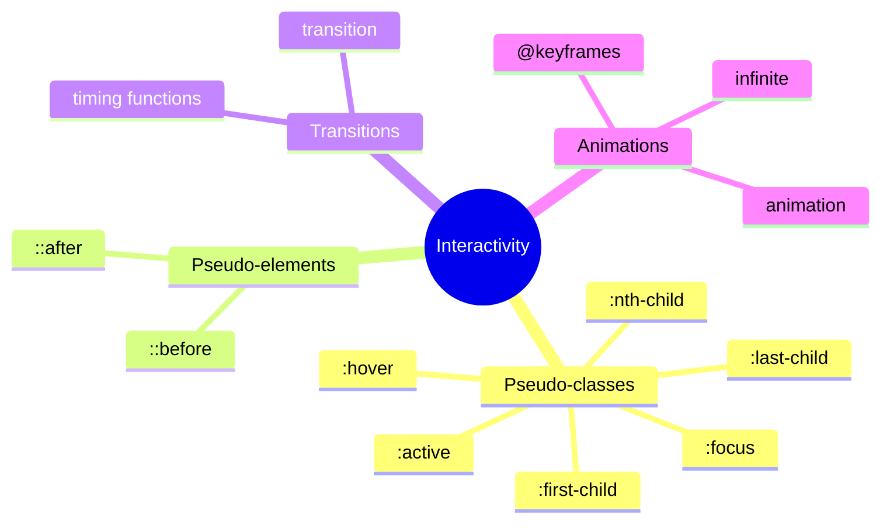
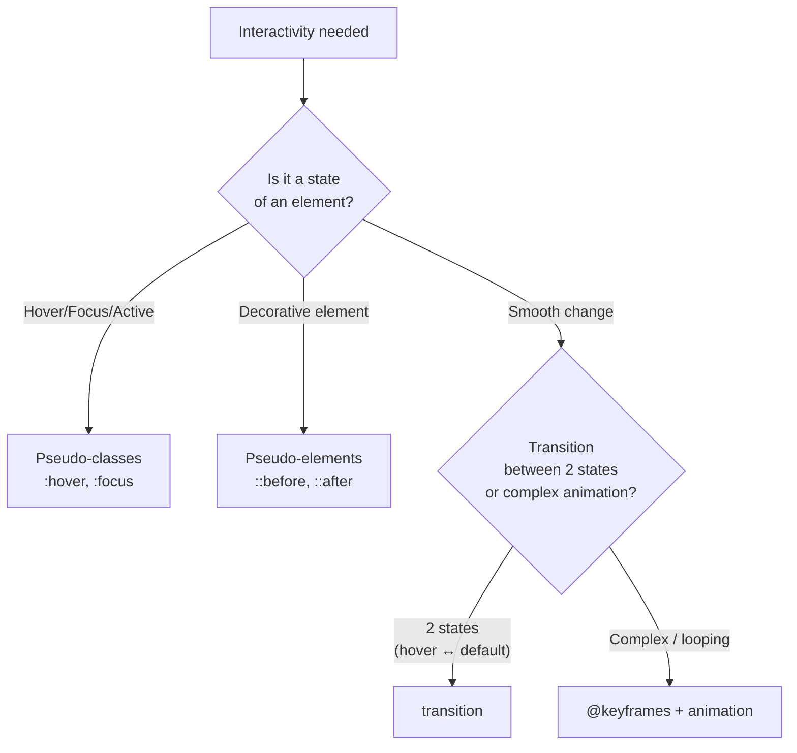

## O'tishlar, animatsiyalar, soxta-sinflar va soxta-elementlar

> **Oldingi dars bilan bog'liqlik:** o'tgan darsda sahifani har qanday ekran o'lchamiga moslashtirdik. Bugun yakuniy loyiha oldidagi so'nggi tafsilotni qo'shamiz - "jonlilik": foydalanuvchi harakatlariga silliq reaktsiyalar va yengil animatsiya, ular interfeysni foydalanishda yoqimli qiladi.

---

## Darsning maqsadi

Sahifaga soxta-sinflar va soxta-elementlar orqali interaktivlik, o'tishlar va asosiy animatsiya orqali silliqlik qo'shishni o'rganish - JavaScript ishlatmasdan.

## Dars oxiriga qadar nimalarni o'rganasiz

- `:hover`, `:focus`, `:active`, `:nth-child()`, `:first-child`/`:last-child` soxta-sinflarini ishlatishni.
- `::before`/`::after` orqali qo'shimcha belgilashsiz dekorativ elementlar yaratishni.
- `transition` orqali xususiyatlarning silliq o'tishlarini sozlashni.
- `@keyframes` va `animation` orqali oddiy animatsiya yozishni.
- Animatsiya qachon yordam berishi va qachon xalaqit berishini tushunishni - shu jumladan `prefers-reduced-motion` haqida asosiy g'amxo'rlik.

---

## Darsning vaqt jadvali

|Blok|Mazmun|
|---|---|
|1. Soxta-sinflar: hover, focus, active|Interaktiv elementlarning holatlari|
|2. Soxta-sinflar: nth-child, first-child, last-child|Elementlarni pozitsiya bo'yicha tanlash|
|3. Soxta-elementlar: before, after|Qo'shimcha belgilashsiz dekorativ kontent|
|4. Mini-topshiriq|Hover ni mustaqil stilizatsiya qilish|
|5. transition|Xususiyatlarining silliq o'zgarishi|
|6. @keyframes va animation|Asosiy animatsiya|
|7. Me'yordorlik va prefers-reduced-motion|Qachon animatsiya xalaqit beradi|
|8. Xulosalar va amaliyot|Hover + animatsiyalangan paydo bo'lish bilan tugma|


---

## 1-blok. Soxta-sinflar: `:hover`, `:focus`, `:active`

**Oddiy qilib aytganda:** soxta-sinflar - bu oddiy selektorga maxsus "qo'shimcha", u elementni doimiy nima ekanligiga (klass yoki id kabi) qarab emas, balki uning **joriy holati** yoki ma'lum bir daqiqadagi **joylashuvi** bo'yicha tanlaydi. Selektordan keyin ikki nuqta bilan yoziladi.

### `:hover` - sichqoncha kursorini ustiga olib kelish

```css
.button {
    background-color: #3498db;
    transition: background-color 0.2s;
}

.button:hover {
    background-color: #2980b9;
}
```

`:hover` ichidagi uslublar **faqat sichqoncha kursori element ustida bo'lganda** qo'llaniladi - kursor ketishi bilan element o'zining oddiy holatiga qaytadi. Bu, ehtimol, vebda eng ko'p ishlatiladigan soxta-sinflar - deyarli har qanday bosiladigan tugma yoki havola bosishda vizual reaktsiya oladi, foydalanuvchiga "bu element interaktiv" aniq signalini berish uchun.

**Muhim eslatma:** `:hover` faqat sichqoncha kursori jismoniy mavjud bo'lgan joylarda ishlaydi - sensorli qurilmalarda (telefonlar, planshetlar) bu holat umuman ishlamasligi yoki oldindan aytib bo'lmaydigan tarzda o'zini tutishi mumkin (ba'zan brauzer tap dan darhol keyin hover uslubini ko'rsatadi). **Juda muhim** funksionalni faqat `:hover` ga qurmaslik - uni yoqimli vizual qo'shimcha sifatida ishlating, element bosiladiganligini tushunishning yagona usuli sifatida emas.

### `:focus` - element fokusda (masalan, Tab orqali)

```css
input:focus {
    border-color: #3498db;
    outline: 2px solid #3498db;
}
```

Element **fokus olganda** ishlaydi - bu yorliq formasidagi mayne bosganingizda yoki (bu ayniqsa muhim, HTML kursining 8-darsidagi `tabindex` ni eslab) **Tab** tugmasi orqali elementga o'tganingizda sodir bo'ladi. `:focus` moslik uchun juda muhim - faqat klaviatura bilan ishlaydigan foydalanuvchi aynan ko'rinadigan fokus ramkasiga qarab, hozir qaysi elementda ekanligini tushunadi.

**Moslilik haqida muhim ogohlantirish:** hech qachon standart ko'rinadigan fokus ramkasini **muqobil**, lekin shunchalik sezilarli bilan almashtirmasdan o'chirmang:

```css
/* Yomon: fokus indikatorini butunlay o'chiradi */
input:focus {
    outline: none;
}

/* Yaxshi: standart ramkani o'zining, lekin hali ham sezilarli uslubiga almashtiradi */
input:focus {
    outline: none;
    box-shadow: 0 0 0 3px rgba(52, 152, 219, 0.5);
}
```

Fokus indikatorini almashtirmasdan butunlay o'chirish saytni klaviatura bilan foydalanishga yaroqsiz qiladi - biz HTML kursining 8-darsida batafsil tahlil qilgan moslik tamoyillarining to'g'ridan-to'g'ri buzilishi.

### `:active` - bosish momenti

```css
.button:active {
    transform: scale(0.98);
}
```

Sichqoncha tugmasi (yoki sensorli ekranda barmoq) element ustida **jismoniy bosilgan** qisqa daqiqada ishlaydi - ya'ni bosishning boshlanishi va tugashi o'rtasida. Ko'pincha tugmaning yengil vizual "bossilishini" taqlid qilish uchun ishlatiladi, jismoniy qayta aloqani taqlid qiladi.

### Yozuv tartibi muhim

CSS faylida shu (va yaqin) soxta-sinflarining tartibi uchun keng tarqalgan mnemonika mavjud: **LVHA** (Link, Visited, Hover, Active - havolalar kontekstidan tarixiy mnemonika). Bizning uchta soxta-sinflarimizga nisbatan tartib odatda bunday:

```css
.button:hover {
    /* ... */
}

.button:focus {
    /* ... */
}

.button:active {
    /* ... */
}
```



Sabab maxsuslik va kaskadda (2-dars) - uchta selektorning hammasida **bir xil** maxsuslik bor (klass vaznli + soxta-sinflar vaznli), ya'ni holatlarning potentsial "qo'llanilishi" (masalan, element bir vaqtda fokusda va kursor ostida) bo'lganda, faylda **keyinroq** yozilgan g'alaba qozonadi. `:active` ni oxirida yozish, "bosish" holati hatto element bir vaqtda fokusda va kursor ostida bo'lsa ham, doimo vizual sezilarli bo'lishini kafolatlaydi.

---

### Yangi boshlovchilarning ko'p uchraydigan xatolari

|Xato|Qanday tuzatish|
|---|---|
|`:focus` dan `outline` ni muqobil ko'rinadigan indikatorsiz o'chirishlar|Har doim almashtiring, oddiy o'chirmang - masalan, yuqoridagi misoldagidek `box-shadow` orqali|
|Element bosiladiganligini tushunishning yagona usuli sifatida faqat `:hover` ga qurishlar|Boshqa vizual ko'rsatmalar (kursor shakli, tugmaning o'z rangi) ham qo'shing, sichqoncha ustiga olib kelishga tayanmaslik uchun|
|`:active` (bosish momenti) ni `.active` klassi (JavaScript loyihalarida ko'pincha "joriy tanlangan" holat uchun ishlatiladi - masalan, faol menyu nuqtasi) bilan adashtirishlar|Eslab qoling: `:active` - bosish holatining soxta-sinflari, `.active` esa oddiy, qo'lda belgilangan klass, brauzerning o'rnatilgan xulqiga hech qanday aloqasi yo'q|

---

## 2-blok. `:nth-child()`, `:first-child`, `:last-child` soxta-sinflari

Bu soxta-sinflar guruhi elementlarni holatga emas, ularning "aka-uka" - bir xil ota-elementdagi qo'shni elementlar orasidagi **pozitsiyasi** bo'yicha tanlaydi.

### `:first-child` va `:last-child`

```html
<ul class="menu">
    <li>1-punkt</li>
    <li>2-punkt</li>
    <li>3-punkt</li>
</ul>
```

```css
.menu li:first-child {
    border-top: none;
}

.menu li:last-child {
    border-bottom: none;
}
```

`:first-child` elementni, agar u ota-elementining bolalari orasida **birinchi** bo'lsa, tanlaydi; `:last-child` - agar u **oxirgi** bo'lsa. Klassik amaliy qo'llanilishi - ro'yxatning birinchi/oxirgi elementidan "ortiqcha" chiziqni olib tashlash, agar barcha boshqa elementlarda umumiy ajratuvchi chiziq (`border-top` yoki `border-bottom`) belgilangan bo'lsa, lekin birinchi/oxirgi elementda u vizual kerak bo'lmasa.

### `:nth-child()` - formulaga yoki aniq raqamga qarab tanlash

```css
.menu li:nth-child(2) {
    font-weight: bold;
}
```

Elementni **aniq tartib raqami** bo'yicha tanlaydi - bu erda `.menu` bolalari orasida aynan ikkinchi `<li>`. Lekin `:nth-child()` ning haqiqiy kuchi **formulalarni** qo'llab-quvvatlashida, ular butun element **ketma-ketligini** belgilaydi:

```css
.table-row:nth-child(odd) {
    background-color: #f4f4f4;
}
```

`odd` (toq) va `even` (juft) - maxsus, ko'p ishlatiladigan kalit so'zlar. Bu jadval satrlari uchun klassik **zebra chiziqlari** (zebra striping) usuli - har ikkinchi satrning fon rangini almashtirib, katta jadvalarning o'qiladiganligini sezilarli yaxshilaydi (biz bu mavzuni HTML kursining 5-darsida faqat tuzilma jihatidan tahlil qilgan edik, bugun esa vizual bezatishni qo'shamiz).

Qo'shimcha mos matematik formulalar ham ishlatish mumkin:

```css
.item:nth-child(3n) {
    /* har uchinchi elementni tanlaydi: 3-chi, 6-chi, 9-chi va hokazo */
}

.item:nth-child(3n + 1) {
    /* 1-chi, 4-chi, 7-chi va hokazo ni tanlaydi (siljish bilan) */
}
```

**Bu kursning umumiy tafsiloti** - siz `odd`/`even` ning mavjudligini (eng ko'p amaliy holat) va formulalar `An+B` ning umumiy tamoyilini bilishning o'zi yetarli; murakkab formulalarga chuqur ketish asosiy daraja uchun shart emas.

---

### Yangi boshlovchilarning ko'p uchraydigan xatolari

|Xato|Qanday tuzatish|
|---|---|
|`:first-child` (ota-elementning **barcha** bolalari orasida birinchi) ni "shu turdagi birinchi element" bilan adashtirishlar|Masalan, agar birinchi bola-element `<li>` emas, boshqa teg bo'lsa, `li:first-child` ishlamaydi - chunki bu `<li>` ota-elementning **barcha** bolalari orasida birinchi emas (bunday holat uchun `:first-of-type` maxsus soxta-sinflari bor, bu asosiy dars doirasidan tashqarida)|
|Oddiy satrlar almashuvi uchun `odd`/`even` ni unutib, formulani qo'lda yozishlar|Tayyor kalit so'zlar `odd`/`even` ni ishlating - ular o'qiladiganroq va eng ko'p amaliy holatni qamraydi|
|`:nth-child()` ni aralash tega ega ota-elementga qo'llashlar, kutilgan natija o'rniga boshqasini olishlar|HTML ning haqiqiy tuzilmasini tekshiring - `:nth-child()` **barcha** bolalarni ularning tegidan qat'i nazar, ketma-ket hisoblaydi|

---

## 3-blok. Soxta-elementlar: `::before` va `after`

**Oddiy qilib aytganda:** soxta-elementlar (diqqat qiling - **ikkita** ikki nuqta `::` bilan yoziladi, bitta `:` bilan soxta-sinflardan farqli o'laroq) elementga yangi HTML belgilash qo'shmasdan, toza CSS orqali **qo'shimcha dekorativ kontent** qo'shishga imkon beradi.

### Asosiy sintaksis

```css
.quote::before {
    content: "«";
}

.quote::after {
    content: "»";
}
```

```html
<p class="quote">Bu erda iqtibos misoli</p>
```

Ekrandagi natija `«Bu erda iqtibos misoli»` ko'rinishida bo'ladi - tirnoqlar CSS orqali vizual qo'shilgan, haqiqiy HTML kodida ular umuman yo'q. `::before` kontentni asosiy kontentdan **oldin**, `after` - **keyin** qo'shadi.

**Majburiy xususiyat:** `content` - bundan qat'i nazar, soxta-element umuman ko'rsatilmaydi, hatto boshqa uslublar belgilangan bo'lsa ham. Qiymat bo'sh satr bo'lishi mumkin (`content: "";`) - bu ham mutlaqo ishlaydigan va ko'p ishlatiladigan holat, uni quyida ko'rib chiqamiz.

### Amaliy misol: qo'shimcha belgilashsiz dekorativ belgi

```css
.external-link::after {
    content: " ↗";
}
```

```html
<a href="https://github.com" class="external-link">Mening GitHub profilingim</a>
```

Bu havola matnidan darhol keyin kichik strelchaga qo'shadi, foydalanuvchiga "bu havola tashqi saytga olib boradi" vizual signalini beradi - bitta dekorativ strelka uchun maxsus qo'shimcha `<span>` qo'shmasdan.

### Amaliy misol: dekorativ geometrik shakl (`content: ""`)

```css
.card {
    position: relative;
}

.card::before {
    content: "";
    position: absolute;
    top: 0;
    left: 0;
    width: 100%;
    height: 4px;
    background-color: #3498db;
}
```

Bu erda `content: "";` - bo'sh satr, hech qanday matn qo'shilmaydi, lekin soxta-element o'zi alohida vizual "blok" sifatida **mavjud**, uni joylashtirish mumkin (ota-elementdagi tanish `position: relative` + soxta-elementdagi `position: absolute` ni e'tibor bering, 4-darsda tahlil qilingan) va mustaqil dekorativ element sifatida stilizatsiya qilish mumkin - bu holatda kartochkaning yuqorisidagi ingichka rangli chiziq.

**Moslilikning muhim qoidasi:** `::before`/`after` kontenti (matn bo'lganda, tirnoqlar yoki strelka misolida) **har doim** ham barcha brauzerlarda ekran o'quvchilar tomonidan ishonchli ovozlanavermaydi - sahifani tushunish uchun muhim, ma'nomiy axborotni ularga joylashtirmang. Soxta-elementlarni **faqat butunlay dekorativ** kontent uchun ishlating - biz 7-darsda `background-image` uchun qo'llagan "dekorativ - CSS da, ma'noli - HTML da" qoidasi.

---

### Yangi boshlovchilarning ko'p uchraydigan xatolari

|Xato|Qanday tuzatish|
|---|---|
|Majburiy `content` xususiyatini unutishlar|`content` siz (hatto bo'sh `content: "";` bilan ham) soxta-element umuman ko'rsatilmaydi|
|Bitta ikki nuqtani (soxta-sinflar `:hover`) va ikki ikki nuqtani (soxta-element `::before`) adashtirishlar|Zamonaviy CSS3 standarti aynan soxta-elementlar uchun `::` ni ishlatadi - bu ularni soxta-sinflardan vizual ajratishga yordam beradi|
|Soxta-elementning `content`iga ma'noli muhim matnni joylashtirishlar|Soxta-elementlarni faqat dekorativ kontent uchun ishlating - ma'noli kontent o'zi HTML da bo'lishi kerak|

---

## 4-blok. Mini-topshiriq

Nusxalab ko'rmadan mustaqil ravishda havolaning hover holatini stilizatsiya qiling: oddiy rang `#333`, ustiga kelganda - rang `#3498db` va tag chiziq.

**Yechim:**

```css
a {
    color: #333;
}

a:hover {
    color: #3498db;
    text-decoration: underline;
}
```

---

## 5-blok. `transition` - xususiyatlarning silliq o'zgarishi

Hozirgacha `:hover`/`:focus`/`:active` bo'yicha barcha o'zgarishlar **darhol** sodir bo'lgan - rang bir holatdan boshqasiga keskin "qalqigan". `transition` bu o'zgarishni **silliq** qiladi, uni vaqtga cho'zadi.

### Asosiy sintaksis

```css
.button {
    background-color: #3498db;
    transition: background-color 0.3s;
}

.button:hover {
    background-color: #2980b9;
}
```

`transition` xususiyati elementning **asosiy** (`:hover` emas) holatida ko'rsatiladi - bu yangi boshlovchilar ko'p e'tiborsiz qoldiradigan muhim tafsilot. Aynan asosiy qoida brauzerga tushuntiradiki, bu elementning `background-color` xususiyatining **har qanday** o'zgarishi (o'zgarish sababidan qat'i nazar - hover, JavaScript orqali klass qo'shish va hokazo) **silliq**, `0.3` sekundda, darhol emas, sodir bo'lishi kerak.

### Ko'p qismlilik bilan sintaksis

```css
.button {
    transition: background-color 0.3s ease-in-out;
}
```

- **`background-color`** - qaysi xususiyatni animatsiya qilish (`all` ko'rsatish mumkin, barcha o'zgaruvchi xususiyatlar silliq animatsiya qilinsin, lekin bu aniq xususiyatlarni sanab ko'rsatishdan kamroq samarali va kamroq bashorat qilinadi).
- **`0.3s`** - o'tish davomiyligi (millisekundlarda ham bo'lishi mumkin: `300ms`).
- **`ease-in-out`** - tezlik funksiyasi (timing function), o'tish tezligining belgilangan vaqt davomida qanday o'zgarishini belgilaydi.

### Asosiy tezlik funksiyalari (umumiy ko'rinishda)

- **`ease`** (standart qiymat) - boshida silliq, o'rtada tezlashuv, oxirida silliq sekinlashish.
- **`linear`** - butun davomida bir xil, doimiy tezlik.
- **`ease-in`** - boshida sekin, oxirida tezlashuv.
- **`ease-out`** - boshida tez, oxirida sekinlashish.
- **`ease-in-out`** - boshida silliq sekinlashish va oxirida shunday silliq tugash, `ease` ga o'xshaydi, lekin har ikki tomonda yaqqolroq.

**Amaliy tavsiya:** ko'pchilik oddiy UI o'tishlari (tugma va havolalarning hover-effektlari) uchun `ease` (standart qiymat, umuman ko'rsatmaslik ham mumkin) yoki `ease-in-out` eng tabiiy ko'rinadi - keskin `linear` bunday qisqa o'zaro ta'sirlarda "mexanik" his qilinadi.

### Bir nechta xususiyatni bir vaqtda animatsiya qilish

```css
.button {
    background-color: #3498db;
    transform: scale(1);
    transition: background-color 0.3s, transform 0.2s;
}

.button:hover {
    background-color: #2980b9;
    transform: scale(1.05);
}
```

Vergul bilan bir nechta xususiyatni individual davomiyliliklari bilan sanab ko'rsatish mumkin - bu erda fon rangi 0.3 sekundda o'zgaradi, masshtab esa 0.2 sekundda, biroz "jonroq" birlashtirilgan effekt yaratadi.

---

### Yangi boshlovchilarning ko'p uchraydigan xatolari

|Xato|Qanday tuzatish|
|---|---|
|`transition` ni `:hover` ichida ko'rsatishlar, elementning asosiy holatida emas|`transition` **asosiy** qoidada bo'lishi kerak - shunda o'tish har qanday holat o'zgarishiga, "borish" va "qaytish" ham qo'llaniladi|
|Kerakli xususiyatlarni aniq sanab ko'rsatish o'rniga `transition: all;` ishlatishlar|Aniq xususiyatlarni ko'rsating (`background-color`, `transform` va h.k.) - bu bashorat qilinadi va samaradorlik uchun yaxshiroq|
|Oddiy tugma hover-effektlari uchun juda uzoq o'tishlar (masalan, 2 sekund) qilishlar|Qisqa UI o'zaro ta'sirlari uchun odatda 0.15–0.35 sekund yetarli - uzoqroq o'tishlar "sekin" his qilinadi va tez-tez o'zaro ta'sirda bezovta qiladi|

---

## 6-blok. `@keyframes` va `animation` - asosiy animatsiya

`transition` faqat **ikkita holat** o'rtasidagi o'tish uchun mos (oddiy ↔ hover). Murakkabroq o'zgarishlar ketma-ketligi kerak bo'lganda - masalan, siklik pulsatsiya yoki bir necha o'rtadagi "qadam" bilan paydo bo'lish animatsiyasi - `@keyframes` + `animation` bog'lamasi ishlatiladi.

### `@keyframes` orqali animatsiya aniqlash

```css
@keyframes fadeIn {
    from {
        opacity: 0;
    }
    to {
        opacity: 1;
    }
}
```

`@keyframes` animatsiyaning **nomini** belgilaydi (bu erda `fadeIn`, istalgan nom berish mumkin) va CSS xususiyatlari turli "bosqichlarda" qanday o'zgarishini tasvirlaydi - `from` (boshlanishi, `0%` ga mos) va `to` (tugashi, `100%` ga mos).

Batafsil o'rtadagi qadamalarni foizlarda ham belgilash mumkin:

```css
@keyframes pulse {
    0% {
        transform: scale(1);
    }
    50% {
        transform: scale(1.1);
    }
    100% {
        transform: scale(1);
    }
}
```

Bu erda element avval animatsiyaning o'rtasigacha (`50%`) kattalashadi, keyin tugaguncha asosiy o'lchamiga qaytadi - oddiy "pulsatsiya".

### `animation` orqali animatsiyani qo'llash

`@keyframes` o'zi faqat animatsiyani **tasvirlaydi** - u aniq elementda haqiqatan ishlashi uchun `animation` xususiyati orqali ulash kerak:

```css
.hero-title {
    animation: fadeIn 1s ease-in;
}
```

- **`fadeIn`** - yuqorida `@keyframes` da aniqlangan animatsiya nomi.
- **`1s`** - bitta animatsiya ijrosining davomiyligi.
- **`ease-in`** - tezlik funksiyasi (`transition` uchun o'rgangan qiymatlar).

### Animatsiyani siklga aylantirish

```css
.loading-spinner {
    animation: pulse 1.5s ease-in-out infinite;
}
```

**`infinite`** kalit so'zi animatsiyani **cheksiz** takrorlashga majbur qiladi, bir marta ijro etib to'xtatmasdan - masalan, yuklanish indikatorlari uchun klassik usul.

### Amaliy misol: blokning animatsiyalangan paydo bo'lishi

```css
@keyframes slideUp {
    from {
        opacity: 0;
        transform: translateY(20px);
    }
    to {
        opacity: 1;
        transform: translateY(0);
    }
}

.welcome-block {
    animation: slideUp 0.6s ease-out;
}
```

Bu erda blok bir vaqtda "paydo bo'ladi" (`opacity` `0` dan `1` ga o'zgaradi) va biroz pastdan yuqoriga "sirg'aladi" (`transform: translateY()` `20px` siljishdan `0` ga o'zgaradi) - kontent paydo bo'lishining tarqalgan, bezovta qilmaydigan effekti.



---

### Yangi boshlovchilarning ko'p uchraydigan xatolari

|Xato|Qanday tuzatish|
|---|---|
|`@keyframes` aniqlab, lekin ularni kerakli elementda `animation` orqali ulashni unutishlar|`@keyframes` o'zi hech narsani animatsiya qilmaydi - uni albatta `animation: animatsiya-nomi ...;` orqali elementga bog'lang|
|`transition` (ikkita holat o'rtasidagi o'tish, `:hover` kabi trigger talab qiladi) va `animation` (o'zi ijro etilishi mumkin, triggersiz, shu jumladan siklda) ni adashtirishlar|Oddiy hover-effektlari uchun `transition` ishlating; avtomatik, murakkab yoki siklik animatsiyalar uchun - `@keyframes`/`animation`|
|Animatsiya cheksiz takrorlanishi kerak bo'lganda `infinite` ni unutishlar|`infinite` siz animatsiya **bir marta** ijro etiladi va oxirgi kadrlarda to'xtaydi|

---

## 7-blok. Animatsiyalarni ishlatishda me'yordorlik

**Oddiy qilib aytganda:** animatsiya - bu ziravor, asosiy taom emas. Kichik, mos animatsiya interfeysni jonroq va yoqimliroq qiladi; ortiqcha, haddan tashqari yoki juda uzoq animatsiya foydalanuvchini haqiqiy vazifadan chalg'itadi va takroriy o'zaro ta'sirda bezovta qiladi.

**Amaliy yo'riqnoma:**

- Har kungi UI o'zaro ta'sirlari uchun qisqa o'tishlar (0.15–0.35s) (tugmalar hover, menyu ochilishi).
- Sahifadagi **hamma narsani** bir vaqtda animatsiya qilishdan saqlaning - faqat haqiqatan muhim, aktsent elementlarni animatsiya bilan ajrating.
- Har safar oddiy foydalanuvchi o'zaro ta'sirida (masalan, har qanday havolaga ustiga kelganingizda) ijro etiladigan animatsiya ayniqsa qisqa va bezovta qilmaydigan bo'lishi kerak - masalan, faqat bir marta ijro etiladigan qarshilash ekranidan farqli o'laroq.

### `prefers-reduced-motion` - harakatga sezgir foydalanuvchilarga g'amxo'rlik

Ba'zi foydalanuvchilar (masalan, vestibulyar buzilishlar, migren yoki shaxsiy afzallik tufayli) operatsion tizimda "harakatni kamaytirish" opsiyasini sozlaydi - CSS bu ni maxsus media-so'rov orqali aniqlashi mumkin (biz o'tgan darsda `@media` sintaksisini tahlil qilgan edik - bu holat ham shuni ishlatadi, lekin boshqa shart bilan):

```css
@media (prefers-reduced-motion: reduce) {
    * {
        animation-duration: 0.01ms !important;
        transition-duration: 0.01ms !important;
    }
}
```

Bu qoida deyarli barcha animatsiyalar va o'tishlarni "o'chiradi" (ularning davomiyligini juda kichik - haqiqatan sezilmaydigan qiladi) qurilma sozlamalarida harakatni kamaytirishni so'ragan foydalanuvchilar uchun.

**Bu kursning umumiy, lekin muhim tafsiloti** - har bir o'quv loyihasida buni batafsil ishlash shart emas, lekin bunday imkon mavjudligini bilish foydali, HTML kursining 8-darsida boshlangan moslik mavzusini davom ettirish sifatida.

---

## Dars xulosalari

Bugun siz bilib oldingiz:

- `:hover`, `:focus`, `:active` soxta-sinflari foydalanuvchining element bilan o'zaro ta'sir holatiga reaktsiya beradi - `:focus` moslik uchun ayniqsa muhim va almashtirmasdan o'chirilmasligi kerak.
- `:nth-child()` (qulay `odd`/`even` bilan), `:first-child`, `:last-child` elementlarni "aka-uka" orasidagi pozitsiyasi bo'yicha tanlaydi.
- `::before`/`::after` soxta-elementlari qo'shimcha belgilashsiz CSS orqali dekorativ kontent qo'shadi - albatta `content` xususiyatini talab qiladi.
- `transition` elementning asosiy holatida belgilangan xususiyatning o'zgarishini holatlar o'rtasida o'tganda (masalan, `:hover` da) silliq qiladi.
- `@keyframes` animatsiya kadrlarining ketma-ketligini tasvirlaydi, `animation` uni elementga qo'llaydi, `infinite` siklga aylantiradi.
- Animatsiya me'yordorlik va mos ishlatilishi kerak - `prefers-reduced-motion` esa ekranda harakatga sezgir foydalanuvchilarning afzalliklariga hurmat ko'rsatishga imkon beradi.

---

## Amaliyot (darsda)

1. HTML loyihangizdagi barcha tugma va havolalarga silliq `:hover` effektini qo'shing, `transition` ishlatib (fon rangi o'zgarishi va/or `transform: scale()` orqali yengil kattalashtirish).
2. HTML kursidagi shakl maydonlari (6-7-darslar) uchun ko'rinadigan, lekin estetik `:focus` uslubini qo'shing - standart `outline` ni o'zining bilan almashtiring, lekin uni umuman o'chirmang.
3. Bosh sahifaning `index.html` dagi qarshilash sarlavhasi uchun bitta oddiy paydo bo'lish animatsiyasi (`fadeIn` yoki `slideUp`) yarating.

---

## Uy vazifasi

1. Loyihangizdagi barcha interaktiv elementlarga hover-effektlari qo'shing (havolalar, tugmalar, `projects.html` dagi loyiha kartochkalari) - avval holati darhol o'zgaradigan hamma joyda silliqlik uchun `transition` ishlating.
2. Dekorativ element uchun `before` yoki `after` qo'shing - masalan, tashqi havolalar yonidagi strelka (3-blokdan misoldagidek) yoki kartochkalarning yuqorisidagi dekorativ chiziq.
3. Loyihangizdagi istalgan jadvalda "zebra chiziqlari" uchun `:nth-child(odd)`/`:nth-child(even)` ishlating (HTML kursining 5-darsidagi jadvallarni eslang).
4. **Tadqiqot topshirig'i:** istalgan katta saytda DevTools ni oching, yaqqol hover-effektli tugmaga bosing va CSS uslublarida `transition` ishlatilayotganini toping - qanday davomiylilik va tezlik funksiyasi ko'rsatilgan?

---

[Keyingi dars: Yakuniy loyiha →](Lesson-10/uz/Yakuniy%20loyiha%20—%20to'liq%20stilizatsiya%20va%20nashr%20etish.md)
